# 马尔可夫决策过程——学习一些数学知识

> 原文：<https://medium.datadriveninvestor.com/markov-decision-processes-learning-some-math-b82448169927?source=collection_archive---------4----------------------->

[**之前的文章**](https://medium.com/datadriveninvestor/rl-explained-reinforcing-the-intuition-and-math-fd1185369186) 对于理解强化学习架构背后的直觉是必不可少的，并探索了代理*与其环境*交互的框架。代理观察奖励假设和反馈的环境，以执行行动并达到新的状态。

**马尔可夫决策过程**进一步探索了完全可观察环境的现象以及每个策略和过程是如何工作的。大多数 RL 架构的特征是马尔可夫决策过程。

 [## 数据科学和软件工程哪个更有前途？

### 大约一个月前，当我坐在咖啡馆里为一个客户开发网站时，我发现了这个女人…

www.datadriveninvestor.com](https://www.datadriveninvestor.com/2019/01/23/which-is-more-promising-data-science-or-software-engineering/) 

已经警告过你了——这个帖子确实包含了一些数学和定理(激动！！！)复杂性可能看起来令人生畏，但是不要担心——实际上没有什么能与理解 ML 背后的数学相提并论😍😍😍

# **马尔可夫性质**

马尔可夫决策过程建立在对马尔可夫属性的理解上，马尔可夫属性描述了“给定现在，未来独立于过去”。

当前**状态**(一旦识别)提供了足够的信息；由于该状态包含足够的关于先前反馈的信息，不再需要*历史*。这可以用下面的等式来建模。

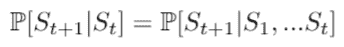

本质上， *S(t)* 包含了历史中的所有相关信息，因此 *S(1) … S(t-1)* 不再需要达到相同的状态转移概率来达到即将到来的状态， *S(t+1)* 。

**状态转移概率**基本上是在给定当前状态的情况下，跨越任何潜在后继状态的概率分布。看起来像这样。

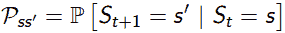

对于所有的数学人(你好👋)，这个定理可以解释成一个**状态转移矩阵**。每一行表示从任何当前状态到可能的先前状态的转移概率。

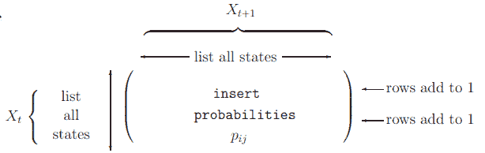

# **马尔可夫过程和链**

这些本质上是包含马尔可夫性质的随机状态序列。所有的马尔可夫链都是存在于状态空间上的**元组< S，P>T31， *S* 和转移函数 *P* 。这个系统的性质将 *S* 定义为状态的有限范围，将 *P* 定义为状态转移概率矩阵(我们上面学过)。**

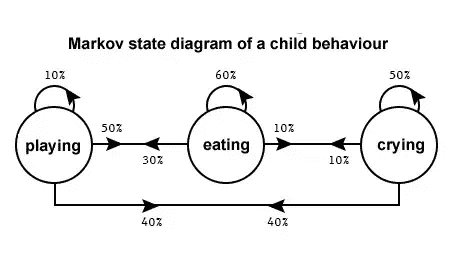

这里，网络中的每个**节点**代表婴儿行为的 *3 个定义状态*，并定义与其他可能状态的行动相关的概率。在某些情况下，网络包含中的**终端状态，其中样本剧集被终止。**

# **马氏奖励流程**

我们之前谈到的马尔可夫过程没有任何与特定状态相关联的**值**——马尔可夫奖励过程将一些值的概念赋予每个状态，作为机器用来评估如何**最大化回报的度量。**

马尔可夫奖励过程为 **< S，P，R，γ >元组**，其中 S 表示有限状态空间， *P* 表示状态转移概率函数， *R* 表示**奖励函数**， *γ* 为**折扣因子**，如下式所示。

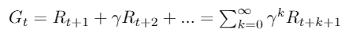

γ存在于 0 和 1 的值之间，表示现在的回报相对于未来的价值。当γ= 0 时，代理只关心第一个奖励，而γ = 1 表示代理关心未来的奖励。

这些奖励有两个主要原因。

1.  它们确保算法收敛并避免无限返回
2.  奖励表明短期奖励是否比长期奖励更有价值。这是至关重要的，因为代理的首要目标是最大化某种意义上的累积回报。

**状态值函数**， *v(s)* 输出从状态 *S* 开始的*期望收益*

由于代理人想要*最高奖励*计数，我们可以创建另一个**样本集**，并通过源于状态 *S* 的许多情况来理解预期回报。这给了代理更多关于哪条路径最有利于最高回报的信息。

γ = 1 的这一过程在以下环境中是这样工作的。

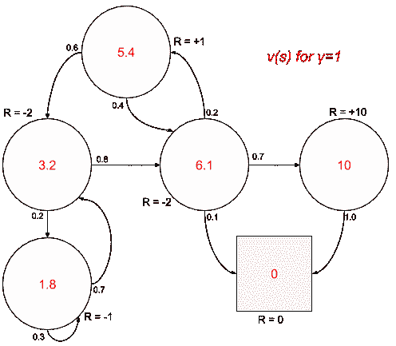

# **贝尔曼方程**

这个定理本质上是通过动态规划将价值与函数自身联系起来，以使**最大化累积奖励的总和**。

让我们把它分成两个部分。

*   **即时奖励**——>——*rₜ₊₁*
*   与后继状态相关联的**贴现值**—>*γ(sₜ₊₁)*

让我们把上一个等式中的 *G(t)* 展开，我们会得到这样的结果。

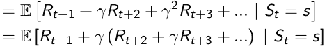

现在让我们用时间步长代替 *G(t+1)* ， *t+1* 作为起点。

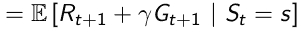

由于**贝尔曼方程**实际上是*线性*，我们知道𝔼(ax+by)= a𝔼(x)【+b𝔼(y】这意味着 *G(t+1)* 的投影**值表示状态 *S(t+1)*** 的值

我们用最后的公式总结一下。贝尔曼方程基本上表示状态空间中每个状态的状态值*。*

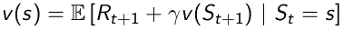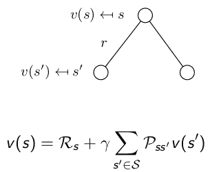

# **马尔可夫决策过程**

马尔可夫决策过程基本上是带有决策的马尔可夫回报过程——这描述了每个状态都是马尔可夫的环境。马尔可夫决策过程为**元组< S，A，P，R，γ >** 其中 *S* 代表状态空间， *A* 指有限范围的动作， *P* 为状态转移概率函数。这些是马尔可夫奖励过程的*扩展*,因为它包含了代理需要做出的决定。

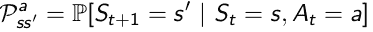

*R* 代表**奖励功能**:

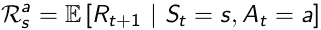

*γ* 代表**折扣因子** ∈[0，1]

这些马尔可夫决策过程对代理选择的状态**提供了更多的控制。**

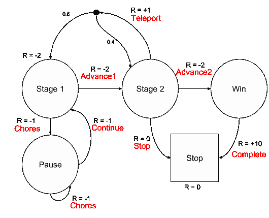

# **政策**

让我们回顾一下- **策略** *(π)* 是在状态上的*分布，并且有助于规定代理的行为和他们行动背后的原因。它们基本上映射每个**状态-动作对**。马尔可夫决策策略是从*当前状态*而不是从*历史*构建的。*

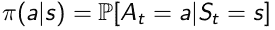

由于策略是**固定的**，一旦代理达到特定状态，代理就会采取之前由策略预先决定的*动作。由于策略具有随机能力，代理可以在状态空间中进行探索。*

# **马尔可夫决策过程价值函数**

马尔可夫决策过程的表示为 *v_(s)* 的*状态值*函数表示代理**的期望输出，假设它们遵循策略，从状态 *s* 开始π。**这个可以这么表达。

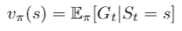

马尔可夫决策过程的*动作值*函数表示为 *q_(s，a)* 表示代理的期望输出，假设它们**执行动作并遵循策略，π从状态 s 开始**这可以表示为。

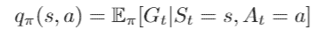

写成**贝尔曼期望方程**(见上面解释的符号)看起来像这样。

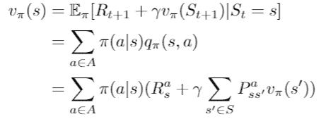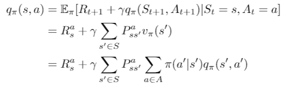

# **最佳值函数**

强化学习的前提是**最大化回报**——虽然基于状态和基于动作的学习对于理解 RL 和映射状态-动作对是必不可少的，但它们*可能不会呈现最优路线。*

表示为 *v*(s)* 的**最优状态值函数**代表所有策略的*最大值函数。这解释了代理人可以从其环境中获取最大可能的回报。*

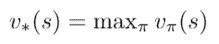

同时，表示为 *q*(s，a)* 的**最优动作值函数**代表所有策略的**最大动作值函数。这解释了从状态 *s* 开始执行动作 *a* 时，代理可以从环境中获取的最大回报。**

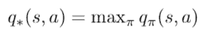

**绝对最优策略**可以从**最大化**q *(s，a) 值中导出。一旦我们解决了最优状态-动作值函数，我们就可以破译采取哪个动作，输出最优状态-动作值函数，记为 *q*(s，a)。*

# 最后一件事

> ***WOAH*** *这里面有很多数学和定理……希望你能够进一步理解强化学习代理实际上是如何以最大化他们的回报假设为主要目标来决定执行哪些动作的。*
> 
> 如果你能通过做以下事情来支持我这个作者，那对我来说将意味着一切

1.  注意👏图标？给我的文章发些**掌声**
2.  **在 [LinkedIn](https://www.linkedin.com/in/suraj-bansal/) 上连接**和我👈
3.  **跟着**我上[梅杜姆](https://medium.com/@bansalsuraj03) ✍️
4.  **查看**我的[作品集](https://tks.life/profile/suraj.bansal)了解我的最新作品💪
5.  关注我的旅程，订阅我的每月简讯🦄