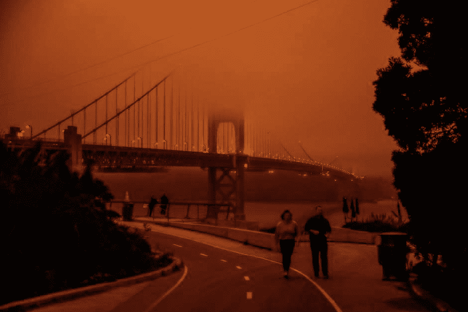
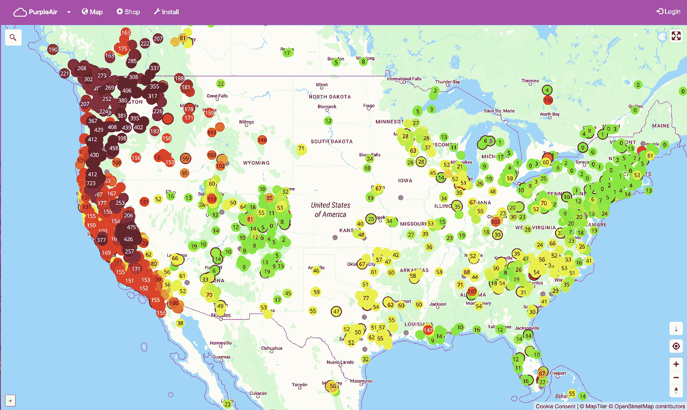
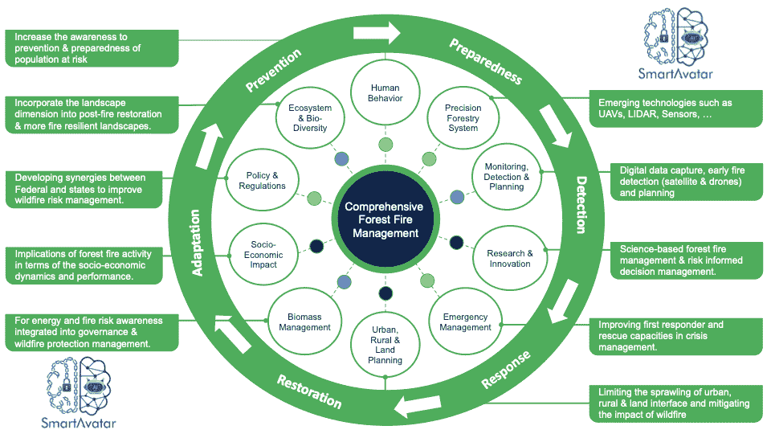

# 火星湾区！

> 原文：<https://medium.datadriveninvestor.com/martian-bay-area-643d7fae51f4?source=collection_archive---------11----------------------->

Photo: Gabrielle Lurie / The Chronicle. September 14, 2020.

## 林火管理的综合方案在哪里？

由于华盛顿、俄勒冈州和加利福尼亚州的野火，美国西海岸的大部分地区经历了数周不健康的空气质量(见下图:“紫色空气”)。上周，2020 年 9 月 9 日，星期三，我们醒来时都有一种超现实的体验，山景城上空，整个海湾地区都是橙色的，下着灰烬和横跨美利坚合众国西海岸的野火燃烧的气味。天亮时，屋子里仍然漆黑一片，随着时间的推移，情况越来越糟。我以为这就是火星上的天空。一周前是一场温度超过 100 华氏度(~ 38 摄氏度)的热浪，而在此之前的一周(8 月的最后一周)，海湾地区经历了 10，800 次雷击，引发了 367 起火灾甚至更多。在疫情(新冠肺炎)和全球经济危机中，我们正在经历所有这些极端的自然灾害。

 [## 气候变化辩论中的科学与金钱|数据驱动的投资者

### 没有关于气候变化的公开辩论。在我发布文章的媒体上，有成千上万的文章是关于…

www.datadriveninvestor.com](https://www.datadriveninvestor.com/2020/01/30/science-and-money-in-the-climate-change-debate/) 

我一直接到家人和爱人打来的电话，询问每日最新消息，并担心我的安全和健康。我只能想象受野火影响的人民和第一反应者正在经历什么，以及那些仍然在前线保护我们的安全的人们。坦率地说，加州几乎每年都会发生野火，毫无疑问，经历这些灾难的人们认为气候变化是主要原因。直到最近，我才知道每年全球温室气体排放总量的大约 20%是由野火造成的，但为什么野火管理不是国家和州的首要任务呢！

PurpleAir: Real-time Air Quality Monitoring, September 14, 2020

火是西海岸许多生态系统的自然组成部分，然而大规模的强烈野火正成为越来越多的关注。社会经济影响是巨大的，从人类生命的直接损失到居民的健康和福祉，再到基础设施和经济活动的破坏。是时候创建一个联邦和州整体火灾管理计划，该计划将整合气候情景、环境、健康和福利、文化、政策、法规、生物多样性和社会经济方面。

## **森林火灾综合治理**

森林火灾管理的方法应该是系统的，应该包括实时、更智能和更快速的相互关联的火灾管理，考虑到气候、地形、社会经济影响、人类习惯等不同的情况。它需要一个全面的生命周期方法，包括一个循环的多阶段方法，如预防和准备，从检测到应对，从恢复到适应。在每个阶段中，都有一个活动子集，如下图所示。

Comprehensive Forest Fire Management by SmartAvatar B.V.

**进入专家视角—** [**订阅 DDI 英特尔**](https://datadriveninvestor.com/ddi-intel)