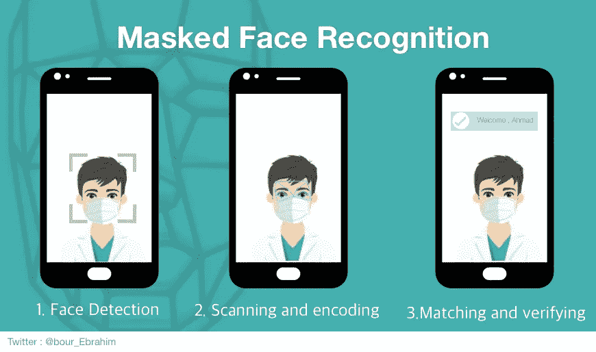
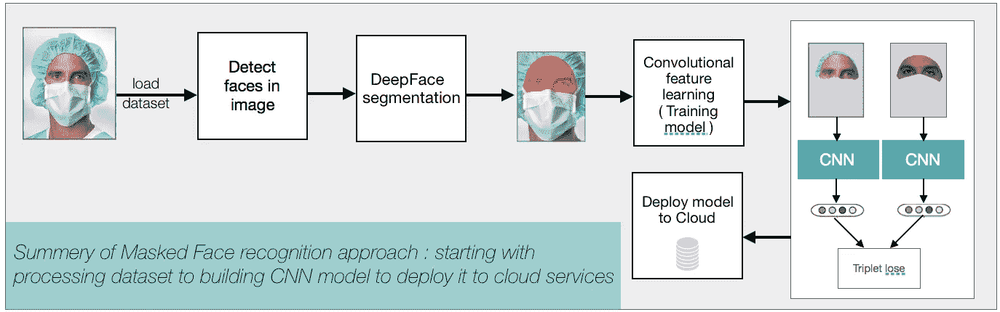
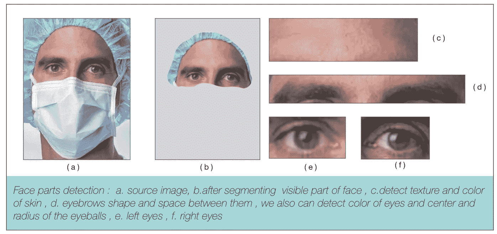
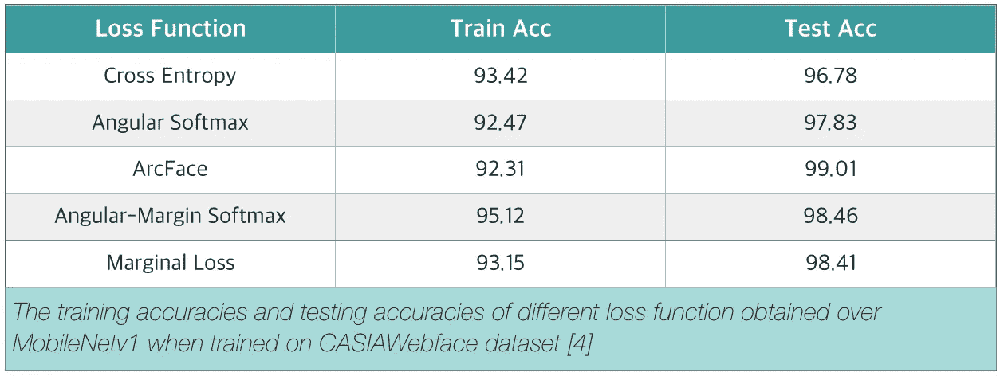

# 蒙面人脸识别应用

> 原文：<https://medium.datadriveninvestor.com/masked-face-recognition-application-9405b397aaea?source=collection_archive---------1----------------------->

人脸识别是通过人脸来识别或验证一个人的身份的过程。它根据人的面部细节捕捉、分析和比较模式。在过去的几年里，面部识别市场发展非常迅速。那是因为面部识别有各种各样的商业应用。犯罪识别、考勤系统、人脸解锁系统等应用。但是随着新冠肺炎的传播，全世界数百万人戴上了面具。这影响了面部识别系统的准确性。当戴上面具时，现有的人脸识别解决方案不再可靠，并且为了通过认证而移除面具将增加病毒感染的风险。突然间，员工无法在考勤系统中注册自己，因为许多公司暂停使用指纹设备，通过面部标记考勤效果不佳。为此，本工作提出了一种方法，可以改进严重依赖于所有面部特征点的现有人脸识别方法，以便在不完全暴露的人脸的情况下仍然可以可靠地执行身份验证。

**为了处理蒙面人脸识别，我提出一些我们必须遵循的任务:**

## **1。数据处理**

图像中的所有人脸及其标志都将通过多任务级联卷积网络(MTCNN)算法进行检测[1]。我们将使用两只眼睛作为相似性变换的标志。当检测失败时，我们简单地丢弃图像。数据集将包括网络收集的训练数据，真实世界的蒙面人脸识别数据集(RMFRD) [2]。在删除了测试数据集中出现的带有身份的图像后，它大致变成了 525 个不同人的 5000 张图像。

## **2。面部分割**

我们将使用深度人脸分割技术[3],该技术应用完全卷积网络(FCN)从上下文和遮挡中分割人脸的可见部分。所有相交的分割区域进一步前进到下一个任务。

## **3。人脸识别**

## **网络设置**

基于[卷积神经网络](https://en.wikipedia.org/wiki/Convolutional_neural_network) (CNN)提出的深度学习结构。与像 VGG 这样的老体系结构相比，像 ResNet 这样的高容量网络具有更好的预测准确性。如今，先进的技术使得训练更深的网络更快，并因此提取具有各种属性(位置、性别、年龄、模式)的大量面部数据(特征向量)。CNN 模型通过使用 100 个神经元完全连接层作为最后一层，将人脸图像映射到 100 维编码中。我相信，如果我们只为面部的上半部分指定完整的 100 维编码，我们将获得关于一个人面部的更有特色的细节。这些细节，如眼睛之间的距离或纹理，皮肤的颜色和眉毛的形状，然后被转换成数学表示，并与其他数据进行比较。

## **训练数据**

人脸被裁剪为 96 × 96 的 RGB 图像。图像被水平翻转以增加数据。这些图像中的每个像素通过减去 127.5 然后除以 128 来归一化。

## **损失函数**

损失函数在 CNN 训练中起着重要的作用。分类器的主要目标是增加类内紧密度，扩大类间分离。虽然 Softmax 损失是最广泛使用的分类，但它不具有这种区分能力。为此，科学家开发了三重态损失，使用三重态方法来提高性能。后来，另一个更损失函数实现了更准确的预测，如 ArcFace 损失或 insight face。

## **结论**

掩蔽识别应用要求对象靠近并面向摄像机。因此，高质量的正面人脸图像将很容易获得，使蒙面人脸识别任务将不再困难。即使掩模覆盖了人脸的一部分，上半脸的特征，例如眼睛和眉毛，仍然可以用于提高人脸识别的可用性。最后，在过去的几年中，人脸识别的使用随着大量的使用案例呈指数级增长。它可以用于从监控到营销的任何事情。人脸识别比以往任何时候都更代表着一个应该优先研究的重要问题。

 [## 认知计算——一套被广泛认为是……

### 作为它的用户，我们已经习惯了科技。这些天几乎没有什么是司空见惯的…

www.datadriveninvestor.com](https://www.datadriveninvestor.com/2020/02/19/cognitive-computing-a-skill-set-widely-considered-to-be-the-most-vital-manifestation-of-artificial-intelligence/) 

**参考文献**:

*【1】多任务级联卷积网络的联合人脸检测与对齐，张，k，张，z，李，z，乔*

*【2】蒙面人脸识别数据集及应用，王中原，，，黄，，熊，祁红，，，，裴英娇，，俞淼，黄志兵，梁金碧*

*[3]关于面部分割、面部交换和面部感知，尤瓦尔·尼尔金、亚科波·马西、安·图安·特兰、塔尔·哈斯纳、杰拉德·梅迪奥尼*

*[4]深度人脸识别 Yash Srivastava、Vaishnav Murali 和 Shiv Ram Dubey 的损失函数的性能评估*