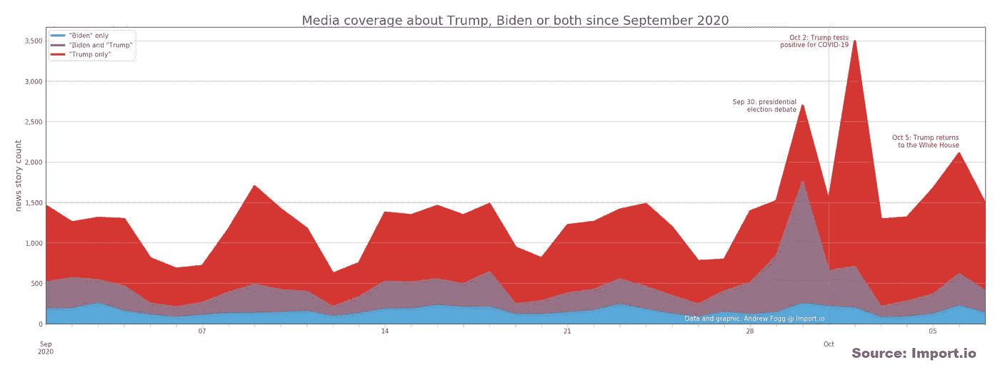

# 大量媒体研究显示，特朗普获得了 5 倍的报道——但没有爱

> 原文：<https://medium.datadriveninvestor.com/massive-media-study-shows-trump-gets-x5-the-coverage-but-no-love-e2f7869f86d0?source=collection_archive---------20----------------------->

Original composite image using campaign web site imagery.

## 特朗普被确诊时，周围的负面情绪略有上升——当他回到白宫时，情绪有所下降。

在俄亥俄州克利夫兰举行的 2020 年 9 月 29 日总统辩论期间，唐纳德·特朗普对乔·拜登说:

> “他们给你好的报道，给我坏的报道，因为不幸的是，事情就是这样。”——唐纳德·特朗普

到目前为止，特朗普的这一论断很难被证明或反驳。但是 Import.io 发布的一项新的媒体研究表明，在某种程度上，总统的这一论断是正确的。

这项研究分析了来自 1571 家美国英语新闻机构网站的 49682 篇新闻报道。这个庞大的数据集代表了从 9 月 1 日到 10 月 7 日提及特朗普、拜登或特朗普和拜登的报道。这些数据是从音量和音调两方面来衡量的。

 [## 忽略特朗普|数据驱动的投资者

### 通常，7 月 4 日是烧烤或逃离城市的日子。随着第一轮新冠肺炎…

www.datadriveninvestor.com](https://www.datadriveninvestor.com/2020/07/02/ignore-trump/) 

以下是他们的发现:

**特朗普&拜登的报道——并非绝对正面**

两位候选人都没有正面报道，但特朗普的语气肯定更加负面。

时间线显示拜登为蓝色，特朗普为红色。某些事件，如特朗普称赞斯科特·鲁斯·巴德·金斯伯格和特朗普自己对新冠肺炎的诊断，确实暂时提升了对特朗普的情绪——但这是短暂的。

Media sentiment timeline — Trump vs. Biden

TL；DR 分析——两位候选人都没有太多正面报道，但特朗普的报道更负面，围绕关键事件的波动更大。

**川普得到了更多的报道……**

自 9 月以来，关于特朗普的报道数量是关于拜登的报道数量的 5 倍。如果你把提到两个候选人的报道都考虑进去，特朗普仍然得到 x2 的报道量。

Volume of coverage — Trump vs. Biden

TL；分析博士——特朗普可能不会在媒体上表现出很大的情绪，但他很擅长被谈论。

更多需要考虑的事实:

*   在第一场总统辩论后，媒体对两位候选人的看法立即转向负面。
*   当特朗普在 10 月 2 日被诊断患有新冠肺炎时，这是媒体报道 2020 年美国总统大选最重要的一天，其次是 9 月 30 日，即第一场总统辩论的第二天。
*   在特朗普感染新冠肺炎的消息宣布后，特朗普的报道量飙升(但不是特朗普/拜登或拜登一人)，特朗普的情绪得分达到了历史最高水平。
*   特朗普住院期间的媒体情绪得分一直在上升，但在他返回白宫后再次下降

**结论**

当双方的权威人士惊叹这位高度两极分化的总统的巨大号召力时，这些数字引发了一个问题——所有的消息都是好消息是真的吗？还有待观察，竞选前的几周可能会充满惊喜。

Import.io 为全球公司提取和分析大规模的 web 数据。为了了解更多关于研究方法的信息，[查看该公司的博客条目](https://www.import.io/post/trump-vs-biden-web-scraping-the-news-to-understand-media-coverage-and-sentiment/)。

## 获得专家观点— [订阅 DDI 英特尔](https://datadriveninvestor.com/ddi-intel)