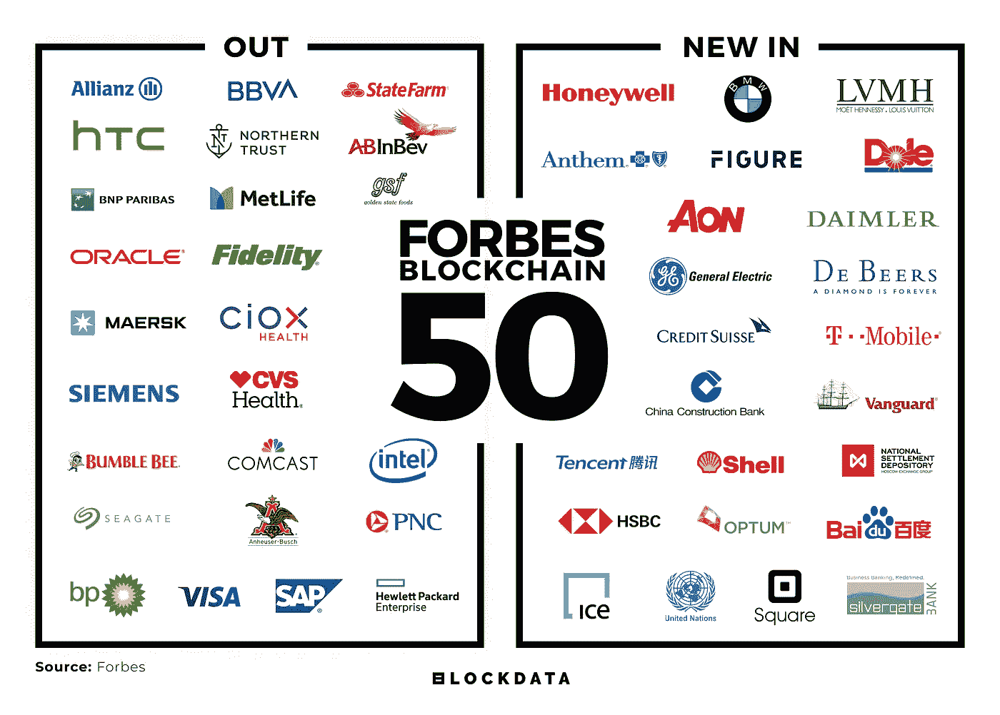
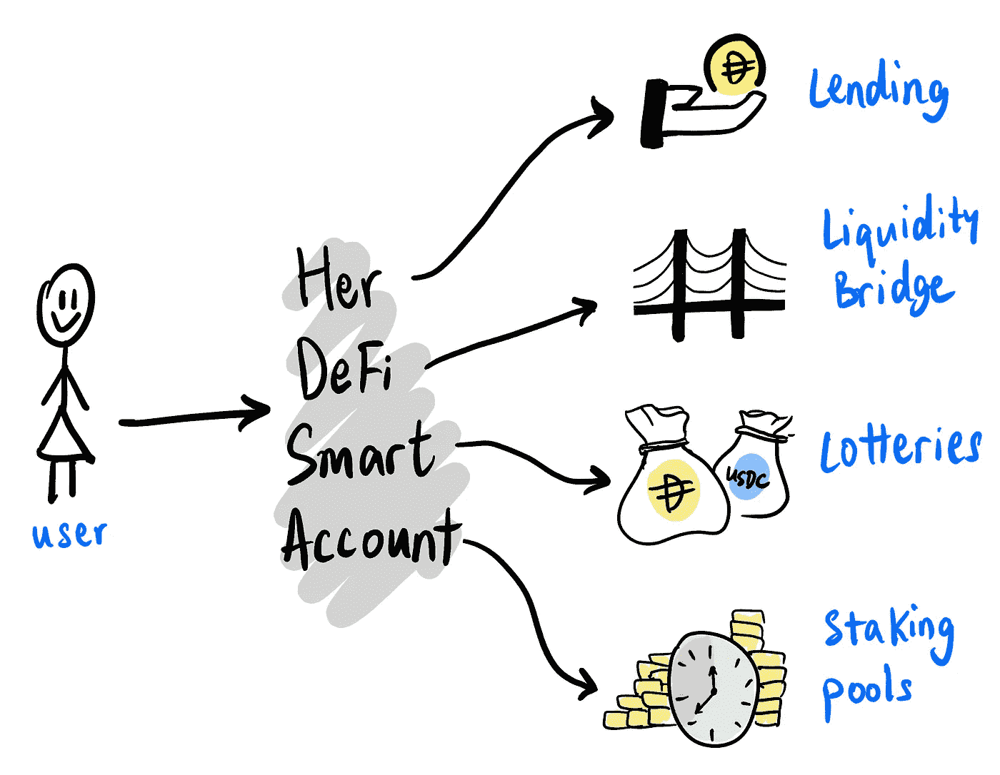

# 万事达卡首席执行官 Ajay Banga 下台/国际清算银行(BIS)深入探讨 CBDCs / DeFi 和以太网时代的到来

> 原文：<https://medium.datadriveninvestor.com/mastercard-ceo-ajay-banga-to-step-down-bank-for-international-settlements-bis-in-depth-on-1e251437aba4?source=collection_archive---------9----------------------->

*2020 年 3 月 7 日*

*对于金融科技、去中心化金融(DeFi)和开放的银行业来说，这是又一个糟糕的一周。本周版—* ***万事达卡*** *CEO 阿贾伊·邦加下台。* ***国际清算银行*** *(BIS)坦承玩味并深入讲解* ***央行数字货币*** *(CBDC)。加拿大银行***没有计划发行自己的数字货币，除非现金的竞争对手起飞。****Merchantrade****已获 BNM 批准增加其* ***签证*** *启用多币种电子钱包。* ***德国*** *承认* ***比特币*** *为合法金融工具。****block data****团队提供了福布斯最新区块链 50 强榜单的完整细分。DeFi 的正盛，然而建筑****DeFi****烂透了，闪现(租借)攻击将成为新常态。2019 年，24 家 FinTech 独角兽诞生——2020 年会有多少家崛起？。学习如何让****DeFi****为你的午餐买单(精彩阅读)。* ***毕马威*** *表示，加密托管机构有着“巨大的”增长潜力(为 2020 年这一类别的扩张做好准备)。为了了解更多信息，让你跟上时代的步伐，这里有一张本周业内热门新闻的快照。**

* [## 分散金融的出现|数据驱动的投资者

### 当前的全球金融体系为拥有资源、知识和财富的人创造了巨大的财富

www.datadriveninvestor.com](https://www.datadriveninvestor.com/2019/03/14/the-emergence-of-decentralized-finance/) 

***奖金#1*** *:我最近发布了最新的 Q1 2020 版 my* [*区块链版图*](https://www.linkedin.com/posts/kyleellicott_q12020-blockchain-landscapekyleellicotttopionetworks-activity-6638879840634310656-UNtB) *(包含在下面供下载)，它提供了一个行业概述，突出了 900 多家全球公司、风险基金和工作组。如果这是你看到的第一个版本，就把它当作你在这个行业中进一步导航的路线图。在这里获得高分辨率的免费！*

## 📖[伦敦金融科技初创公司 Revolut 估值 55 亿美元](https://www.bloomberg.com/news/articles/2020-02-25/revolut-valued-at-5-5-billion-in-fintech-s-latest-funding-round)

总部位于伦敦的金融科技初创公司 Revolut 在一轮融资中筹集了 5 亿美元，对这家金融科技公司的估值为 55 亿美元。筹集的资金将推动该公司致力于产品开发，并增加整个欧洲的银行业务。该公司已成为欧洲最有价值的金融科技初创公司之一，目标是在未来五年内拥有 1 亿客户……[阅读更多](https://www.bloomberg.com/news/articles/2020-02-25/revolut-valued-at-5-5-billion-in-fintech-s-latest-funding-round)

## 📈[国际清算银行承认 CBDC 在思考](https://thedailychain.com/bank-of-international-settlements-admits-to-cbdc-pondering/)

国际清算银行(BIS)发布了关于加密货币增长和采用的季度报告，主要是关于中央银行数字货币(CBDC)和令牌化。国际清算银行对全球不同银行对 CBD 日益增长的兴趣进行了更深入的研究，随后是中国推出加密货币引起的兴奋……[阅读更多信息](https://thedailychain.com/bank-of-international-settlements-admits-to-cbdc-pondering/)

## 📈副行长除非 Libra 成功，否则加拿大银行不会发行自己的密码

副行长 Timothy Lane 表示，加拿大银行没有计划发行自己的数字货币，除非现金的竞争对手起飞。加拿大银行在 R3 的分布式账本技术(DLT)解决方案 Corda 上运行了一个试点项目，但没有看到成功，因为监管机构没有留下深刻印象。虽然最明显的威胁是天秤座，稳定币最初由脸书倡导，目前还没有推出的时间表。目前，加拿大将继续由现有的支付生态系统提供良好的服务，相当有必要在此时发布 CBDC……[阅读更多信息](https://www.coindesk.com/bank-of-canada-wont-issue-its-own-crypto-unless-libra-succeeds-deputy-governor)

> *👉下载新的* [*区块链基础设施景观 Q1 2020*](https://www.topionetworks.com/markets/blockchain-landscape-5bf43854b9abe4633c1f87da) *版，了解关于 DeFi、FinTech、开放式银行和 FinTech 未来的见解。*

## 📖[英格兰银行警告采用加密可能会影响信用创造](https://cointelegraph.com/news/bank-of-england-warns-crypto-adoption-may-impact-credit-creation)

英格兰银行(BoE)负责金融稳定的副行长 Jon Cuncliffe 表示，像 stablecoin 钱包这样的加密经济的出现最终可能会削弱甚至消除银行信贷发行。肯克利夫迫使监管机构和央行在新兴加密货币生态系统变得“具有系统重要性”之前，审查并准备好应对与新兴加密货币生态系统相关的独特挑战。… [阅读更多信息](https://cointelegraph.com/news/bank-of-england-warns-crypto-adoption-may-impact-credit-creation)

## 📖[merchant trade 获得 BNM 批准将电子钱包限额提高至 20，000 令吉](https://fintechnews.my/23009/e-wallets-malaysia/merchantrades-e-wallet-receives-bnm-approval-to-increase-wallet-limit-size-to-rm-20000/)

Merchantrade 已获得 BNM 的批准，将其支持签证的多货币电子钱包的大小从 10，000 令吉增加到 20，000 令吉，预计在 2020 年 Q2 结束前生效。该批准将使该公司领先于其最接近的竞争对手 BigPay，为其客户提供更多便利和灵活性……[阅读更多](https://fintechnews.my/23009/e-wallets-malaysia/merchantrades-e-wallet-receives-bnm-approval-to-increase-wallet-limit-size-to-rm-20000/)

# 奖金#2:福布斯区块链 50 大数据深度挖掘

团队 [BLOCKDATA](https://medium.com/u/279c07ad0b4d?source=post_page-----f004d02251e7----------------------) 花时间为我们提供了福布斯最新区块链 50 强的完整细分，以获取今年榜单上最受欢迎的用例和开发平台的所有见解。与去年的名单相比，新增/删除了 24 家公司……[阅读更多](https://medium.com/blockdata/forbes-blockchain-50-data-deep-dive-117fc230822f)

Source: [Blockdata](https://medium.com/blockdata/forbes-blockchain-50-data-deep-dive-117fc230822f)* 

# *分散财务*

## *📖[风险生意:#DeFi 和以太坊的成人故事](https://medium.com/mycrypto/risky-business-defi-and-ethereums-coming-of-age-story-4d99465ad102)*

*对于分散融资(DeFi)，我们认为它是“DeFi Lego”，但如果基础不可靠，它实际上是“DeFi Jenga”，所有东西都会倒塌。每当有人未能坚持他们的协议，另一方就处于危险之中。DeFi 确实消除了一些交易对手风险，但你仍然会看到流动性、滑点和人为沟通失误方面的风险。当金融市场发生意想不到的事情时，它很少是积极的。当令人惊讶的事情发生，让一方获得 35 万美元，这通常意味着另一方，或各方失去了 35 万美元。最近这些攻击发生的原因是一些 DeFi 系统以各种方式相互连接、依赖或构建… [阅读更多](https://medium.com/mycrypto/risky-business-defi-and-ethereums-coming-of-age-story-4d99465ad102)并查看更多来自[泰勒·莫纳汉](https://medium.com/u/544d2eb94cf?source=post_page-----1e251437aba4--------------------------------) & [MyCrypto](https://medium.com/u/19919043dcef?source=post_page-----1e251437aba4--------------------------------)*

## *📖 [DeFi 智能账户](https://blog.instadapp.io/defi-smart-accounts/)*

**

*Source: [InstaDApp](https://blog.instadapp.io/defi-smart-accounts/)*

*以太坊账户和钱包主要是为代币资产设计的，而 DeFi 资产在管理、行政和分析方面的复杂程度要高得多。这需要对 UX、项目组合管理和管理委托采取完全不同的方法。随着底层协议的数量呈指数级增长，这个问题只会变得更加严重。当被要求自己管理所有资产，或在一个账户下管理时，用户很可能会失去他们的资产，信任不安全的 DApp，或为许多智能合同提供津贴……[阅读更多](https://medium.com/@andre_54855/building-in-defi-sucks-b8fdfda0ef58)并从 [InstaDApp](https://medium.com/u/442732df1e2c?source=post_page-----1e251437aba4--------------------------------) 查看更多*

## *📖[在#DeFi 烂透了的建筑](https://medium.com/@andre_54855/building-in-defi-sucks-b8fdfda0ef58)*

*批评为创新奠定了基础，但当数字金融服务像 iearn.finance 一样 100%免费提供时，批评是不道德的。社区在没有私下获得信息或试图了解更广泛情况的情况下提出了批评。这些批评的结论减缓了人们对公共利益创新的期望……[阅读更多](https://medium.com/@andre_54855/building-in-defi-sucks-b8fdfda0ef58)和查看更多来自 [Andre Cronje](https://medium.com/u/34f4446c6ba1?source=post_page-----1e251437aba4--------------------------------) 的文章*

## *📖[闪付贷款:为什么闪付攻击将成为新常态](https://medium.com/dragonfly-research/flash-loans-why-flash-attacks-will-be-the-new-normal-5144e23ac75a)*

*Flash loans 是由 Marble Protocol 的创始人 Max Wolff 在 2018 年推出的，并作为“智能合约银行”进行营销，通过智能合约提供 DeFi 创新的零风险贷款。闪贷不能收取传统意义上的利息，因为贷款是零时间活跃的。快速贷款在再融资贷款等服务中有使用案例。最近，两名黑客利用闪贷攻击保证金交易协议 bZx，首先是 35 万美元的攻击，后来是 60 万美元的模仿攻击。在每次攻击中，攻击者瞬间借入数十万美元的 ETH，通过一系列易受攻击的链上协议，从窃取的资产中提取数十万美元，然后偿还他们的巨额 ETH 贷款……[阅读更多](https://medium.com/dragonfly-research/flash-loans-why-flash-attacks-will-be-the-new-normal-5144e23ac75a)和查看更多来自[的 Haseeb Qureshi](https://medium.com/u/8bc4e5f8b505?source=post_page-----1e251437aba4--------------------------------)*

# *本周的更多内容:*

*📖[万事达卡首席执行官 Ajay Banga 下台，知情人 Miebach 窃听](https://www.reuters.com/article/us-mastercard-ceo/mastercard-ceo-ajay-banga-to-step-down-insider-miebach-tapped-idUSKBN20J1LG)*

*📖[金融科技行业报告](https://www.linkedin.com/pulse/fintech-industry-report-kyle-kling/?trackingId=Ki5XjGuPDGGwq%2F39iiwJdA%3D%3D)*

*📖[2019 年诞生了 24 只金融科技独角兽](https://fintechnews.hk/11298/various/24-fintech-unicorns-were-born-in-2019/)*

*📖[DeFi 用户应该问 DeFi 开发者的问题](https://diligence.consensys.net/blog/2020/03/questions-defi-users-should-be-asking-defi-developers/)*

*📖[DeFi 如何支付你的午餐](https://bankless.substack.com/p/how-defi-can-pay-for-your-lunches)由 [Brice Berdah](https://medium.com/u/15517686b62c?source=post_page-----1e251437aba4--------------------------------) 的 [Monolith](https://medium.com/u/fb0b7e32b7a5?source=post_page-----1e251437aba4--------------------------------)*

*📖[德国承认比特币为合法金融工具](https://decrypt.co/21148/germany-recognizes-bitcoin-as-a-legal-financial-instrument)*

*📖[高盛牵头在南非金融科技 Jumo](https://qz.com/africa/1808669/goldman-sachs-leads-55m-raise-in-south-african-fintech-jumo/) 募集 5500 万美元*

*📖[由](https://medium.com/opyn/providing-insurance-on-opyn-b370e67a709a) [opyn](https://medium.com/u/29ed85ed5e1f?source=post_page-----1e251437aba4--------------------------------) 为 Opyn 提供保险*

*📖[负责任的漏洞披露](https://medium.com/nexus-mutual/responsible-vulnerability-disclosure-ece3fe3bcefa)作者[罗克珊娜·丹妮拉](https://medium.com/u/e757764289a6?source=post_page-----1e251437aba4--------------------------------)*

*📖[从 Biser Dimitrov](https://www.forbes.com/sites/biserdimitrov/2020/02/28/six-things-we-learned-about-jpmorgans-blockchain-strategy-from-this-new-report/#73bfbbf86a02)[的新报告](https://medium.com/u/f91a4cb3fbb7?source=post_page-----1e251437aba4--------------------------------)中，我们了解到了关于摩根大通区块链战略的六件事*

*📖[毕马威表示，加密托管公司拥有“巨大的”增长潜力](https://www.theblockcrypto.com/post/57556/crypto-custodians-have-tremendous-growth-potential-says-kpmg)*

*📖[数据聚合商如何利用区块链为金融科技公司赋能](https://inc42.com/resources/how-data-aggregators-are-using-blockchain-to-empower-fintech-players/)*

# *🚨区块链行业状况 Q1 2020:*

**上周我发布了****Q1 2020****版* [*区块链景观图*](https://www.linkedin.com/posts/kyleellicott_q12020-blockchain-landscapekyleellicotttopionetworks-activity-6638879840634310656-UNtB) *。这是我发布的第五版景观，包括****747****家公司(* ***900 多家独特公司*** *包括更广泛的关键生态系统参与者)和超过***220 亿美元的资金，从 2010 年到 2020 年在整个景观中筹集，自 2010 年以来投资超过 180 亿美元—出现明显的循环，并有完整的分解。***

***一个完整的 60 分钟的景观概述视频现在可以在***这里免费观看。在视频中，我对 2020 年的前景进行了细分，提供了 2019 年的总结、2020 年的新兴趋势、DeFi、Libra、CDBCs、Stablecoins、DApps 等等！****

****

**Source: [Topio Networks](https://www.topionetworks.com/markets/blockchain-landscape-5bf43854b9abe4633c1f87da)**

**不想等到下周，[现在就订阅](http://click1.m.readwritelabs.com/xsdqkbbrgsdtqkmntpjlstcnkytvpvphsnhsqlvbrhhd_yfqbfcmslnskglmckvqv.html?source=post_page---------------------------)📥有关区块链、DeFi、DApps 等的实时行业见解！**