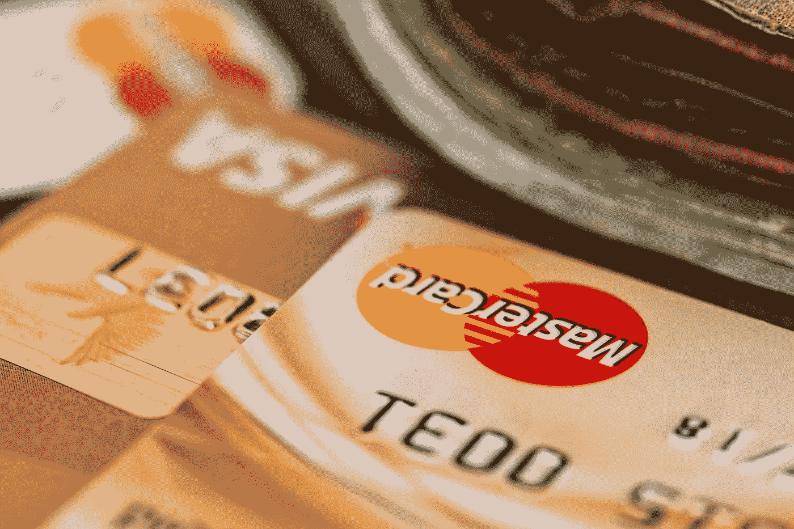

# 万事达卡获准进入中国/黑客利用 DeFi 赚了 100 万美元/ Apple Pay 现在占全球交易的 5%以上

> 原文：<https://medium.datadriveninvestor.com/mastercard-wins-approval-to-enter-china-hacker-makes-1m-exploiting-defi-apple-pay-now-over-5-7ff86aaa2e77?source=collection_archive---------16----------------------->

Photo by [Pixabay](https://www.pexels.com/@pixabay?utm_content=attributionCopyText&utm_medium=referral&utm_source=pexels) from [Pexels](https://www.pexels.com/photo/bank-blur-business-buy-259200/?utm_content=attributionCopyText&utm_medium=referral&utm_source=pexels)

*2020 年 2 月 20 日*

*我们看到了金融科技领域的巨大势头和变化，我决定创建一个独立的网站，提供对金融科技、DeFi(去中心化金融)和开放银行领域最近发生的所有事情的见解。欢迎来到第一版，我们走吧！*

***Apple Pay*** *目前占全球信用卡交易的 5%，预计到 2025 年将处理超过 10%的支付业务。这对 FinTech 来说是一个改变游戏规则的消息，* ***万事达卡*** *获得了进入中国市场的批准。在 DeFi，根据 DeFi Pulse 的数据，第八大分散融资项目****【bZx****在引入“闪贷”后，上周末遭受了两次攻击，损失约 100 万美元。* ***签证*** *已经授予* ***比特币基地*** *发行比特币借记卡的权力。* ***达摩*** *，世界第一家密码银行最近推出为用户提供实时赚取 6.6%年利率利息的能力，而****Opyn****推出一个保险平台来保护 DeFi 用户。我们已经更新了* ***【优步货币】*******Monzo、*******Libra****，并深入探讨了加密资产估值、加密美元的崛起以及 DeFi 代币/支付。***

** [## 分散金融的出现|数据驱动的投资者

### 当前的全球金融体系为拥有资源、知识和财富的人创造了巨大的财富

www.datadriveninvestor.com](https://www.datadriveninvestor.com/2019/03/14/the-emergence-of-decentralized-finance/) 

为了了解更多信息，让你跟上时代的步伐，这里有一张本周业内重大新闻的快照。

## 📈 [Apple Pay 将占全球信用卡交易的 10%](https://qz.com/1799912/apple-pay-on-pace-to-account-for-10-percent-of-global-card-transactions/)

数字支付是一个机会，代表着全球近 1 万亿美元的收入。Apple Pay 在 2019 年的最后三个月创造了 127 亿美元的收入，比去年同期增长了 17%。该公司的钱包占全球信用卡交易的近 5%，预计到 2025 年将处理十分之一的此类支付。Apple Pay 的收入和交易在上一个财季增长了一倍多。蒂姆·库克正计划通过该公司的信用卡将钱包与现金返还联系起来，从而给钱包带来额外的刺激。“Apple Pay 确实是 PayPal 的长期竞争威胁之一，”伯恩斯坦分析师写道……[阅读更多](https://qz.com/1799912/apple-pay-on-pace-to-account-for-10-percent-of-global-card-transactions/)

## 📈[万事达卡获准进入中国支付市场](https://www.ft.com/content/657cdcf0-4ccc-11ea-95a0-43d18ec715f5)

根据 Frost & Sullivan 的一份报告，预计到 2023 年，中国的移动支付将比 2017 年增长 21.8%，达到 96.73 万亿美元，活跃移动支付客户总数预计到 2023 年将达到 9.56 亿，高于 2017 年的 5.62 亿。在多次试图进入中国 27 万亿美元的支付市场未果后，万事达卡获得了中国人民银行(PBOC)的批准，开始正式筹备在中国设立银行卡清算机构……[阅读更多](https://www.ft.com/content/657cdcf0-4ccc-11ea-95a0-43d18ec715f5)

## 📈[关于 DeFi“闪贷”攻击，你想知道的一切](https://www.coindesk.com/everything-you-ever-wanted-to-know-about-the-defi-flash-loan-attack)

根据 [DeFi Pulse](https://www.defipulse.com/) 的数据，bZx ( [bZx Team](https://medium.com/u/c84b634c7ca3?source=post_page-----7ff86aaa2e77--------------------------------) )是第八大分散化金融项目，在上周末推出“闪贷”后遭受了两次攻击，这是一种新的 DeFi 功能，在提高收益的同时限制了交易者的风险。在首席执行官汤姆·比恩(Tom Bean)的带领下，bZx 团队周五参加了在科罗拉多州首府举行的大型以太坊会议 ETHDenver，当时一名不明身份的攻击者从这家初创公司的贷款平台 Fulcrum 取走了价值约 35 万美元的以太。正如来自该公司的[事后分析所描述的](https://bzx.network/blog/postmortem-ethdenver)，攻击者利用定价数据和 bZx 协议代码中的一个错误来确保支付……[阅读更多](https://www.coindesk.com/everything-you-ever-wanted-to-know-about-the-defi-flash-loan-attack)

## 📖 [Visa 授权比特币基地发行比特币借记卡](https://www.forbes.com/sites/michaeldelcastillo/2020/02/19/visa-grants-coinbase-power-to-issue-bitcoin-debit-cards/#51a1847b2e83)

信用卡巨头 Visa 首次将其主要会员资格授予一家加密货币公司。2019 年 12 月正式授予加密货币交易所[比特币基地](https://medium.com/u/b9034df3e57a?source=post_page-----7ff86aaa2e77--------------------------------)，然而，直到 2020 年 2 月才向公众透露，会员资格从发行借记卡的过程中去掉了一个关键而昂贵的中间人，让用户花自己的比特币，ether & XRP 任何地方的签证都被接受… [阅读更多](https://www.forbes.com/sites/michaeldelcastillo/2020/02/19/visa-grants-coinbase-power-to-issue-bitcoin-debit-cards/#51a1847b2e83)

## 📖[加密货币、“去中心化金融”和 8%利息的甜蜜承诺](https://fortune.com/2020/02/19/cryptocurrency-decentralized-finance-and-the-sweet-promise-of-8-interest/)

美国经济可能正在蓬勃发展，但对于那些寻求储蓄回报的人来说，前景并不那么美好:即使是所谓的高收益储蓄账户也只提供微薄的利息——例如，高盛(Goldman Sachs)的 Marcus 产品目前提供的利息只有区区 1.7%。这就是分散金融(DeFi)这个新世界如此吸引人的原因。加密货币市场的这个奇异角落已经存在了不到两年，但却吸引了巨大的兴趣，因为用户吹嘘他们的存款可以获得 4%到 8%的利息……[阅读更多](https://fortune.com/2020/02/19/cryptocurrency-decentralized-finance-and-the-sweet-promise-of-8-interest/)

## 📖【2020 年福布斯 50 大金融科技公司中有 6 家是区块链公司

在 2020 年 2 月 12 日发布的 2020 年金融科技 50 强榜单中，福布斯将 [AXONI](https://medium.com/u/acb80f3ff232?source=post_page-----7ff86aaa2e77--------------------------------) 、[chain analysis Team](https://medium.com/u/5e8e832cba90?source=post_page-----7ff86aaa2e77--------------------------------)、比特币基地、Everledger、MakerDao 和 Ripple 列为“区块链和比特币”类别。在六个区块链和加密相关类别中，加密交易所巨头比特币基地获得了最多的资金，达到 5.25 亿美元。Ripple 以 2.93 亿美元位居第二。 [Everledger](https://medium.com/u/4d271f76a562?source=post_page-----7ff86aaa2e77--------------------------------) 公布了上市加密公司中最小的资金基础，为 2000 万美元… [阅读更多](https://cointelegraph.com/news/six-out-of-forbes-top-50-fintech-companies-for-2020-are-in-blockchain)

## 📖 [Monzo 首席执行官汤姆·布隆菲尔德:大银行是为了“扼杀”变革而设立的](https://www.cnbc.com/2020/02/10/monzo-ceo-tom-blomfield-big-banks-are-set-up-to-kill-change.html)

Monzo 首席执行官 Tom Blomfield 表示，大银行背负着过时的技术和规避风险的文化。“银行非常专注于现有的金融产品，”指的是抵押贷款、贷款和信用卡等“资产负债表产品”在去年 1.46 亿美元注资的支持下，他的移动银行估值升至 25 亿美元。布洛姆菲尔德表示，他觉得大型贷款机构和它们的客户之间存在“脱节”。他表示，银行“是为了阻止变革而设立的”，并且“在寻找变革，试图扼杀变革。”… [阅读更多](https://www.cnbc.com/2020/02/10/monzo-ceo-tom-blomfield-big-banks-are-set-up-to-kill-change.html)** 

# **分散财务**

## **📖[分权财务的四个阶段](https://cointelegraph.com/news/the-four-phases-of-decentralized-finance)**

**分散融资(DeFi)正在迅速发展，一个四阶段模型有助于确定已经完成的重大变革和即将到来的重大发展。第一阶段可以被称为“大爆炸”企业家、分析师和专家。在最初的概念验证阶段之后，DeFi 进入了一个突破性的时刻——第二阶段。专家们认识到，加密的本地金融产品是可能的，权力下放是一种优势，而不是一种负担。在 DeFi 的第三阶段，企业回归传统产品。DeFi 的第四个也是最后一个阶段是最具推测性的:我们不太清楚它什么时候会到来，也不知道它会包含什么。… [阅读更多信息](https://cointelegraph.com/news/the-four-phases-of-decentralized-finance)**

## **📖 [Opyn 推出保险平台保护 DeFi 用户](https://medium.com/opyn/opyn-launches-insurance-platform-to-protect-defi-users-fdcabaca7d97)**

**[opyn](https://medium.com/u/29ed85ed5e1f?source=post_page-----7ff86aaa2e77--------------------------------) 是一个允许以太坊 DeFi 用户保护自己免受技术和金融风险的平台，从复合存款保险开始。该平台是一个双边市场，使用令牌化的 ERC20 看跌期权设计，称为 oTokens。这将是首个保护 DeFi 用户免受流动性危机影响的平台，并允许 ETH 持有人通过提供保险从其持有的 ETH 资产中赚取可观的溢价……[阅读更多](https://medium.com/opyn/opyn-launches-insurance-platform-to-protect-defi-users-fdcabaca7d97)**

## **📖[天秤座协会正在考虑转向美元支持的稳定货币](https://www.theblockcrypto.com/daily/54860/the-libra-association-is-weighing-a-shift-to-a-u-s-dollar-backed-stablecoin)**

**Libra Association 正在考虑是否放弃现有的货币和资产篮子模型，转而支持以美元为中心的 Libra stablecoin 模型。此举可能会缓解监管机构和立法者对瑞士倡议的疑虑。对其他美元支持的稳定债券来说，这可能没什么大不了的……[阅读更多](https://www.theblockcrypto.com/daily/54860/the-libra-association-is-weighing-a-shift-to-a-u-s-dollar-backed-stablecoin)**

# **本周的更多内容:**

**📖 [DeFi 被](https://tokentuesdays.substack.com/p/defi-gets-flash-fcked?r=6sqy&utm_campaign=post&utm_medium=web&utm_source=copy) [Fitzner 区块链](https://medium.com/u/80b937da83d8?source=post_page-----7ff86aaa2e77--------------------------------)干掉了**

**📖[加密资产估值研究入门，第 1 部分](https://coinmetrics.substack.com/p/coin-metrics-state-of-the-network-6f5)作者[凯文·卢](https://twitter.com/luyongxu)**

**📖[以太:货币的新模式(重新发布)](https://bankless.substack.com/p/ether-a-new-model-for-money-re-release)作者[瑞安·肖恩·亚当斯](https://medium.com/u/4a4d94c2ec4c?source=post_page-----7ff86aaa2e77--------------------------------)**

**📖[DeFi 代币值得买吗？卢卡斯·坎贝尔](https://bankless.substack.com/p/are-defi-tokens-worth-buying)**

**💰[加密美元的崛起](https://bankless.substack.com/p/rise-of-the-cryptodollar)作者 [Ryan Sean Adams](https://medium.com/u/4a4d94c2ec4c?source=post_page-----7ff86aaa2e77--------------------------------) 作者[无银行](http://bankless.substack.com)**

**📖[DeFi Dive:ky ber Network——分散融资的链上流动性协议](https://defipulse.com/blog/defi-dive-kyber-network/)**

**📖[优步与优步金融团队加强在印度的金融科技业务](https://www.business-standard.com/article/companies/uber-strengthens-its-india-fintech-presence-with-uber-money-team-120021101432_1.html)**

**📖[瓦洛离成为一家银行又近了一步](https://www.wsj.com/articles/fintech-varo-moves-closer-to-becoming-a-bank-11581361990)**

**📖[莱特币的创造者，查理·李不相信 DeFi——这就是为什么](https://coingape.com/litecoin-creator-doesnt-believe-in-the-idea-of-defi-heres-why/)**

**📖 [SafeCapital 推出基于区块链的分散式金融服务](https://coingape.com/safecapital-launches-decentralized-finance-services-blockchain/)**

**📖[真实租金支付 V2:用复利增加收益](https://medium.com/realtplatform/realt-rent-payments-v2-increasing-yields-with-compound-d7579178426a)由[大卫·霍夫曼](https://medium.com/u/856cb9f985dd?source=post_page-----7ff86aaa2e77--------------------------------)**

**📖[见见 Consensys 的超光速粒子加速器 2020 冬季计划](https://medium.com/@itsbdell/meet-the-9-open-finance-startups-of-consensys-tachyon-accelerator-winter-2020-program-9169100a082f)的 9 家开放金融初创公司 [Brian Dell](https://medium.com/u/446208243ed8?source=post_page-----7ff86aaa2e77--------------------------------)**

# **🎧行业现状—区块链 Q1 2020:**

**[*加入我*](https://www.topionetworks.com/events/5e1e691778e0025bb65b3991?flow=rw_event&utm_source=Kyle%20Social&utm_medium=Post&utm_campaign=Blockchain%2002%2F20&utm_content=Promo)*2020 年 2 月 27 日为我分享对区块链行业* [*状态的感悟*](https://www.topionetworks.com/events/5e1e691778e0025bb65b3991?flow=rw_event&utm_source=Kyle%20Social&utm_medium=Post&utm_campaign=Blockchain%2002%2F20&utm_content=Promo) [*为 Q1 2020*](https://www.topionetworks.com/events/5e1e691778e0025bb65b3991?flow=rw_event&utm_source=Kyle%20Social&utm_medium=Post&utm_campaign=Blockchain%2002%2F20&utm_content=Promo) *。我们将深入探讨 2019 年如何迅速成为区块链/DLT 格局的决定性一年。我们见证了企业和政府采用的激增，对基础设施、分散应用(DApps) &金融(DeFi)的日益关注，以及 2020 年的建筑预期。这个新的十年将会是最重要的一年，有大量的计划发布(天秤座，数字货币，协议等等)。)，整个基础设施的改进，以及消费者首次采用的转折点。此外，我将深入探讨行业的整体状况，从 2019 年到 2020 年 Q1 的变化，并为您提供一个路线图，以成功导航快速兴起的去中心化未来，以及您的主要问题。***

****

**[Source](https://www.topionetworks.com/events/5e1e691778e0025bb65b3991?flow=rw_event&utm_source=Kyle%20Social&utm_medium=Post&utm_campaign=Blockchain%2002%2F20&utm_content=Promo)**

**不想等到下周，[现在就订阅](http://click1.m.readwritelabs.com/xsdqkbbrgsdtqkmntpjlstcnkytvpvphsnhsqlvbrhhd_yfqbfcmslnskglmckvqv.html?source=post_page---------------------------)📥有关区块链、DeFi、DApps 等的实时行业见解！**