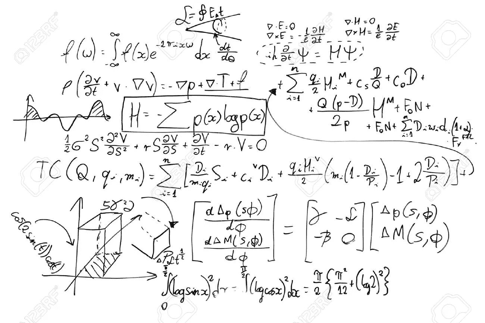
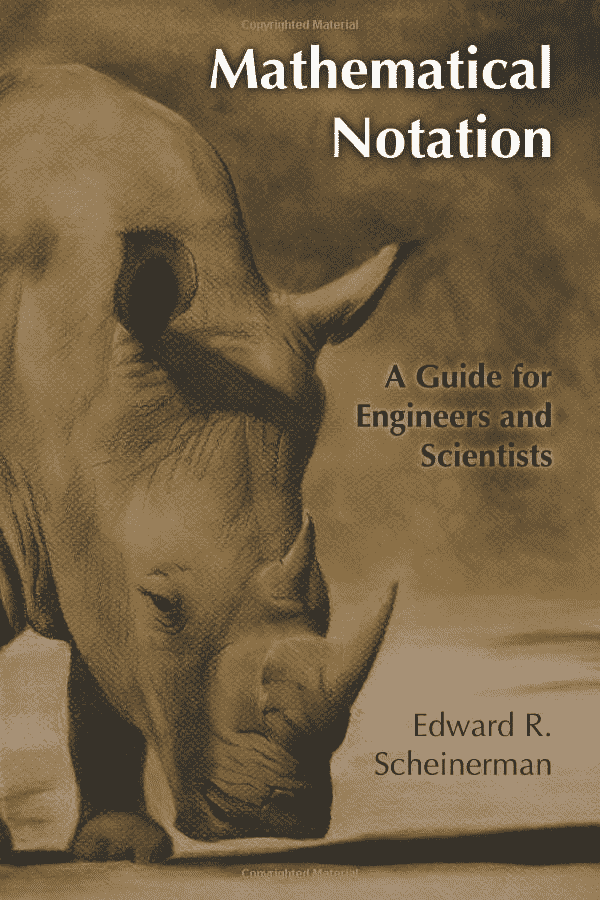

# Python 开发人员的数学符号(第 1 部分)

> 原文：<https://medium.datadriveninvestor.com/mathematical-notation-for-python-developers-part-1-1c94599b97cd?source=collection_archive---------7----------------------->



作为一名自学成才的开发人员，我大部分时间都在努力阅读白皮书，或者浏览包含大量数学术语(大多是怪异和神奇的符号)的数据科学课程。

我感谢 Edward R. Scheinerman 的书【T2 数学符号:工程师和科学家指南】，这本书在一开始给了我最大的帮助*。*

[](https://www.datadriveninvestor.com/2019/03/25/a-programmers-guide-to-creating-an-eclectic-bookshelf/) [## 创建折衷书架的程序员指南|数据驱动的投资者

### 每个开发者都应该有一个书架。他的内阁中可能的文本集合是无数的，但不是每一个集合…

www.datadriveninvestor.com](https://www.datadriveninvestor.com/2019/03/25/a-programmers-guide-to-creating-an-eclectic-bookshelf/) 

如果你和我一样在挣扎，我强烈建议你购买它，如果你想看 https://www . Amazon . co . uk/Mathematical-Notation-Engineers-Scientists-Scheinerman/DP/b00e 321 mu 8，这里有一个链接。



Mathematical Notation: A Guide for Engineers and Scientists

# 介绍

本教程的重点是将数学符号翻译成 Python。

**注意** : Python 3.6 是我将在本系列教程中使用的。

仅供参考:我将尽可能避免使用任何库，这样任何人都可以很容易地理解符号下面发生的事情。

# 那么…我们开始吧，好吗？

# 设置

**集合**是禁止重复的项目的集合。

示例:{1，2，3，4}

强化注:有类似{1，2，3，4，4}的重复的集合将再次等于{1，2，3，4}，因为重复在一个集合内是不存在的。

## Python 中的 Set 声明:

```
# Declare the set
my_set = {1, 2, 3, 4, 4}
# Will output {1, 2, 3, 4}# FUN NOTE: Strings can also be added to sets in Python like        # {"Banana", "Apple"}
```

# 集合和元素成员资格

集合和元素之间的成员关系用以下符号定义:

为了便于阅读，我将在符号后面加上它的含义。

∑(元素存在于)，1∑{ 1，2，3}

∋(集合包含元素)，{1，2，3} ∋ 1

```
# Declare the set
my_set = {1, 2, 3}print(1 in my_set) # Equivalent to 1 ∈ {1, 2, 3} or {1, 2, 3} ∋ 1
>> True
```

∉(元素不存在于中)，1 ∉ {2，5，6}

∌(集合不包含元素)，{2，5，6} ∌ 1

```
# Declare the set
my_set = {1, 2, 3}(1 not in my_set) # Equivalent to 1 ∉ {2, 5, 6} or {2, 5, 6} ∌ 1
>> True
```

## 处理大型集合

假设您想要创建一个从 1 到 100 的集合，您不希望将所有内容都写在纸上，相反，您可以显示一些传达模式的元素，并用省略号(…)填充其余的元素。

示例:{1，2，3，4，5，…，100}

你也可以采取以下方法:

{x ∈ ℤ: 1 ≤ x ≤ 100}

**注意事项**:

*   ℤ = {-∞, …, -2,-1,0,1,2….∞} =所有整数的集合。
*   x 代表用于每次迭代的虚拟变量。

x ∈ ℤ = x 迭代是ℤ集的一部分，换句话说，x 在每次迭代中都是一个整数。

1 ≤ x ≤ 100 =每次 x 迭代将是(大于或等于 1)和(小于或等于 100)。

```
# In case you are wondering about why the range goes to 101, that is # because, the last argument is where it stops, meaning it will only # reach the previous iteration (100).# For more information check:   # [https://www.geeksforgeeks.org/python-range-function/](https://www.geeksforgeeks.org/python-range-function/)our_set = {x for x in range(1, 101)}
print(our_set)
>> {1, 2, 3, 4,..., 100}# or the easiest approach for newcomers.our_set = set()
for x in range(1, 101):    
    our_set.add(x)
print(our_set)
>> {1, 2, 3, 4,..., 100}
```

# 设置以设置成员资格

## 设置等式

A = {1，2，3，4，5}而 B = {1，2，3，4，5}那么我们可以说 **A = B** 因为在两个变量中找到的元素是相同的。

## 子集

A = {1，2，3}和 B = {1，2，3，4，5}

我们可以看到，a 中的每个元素在 b 中都能找到，这意味着 a 是 b 的子集或⊆ B = {1，2，3} ⊆ {1，2，3，4，5}

⊆相当于“的子集”。

```
# For more info check:
# [https://www.programiz.com/python-programming/methods/set/issubset](https://www.programiz.com/python-programming/methods/set/issubset)A = {1, 2, 3}
B = {1, 2, 3, 4, 5}
C = {1, 2, 4, 5}# Returns True
print(A.issubset(B))# Returns False
# B is not subset of A
print(B.issubset(A))# Returns False
print(A.issubset(C))# Returns True
print(C.issubset(B))
```

## 超集

超集是由子集的相反顺序得到的，因为在这里我们定义集合 A 有所有的元素|是一个超集 *B，我们也可以说 B 是 A 的子集*

⊇=⊆

A = {1，2，3，4，5}和 B = {1，2，3}

⊇ B = {1，2，3，4，5} ⊆ {1，2，3}

⊇相当于“的超集”。

```
"""
For more information check:
[https://www.programiz.com/python-programming/methods/set/issuperset](https://www.programiz.com/python-programming/methods/set/issuperset)
"""A = {1, 2, 3, 4, 5}
B = {1, 2, 3}
C = {1, 2, 3}# Returns True
print(A.issuperset(B))# Returns False
print(B.issuperset(A))# Returns True
print(C.issuperset(B))
```

我将把这个系列的第二部分的链接放在下面。

[](https://medium.com/datadriveninvestor/mathematical-notation-for-python-developers-part-2-sets-continuation-b53cac11a770) [## Python 开发人员的数学符号(第 2 部分)|集合延续

### 在上一篇文章中，我们对什么是集合以及它们的成员是如何工作的有了基本的了解…

medium.com](https://medium.com/datadriveninvestor/mathematical-notation-for-python-developers-part-2-sets-continuation-b53cac11a770)