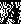

# Python 开发人员的数学符号(第 2 部分)|集合符号

> 原文：<https://medium.datadriveninvestor.com/mathematical-notation-for-python-developers-part-2-sets-continuation-b53cac11a770?source=collection_archive---------2----------------------->


在之前的[文章](https://medium.com/datadriveninvestor/mathematical-notation-for-python-developers-part-1-1c94599b97cd?source=your_stories_page---------------------------)中，我们通过简单的 Python 3 片段对什么是集合以及它们的成员如何工作有了基本的了解。

在第 2 部分中，我们将使用我们的朋友 Python 3 继续了解更多关于集合关系的知识。

## 联盟

顾名思义，它是两个或更多集合的并集。联合用符号∨表示。

如果 A 和 B 是**集合**并且 A = {1，2，3}，B={3，4，5}那么 A ∪ B = {1，2，3，4，5}

```
# For more info [https://www.w3schools.com/python/ref_set_union.asp](https://www.w3schools.com/python/ref_set_union.asp)a = {1, 2, 3}
b = {3, 4, 5}c = a.union(b)
print(c)
# >> {1, 2, 3, 4, 5}"""
If you do not want to use any in-build functionalities you can simply use the | operator to unite sets.
For more info [https://www.programiz.com/python-programming/methods/set/union](https://www.programiz.com/python-programming/methods/set/union)
"""c = a | bprint(c)
# >> {1, 2, 3, 4, 5}
```

## 交集

当您想要获得两个集合中都存在的元素时，可以使用交集，交集用符号 **∩** 表示。

如果 A 和 B 是**集合**并且 A = {1，2，3}，B={3，4，5}那么 A ∩ B = {3}

```
# For more info check
# [https://www.w3schools.com/python/ref_set_intersection.asp](https://www.w3schools.com/python/ref_set_intersection.asp)a = {1, 2, 3}
b = {3, 4, 5}c = a.intersection(b)
print(c)
# >> {3}"""
If you do not want to use any in-build functionalities you can simply use the & operator to get the set intersection.
For more info [https://www.programiz.com/python-programming/methods/set/intersection](https://www.programiz.com/python-programming/methods/set/intersection)
"""c = a & bprint(c)
# >> {3}
```

## 差异

差异是 A 中所有不属于 b 的元素的集合。差异用符号 **-** 表示。

如果 A 和 B 是**集合**并且 A = {1，2，3}，B={3，4，5}那么 A - B = {1，2}

```
# For more info check:
# [https://www.w3schools.com/python/ref_set_difference.asp](https://www.w3schools.com/python/ref_set_difference.asp)a = {1, 2, 3}
b = {3, 4, 5}c = a.difference(b)
print(c)
# >>  {1, 2}"""
If you do not want to use any in-build functionalities you can simply use the - operator to get the difference.
For more info [https://www.programiz.com/python-programming/methods/set/difference](https://www.programiz.com/python-programming/methods/set/difference)
"""c = a - bprint(c)
# >>  {1, 2}
```

## 补充

如果 a 是一个集合，A= {1，2，3}，那么 a 的补集将引用元素，而不是 a 中的元素。补集可以用不同的方式表示，如 a '或 Aᶜ或:



Complement of A

注意:如果你想知道为什么最后的**补码**符号是图像格式的，那是因为 medium 没有正确渲染一些 latex 配置。

[](https://www.datadriveninvestor.com/2019/02/21/best-coding-languages-to-learn-in-2019/) [## 2019 年最值得学习的编码语言|数据驱动的投资者

### 在我读大学的那几年，我跳过了很多次夜游去学习 Java，希望有一天它能帮助我在…

www.datadriveninvestor.com](https://www.datadriveninvestor.com/2019/02/21/best-coding-languages-to-learn-in-2019/) 

让我们假设集合 **X** 包含了宇宙中所有可能的数字，集合 **X** = {1，2，3，4，5，6，7}，我们有另一个集合表示为集合 **A，** **A** = {1，2，3}，然后 Aᶜ = {4，5，6，7}。

我不打算在 Python 3 中表示这个符号，因为它类似于**差异符号**所表示的。

## 使用补码符号的时候一定要非常小心，并尝试添加上下文，否则你可能会得到一个无限集合。

## 对称差

对称差是包含存在于 A 和 B 中但不同时存在于两者中的元素的集合。对称差用符号∈表示。

如果 A 和 B 是**集合**并且 A = {1，2，3}，B={3，4，5}那么 A-B = { 1，2，4，5}

```
# For more info check:
# [https://www.w3schools.com/python/ref_set_symmetric_difference.asp](https://www.w3schools.com/python/ref_set_symmetric_difference.asp)a = {1, 2, 3}
b = {3, 4, 5}c = a.difference(b)
print(c)
# >> {1, 2, 4, 5}"""
If you do not want to use any in-build functionalities you can simply use the ^ operator to get the difference.
For more info [https://www.programiz.com/python-programming/methods/set/symmetric_difference](https://www.programiz.com/python-programming/methods/set/symmetric_difference)
"""c = a ^ bprint(c)
# >> {1, 2, 4, 5}
```

## 笛卡尔乘积

笛卡尔积是两个集合相乘形成所有有序对的集合。笛卡尔积用乘法符号×。

如果 A 和 B 是**集合**并且 A = {1，2，3}，B={4，5，6}

A × B = {(a，b): a ∈ A 和 b ∈ B}

那么 A × B = {(2，4)，(3，4)，(1，5)，(1，4)，(2，6)，(3，6)，(1，6)，(2，5)，(3，5)}

```
a = {1,2,3}
b = {4,5,6}
v = {(x, y) for x in a for y in b}print(v)
# >> {(2, 4), (3, 4), (1, 5), (1, 4), (2, 6), (3, 6), (1, 6), (2,5), # (3, 5)}
```

笛卡尔积在开始时很难理解，所以我会给你留几个链接，可能会帮助你更好地理解笛卡尔积是什么。

[](https://www.mathstopia.net/sets/cartesian-product) [## 笛卡尔乘积

### 对于两个集合 a 和 b，a 和 b 的笛卡尔积用 A×B 表示，定义为:A×B = { (a，b) | aϵA 和 bϵB }…

www.mathstopia.net](https://www.mathstopia.net/sets/cartesian-product) 

## 动力装置

如果 A 是一个集合，那么 A 的幂集是 A 的所有子集的集合，这包括空集和 A 本身。A 的幂集用 P(A)表示。

A = {1，2，3}那么 P(A) = {{}，{1}，{2}，{3}，{1，2}，{1，3}，{2，3}，{1，2，3}，{1，2，3}}

**注:**

在下面的 Python 代码片段中，你会注意到我们没有在集合中使用集合。这是因为在集合中添加的每个对象都必须是不可变的。因此，您将看到父集，而不是子集，您将看到具有 powerset 迭代的 itertools 对象。

**那么，你可能会问，它们为什么是不可改变的呢？**

因为你在集合中添加的每个对象都将被散列，这是 Python 中集合计算唯一值并索引它们的方式，这意味着你不能在集合中添加集合、列表、字典或任何其他可变对象。

> **Hashable**
> 一个对象是 **hashable** 如果它有一个在其生命周期内永不改变的哈希值(它需要一个 **hash** ()方法)，并且可以与其他对象进行比较(它需要一个 **eq** ()或 **cmp** ()方法)。**比较相等的散列**对象必须具有相同的**散列**值。
> 
> **Hashability** 使一个对象可用作**字典**键和**集合**成员，因为这些数据结构在内部使用哈希值。
> 
> Python 的所有**不可变**内置对象都是**可散列**，而没有可变容器(如列表或字典)是可散列的。默认情况下，作为用户定义类实例的对象是**可散列的**；它们都是不相等的比较，它们的哈希值就是它们的 id()。

```
from itertools import combinations, chain# Defines the parent set and adds an empty tuple inside (this is our # equivalent to an empty set)
empty_set = {(), }def powerset(someset): try: # Check if someset is a set someset.isdisjoint except AttributeError: raise TypeError( f"{powerset.__name__} accepts only a set-like object as       parameter" ) from None # Get the length/cardinality of the set.  size = len(someset) # Check below for more information on length. combs =  set() for k in range(1, size+1):
    """ Combinations are emitted in lexicographic sorted order. So,if      the input iterable is sorted, the combination tuples will be    produced in sorted order. For more info check:  https://docs.python.org/3/library/itertools.html#itertools.combinations """

    subset = combinations(someset, k) combs.add(subset) """ Make an iterator that returns elements from the first iterable  until it is exhausted, then proceeds to the next iterable, until all of the iterables are exhausted. Used for treating consecutive sequences as a single sequence. For more info check: https://docs.python.org/3/library/itertools.html#itertools.chain """

  return set(chain(empty_set, *combs))print(powerset({1, 2, 3}))
# >> {(1, 3), (2,), (1, 2), (1, 2, 3), (2, 3), (1,), (), (3,)}
```

## 基数

基数表示集合中元素的数量，也称为集合长度。如果 A 是一个集合，那么 A 的基数用|A|表示。

如果 A 是一个**集合**并且 A = {1，2，3}那么|A| = 3

```
a = {1, 2, 3}
cardinality = len(a)
print(cardinality)
# >> 3
```

## 有用的链接:

[https://www . rapid tables . com/Math/symbols/Basic _ Math _ symbols . html](https://www.rapidtables.com/math/symbols/Basic_Math_Symbols.html)