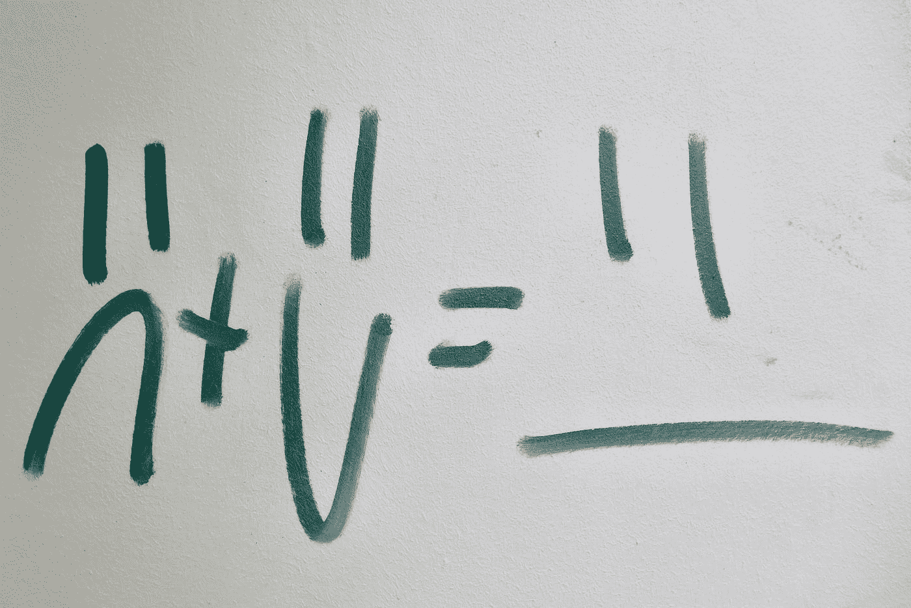

# Python 开发人员的数学符号|命题逻辑

> 原文：<https://medium.datadriveninvestor.com/mathematical-notation-for-python-developers-propositional-logic-eab60629cdd?source=collection_archive---------3----------------------->

## 用 Python 3 的简单性学习命题逻辑。

Photo by [Bekky Bekks](https://unsplash.com/@bekky_bekks?utm_source=medium&utm_medium=referral) on [Unsplash](https://unsplash.com?utm_source=medium&utm_medium=referral)

# 介绍

作为开发人员，我们需要始终了解最新的技术堆栈，但是我们往往会忘记内置新技术堆栈的底层结构的重要性。

我并不是说我们需要成为汇编或二进制的忍者，但是作为一名开发人员，很好地理解他们是如何工作的是必要的。

 [## 数据驱动的投资者|微软比 Chrome 有“优势”

### 简史我从来不是浏览器的粉丝，确切地说，我只是一个浏览器的粉丝，Chrome。这是我的…

www.datadriveninvestor.com](https://www.datadriveninvestor.com/2020/03/29/microsoft-having-an-edge-over-chrome/) 

学习**命题逻辑**可以帮助你理解电路如何在编程条件下工作，用数学符号编写你的代码等等。

Photo by [Laura Gilchrist](https://unsplash.com/@lauragilchristedu?utm_source=medium&utm_medium=referral) on [Unsplash](https://unsplash.com?utm_source=medium&utm_medium=referral)

# 这篇文章是写给谁的

到目前为止，您可能在想:“要理解这篇文章，我需要了解 Python 或二进制吗？”。你没有！

我为任何对学习数学符号感兴趣的人写了这篇文章。

# 命题逻辑

## **与|连词**

*和表达式用符号* `∧`表示。

a∧b = a 和 b

为了使**和**语句为真，a 和 b 都必须为真，否则它将始终为假。

**| 1∧0 = 0 | 0∧1 = 0 | 1∧1 = 1 | 0∧0 = 0 |**

## **或|析取**

*或表达式用符号* `*∨*` *表示。*

a ∨ b = a 或 b

为了使**或**语句为真，a 或 b 必须为真。

**| 1**∩**0 = 1 | 0**∩**1 = 1 | 1**∩**1 = 1 | 0**∩**0 = 0 |**

## **非|否定**

*非表达式用符号* `**¬**` 或`**~**` **表示。**

如果 a = 1，那么~a = 0，反之亦然。

抓紧了，事情会变得有点复杂，相信我，我们可以一起做。

## 异或|异或析取|异或

*异或表达式用符号* `⊕`或`⊻` **表示。**

or 排他性是指:

*   `a or b` 而不是`a and b`。它们不可能同时都是真的。

**| 1**⊻**0 = 1 | 0**⊻**1 = 1 | 1**⊻**1 = 0 | 0**⊻**0 = 0 |**

如果这让你有点困惑，试试这个 XOR 沙盒[http://xor.pw/](http://xor.pw/)你马上就会明白了。

## “与非”

*NAND 是* `*not and*` *的缩写，意思是它的结果永远和它的 AND 表达式相反。NAND 用符号* `↑`定义。

**a ↑ b = ~(a ∧ b)**

**| 1↑0 = 1 | 0↑1 = 1 | 1↑1 = 0 | 0↑0 = 1 |**

如果这让你有点困惑，试试这个 XOR 沙盒[http://xor.pw/](http://xor.pw/)你马上就会明白了。

## 隐含|有条件

顾名思义，这涉及到一个条件。意思是如果“如果 A 那么 B”或者“A 隐含 B”。暗示用符号`→`表示。

**| 0→****0 = 1 | 0→1 = 1 | 1**→**1 = 1 | 1**→**0 = 0 |**

## 当且仅当|双条件

双条件是表示条件*“当且仅当”的连接词，通过检查是两个命题具有相同的值。双条件用符号* `↔`表示。

a↔b =(*a*→*b*)∧(*b*→*a*)

**0**↔**0 = 1 | 0**↔**1 = 0 | 1**↔**1 = 1 | 1**↔**0 = 0 |**

# 结论

数学符号不必像你看到的那样复杂。现在我把它留给你，作为一个挑战，试着创造你自己的表达并测试它们。

如果你是 Python 开发者，尝试使用**命题逻辑符号**创建小算法。

# 文献学

 [## 命题逻辑|卓越的数学和科学维基

### 顾名思义，命题逻辑是数理逻辑的一个分支，研究逻辑关系…

brilliant.org](https://brilliant.org/wiki/propositional-logic/)  [## 命题演算

### 命题演算是逻辑学的一个分支。它也被称为命题逻辑、陈述逻辑、句子逻辑

en.wikipedia.org](https://en.wikipedia.org/wiki/Propositional_calculus) 

# Python 数学符号的其他链接

 [## Python 开发人员的数学符号(第 1 部分)

### 作为一名自学成才的开发人员，我大部分时间都在阅读白皮书或学习数据科学课程…

medium.com](https://medium.com/datadriveninvestor/mathematical-notation-for-python-developers-part-1-1c94599b97cd)  [## Python 开发人员的数学符号(第 2 部分)|集合延续

### 在上一篇文章中，我们对什么是集合以及它们的成员是如何工作的有了基本的了解…

medium.com](https://medium.com/datadriveninvestor/mathematical-notation-for-python-developers-part-2-sets-continuation-b53cac11a770)