# 机器人背后的数学

> 原文：<https://medium.datadriveninvestor.com/mathematics-behind-robotics-9d1790b33828?source=collection_archive---------0----------------------->

机器人研究一直呈指数增长，标志着一场新的工业革命。今天，全球有 100 多万台机器人在运行，而且这个数字还在不断增长。

今天，我们有许多机器人，它们的智力相当于甚至超过人类的智力、身体能力、感知和行为。在一些领域，如计算机辅助手术，这些智能机器甚至可以超越人类的能力。

从处理危险材料到焊接部件，执行管理任务，如为客户归档文件，或用吸尘器清扫地毯，机器人在社会中扮演着许多重要的角色。

但是是什么让他们做了所有巧妙的事情呢？数学、工程和物理的几个方面让奇迹发生了。

# 机器人是什么时候出现在世界上的？

机器人学的研究和最早的数学研究一样古老。“机器人”一词是在 1920 年由捷克作家卡雷尔·帕佩克创作的一部名为《罗森的万能机器人》的戏剧中引入世界的。

18 世纪，列奥纳多·达·芬奇设计了一个可编程机器人，它可以移动四肢、扭动身体和坐着。19 世纪，查尔斯·巴贝奇(英国数学家，可编程计算机的发明者)和阿达·洛芙莱斯(为巴贝奇的分析引擎编写了程序)的工作对机器人学做出了重大贡献。)

在 20 世纪，诺伯特·维纳、艾伦·图灵、约翰·冯·诺依曼和克劳德·香农引领了机器人创新的大爆发。

 [## 模式和机器人:复杂的现实|数据驱动的投资者

### 哈耶克的名著《复杂现象理论》(哈耶克，1964)深入探讨了复杂性的话题，并断言…

www.datadriveninvestor.com](https://www.datadriveninvestor.com/2019/03/04/patterns-and-robotics-a-complex-reality/) 

现在，机器人技术被广泛应用于工业领域。我们有移动机器人，工业机器人，野外机器人和高级机器人，它们可以在房间里工作，检测光线，气味，伸出手抓取，学习和识别事物甚至表情，模仿人脑，等等。

# **什么是机器人系统？**

在数学方面，机器人系统是由多个子系统中的功能表示的复杂系统。它是感知和行动之间的智能连接，并根据其移动属性进行分类。数学概念越难，机器人系统的灵活性就越大。

# **数学在机器人建模、规划和控制中的应用**

想学习机器人学的人应该尽最大努力去理解数学，因为数学是机器人学研究中的必需品。要找到正确尺寸的零件、执行任务的测量方法、测试性能、检测速度和功率之间的模式和关系，或者车轮直径和行驶距离，您需要了解一些基本的数学概念。

机器人学的基本数学先决条件是:

*   结石
*   常微分方程
*   高等线性代数
*   几何学
*   数值分析

这里是一些数学概念的方面，帮助机器人有效地执行所有的操作。

# **变换矩阵有助于改变机器人的坐标系**。

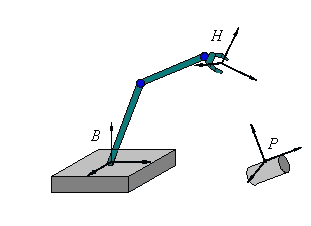

为了执行特定的动作，机器人会改变它的坐标系统。这就是为什么机器人问题有不止一个坐标系。上图中有三个附带的坐标系，**B***机器人的底座， **H** 它的手， **P** 机器人必须握住的棋子。如果您移动底座 **B** 、手 **H** 或工件 **P** ，相应的坐标系也会随之移动。*

坐标系 **P** 定位圆柱体上的点

坐标系 **B** 描述了手的位置

坐标系 **H** 测量手的距离

**主要关注点**是确定工件 **P** 相对于机器人手 **H** 的位置和方向，以便手正确移动以抓取工件。

**为了计算这一点，**知道手相对于底座的位置和方向是至关重要的，这样手就能正确地抓住工件。

在这种情况下，可以使用变换矩阵来描述第二坐标系 **P** 相对于第一坐标系 **H** 的位置和方向。

考虑一个变换矩阵，

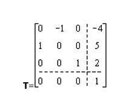

该变换矩阵可用于定义第二坐标系 **P** 相对于第一坐标系 **H** 的方向和位置。矩阵 T 应用于单位向量的端点和第一坐标系的原点，

单位向量为 **i=1** ， **j=1** ， **k=1** ，

具有单位向量 I、j 和 k 以及原点的第一坐标系的变换矩阵表示为，

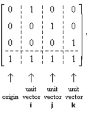

将变换矩阵 T 与第一坐标系相乘，以获得第二坐标系的单位向量(I’，j’，k’)的原点和端点。

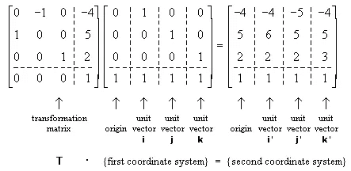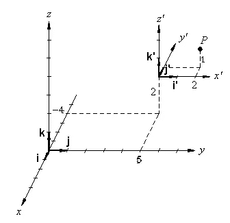

图片显示 **P** 点位于第二坐标系中的( *x'* = 2， *y'* = 1， *z'* = 1)，位于第一坐标系中的( *x* = -5， *y* = 7， *z* = 3)。

# **让我们考虑机器人的手正在拿起一块东西**

附在棋子上的坐标系 **P** 相对于坐标系世界定位，姑且称之为 **W** ，由变换矩阵表示。

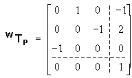

当机器人的基座 **B** 相对于世界坐标系定位时，由变换矩阵表示，

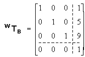

为了抓住棋子，手框架和棋子框架必须对齐，目的是找到表示对齐的变换矩阵。

**我们来找变换矩阵**。

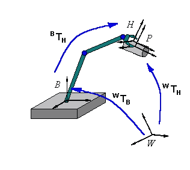

请看下图，图中显示了一个机器人抓取棋子时的动作。当机器人的手抓住棋子 P 时，机器人框架对齐，这意味着，

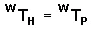

现在考虑这样一个事实，即从世界 W 到底数 B 的变换，以及从底数 B 到手 H 的变换，可以合并成一个从世界 W 到手 H 的变换，表示为:

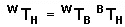

把已知的矩阵，

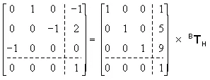

求解该矩阵方程以从底部转换到手，表示为:

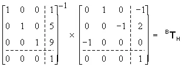

或者，

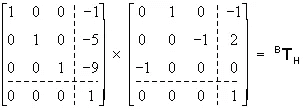

产生最终的变换矩阵，

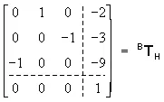

请记住，3×3 子矩阵的三列表示手坐标系相对于机器人基础坐标系的方向。而最后一列表示手坐标系相对于基础坐标系的原点。

# **用一组常微分方程控制机器狗的框架**

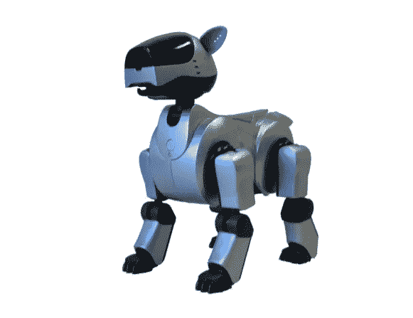

非线性动力系统为控制四足或腿式机器人的运动提供了创造性的可能性。非线性动力系统表现出与生物神经结构的相似性。虽然动力系统本身是多个系统的集合，这些系统彼此相连，并与机器人的执行器和传感器相连，但您可以将动力系统的集合视为大脑中神经元的集合。当大脑有感觉输入时，它会产生信号模式。按照这种方法，可以获得动物的神经网络，并且有助于[了解包含学习能力和自适应运动的类动物机器人](http://biorob2.epfl.ch/pages/studproj/birg56278/report.pdf)(在这种情况下是机器狗)的行为。

为了控制机器狗，让我们用一组动力系统创建一个框架。让我们在不使机器狗行走和接触地面的情况下移动它的腿。

为此，将机器狗放在一个长方形的盒子上，这样腿就可以自由移动而不接触地面，如下图所示。

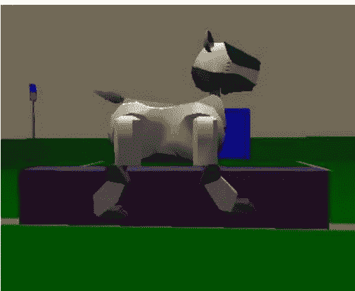

目标是实现两条腿运动的同步，并且只有当由人类用户在一条腿上驱动的运动频率足够接近由 ACPO 在另一条腿上驱动的固有频率时才能实现。这种情况表明机器狗由差动系统控制，因为当人类用户控制机器狗的一条摆动腿时，它给出扰动输入。

考虑一下，

x =由 ACPO 控制的左前腿的位置

x =右前腿的位置

y =左后腿的位置

y =右后腿的位置

k=耦合常数

振荡器被表示为，

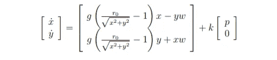

其中:

p 是右前腿的位置输入；

参数:— g = 10 是振荡器的增益；

–r0 = 1 是振荡器的半径；

–w = 2π是振荡器的固有频率。

轨迹是用不同的 k 值制成的，k 值越高，支路之间的耦合越强。

在一定的 k 值下，耦合将是混沌的。

这些图显示了不同耦合常数 k 值下的支路同步，

在该图中，对于 k = 0，没有观察到同步。

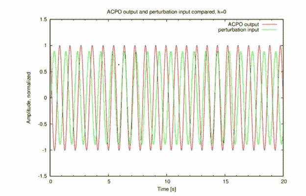

对于 k = 2 的运行，几秒钟后观察到最佳同步，如下图所示，

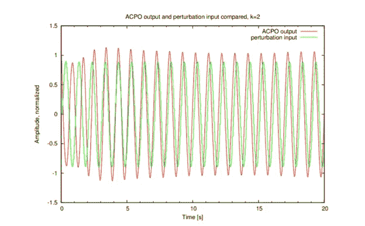

# **结束语**

数学在机器人建模、规划和执行中起着重要的作用。机器人科学家知道如何处理这些复杂的方程，并形成一个软件框架来创建本世纪更先进和功能更强的机器人。投资于机器人技术的研发对于经济的最大增长是至关重要的，因为据估计，从现在起 10 到 15 年后，世界将全部是机器人，你将看到你自己居住在这些智能机器中。