# 机器学习的数学第一部分

> 原文：<https://medium.datadriveninvestor.com/mathematics-for-machine-learning-part-1-5e210c138a12?source=collection_archive---------11----------------------->

***数学是万能的*** *。机器学习是建立在* ***线性代数、*** *等数学前提之上的。现在，我们将看到使用 Python 实现这些先决条件中的基本数学概念。*

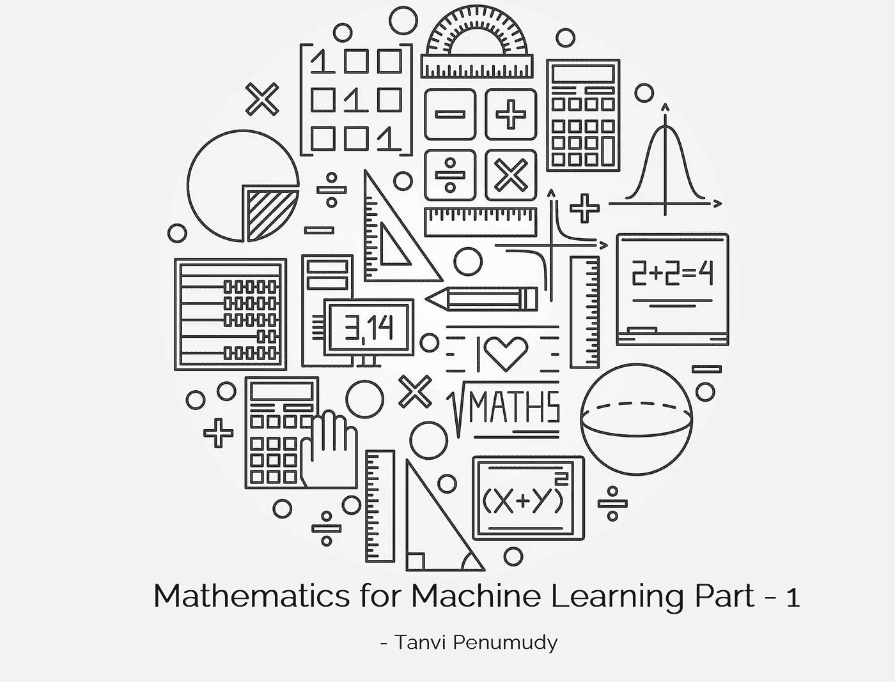

Image Source: Pinterest (Edited)

# 线性代数

数学的一个分支，研究在*加法*和*标量乘法*运算下闭合的数学结构，包括线性方程组、矩阵、行列式、向量空间和线性变换的理论——来源: [***韦氏词典***](https://www.merriam-webster.com/dictionary/linear%20algebra)

*如果你还没有经历—* [***熟悉 Numpy***](https://medium.com/analytics-vidhya/getting-familiar-with-numpy-854fc60ac497)**一定要经历！我们将需要 Numpy 来实现大多数数学概念！**

## *内容*

*   **矩阵乘法**
*   **矩阵异能**
*   **转置**
*   **逆**
*   **追踪**
*   **行列式**
*   **特征多项式和凯莱-汉密尔顿定理**
*   **预测**
*   **线性系统**
*   **高斯消去法**
*   **初等行运算**
*   **逆**
*   **求解一个系统**

## *入门指南*

*本教程需要导入的库—[***Numpy***](https://medium.com/analytics-vidhya/getting-familiar-with-numpy-854fc60ac497)***，***[***Matplotlib***](https://medium.com/analytics-vidhya/data-visualization-using-python-part-i-19f9b76d43dc)***和 Scipy****

```
*import numpy as np
import matplotlib.pyplot as plt
import scipy.linalg as la
%matplotlib inline*
```

**让我们为—* 计算***2I+3A AB****(I 是大小为 2 的单位矩阵)**

*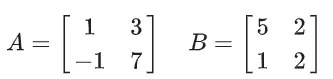*

```
*A = np.array([[1,3],[-1,7]])
print(A)**Out:** [[ 1  3]
 [-1  7]]B = np.array([[5,2],[1,2]])
print(B)**Out:** [[5 2]
 [1 2]]I = np.eye(2)
print(I)**Out:** [[1\. 0.]
 [0\. 1.]]2*I + 3*A - A@B**Out:** array([[-3.,  1.],
       [-5., 11.]])*
```

## *矩阵幂*

*没有矩阵幂的符号，所以我们必须从子包`numpy.linalg`中导入函数`matrix_power`。*

```
*from numpy.linalg import matrix_power as mpowM = np.array([[3,4],[-1,5]])
print(M)**Out:** [[ 3  4]
 [-1  5]]mpow(M,2)**Out:** array([[ 5, 32],
       [-8, 21]])mpow(M,5)**Out:** array([[-1525,  3236],
       [ -809,    93]])*
```

**与矩阵乘法运算符比较:**

```
*M @ M @ M @ M @ M**Out:** array([[-1525,  3236],
       [ -809,    93]])*
```

## *移项*

**我们可以用* `.T` *属性:*取转置*

```
*print(M)**Out:** [[ 3  4]
 [-1  5]]print(M.T)**Out:** [[ 3 -1]
 [ 4  5]]*
```

**注意 M.MT 是一个对称矩阵:**

```
*M @ M.T**Out:** array([[25, 17],
       [17, 26]])*
```

## *相反的*

**我们可以用函数* `scipy.linalg.inv`求逆:*

```
*A = np.array([[1,2],[3,4]])
print(A)**Out:** [[1 2]
 [3 4]]la.inv(A)**Out:** array([[-2\. ,  1\. ],
       [ 1.5, -0.5]])*
```

## *找到；查出*

**我们可以使用* `numpy.trace`函数找到一个矩阵的迹:*

```
*np.trace(A)**Out:** 5*
```

## *决定因素*

**我们用函数* `scipy.linalg.det`找到行列式:*

```
*A = np.array([[1,2],[3,4]])
print(A)**Out:** [[1 2]
 [3 4]]la.det(A)**Out:** -2.0*
```

## *特征多项式和 Cayley-Hamilton 定理*

*2 乘 2 方阵 A 的特征多项式为*

*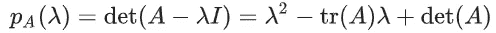*

*[***Cayley-Hamilton 定理***](https://en.wikipedia.org/wiki/Cayley%E2%80%93Hamilton_theorem) 陈述任意方阵满足其特征多项式。*

> *对于大小为 2 的矩阵 A，这意味着*

*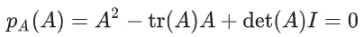*

**让我们针对几个不同的矩阵来验证* ***Cayley-Hamilton 定理****—**

```
*print(A)**Out:** [[1 2]
 [3 4]]trace_A = np.trace(A)
det_A = la.det(A)
I = np.eye(2)
A @ A - trace_A * A + det_A * I**Out:** array([[0., 0.],
       [0., 0.]])*
```

## *预测*

**将矢量 v 投影到矢量 w* 上的公式是—*

*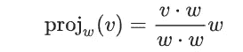*

**让我们用一个叫做* `proj` *的函数来计算 v 到 w 的投影:**

```
*def **proj**(v,w):
    '''Project vector v onto w.'''
    v = np.array(v)
    w = np.array(w)
    return np.sum(v * w)/np.sum(w * w) * w  # or (v @ w)/(w @ w) * wproj([1,2,3],[1,1,1])**Out:** array([2., 2., 2.])*
```

## *求解线性系统*

## *线性系统*

*一个 [***线性方程组***](https://en.wikipedia.org/wiki/System_of_linear_equations) 是线性方程组的集合*

*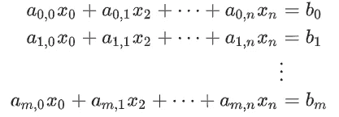*

*在矩阵符号中，一个线性系统是 ***Ax=b*** 其中*

*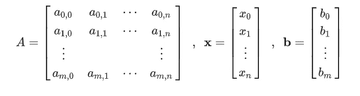*

## *高斯消去法*

*求解线性方程组的一般程序称为 [***高斯消去***](https://en.wikipedia.org/wiki/Gaussian_elimination) 。其思想是执行基本的行操作，将系统简化为行梯队形式，然后求解。*

## *初等行运算*

*[***初等行操作***](https://en.wikipedia.org/wiki/Elementary_matrix#Elementary_row_operations) 包括:*

1.  **将 k 乘以第 j 行加到第 I 行**
2.  **将第 I 行乘以标量 k**
3.  **切换第 I 行和第 j 行**

*每个基本行操作都是矩阵乘以基本矩阵的结果。为了将矩阵 A 中的第 I 行的 k 乘以第 j 行的 j 相加，我们将 A 乘以矩阵 E，其中 E 等于单位矩阵，除了 I，j 项是 e i，j=k*

> *例如，如果 A 是 3 乘 3，我们想将第 2 行的 3 倍加到第 0 行(使用 0 索引),那么—*

*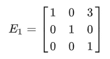*

**我们来验证一下计算:**

```
*A = np.array([[1,1,2],[-1,3,1],[0,5,2]])
print(A)**Out:**
[[ 1  1  2]
 [-1  3  1]
 [ 0  5  2]]E1 = np.array([[1,0,3],[0,1,0],[0,0,1]])
print(E1)**Out:** [[1 0 3]
 [0 1 0]
 [0 0 1]]E1 @ A**Out:** array([[ 1, 16,  8],
       [-1,  3,  1],
       [ 0,  5,  2]])*
```

*为了*将矩阵 A 中的 k 乘以行 i* ，我们*将 A 乘以矩阵 E* 其中 E 等于单位矩阵*除了 I，j* 条目是 ***Ei，i=k.****

> *例如，如果 A 是 3 乘 3，我们想将第 1 行乘以-2，那么—*

*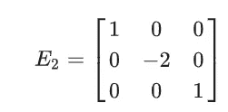*

**我们来验证一下计算:**

```
*E2 = np.array([[1,0,0],[0,-2,0],[0,0,1]])
print(E2)**Out:**
[[ 1  0  0]
 [ 0 -2  0]
 [ 0  0  1]]E2 @ A**Out:** array([[ 1,  1,  2],
       [ 2, -6, -2],
       [ 0,  5,  2]])*
```

*最后，为了*切换矩阵 A 中的第 I 行和第 j 行*，我们*将 A 乘以矩阵 E* 其中 E 等于单位矩阵*除了* ***Ei，i=0*** *，* ***Ej，j=0*** *，* ***Ei，j=1*** 和*

> *例如，如果 A 是 3 乘 3，我们想交换第 1 行和第 2 行，那么—*

*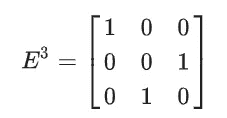*

**我们来验证一下计算:**

```
*E3 = np.array([[1,0,0],[0,0,1],[0,1,0]])
print(E3)**Out:** [[1 0 0]
 [0 0 1]
 [0 1 0]]E3 @ A**Out:** array([[ 1,  1,  2],
       [ 0,  5,  2],
       [-1,  3,  1]])*
```

## *履行*

*现在让我们编写函数来实现 ***初等行操作。****

*如果 ***i=j****

```
*def **add_row**(A,k,i,j):
    "Add k times row j to row i in matrix A."
    n = A.shape[0]
    E = np.eye(n)
    if i == j:
        E[i,i] = k + 1
    else:
        E[i,j] = k
    return E @ A*
```

**让我们测试一下我们的功能:**

```
*M = np.array([[1,1],[3,2]])
print(M)**Out:** [[1 1]
 [3 2]]add_row(M,2,0,1)**Out:** array([[7., 5.],
       [3., 2.]])*
```

*让我们编写一个名为`scale_row`的函数，它接受 3 个输入参数 *A、k 和 i* ，并返回矩阵 A 中由 *k 乘以第 I 行*得到的矩阵。*

```
*def **scale_row**(A,k,i):
    "Multiply row i by k in matrix A."
    n = A.shape[0]
    E = np.eye(n)
    E[i,i] = k
    return E @ A*
```

**让我们测试一下我们的功能:**

```
*M = np.array([[3,1],[-2,7]])
print(M)**Out:** [[ 3  1]
 [-2  7]]scale_row(M,3,1)**Out:** array([[ 3.,  1.],
       [-6., 21.]])*
```

*让我们编写一个名为`switch_rows`的函数，它接受 3 个输入参数 *A、I 和 j* ，并返回由*切换矩阵 A 中的行 I 和 j* 得到的矩阵*

```
*def **switch_rows**(A,i,j):
    "Switch rows i and j in matrix A."
    n = A.shape[0]
    E = np.eye(n)
    E[i,i] = 0
    E[j,j] = 0
    E[i,j] = 1
    E[j,i] = 1
    return E @ A*
```

**让我们测试一下我们的功能:**

```
*A = np.array([[1,1,1],[1,-1,0]])
print(A)**Out:** [[ 1  1  1]
 [ 1 -1  0]]switch_rows(A,0,1)**Out:** array([[ 1., -1.,  0.],
       [ 1.,  1.,  1.]])*
```

## *例子*

## *求逆*

*让我们将我们的函数应用于 ***增广矩阵****【M | I】*来寻找矩阵 M 的 ***逆*** :*

```
*M = np.array([[5,4,2],[-1,2,1],[1,1,1]])
print(M)**Out:** [[ 5  4  2]
 [-1  2  1]
 [ 1  1  1]]A = np.hstack([M,np.eye(3)])
print(A)**Out:** [[ 5\.  4\.  2\.  1\.  0\.  0.]
 [-1\.  2\.  1\.  0\.  1\.  0.]
 [ 1\.  1\.  1\.  0\.  0\.  1.]]A1 = switch_rows(A,0,2)
print(A1)**Out:** [[ 1\.  1\.  1\.  0\.  0\.  1.]
 [-1\.  2\.  1\.  0\.  1\.  0.]
 [ 5\.  4\.  2\.  1\.  0\.  0.]]A2 = add_row(A1,1,1,0)
print(A2)**Out:** [[1\. 1\. 1\. 0\. 0\. 1.]
 [0\. 3\. 2\. 0\. 1\. 1.]
 [5\. 4\. 2\. 1\. 0\. 0.]]A3 = add_row(A2,-5,2,0)
print(A3)**Out:** [[ 1\.  1\.  1\.  0\.  0\.  1.]
 [ 0\.  3\.  2\.  0\.  1\.  1.]
 [ 0\. -1\. -3\.  1\.  0\. -5.]]A4 = switch_rows(A3,1,2)
print(A4)**Out:** [[ 1\.  1\.  1\.  0\.  0\.  1.]
 [ 0\. -1\. -3\.  1\.  0\. -5.]
 [ 0\.  3\.  2\.  0\.  1\.  1.]]A5 = scale_row(A4,-1,1)
print(A5)**Out:** [[ 1\.  1\.  1\.  0\.  0\.  1.]
 [ 0\.  1\.  3\. -1\.  0\.  5.]
 [ 0\.  3\.  2\.  0\.  1\.  1.]]A6 = add_row(A5,-3,2,1)
print(A6)**Out:** [[  1\.   1\.   1\.   0\.   0\.   1.]
 [  0\.   1\.   3\.  -1\.   0\.   5.]
 [  0\.   0\.  -7\.   3\.   1\. -14.]]A7 = scale_row(A6,-1/7,2)
print(A7)**Out:** [[ 1\.          1\.          1\.          0\.          0\.          1\.        ]
 [ 0\.          1\.          3\.         -1\.          0\.          5\.        ]
 [ 0\.          0\.          1\.         -0.42857143 -0.14285714  2\.        ]]A8 = add_row(A7,-3,1,2)
print(A8)**Out:** [[ 1\.          1\.          1\.          0\.          0\.          1\.        ]
 [ 0\.          1\.          0\.          0.28571429  0.42857143 -1\.        ]
 [ 0\.          0\.          1\.         -0.42857143 -0.14285714  2\.        ]]A9 = add_row(A8,-1,0,2)
print(A9)**Out:** [[ 1\.          1\.          0\.          0.42857143  0.14285714 -1\.        ]
 [ 0\.          1\.          0\.          0.28571429  0.42857143 -1\.        ]
 [ 0\.          0\.          1\.         -0.42857143 -0.14285714  2\.        ]]A10 = add_row(A9,-1,0,1)
print(A10)**Out:** [[ 1\.          0\.          0\.          0.14285714 -0.28571429  0\.        ]
 [ 0\.          1\.          0\.          0.28571429  0.42857143 -1\.        ]
 [ 0\.          0\.          1\.         -0.42857143 -0.14285714  2\.        ]]*
```

**验证一下我们找到 M 逆是否正确:**

```
*Minv = A10[:,3:]
print(Minv)**Out:** [[ 0.14285714 -0.28571429  0\.        ]
 [ 0.28571429  0.42857143 -1\.        ]
 [-0.42857143 -0.14285714  2\.        ]]result = Minv @ M
print(result)**Out:** [[ 1.00000000e+00  4.44089210e-16  2.22044605e-16]
 [-6.66133815e-16  1.00000000e+00 -2.22044605e-16]
 [ 0.00000000e+00  0.00000000e+00  1.00000000e+00]]*
```

**成功！如果四舍五入到小数点后 15 位，我们可以更清楚地看到结果:**

```
*np.round(result,15)**Out:** array([[ 1.e+00,  0.e+00,  0.e+00],
       [-1.e-15,  1.e+00, -0.e+00],
       [ 0.e+00,  0.e+00,  1.e+00]])*
```

## *求解一个系统*

*让我们使用我们的函数来执行*高斯消去*并求解一个线性方程组 ***Ax=b.****

```
*A = np.array([[6,15,1],[8,7,12],[2,7,8]])
print(A)**Out:** [[ 6 15  1]
 [ 8  7 12]
 [ 2  7  8]]b = np.array([[2],[14],[10]])
print(b)**Out:** [[ 2]
 [14]
 [10]]*
```

**形成* ***增广矩阵*** *M:**

```
*M = np.hstack([A,b])
print(M)[[ 6 15  1  2]
 [ 8  7 12 14]
 [ 2  7  8 10]]*
```

**执行行操作:**

```
*M1 = scale_row(M,1/6,0)
print(M1)**Out:** [[ 1\.          2.5         0.16666667  0.33333333]
 [ 8\.          7\.         12\.         14\.        ]
 [ 2\.          7\.          8\.         10\.        ]]M2 = add_row(M1,-8,1,0)
print(M2)**Out:**
[[  1\.           2.5          0.16666667   0.33333333]
 [  0\.         -13\.          10.66666667  11.33333333]
 [  2\.           7\.           8\.          10\.        ]]M3 = add_row(M2,-2,2,0)
print(M3)**Out:** [[  1\.           2.5          0.16666667   0.33333333]
 [  0\.         -13\.          10.66666667  11.33333333]
 [  0\.           2\.           7.66666667   9.33333333]]M4 = scale_row(M3,-1/13,1)
print(M4)**Out:** [[ 1\.          2.5         0.16666667  0.33333333]
 [ 0\.          1\.         -0.82051282 -0.87179487]
 [ 0\.          2\.          7.66666667  9.33333333]]M5 = add_row(M4,-2,2,1)
print(M5)**Out:** [[ 1\.          2.5         0.16666667  0.33333333]
 [ 0\.          1\.         -0.82051282 -0.87179487]
 [ 0\.          0\.          9.30769231 11.07692308]]M6 = scale_row(M5,1/M5[2,2],2)
print(M6)**Out:** [[ 1\.          2.5         0.16666667  0.33333333]
 [ 0\.          1\.         -0.82051282 -0.87179487]
 [ 0\.          0\.          1\.          1.19008264]]M7 = add_row(M6,-M6[1,2],1,2)
print(M7)**Out:** [[1\.         2.5        0.16666667 0.33333333]
 [0\.         1\.         0\.         0.1046832 ]
 [0\.         0\.         1\.         1.19008264]]M8 = add_row(M7,-M7[0,2],0,2)
print(M8)**Out:** [[1\.         2.5        0\.         0.13498623]
 [0\.         1\.         0\.         0.1046832 ]
 [0\.         0\.         1\.         1.19008264]]M9 = add_row(M8,-M8[0,1],0,1)
print(M9)**Out:** [[ 1\.          0\.          0\.         -0.12672176]
 [ 0\.          1\.          0\.          0.1046832 ]
 [ 0\.          0\.          1\.          1.19008264]]*
```

**成功了！****Ax = b****的解是**

```
*x = M9[:,3].reshape(3,1)
print(x)**Out:** [[-0.12672176]
 [ 0.1046832 ]
 [ 1.19008264]]*
```

*或者，我们可以用简单的方法来做*

```
*x = la.solve(A,b)
print(x)**Out:** [[-0.12672176]
 [ 0.1046832 ]
 [ 1.19008264]]*
```

## *`scipy.linalg.solve`*

*我们最感兴趣的是存在唯一解 x 的线性系统 **Ax=b** 当 A 是方阵*(m = n)**det(A)≠0 时就是这种情况。*解决这样一个系统，我们可以使用函数`[scipy.linalg.solve](https://docs.scipy.org/doc/scipy/reference/generated/scipy.linalg.solve.html)`。*

**该函数返回方程组 Ax=b 的解。例如:**

```
*A = np.array([[1,1],[1,-1]])
print(A)**Out:** [[ 1  1]
 [ 1 -1]]b1 = np.array([2,0])
print(b1)**Out:** [2 0]*
```

**并求解:**

```
*x1 = la.solve(A,b1)
print(x1)**Out:** [1\. 1.]*
```

*注意，当向量 b(右侧)作为 *1D 数数组输入时，输出 x 作为 *1D 数数组*返回。*如果我们输入 b 作为一个 *2D 数数组*，那么输出就是一个 *2D 数数组*。*

**例如:**

```
*A = np.array([[1,1],[1,-1]])
b2 = np.array([2,0]).reshape(2,1)
x2 = la.solve(A,b2)
print(x2)**Out:** [[1.]
 [1.]]*
```

*最后，如果右手边 b 是一个矩阵，那么输出是一个同样大小的矩阵。是当 b 是矩阵时 Ax=b 的解。*

**例如:**

```
*A = np.array([[1,1],[1,-1]])
b3 = np.array([[2,2],[0,1]])
x3 = la.solve(A,b3)
print(x3)**Out:** [[1\.  1.5]
 [1\.  0.5]]*
```

## *简单的例子*

*让我们计算方程组的解*

*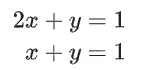*

**创建系数矩阵:**

```
*A = np.array([[2,1],[1,1]])
print(A)**Out:** [[2 1]
 [1 1]]*
```

**和矢量 b:**

```
*b = np.array([1,-1]).reshape(2,1)
print(b)**Out:** [[ 1]
 [-1]]*
```

**并求解:**

```
*x = la.solve(A,b)
print(x)**Out:** [[ 2.]
 [-3.]]*
```

**我们可以通过计算 A 的逆来验证解:**

```
*Ainv = la.inv(A)
print(Ainv)**Out:** [[ 1\. -1.]
 [-1\.  2.]]*
```

**并乘 A 逆和 b 求 x:**

```
*x = Ainv @ b
print(x)**Out:** [[ 2.]
 [-3.]]*
```

*我们得到同样的结果。成功！*

## *求逆或求解*

*如果 *A 很大*用一个逆来解 Ax=b 是个馊主意。 ***计算量太大。****

> *让我们创建一个大的随机矩阵 A 和向量 b，用两种方法计算解 x——*

```
*N = 1000
A = np.random.rand(N,N)
b = np.random.rand(N,1)*
```

**检查第一个条目 A:**

```
*A[:3,:3]**Out:** array([[0.35754719, 0.63135432, 0.6572258 ],
       [0.18450506, 0.14639832, 0.23528745],
       [0.27576474, 0.46264005, 0.26589724]])*
```

**而对于 b:**

```
*b[:4,:]**Out:** array([[0.82726751],
       [0.96946096],
       [0.31351176],
       [0.63757837]])*
```

**现在我们比较一下* `scipy.linalg.solve` *与* `scipy.linalg.inv`的速度:*

```
*%%timeit
x = la.solve(A,b)**Out:** 2.77 s ± 509 ms per loop (mean ± std. dev. of 7 runs, 1 loop each)%%timeit
x = la.inv(A) @ b**Out:** 4.46 s ± 2.04 s per loop (mean ± std. dev. of 7 runs, 1 loop each)*
```

**用* `scipy.linalg.solve` *求解大约快一倍！**

> *这就是第一部分的全部内容！我知道一下子很难接受。但是你坚持到了最后！恭喜你。别忘了看看这篇文章的其他部分——[**第二部分**](https://tp6145.medium.com/mathematics-for-machine-learning-part-2-fa36b6154dec)[**第三部分**](https://tp6145.medium.com/mathematics-for-machine-learning-part-3-4acbc355fb03)[**第四部分**](https://tp6145.medium.com/mathematics-for-machine-learning-part-4-8032bec2aa3d) 和 [**第五部分**](https://tp6145.medium.com/mathematics-for-machine-learning-part-5-8df72392ec10) ！*

***访问专家视图—** [**订阅 DDI 英特尔**](https://datadriveninvestor.com/ddi-intel)*

# *其他资源和参考*

> *如果你仍然有兴趣从这个主题中获得最大收益，还有很多其他的好资源—*

 *[## 数学 Python

www.math.ubc.ca](https://www.math.ubc.ca/~pwalls/math-python/)* *[](https://en.wikipedia.org/wiki/Linear_algebra) [## 线性代数

### 线性代数是数学的一个分支，它涉及线性方程，如:线性映射，如:线性代数是…

en.wikipedia.org](https://en.wikipedia.org/wiki/Linear_algebra) 

***要了解完整的实现，请查看我的 GitHub 库—***

[](https://github.com/tanvipenumudy/Winter-Internship-Internity/blob/main/Day%2006/Day-6%20Notebook-1%20%28Linear%20Algebra-I%29.ipynb) [## tanvipenumudy/Winter-实习-实习

### 存储库跟踪每天分配的工作-tanvipenumudy/Winter-实习-实习

github.com](https://github.com/tanvipenumudy/Winter-Internship-Internity/blob/main/Day%2006/Day-6%20Notebook-1%20%28Linear%20Algebra-I%29.ipynb)*