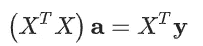

# 机器学习的数学第二部分

> 原文：<https://medium.datadriveninvestor.com/mathematics-for-machine-learning-part-2-fa36b6154dec?source=collection_archive---------17----------------------->

*下面是* ***Part-2*** *到* [***用于机器学习的数学 Part-1***](https://tp6145.medium.com/mathematics-for-machine-learning-part-1-5e210c138a12) ***。*** *如果你还没有经历过，一定要马上去做！*


Image Source: Pinterest (Edited)

# 内容

*   *特征值和特征向量*
*   *对称矩阵*
*   *对角化*
*   *多项式插值*
*   *最小二乘线性回归*

## 特征值和特征向量

```
import numpy as np
import matplotlib.pyplot as plt
import scipy.linalg as la
```

## 定义

设 A 是一个方阵。一个*非零向量 v* 是一个 [***特征向量***](https://en.wikipedia.org/wiki/Eigenvalues_and_eigenvectors) 对于一个具有 [***特征值的***](https://en.wikipedia.org/wiki/Eigenvalues_and_eigenvectors) *λ* 如果——


重新排列方程，我们看到 v 是齐次方程组的*解(其中 I 是大小为 n 的单位矩阵)*


只有当矩阵***AλI***是奇异的，这意味着***det(AλI)= 0***时，非平凡解才存在。因此 A 的特征值是 [***特征多项式***](https://en.wikipedia.org/wiki/Characteristic_polynomial) ***的*根。****


## scipy.linalg.eig

函数`[scipy.linalg.eig](https://docs.scipy.org/doc/scipy/reference/generated/scipy.linalg.eig.html)`计算方阵 a 的*特征值*和*特征向量*

*让我们考虑一个对角矩阵的简单例子:*

```
A = np.array([[1,0],[0,-2]])
print(A)**Out:** [[ 1  0]
 [ 0 -2]]
```

函数`la.eig`返回一个元组`(eigvals,eigvecs)`，其中`eigvals`是给出 A 的特征值的*复数*的 *1D 数组*，而`eigvecs`是一个 *2D 数组*，对应的*特征向量*在列中:

```
results = la.eig(A)
```

*A 的特征值有:*

```
print(results[0])**Out:** [ 1.+0.j -2.+0.j]
```

*对应的特征向量有:*

```
print(results[1])**Out:** [[1\. 0.]
 [0\. 1.]]
```

*我们可以* [***解包元组***](https://www.math.ubc.ca/~pwalls/math-python/python/sequences/#unpacking-a-sequence)***:***

```
eigvals, eigvecs = la.eig(A)
print(eigvals)**Out:** [ 1.+0.j -2.+0.j]print(eigvecs)**Out:** [[1\. 0.]
 [0\. 1.]]
```

如果我们知道 ***的特征值是实数*** *(即。如果 A 是对称的)*，那么我们可以用 Numpy 数组法`.real`将数组的特征值转换成实数:

```
eigvals = eigvals.real
print(eigvals)**Out:** [ 1\. -2.]
```

*注意，数组* `eigvals` *中一个特征值的位置对应于* `eigvecs` *中的列及其特征向量:*

```
lambda1 = eigvals[1]
print(lambda1)**Out:** -2.0v1 = eigvecs[:,1].reshape(2,1)
print(v1)**Out:** [[0.]
 [1.]]A @ v1**Out:** array([[ 0.],
       [-2.]])lambda1 * v1**Out:** array([[-0.],
       [-2.]])
```

## 例子

## 对称矩阵

[***对称矩阵***](https://en.wikipedia.org/wiki/Symmetric_matrix) 的*特征值*是*总是实数*并且*特征向量*是*总是正交*！

*让我们用一些随机矩阵来验证这些事实:*

```
n = 4
P = np.random.randint(0,10,(n,n))
print(P)**Out:** [[7 0 6 2]
 [9 5 1 3]
 [0 2 2 5]
 [6 8 8 6]]
```

*创建对称矩阵 S=P.PT:*

```
S = P @ P.T
print(S)**Out:** [[ 89  75  22 102]
 [ 75 116  27 120]
 [ 22  27  33  62]
 [102 120  62 200]]
```

*我们来解开 S 的特征值和特征向量:*

```
evals, evecs = la.eig(S)
print(evals)**Out:** [361.75382302+0.j  42.74593101+0.j  26.33718907+0.j   7.16305691+0.j]
```

*特征值都有零虚部，所以它们确实是实数:*

```
evals = evals.real
print(evals)**Out:** [361.75382302  42.74593101  26.33718907   7.16305691]
```

*A 对应的特征向量有:*

```
print(evecs)**Out:** [[-0.42552429 -0.42476765  0.76464379 -0.23199439]
 [-0.50507589 -0.54267519 -0.64193252 -0.19576676]
 [-0.20612674  0.54869183 -0.05515612 -0.80833585]
 [-0.72203822  0.4733005   0.01415338  0.50442752]]
```

*让我们检查特征向量是否相互正交:*

```
v1 = evecs[:,0] # First column is the first eigenvector
print(v1)**Out:** [-0.42552429 -0.50507589 -0.20612674 -0.72203822]v2 = evecs[:,1] # Second column is the second eigenvector
print(v2)**Out:** [-0.42476765 -0.54267519  0.54869183  0.4733005]v1 @ v2**Out:** -1.1102230246251565e-16
```

特征向量 v1 和 v2 的点积为零(上面的数字*非常接近于零*，这是由于计算中的舍入误差)，因此它们是*正交的！*

## 对角线化

一个方阵 M 是 [***可对角化的***](https://en.wikipedia.org/wiki/Diagonalizable_matrix)*如果它类似于一个*对角矩阵*。换句话说，如果存在可逆矩阵 P，使得 D 是对角矩阵，则 M 是可对角化的。*

**

*线性代数中一个漂亮的结果是*一个大小为 n 的方阵 M 是* ***可对角化*** *当且仅当 M 有* ***n 个独立特征向量*** *。* *再者，**

**

*其中 P 的列是 M 和 D 的特征向量，沿着对角线具有相应的特征值*。**

*我们用这个来构造一个矩阵，给定特征值 *λ1=3，λ2=1* ，特征向量。*

**

```
*P = np.array([[1,1],[1,-1]])
print(P)**Out:** [[ 1  1]
 [ 1 -1]]D = np.diag((3,1))
print(D)**Out:** [[3 0]
 [0 1]]M = P @ D @ la.inv(P)
print(M)**Out:** [[2\. 1.]
 [1\. 2.]]*
```

**我们来验证一下 M 的特征值是 3 和 1:**

```
*evals, evecs = la.eig(M)
print(evals)**Out:** [3.+0.j 1.+0.j]*
```

**验证特征向量:**

```
*print(evecs)**Out:** [[ 0.70710678 -0.70710678]
 [ 0.70710678  0.70710678]]*
```

## *矩阵幂*

*设 M 是一个方阵。通过矩阵乘法计算 M 的能力——*

**

*这在计算上是昂贵的。而是，*让我们用对角化来更高效的计算 M 次方 k。**

**

**让我们用两种方法计算 M 的 20 次方，并比较执行时间:**

```
*Pinv = la.inv(P)
k = 20%%timeit
result = M.copy()
for _ in range(1,k):
    result = result @ M**Out:** 42.1 µs ± 11.4 µs per loop (mean ± std. dev. of 7 runs, 10000 loops each)*
```

**让我们用对角化来做同样的计算:**

```
*%%timeit
P @ D**k @ Pinv**Out:** 6.42 µs ± 1.36 µs per loop (mean ± std. dev. of 7 runs, 100000 loops each)*
```

**对角化计算 M 次方 k 快多了！**

# *应用程序*

## *多项式内插法*

*[***多项式插值***](https://en.wikipedia.org/wiki/Polynomial_interpolation) 找到*通过 xy 平面*中 n+1 个点的*唯一 n 次多项式*。*

> *例如，xy 平面上的两点确定一条直线，三点确定一条抛物线。*

## *制定*

*假设我们在 ***xy 平面*** 中有 *n+1 个点*—*

**

*使得所有的 x 值都是**(Xi≠XJ 代表 i≠j)* 。一个 n 次多项式的一般形式是—**

****

**如果 p(x)是插值所有点的唯一 n 次多项式，则系数 *a0，a1，…，an* 满足以下等式:**

****

***因此系数的向量:***

****

**是*线性方程组—* 的 ***唯一解*****

****

**其中 X 是 [***范德蒙矩阵***](https://en.wikipedia.org/wiki/Vandermonde_matrix) ，y 是 y 值的向量**

****

## **例子**

## **简单抛物线**

**我们来做一个简单的例子。我们知道 ***y=x*** 是插值点*(1，1)、(0，0)和(1，1)* 的唯一 2 次多项式。让我们计算这些点的多项式插值，并验证预期结果 *a0=0，a1=0，a2=1。***

***用 X 值数组创建范德蒙矩阵 X:***

```
**x = np.array([-1,0,1])
X = np.column_stack([[1,1,1],x,x**2])
print(X)**Out:** [[ 1 -1  1]
 [ 1  0  0]
 [ 1  1  1]]**
```

***创建 y 值的向量 y:***

```
**y = np.array([1,0,1]).reshape(3,1)
print(y)**Out:** [[1]
 [0]
 [1]]**
```

***我们期望解 a=[0，0，1]T:***

```
**a = la.solve(X,y)
print(a)**Out:** [[0.]
 [0.]
 [1.]]**
```

***成功！***

## **另一条抛物线**

**3 点 ***(x0，y0)，(x1，y1)和(x2，y2)*** 的多项式插值是抛物线 *p(x)=a0+a1x+a2x2* 使得系数满足**

****

> **我们来求点 **(0，6)，(3，1)，(8，2)的多项式插值。****

***创建范德蒙矩阵 X:***

```
**x = np.array([0,3,8])
X = np.column_stack([[1,1,1],x,x**2])
print(X)**Out:** [[ 1  0  0]
 [ 1  3  9]
 [ 1  8 64]]**
```

***和 y 值的向量:***

```
**y = np.array([6,1,2]).reshape(3,1)
print(y)**Out:** [[6]
 [1]
 [2]]**
```

***计算矢量* ***一个*** *的系数:***

```
**a = la.solve(X,y)
print(a)**Out:** [[ 6\.        ]
 [-2.36666667]
 [ 0.23333333]]**
```

***并绘制结果:***

```
**xs = np.linspace(0,8,20)
ys = a[0] + a[1]*xs + a[2]*xs**2
plt.plot(xs,ys,x,y,'b.',ms=20)
plt.show()**Out:****
```

****

## **过度拟合 10 个随机点**

**现在我们用从*【0，10】*采样的 *xi=i，i=0，…，9* ，和 *10* 随机整数作为 y 值来插值点:**

```
**N = 10
x = np.arange(0,N)
y = np.random.randint(0,10,N)
plt.plot(x,y,'r.')
plt.show()**Out:****
```

****

***创建范德蒙矩阵并验证前 5 行和前 5 列:***

```
**X = np.column_stack([x**k for k in range(0,N)])
print(X[:5,:5])**Out:** [[  1   0   0   0   0]
 [  1   1   1   1   1]
 [  1   2   4   8  16]
 [  1   3   9  27  81]
 [  1   4  16  64 256]]**
```

**我们也可以使用 Numpy 函数 `[numpy.vander](https://docs.scipy.org/doc/numpy-1.15.0/reference/generated/numpy.vander.html)`。**

***我们指定选项* `increasing=True` *，这样 xi 的幂从左到右递增:***

```
**X = np.vander(x,increasing=True)
print(X[:5,:5])**Out:** [[  1   0   0   0   0]
 [  1   1   1   1   1]
 [  1   2   4   8  16]
 [  1   3   9  27  81]
 [  1   4  16  64 256]]**
```

***求解线性系统:***

```
**a = la.solve(X,y)**
```

***绘制插值:***

```
**xs = np.linspace(0,N-1,200)
ys = sum([a[k]*xs**k for k in range(0,N)])
plt.plot(x,y,'r.',xs,ys)
plt.show()**Out:****
```

****

**成功了！但是请注意曲线是多么不稳定。**

**这就是为什么最好使用一个 [***三次样条***](https://en.wikipedia.org/wiki/Spline_%28mathematics%29) 来插值一个*大数目的点。***

> **然而，现实生活中的数据通常非常嘈杂，插值并不是拟合数据的最佳工具。取而代之的是，我们想要一个更小次数的多项式(像一条线)并且在不插值的情况下尽可能的拟合它。**

## **最小平方线性回归**

**假设我们有 *n+1 个点***

****

**在 *xy 平面*中，我们要拟合一条线**

****

**“最符合”数据。有不同的方法来量化“最佳拟合”的含义，但最常用的方法称为 [***最小二乘线性回归***](https://en.wikipedia.org/wiki/Linear_regression) ***。*****

****

**在最小二乘线性回归中，我们希望 ***最小化误差平方和。*****

## **制定**

***如果我们形成矩阵***

****

***那么误差平方和可以表示为***

****

****定理。** ***(最小二乘线性回归)*** 考虑 n+1 点**

******

***在 ***xy 平面中。*** 最小化误差平方和的系数***a =【A0，a1】T****—****

****

***是系统*的唯一解吗**

****

***样张草图。*产品 **Xa** 在 **X** 的*栏空间*内。连接 y 到 X 的列空间中最近点的直线*垂直于 X 的列空间*。*因此，***

****

***如此这般***

****

## **例子**

****假噪声线性数据****

**我们用一些假数据做个例子。让我们基于模型构建一组随机点**

****

**对于一些任意选择的 *a0 和*a1。 ***因子ϵ*** 代表一些 ***随机噪声*** 我们用 [***正态分布***](https://en.wikipedia.org/wiki/Normal_distribution) 建模。**

**我们可以使用 Numpy 函数 `[numpy.random.rand](https://docs.scipy.org/doc/numpy/reference/generated/numpy.random.randn.html)`生成从*标准正态分布中采样的随机数。***

> **目标是证明我们可以使用线性回归从线性回归计算中检索系数 a0 和 a1。**

```
**a0 = 2
a1 = 3
N = 100
x = np.random.rand(100)
noise = 0.1*np.random.randn(100)
y = a0 + a1*x + noise
plt.scatter(x,y);
plt.show()**Out:****
```

****

**让我们使用线性回归来检索系数 a0 和 a1。**

***构造矩阵 X:***

```
**X = np.column_stack([np.ones(N),x])
print(X.shape)**Out:** (100, 2)**
```

***让我们看看 X 的前 5 行，看看它的形式是否正确:***

```
**X[:5,:]**Out:** array([[1\.        , 0.92365627],
       [1\.        , 0.78757973],
       [1\.        , 0.51506055],
       [1\.        , 0.51540875],
       [1\.        , 0.86563343]])**
```

***用* `scipy.linalg.solve` *求解为**—***

******

```
***a = la.solve(X.T @ X, X.T @ y)
print(a)**Out:** [2.02783873 2.95308228]***
```

> ***我们几乎准确地检索到了模型的系数！***

****让我们用刚刚计算的线性回归来绘制随机数据点。****

```
**xs = np.linspace(0,1,10)
ys = a[0] + a[1]*xs
plt.plot(xs,ys,'r',linewidth=4)
plt.scatter(x,y);
plt.show()**Out:****
```

****

****真实科比数据****

***给所有的篮球迷* — *让我们用一些真实的数据*来工作。 [***科比***](https://www.basketball-reference.com/players/b/bryanko01.html)*于 2016 年以 33643 分的总积分退役，这也是[*NBA 历史上第三高的总积分*](https://en.wikipedia.org/wiki/List_of_National_Basketball_Association_career_scoring_leaders) 。科比还要打多少年才能超过卡里姆·阿布杜尔·贾巴尔的 38387 分的记录？***

> **RIP Kobe Bryant:“(你是最棒的！*❤*t65】**

**科比的巅峰是 2005-2006 赛季。我们来看看科比 2006-2016 年的总出场数和场均得分。**

```
**years = np.array([2006, 2007, 2008, 2009, 2010, 2011, 2012, 2013, 2014, 2015, 2016])
games = [80,77,82,82,73,82,58,78,6,35,66]
points = np.array([35.4,31.6,28.3,26.8,27,25.3,27.9,27.3,13.8,22.3,17.6])fig = plt.figure(figsize=(12,10))
axs = fig.subplots(2,1,sharex=True)
axs[0].plot(years,points,'b.',ms=15)
axs[0].set_title('Kobe Bryant, Points per Game')
axs[0].set_ylim([0,40])
axs[0].grid(True)
axs[1].bar(years,games)
axs[1].set_title('Kobe Bryant, Games Played')
axs[1].set_ylim([0,100])
axs[1].grid(True)
plt.show()**Out:****
```

****

***科比在 2013–2014 NBA 赛季的大部分时间都有伤病，只打了 6 场比赛。***

> **这是一个异常值，因此我们可以忽略这个数据点:**

```
**years = np.array([2006, 2007, 2008, 2009, 2010, 2011, 2012, 2013, 2015, 2016])
games = np.array([80,77,82,82,73,82,58,78,35,66])
points = np.array([35.4,31.6,28.3,26.8,27,25.3,27.9,27.3,22.3,17.6])**
```

***让我们计算一下这段时间内每个赛季的平均比赛场次:***

```
**avg_games_per_year = np.mean(games)
print(avg_games_per_year)**Out:** 71.3**
```

***计算每局点数的线性模型:***

```
**X = np.column_stack([np.ones(len(years)),years])
a = la.solve(X.T @ X, X.T @ points)
model = a[0] + a[1]*yearsplt.plot(years,model,years,points,'b.',ms=15)
plt.title('Kobe Bryant, Points per Game')
plt.ylim([0,40])
plt.grid(True)
plt.show()**Out:****
```

****

***现在我们可以推断未来几年，将每场比赛的得分乘以每个赛季的比赛数，计算出累计的总和，就可以看到科比的总得分:***

```
**future_years = np.array([2017,2018,2019,2020,2021])
future_points = (a[0] + a[1]*future_years)*avg_games_per_year
total_points = 33643 + np.cumsum(future_points)
kareem = 38387*np.ones(len(future_years))plt.plot(future_years,total_points,future_years,kareem)
plt.grid(True)
plt.xticks(future_years)
plt.title('Kobe Bryant Total Points Prediction')
plt.show()**Out:****
```

****

***只有 4 年多了！***

> **想念你科比 *❤***
> 
> **第 2 部分到此为止！我知道一下子很难接受。但是你坚持到了最后！恭喜你。不要忘记查看本文的其他部分— [**第 3 部分**](https://tp6145.medium.com/mathematics-for-machine-learning-part-3-4acbc355fb03) 、 [**第 4 部分**](https://tp6145.medium.com/mathematics-for-machine-learning-part-4-8032bec2aa3d) 和 [**第 5 部分**](https://tp6145.medium.com/mathematics-for-machine-learning-part-5-8df72392ec10) ！**

****获取专家观点—** [**订阅 DDI 英特尔**](https://datadriveninvestor.com/ddi-intel)**

# **其他资源和参考**

> **如果你仍然有兴趣从这个主题中获得最大收益，还有很多其他的好资源—**

 **[## 数学 Python

www.math.ubc.ca](https://www.math.ubc.ca/~pwalls/math-python/)** **[](https://en.wikipedia.org/wiki/Linear_algebra) [## 线性代数

### 线性代数是数学的一个分支，它涉及线性方程，如:线性映射，如:线性代数是…

en.wikipedia.org](https://en.wikipedia.org/wiki/Linear_algebra) 

***关于完整的实现，请查看我的 GitHub 库—***

[](https://github.com/tanvipenumudy/Winter-Internship-Internity/blob/main/Day%2006/Day-6%20Notebook-2%20%28Linear%20Algebra-II%29.ipynb) [## tanvipenumudy/Winter-实习-实习

### 存储库跟踪每天分配的工作-tanvipenumudy/Winter-实习-实习

github.com](https://github.com/tanvipenumudy/Winter-Internship-Internity/blob/main/Day%2006/Day-6%20Notebook-2%20%28Linear%20Algebra-II%29.ipynb) [](https://github.com/tanvipenumudy/Winter-Internship-Internity/blob/main/Day%2006/Day-6%20Notebook-3%20%28Linear%20Algebra-III%29.ipynb) [## tanvipenumudy/Winter-实习-实习

### 存储库跟踪每天分配的工作-tanvipenumudy/Winter-实习-实习

github.com](https://github.com/tanvipenumudy/Winter-Internship-Internity/blob/main/Day%2006/Day-6%20Notebook-3%20%28Linear%20Algebra-III%29.ipynb)**