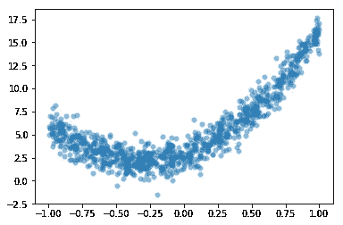

# 机器学习的数学第三部分

> 原文：<https://medium.datadriveninvestor.com/mathematics-for-machine-learning-part-3-4acbc355fb03?source=collection_archive---------16----------------------->

*下面是****Part-3*******用于机器学习的数学***[***Part-1***](https://tp6145.medium.com/mathematics-for-machine-learning-part-1-5e210c138a12)*[***Part-2******。*** *如果你还没有过前面的部分，一定要马上去做！*](https://tp6145.medium.com/mathematics-for-machine-learning-part-2-fa36b6154dec)**

****

**Image Source: Pinterest (Edited)**

# **内容**

1.  ***多项式回归***
2.  ***图论***

*   ***网络 X***
*   ***邻接矩阵***
*   ***最短路径的长度***
*   ***图形中的三角形***

# **多项式回归**

## **制定**

**同样的想法适用于拟合一个***d 次多项式模型*****

****

**到一组 n+1 个 数据点的**

******

***我们像以前一样形成矩阵，但是现在 ***范德蒙矩阵 X*** 具有 *d+1 列—****

********

**使误差平方和 ***SSE*** 最小的系数是线性系统的 ***唯一解。*****

## **例子**

****假噪声二次数据****

**让我们使用二次模型***y=a0+a1x+a2x2+ϵ***建立一些假数据，并使用线性回归来检索系数 *a0、a1 和 a2。***

```
**a0 = 3
a1 = 5
a2 = 8
N = 1000
x = 2*np.random.rand(N) - 1 # Random numbers in the interval (-1,1)
noise = np.random.randn(N)
y = a0 + a1*x + a2*x**2 + noise
plt.scatter(x,y,alpha=0.5,lw=0);
plt.show()**Out:****
```

****

***构造矩阵 X:***

```
**X = np.column_stack([np.ones(N),x,x**2])**
```

***用* `scipy.linalg.solve` *求解—***

****

```
**a = la.solve((X.T @ X),X.T @ y)**
```

***绘制结果:***

```
**xs = np.linspace(-1,1,20)
ys = a[0] + a[1]*xs + a[2]*xs**2
plt.plot(xs,ys,'r',linewidth=4)
plt.scatter(x,y,alpha=0.5,lw=0)
plt.show()**Out:****
```

****

## **图论**

**[***图***](https://en.wikipedia.org/wiki/Graph_%28discrete_mathematics%29) 是一组顶点和一组连接一些顶点的边。我们将考虑*简单、无向、连通图*:**

*   **如果顶点之间没有回路或多条边，则一个图是简单的**
*   **如果边没有方向，则图是 [***无向的***](https://en.wikipedia.org/wiki/Graph_%28discrete_mathematics%29#Undirected_graph)**
*   **一个图是 [***连通的***](https://en.wikipedia.org/wiki/Graph_%28discrete_mathematics%29#Connected_graph) 如果图中的每个顶点都通过一条路与其他顶点相连**

**我们可以把一个图想象成一组顶点和边，并通过观察它来回答关于这个图的问题。然而，对于诸如 [***社交网络图***](https://en.wikipedia.org/wiki/Social_network_analysis) 之类的大型图，这变得困难得多。相反，我们从图中构造矩阵，如 [***邻接矩阵***](https://en.wikipedia.org/wiki/Adjacency_matrix) 和 [***拉普拉斯矩阵***](https://en.wikipedia.org/wiki/Laplacian_matrix) 并研究它们的性质。**

**[***谱图论***](https://en.wikipedia.org/wiki/Spectral_graph_theory) 是研究邻接矩阵*(以及其他关联矩阵)*的特征值与 g 的结构的关系。**

## **网络 x**

**让我们用 Python 包[***NetworkX***](https://networkx.github.io/)来构造和可视化一些简单的图形——**

```
**import networkx as nx**
```

## **邻接矩阵**

**具有 n 个顶点的图 G 的 [***邻接矩阵***](https://en.wikipedia.org/wiki/Adjacency_matrix) AG 是大小为 n 的方阵，使得如果*顶点 I 和 j 由边*连接，则 *Ai，j=1* ，否则 *Ai，j=0。***

**我们可以使用`networkx`来创建图 g 的邻接矩阵。函数`nx.adjacency_matrix`返回一个 [***稀疏矩阵***](https://docs.scipy.org/doc/scipy/reference/sparse.html) ，我们使用`todense`方法将它转换成一个常规的 Numpy 数组。**

***例如，画出有 5 个顶点的* [***完全图***](https://en.wikipedia.org/wiki/Complete_graph) *并计算邻接矩阵:***

```
**G = nx.complete_graph(5)
nx.draw(G,with_labels=True)**Out:****
```

****

```
**A = nx.adjacency_matrix(G).todense()
print(A)**Out:** [[0 1 1 1 1]
 [1 0 1 1 1]
 [1 1 0 1 1]
 [1 1 1 0 1]
 [1 1 1 1 0]]**
```

## **最短路径的长度**

**简单无向图 G*中顶点间最短路径* 的长度 [***可以很容易地从邻接矩阵 AG 中计算出来。***](https://en.wikipedia.org/wiki/Shortest_path_problem)**

**特别地，从顶点 *i* 到顶点 *j (i≠j)* 的最短路径的长度是最小的正整数 *k* 使得—**

****

***剧情* [***十二面体图***](https://en.wikipedia.org/wiki/Regular_dodecahedron#Dodecahedral_graph)***:*****

```
**G = nx.dodecahedral_graph()
nx.draw(G,with_labels=True)**Out:****
```

****

```
**A = nx.adjacency_matrix(G).todense()
print(A)**Out:** [[0 1 0 0 0 0 0 0 0 0 1 0 0 0 0 0 0 0 0 1]
 [1 0 1 0 0 0 0 0 1 0 0 0 0 0 0 0 0 0 0 0]
 [0 1 0 1 0 0 1 0 0 0 0 0 0 0 0 0 0 0 0 0]
 [0 0 1 0 1 0 0 0 0 0 0 0 0 0 0 0 0 0 0 1]
 [0 0 0 1 0 1 0 0 0 0 0 0 0 0 0 0 0 1 0 0]
 [0 0 0 0 1 0 1 0 0 0 0 0 0 0 0 1 0 0 0 0]
 [0 0 1 0 0 1 0 1 0 0 0 0 0 0 0 0 0 0 0 0]
 [0 0 0 0 0 0 1 0 1 0 0 0 0 0 1 0 0 0 0 0]
 [0 1 0 0 0 0 0 1 0 1 0 0 0 0 0 0 0 0 0 0]
 [0 0 0 0 0 0 0 0 1 0 1 0 0 1 0 0 0 0 0 0]
 [1 0 0 0 0 0 0 0 0 1 0 1 0 0 0 0 0 0 0 0]
 [0 0 0 0 0 0 0 0 0 0 1 0 1 0 0 0 0 0 1 0]
 [0 0 0 0 0 0 0 0 0 0 0 1 0 1 0 0 1 0 0 0]
 [0 0 0 0 0 0 0 0 0 1 0 0 1 0 1 0 0 0 0 0]
 [0 0 0 0 0 0 0 1 0 0 0 0 0 1 0 1 0 0 0 0]
 [0 0 0 0 0 1 0 0 0 0 0 0 0 0 1 0 1 0 0 0]
 [0 0 0 0 0 0 0 0 0 0 0 0 1 0 0 1 0 1 0 0]
 [0 0 0 0 1 0 0 0 0 0 0 0 0 0 0 0 1 0 1 0]
 [0 0 0 0 0 0 0 0 0 0 0 1 0 0 0 0 0 1 0 1]
 [1 0 0 1 0 0 0 0 0 0 0 0 0 0 0 0 0 0 1 0]]**
```

**有了这个标签，让我们找出从顶点 0 到 15 的最短路径的长度:**

```
**i = 0
j = 15
k = 1
Ak = A
while Ak[i,j] == 0:
    Ak = Ak @ A
    k = k + 1
print('Length of the shortest path is',k)**Out:** Length of the shortest path is 5**
```

## **图形中的三角形**

*****谱图论中的一个简单结果*** 是一个图中 [***三角形***](https://en.wikipedia.org/wiki/Adjacency_matrix#Matrix_powers) 的个数***【T(G)***由下式给出:**

****

**其中 ***λ1≤λ2≤⋯≤λn*** 是邻接矩阵的*特征值。***

***让我们用最简单的例子来验证这一点，3 个顶点的完整图形:***

```
**C3 = nx.complete_graph(3)
nx.draw(C3,with_labels=True)**Out:****
```

****

```
**A3 = nx.adjacency_matrix(C3).todense()
eigvals, eigvecs = la.eig(A3)
int(np.round(np.sum(eigvals.real**3)/6,0))**Out:** 1**
```

***让我们计算 7 个顶点的完整图形中三角形的数量:***

```
**C7 = nx.complete_graph(7)
nx.draw(C7,with_labels=True)**Out:****
```

****

```
**A7 = nx.adjacency_matrix(C7).todense()
eigvals, eigvecs = la.eig(A7)
int(np.round(np.sum(eigvals.real**3)/6,0))**Out:** 35**
```

***7 个顶点的完全图有 35 个三角形！***

**让我们编写一个名为`triangles`的函数，它采用一个方阵`M`并返回总和—**

****

**其中 ***λi*** 是*对称矩阵*的*特征值***

****

**注意 ***M=A*** 如果 M 是对称的。如果*输入 M 是邻接矩阵，返回值是图 G* 中三角形的数量。**

```
**def **triangles**(M):
    A = (M + M.T)/2
    eigvals, eigvecs = la.eig(A)
    eigvals = eigvals.real
    return int(np.round(np.sum(eigvals**3)/6,0))**
```

***接下来，我们来试一个* [***图兰图***](https://en.wikipedia.org/wiki/Tur%C3%A1n_graph) ***。*****

```
**G = nx.turan_graph(10,5)
nx.draw(G,with_labels=True)**Out:****
```

****

```
**A = nx.adjacency_matrix(G).todense()
print(A)**Out:** [[0 0 1 1 1 1 1 1 1 1]
 [0 0 1 1 1 1 1 1 1 1]
 [1 1 0 0 1 1 1 1 1 1]
 [1 1 0 0 1 1 1 1 1 1]
 [1 1 1 1 0 0 1 1 1 1]
 [1 1 1 1 0 0 1 1 1 1]
 [1 1 1 1 1 1 0 0 1 1]
 [1 1 1 1 1 1 0 0 1 1]
 [1 1 1 1 1 1 1 1 0 0]
 [1 1 1 1 1 1 1 1 0 0]]**
```

***求三角形的个数:***

```
**triangles(A)**Out:** 80**
```

***最后，让我们来计算十二面图中三角形的数量:***

```
**G = nx.dodecahedral_graph()
nx.draw(G,with_labels=True)**Out:****
```

****

```
**A = nx.adjacency_matrix(G).todense()
print(A)**Out:** [[0 1 0 0 0 0 0 0 0 0 1 0 0 0 0 0 0 0 0 1]
 [1 0 1 0 0 0 0 0 1 0 0 0 0 0 0 0 0 0 0 0]
 [0 1 0 1 0 0 1 0 0 0 0 0 0 0 0 0 0 0 0 0]
 [0 0 1 0 1 0 0 0 0 0 0 0 0 0 0 0 0 0 0 1]
 [0 0 0 1 0 1 0 0 0 0 0 0 0 0 0 0 0 1 0 0]
 [0 0 0 0 1 0 1 0 0 0 0 0 0 0 0 1 0 0 0 0]
 [0 0 1 0 0 1 0 1 0 0 0 0 0 0 0 0 0 0 0 0]
 [0 0 0 0 0 0 1 0 1 0 0 0 0 0 1 0 0 0 0 0]
 [0 1 0 0 0 0 0 1 0 1 0 0 0 0 0 0 0 0 0 0]
 [0 0 0 0 0 0 0 0 1 0 1 0 0 1 0 0 0 0 0 0]
 [1 0 0 0 0 0 0 0 0 1 0 1 0 0 0 0 0 0 0 0]
 [0 0 0 0 0 0 0 0 0 0 1 0 1 0 0 0 0 0 1 0]
 [0 0 0 0 0 0 0 0 0 0 0 1 0 1 0 0 1 0 0 0]
 [0 0 0 0 0 0 0 0 0 1 0 0 1 0 1 0 0 0 0 0]
 [0 0 0 0 0 0 0 1 0 0 0 0 0 1 0 1 0 0 0 0]
 [0 0 0 0 0 1 0 0 0 0 0 0 0 0 1 0 1 0 0 0]
 [0 0 0 0 0 0 0 0 0 0 0 0 1 0 0 1 0 1 0 0]
 [0 0 0 0 1 0 0 0 0 0 0 0 0 0 0 0 1 0 1 0]
 [0 0 0 0 0 0 0 0 0 0 0 1 0 0 0 0 0 1 0 1]
 [1 0 0 1 0 0 0 0 0 0 0 0 0 0 0 0 0 0 1 0]]np.round(triangles(A),2)**Out:** 0**
```

> **Part-3 到此为止！我知道一下子很难接受。但是你坚持到了最后！恭喜你。别忘了看看这篇文章的其他部分——第四部分 和第五部分 ！**

****访问专家视图—** [**订阅 DDI 英特尔**](https://datadriveninvestor.com/ddi-intel)**

# **其他资源和参考**

> **如果你仍然有兴趣从这个主题中获得最大收益，还有很多其他的好资源—**

 **[## 数学 Python

www.math.ubc.ca](https://www.math.ubc.ca/~pwalls/math-python/)** **[](https://en.wikipedia.org/wiki/Linear_algebra) [## 线性代数

### 线性代数是数学的一个分支，它涉及线性方程，如:线性映射，如:线性代数是…

en.wikipedia.org](https://en.wikipedia.org/wiki/Linear_algebra) 

***要了解完整的实现，请查看我的 GitHub 库—***

[](https://github.com/tanvipenumudy/Winter-Internship-Internity/blob/main/Day%2006/Day-6%20Notebook-3%20%28Linear%20Algebra-III%29.ipynb) [## tanvipenumudy/Winter-实习-实习

### 存储库跟踪每天分配的工作-tanvipenumudy/Winter-实习-实习

github.com](https://github.com/tanvipenumudy/Winter-Internship-Internity/blob/main/Day%2006/Day-6%20Notebook-3%20%28Linear%20Algebra-III%29.ipynb)**