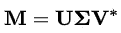

# 机器学习的数学第 4 部分

> 原文：<https://medium.datadriveninvestor.com/mathematics-for-machine-learning-part-4-8032bec2aa3d?source=collection_archive---------15----------------------->

*下面是* ***Part-4*** *到* ***用于机器学习的数学！*** *如果你还没有经历过*[***Part-1***](https://tp6145.medium.com/mathematics-for-machine-learning-part-1-5e210c138a12)[***Part-2***](https://tp6145.medium.com/mathematics-for-machine-learning-part-2-fa36b6154dec)*和*[***Part-3***](https://tp6145.medium.com/mathematics-for-machine-learning-part-3-4acbc355fb03)****T44****

****

**Image Source: Pinterest (Edited)**

# **内容**

*   ***使用 Sympy 的数学实现***
*   ***奇异值分解***
*   ***主成分分析***

## **【Sympy 的数学实现**

> **我们将在一些实现中使用 Sympy 模块。**

**[***SymPy***](https://www.scipy-lectures.org/advanced/sympy.html)是一个符号数学的 Python 库。它的目标是成为一个全功能的*计算机代数系统(CAS)* ，同时保持代码尽可能简单，以便易于理解和扩展。**

> **它完全是用 Python 写的。**

## **装置**

```
**pip install sympy**
```

## **导入症状**

```
****from** sympy **import** ***** *#importing all from sympy module***
```

## **在 Sympy 中定义矩阵**

```
**M = Matrix(([1,2,3,4],[5,6,7,8],[9,10,11,12],[13,14,15,16]))
M **Out:** [1   2   3   4 ]
[              ]
[5   6   7   8 ]
[              ]
[9   10  11  12]
[              ]
[13  14  15  16]**
```

> **支持所有标准的算术运算和切片**

## ****线性代数实现****

***我们可以执行一个* [***QR 分解***](https://en.wikipedia.org/wiki/QR_decomposition) *这对于求解系统来说是很方便的:***

```
**A = Matrix([[1,1,1],[1,1,3],[2,3,4]])
Q, R = A.QRdecomposition()
Q**Out:** [  ___     ___      ___ ]
[\/ 6   -\/ 3    -\/ 2  ]
[-----  -------  -------]
[  6       3        2   ]
[                       ]
[  ___     ___      ___ ]
[\/ 6   -\/ 3     \/ 2  ]
[-----  -------   ----- ]
[  6       3        2   ]
[                       ]
[  ___     ___          ]
[\/ 6    \/ 3           ]
[-----   -----      0   ]
[  3       3            ]R**Out:** [           ___         ]
[  ___  4*\/ 6       ___]
[\/ 6   -------  2*\/ 6 ]
[          3            ]
[                       ]
[          ___          ]
[        \/ 3           ]
[  0     -----      0   ]
[          3            ]
[                       ]
[                   ___ ]
[  0       0      \/ 2  ]Q*R**Out:** [1  1  1]
[       ]
[1  1  3]
[       ]
[2  3  4]**
```

**除了`solver.py`文件中的求解器，我们还可以通过将 b 向量传递给矩阵 A 的 [***LUsolve 函数***](https://en.wikipedia.org/wiki/LU_decomposition) 来求解系统 Ax=b。**

> **这里我们会稍微作弊选择 A 和 x 然后相乘得到 b，然后我们可以解出 x 并检查它是否正确:**

```
**A = Matrix([ [2, 3, 5], [3, 6, 2], [8, 3, 6] ])
x = Matrix(3,1,[3,7,5])
b = A*x
soln = A.LUsolve(b)
soln**Out:** [3]
[ ]
[7]
[ ]
[5]**
```

**还有一个很好的 [***格拉姆-施密特正交化器***](https://en.wikipedia.org/wiki/Gram%E2%80%93Schmidt_process) ，它将获取一组向量，并使它们相对于另一组向量正交化。**

**有一个可选参数指定输出是否也应该被规范化，它默认为`False`。**

```
**L = [Matrix([2,3,5]), Matrix([3,6,2]), Matrix([8,3,6])]
out1 = GramSchmidt(L)
out2 = GramSchmidt(L, **True**)
out1**Out:** [Matrix([  
[2],  
[3],  
[5]]), Matrix([  
[ 23/19],  
[ 63/19],  
[-47/19]]), Matrix([  
[ 1692/353],  
[-1551/706],  
[ -423/706]])]out2**Out:** [Matrix([  
[  sqrt(38)/19],  
[3*sqrt(38)/38],  
[5*sqrt(38)/38]]), Matrix([  
[ 23*sqrt(6707)/6707],  
[ 63*sqrt(6707)/6707],  
[-47*sqrt(6707)/6707]]), Matrix([  
[ 12*sqrt(706)/353],  
[-11*sqrt(706)/706],  
[ -3*sqrt(706)/706]])]**
```

***寻找余因子和余因子矩阵:***

```
**M = Matrix([[1, 2], [3, 4]])
M.cofactor(0, 1)**Out:**
-3M.cofactor_matrix()**Out:** Matrix([
[ 4, -3],
[-2,  1]])**
```

***寻找次矩阵和次矩阵:***

```
**M = Matrix([[1, 2, 3], [4, 5, 6], [7, 8, 9]])
M.minor(1, 1)**Out:** -12M.minor_submatrix(1, 1)**Out:** Matrix([
[1, 3],
[7, 9]])**
```

***行梯队形式:***

```
**M = Matrix([[1, 2], [3, 4]])
M.echelon_form()**Out:** Matrix([
[1,  2],
[0, -2]])**
```

***矩阵的秩:***

```
**n = Matrix(3, 3, range(1, 10))
n.rank()**Out:** 2**
```

***降排梯队形式:***

```
**from sympy.abc import x
m = Matrix([[1, 2], [x, 1 - 1/x]])
m.rref()**Out:** (Matrix([
[1, 0],
[0, 1]]), 
(0, 1))rref_matrix, rref_pivots = m.rref()
rref_matrix**Out:** Matrix([
[1, 0],
[0, 1]])rref_pivots**Out:** (0, 1)**
```

***查找列间距和行间距:***

```
**M = Matrix(3, 3, [1, 3, 0, -2, -6, 0, 3, 9, 6])
M**Out:** Matrix([
[ 1,  3, 0],
[-2, -6, 0],
[ 3,  9, 6]])M.columnspace()**Out:** [Matrix([
[ 1],
[-2],
[ 3]]), 
Matrix([
[0],
[0],
[6]])]M = Matrix(3, 3, [1, 3, 0, -2, -6, 0, 3, 9, 6])
M**Out:** Matrix([
[ 1,  3, 0],
[-2, -6, 0],
[ 3,  9, 6]])M.rowspace()**Out:**
[Matrix([[1, 3, 0]]), Matrix([[0, 0, 6]])]**
```

***寻找空空间:***

```
**M = Matrix(3, 3, [1, 3, 0, -2, -6, 0, 3, 9, 6])
M**Out:** Matrix([
[ 1,  3, 0],
[-2, -6, 0],
[ 3,  9, 6]])M.nullspace()**Out:** [Matrix([
[-3],
[ 1],
[ 0]])]**
```

***矩阵正交化:***

```
**v = [Matrix([1, I]), Matrix([1, -I])]
Matrix.orthogonalize(*v)**Out:** [Matrix([
[1],
[I]]), Matrix([
[ 1],
[-I]])]**
```

> **特征值，特征向量，对角化也可以做类似 Scipy！**

***检查矩阵是否为正定/半正定:***

```
**A = Matrix([[1, 0], [0, 1]])
A.is_positive_definite**Out:** TrueA.is_positive_semidefinite**Out:** True**
```

> **不要忘记参考— [**Sympy 文档**](https://docs.sympy.org/latest/modules/matrices/matrices.html)**

## **奇异值分解**

**在线性代数中，奇异值分解是一个实矩阵或复矩阵的因式分解，它通过极坐标分解的扩展将一个平方正规矩阵的特征分解推广到任何矩阵— *来源:* [***维基百科***](https://en.wikipedia.org/wiki/Singular_value_decomposition) ***。*****

****

***实现* ***(使用 Scipy):*****

> **参考 [**机器学习数学第一部分**](https://tp6145.medium.com/mathematics-for-machine-learning-part-1-5e210c138a12) 了解更多关于 Scipy 实现的信息。**

```
****from numpy import array
from scipy.linalg import svd**
*# define a matrix* A = array([[1, 2], [3, 4], [5, 6]])
print(A)**Out:** [[1 2]
[3 4]
[5 6]]*# SVD* U, s, VT = svd(A)
print(U)**Out:** [[-0.2298477   0.88346102  0.40824829]
[-0.52474482  0.24078249 -0.81649658]
[-0.81964194 -0.40189603  0.40824829]]print(s)**Out:** [ 9.52551809  0.51430058]print(VT)**Out:** [[-0.61962948 -0.78489445]
 [-0.78489445  0.61962948]]**
```

## **主成分分析**

********

***实现(使用*[****sk learn****](https://scikit-learn.org/stable/modules/generated/sklearn.decomposition.PCA.html)*):***

```
****import** **numpy** **as** **np**
**from** **sklearn.decomposition** **import** **PCA** *#inbuilt function*
X = np.array([[-1, -1], [-2, -1], [-3, -2], [1, 1], [2, 1], [3, 2]])
pca = PCA(n_components=2)
pca.fit(X)**Out:** PCA(n_components=2)print(pca.explained_variance_ratio_)**Out:**
[0.9924... 0.0075...]print(pca.singular_values_)**Out:** [6.30061... 0.54980...]**
```

> **Part-4 到此为止！我知道一下子很难接受。但是你坚持到了最后！恭喜你。别忘了看看本文的最后一部分— [**第 5 部分**](https://tp6145.medium.com/mathematics-for-machine-learning-part-5-8df72392ec10) ！**

****访问专家视图—** [**订阅 DDI 英特尔**](https://datadriveninvestor.com/ddi-intel)**

# **其他资源和参考**

> **如果你仍然有兴趣从这个主题中获得最大收益，还有很多其他的好资源—**

 **[## 矩阵(线性代数). SymPy 1.7.1 文献

### 线性代数模块设计得尽可能简单。首先，我们导入并声明我们的第一个对象:在…

docs.sympy.org](https://docs.sympy.org/latest/modules/matrices/matrices.html)** **[](https://machinelearningmastery.com/singular-value-decomposition-for-machine-learning/) [## 如何用 Python -机器学习掌握从头计算 SVD

### 矩阵分解，也称为矩阵分解，涉及到描述一个给定的矩阵使用其组成…

machinelearningmastery.com](https://machinelearningmastery.com/singular-value-decomposition-for-machine-learning/) [](https://scikit-learn.org/stable/modules/generated/sklearn.decomposition.PCA.html) [## sk learn . decomposition . PCA-sci kit-learn 0 . 24 . 0 文档

### 主成分分析。使用数据的奇异值分解进行线性降维…

scikit-learn.org](https://scikit-learn.org/stable/modules/generated/sklearn.decomposition.PCA.html) 

***关于完整的实现，请查看我的 GitHub 库—***

[](https://github.com/tanvipenumudy/Winter-Internship-Internity/blob/main/Day%2006/Day-6%20Notebook-4%20%28Misc%2C%20SVD%2C%20PCA%29.ipynb) [## tanvipenumudy/Winter-实习-实习

### 存储库跟踪每天分配的工作-tanvipenumudy/Winter-实习-实习

github.com](https://github.com/tanvipenumudy/Winter-Internship-Internity/blob/main/Day%2006/Day-6%20Notebook-4%20%28Misc%2C%20SVD%2C%20PCA%29.ipynb)**