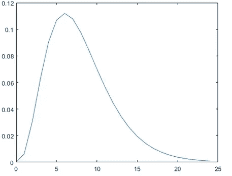

# 机器学习的数学第 5 部分

> 原文：<https://medium.datadriveninvestor.com/mathematics-for-machine-learning-part-5-8df72392ec10?source=collection_archive---------14----------------------->

*功成名就* *最后也是最后一部分* ***用于机器学习的数学！*** *你们如此努力才走到这一步，我们将在接下来的几分钟内结束这一切！*

*如果你还没有经历过*[***Part-1***](https://tp6145.medium.com/mathematics-for-machine-learning-part-1-5e210c138a12)*[***Part-2***](https://tp6145.medium.com/mathematics-for-machine-learning-part-2-fa36b6154dec)*[***Part-3***](https://tp6145.medium.com/mathematics-for-machine-learning-part-3-4acbc355fb03)**和****

********

****Image Source: Pinterest (Edited)****

# ****概率与统计****

*****概率统计*是*机器学习和数据科学的 ***基础支柱*** 。*其实机器学习和人工智能的底层原理无非就是*统计数学*和*线性代数。*****

***你可能经常会遇到这样的情况，为了理解某个特定的主题，你不得不阅读涉及大量数学的研究论文，因此如果你想在这方面做得更好，就必须有很强的数学理解能力。***

# ***内容***

*   ****描述性统计****
*   ****分散****
*   ****随机变量****
*   ****概率分布****

## ***入门指南***

***我们将首先看到什么是数据分析，Python 中的集中趋势:均值、中值和众数。此外，我们将讨论 Python 分散性和 Python 熊猫描述性统计。除此之外，我们还将介绍 Python 中的方差以及如何计算一组值的可变性。***

> ***更多信息请参考使用熊猫的 Python 中的 [**统计分析**](https://medium.com/analytics-vidhya/statistical-analysis-in-python-using-pandas-27c6a4209de2)***

## ***数据分析***

***在数据分析中，我们使用了两种主要的统计方法- *描述性的*和*推断性的*。***

*   ***描述性统计使用样本的均值和标准差等工具来汇总数据。***
*   ***另一方面，推断统计学着眼于随机变化的数据，然后从中得出结论。***

***一些这样的变化包括观察误差和抽样变化。***

## ***Python 中的描述性统计***

******Python 描述性统计*** 过程描述了研究中数据的基本特征。它提供样本和度量的摘要，但不使用数据来了解它所代表的总体。***

> ***在描述性统计下，有两组属性- *集中趋势*和*分散*。Python 中心趋势描述了整个分布的一个中心值。这一项下的衡量标准包括均值、中值和众数。***
> 
> ***Python 离散度是一个术语，用于描述分布成员与中心的距离以及彼此之间的距离。方差/标准差是可变性的一种度量。***

## ****实施****

***我们将从*安装*和*导入*[***Python 中的统计库***](https://docs.python.org/3/library/statistics.html) 开始——***

> *****为什么要统计模块？*****
> 
> ***在本文的前几部分中，我们已经看到了使用其他库实现的各种函数，突然探索新的库总是很有趣，统计学就是其中之一。***
> 
> ***统计模块提供了对数值数据进行数理统计的功能。我们将看到在本模块中定义的几个流行的统计函数。***

## ***装置***

```
***pip install statistics***
```

****参考* [***统计 PyPI***](https://pypi.org/project/statistics/)**排除*故障****

## ****导入统计数据****

```
****import statistics as st****
```

## ****平均值()****

****此函数返回它所操作的数据的算术平均值。****

```
****nums=[1,2,3,5,7,9]
st.mean(nums)**Out:** 4.5****
```

## ****模式()****

****该函数返回一组数据中最常见的值。这给了我们一个中心在哪里的好主意。****

```
****nums=[1,2,3,5,7,9,7,2,7,6]
st.mode(nums)**Out:** 7****
```

## ****中位数()****

****对于奇数长度的数据，返回中间项；对于偶数长度，它返回两个中间项的平均值。****

```
****st.median(nums) #(5+6)/2**Out:** 5.5****
```

## ****调和平均值()****

****该函数返回数据的调和平均值。对于三个值 *a、b、c* ，调和平均值为-***3/(1/a+1/b+1/c)***
它是中心的度量；速度就是这样一个例子。****

```
****st.harmonic_mean([2,4,9.7])**Out:** 3.516616314199396*"""for the same set of data, the arithmetic mean would give us a value of 5.233"""*****
```

## ****median_low()****

****当数据长度为偶数时，这为我们提供了数据的低中值。否则，它返回中间值。****

```
****st.median_low([1,2,4])**Out:** 2****
```

## ****median_high()****

****与 median_low 类似，当数据长度为偶数时，它返回高中间值。否则，它返回中间值。****

```
****st.median_high([1,2,4])**Out:** 2****
```

## ****中位数 _ 分组()****

****此函数使用插值法返回分组连续数据的中值。这是第 50 百分位。****

```
****st.median([1,3,3,5,7])**Out:** 3st.median_grouped([1,3,3,5,7],interval=1)**Out:** 3.25st.median_grouped([1,3,3,5,7],interval=2)**Out:** 3.5****
```

## ****Python 描述性统计-Python 中的离散度****

****离差/扩散让我们了解数据是如何偏离典型值的。****

## ****方差()****

****这将返回样本的方差。这是关于平均值 的 ***二阶矩，较大的值表示一组相当分散的数据。当您的数据是总体中的一个样本时，您可以使用此方法。*******

```
****st.variance(nums)**Out:** 7.433333333333334****
```

## ****p 方差()****

****这将返回数据的总体方差。用它来计算总体的方差。****

```
****st.pvariance(nums)**Out:**
6.69****
```

## ****stdev()****

****这将返回样本的标准偏差。这等于样本方差的平方根。****

```
****st.stdev(nums)**Out:**
2.7264140062238043****
```

## ****pstdev()****

****这将返回总体标准差。这是人口方差的平方根。****

```
****st.pstdev(nums)**Out:**
2.5865034312755126****
```

## ****Python 语言描述性统计的熊猫****

****我们也可以使用熊猫做同样的事情 *(* [***)在 Python 中统计分析使用熊猫***](https://medium.com/analytics-vidhya/statistical-analysis-in-python-using-pandas-27c6a4209de2) *)*****

```
****import pandas as pd
df=pd.DataFrame(nums)
df.mean()**Out:**
0    4.9 
dtype: float64df.mode()**Out:** 0
0    7df.std()**Out:** 0    2.726414 
dtype: float64df.skew()**Out:** 0   -0.115956 
dtype: float64****
```

## ****随机变量****

****一个随机变量代表一个结果可能发生的所有可能的事件集合。随机变量有两种， ***连续*** 和 ***离散。*******

> ****掷硬币、掷骰子和纸牌游戏等事件可以用**离散随机变量**来表示，而体温、大气压力和学生平均绩点(GPA)的值可以用**连续随机变量来表示。******

****还有一种你应该知道的经常出现在文献中的分布类型叫做 ***累积分布函数*** 。所有随机变量*(离散和连续)*都有一个*累积分布函数*。****

****它是一个函数，对于每个值 X，给出随机变量 *X 小于或等于 x* 的概率。****

> ****对于一个离散的随机变量，通过 ***对概率求和得到累积分布函数。*******

## ****概率分布****

## ****1.均匀分布****

****也许最简单和有用的分布之一是均匀分布。连续均匀分布的概率分布函数是—****

********

****由于曲线下的面积必须是*等于 1* ，区间的长度决定了曲线的高度。下图显示了区间(a，b)中的均匀分布。****

> ****请注意，因为面积需要为 1。高度设置为 1/(b a)。****

********

****在 python 中，您可以借助随机数生成器在一个数字区间(a，b)上进行操作来可视化均匀分布。你需要从`scipy.stats`模块导入`uniform`函数。****

```
*****# import uniform distribution* 
from scipy.stats import uniform*# random numbers from uniform distribution* 
n = 10000 
start = 10 
width = 20 
data_uniform = uniform.rvs(size=n, loc = start, scale=width)****
```

****`uniform`函数通过其`loc`和`scale`参数在指定的区间内生成一个均匀连续的变量。这种分布在`loc`和`loc + scale`之间是恒定的。`size`参数描述了随机变量的数量。如果你想保持再现性，包括一个分配给数字的`random_state`参数。****

****您可以使用 Seaborn 的`distplot`来绘制您刚刚创建的分布直方图。Seaborn 的 distplot 接受多个参数来定制绘图。首先创建一个绘图对象`ax`。这里可以指定直方图中`bins`的数量，指定直方图的`color`，用`kde`指定密度绘图选项，用`hist_kws`指定线宽选项。您也可以使用`xlabel`和`ylabel`参数设置 x 轴和 y 轴的标签。****

> ****关于 Seaborn 的更多信息，请参考— [**使用 Python 的数据可视化第二部分**](https://medium.com/analytics-vidhya/data-visualization-using-python-part-ii-e00249fe2543)****

```
****ax = sns.distplot(data_uniform,
                  bins=100,
                  kde=True,
                  color='skyblue',
                  hist_kws={"linewidth": 15,'alpha':1})
ax.set(xlabel='Uniform Distribution ', ylabel='Frequency')**Out:** [Text(0,0.5,u'Frequency'), Text(0.5,0,u'Uniform Distribution ')]****
```

********

## ****2.正态分布****

****正态分布又称 ***高斯分布*** ，在数据科学中普遍存在。****

> ****你会在很多地方遇到它，尤其是在统计推断的话题中。这也是许多数据科学算法的假设之一。****

****正态分布具有钟形密度曲线，由其均值μ和标准差σ描述。密度曲线*是对称的，以其平均值*为中心，其*分布由其标准偏差*决定，表明接近平均值的数据比远离平均值的数据出现得更频繁。****

****在给定点 x 具有均值μ和标准差σ的正态密度曲线的概率分布函数由下式给出****

********

*****下图描述了分布情况:*****

********

*****类似于均匀分布，我们现在开始实施:*****

```
****from scipy.stats import norm 
*# generate random numbers from N(0,1)* 
data_normal = norm.rvs(size=10000,loc=0,scale=1)****
```

*****使用 Seaborn 可视化:*****

```
****ax = sns.distplot(data_normal,
                  bins=100,
                  kde=True,
                  color='skyblue',
                  hist_kws={"linewidth": 15,'alpha':1})
ax.set(xlabel='Normal Distribution', ylabel='Frequency')**Out:** [Text(0,0.5,u'Frequency'), Text(0.5,0,u'Normal Distribution')]****
```

********

## ****3.γ分布****

****伽玛分布是一个双参数连续概率分布族。****

> ****虽然它很少以原始形式使用，但其他普遍使用的分布，如指数分布、卡方分布、埃尔兰分布都是伽马分布的特例。****

****伽马分布可以用形状参数α=和反比例参数β=1/θ(称为速率参数)来参数化，符号γ(n)是伽马函数，定义为(n-1)！—****

********

*****典型的伽玛分布看起来像:*****

********

*****实现:*****

```
****from scipy.stats import gamma 
data_gamma = gamma.rvs(a=5, size=10000)****
```

*****使用 Seaborn 可视化:*****

```
****ax = sns.distplot(data_gamma,
                  kde=True,
                  bins=100,
                  color='skyblue',
                  hist_kws={"linewidth": 15,'alpha':1})
ax.set(xlabel='Gamma Distribution', ylabel='Frequency')**Out:** [Text(0,0.5,u'Frequency'), Text(0.5,0,u'Gamma Distribution')]****
```

********

## ****4.指数分布****

****指数分布描述了泊松点过程中事件之间的时间，即事件以恒定的平均速率连续且独立发生的过程。它有一个称为*速率参数*的参数λ，其方程描述为:****

********

*****递减指数分布看起来像:*****

********

*****实施:*****

```
****from scipy.stats import expon 
data_expon = expon.rvs(scale=1,loc=0,size=1000)****
```

*****使用 Seaborn 可视化:*****

```
****ax = sns.distplot(data_expon,
                  kde=True,
                  bins=100,
                  color='skyblue',
                  hist_kws={"linewidth": 15,'alpha':1})
ax.set(xlabel='Exponential Distribution', ylabel='Frequency')**Out:** [Text(0,0.5,u'Frequency'), Text(0.5,0,u'Exponential Distribution')]****
```

********

## ****5.泊松分布****

*******泊松随机变量*** 通常用于建模一个事件在一个时间间隔内发生的次数。例如，一个网站在一段时间内的用户访问量可以认为是一个泊松过程。****

****泊松分布用事件发生的*速率(μ)* 来描述。一个事件可以在一个时间间隔内发生 0、1、2…次。一个时间间隔内事件的平均数量被指定为 *λ (lambda)* 。****

****λ是事件速率，也称为*速率参数。在一个时间间隔内观察到 k 个事件的概率由下式给出*****

********

> ****正态分布是参数λ→∞的泊松分布的极限情况。此外，如果随机事件之间的时间遵循速率为λ的指数分布，则在长度为 tt 的时间段内的事件总数遵循参数为λt 的泊松分布****

*****下图显示了典型的泊松分布:*****

********

*****实施:*****

```
****from scipy.stats import poisson 
data_poisson = poisson.rvs(mu=3, size=10000)****
```

*****使用 Seaborn 可视化:*****

```
****ax = sns.distplot(data_poisson,
                  bins=30,
                  kde=False,
                  color='skyblue',
                  hist_kws={"linewidth": 15,'alpha':1})
ax.set(xlabel='Poisson Distribution', ylabel='Frequency')**Out:** [Text(0,0.5,u'Frequency'), Text(0.5,0,u'Poisson Distribution')]****
```

********

## ****6.二项分布****

****只有两种可能结果的分布称为二项式分布，如成功或失败、获得或损失、赢或输，并且所有试验的成功和失败概率都相同。****

> ****然而，结果不一定是一样的，每个试验都是相互独立的。****

****二项分布的参数是 n 和 p，其中 n 是试验的总数，p 是每次试验成功的概率。****

****其概率分布函数由下式给出:****

********

*****哪里:*****

********

*****实现:*****

```
****from scipy.stats import binom 
data_binom = binom.rvs(n=10,p=0.8,size=10000)****
```

*****使用 Seaborn 可视化:*****

```
****ax = sns.distplot(data_binom,
                  kde=False,
                  color='skyblue',
                  hist_kws={"linewidth": 15,'alpha':1})
ax.set(xlabel='Binomial Distribution', ylabel='Frequency')**Out:**
[Text(0,0.5,u'Frequency'), Text(0.5,0,u'Binomial Distribution')]****
```

********

****因为成功的概率*大于 0.5* ，所以分布*向右侧倾斜。*****

****同样， ***泊松分布*** 是二项分布在以下条件下的*极限情况:*****

1.  *****试验次数无限大或 n→∞。*****
2.  ****每次试验的成功概率是相同的，并且无限小或 p→0。****
3.  *****np=λ，是有限的。*****

*******正态分布*** 是二项分布在以下条件下的另一种*极限形式:*****

1.  *****试验次数无限大，n→∞。*****
2.  ****p 和 q 都不是无限小的。****

## ****7.二项分布****

****一个伯努利分布有*只有两种可能的结果*，即 ***1(成功)*** 和 ***0(失败)*** ，以及一次单次试投，例如抛硬币。****

****因此，具有伯努利分布的随机变量 X 可以取值 *1* 表示成功概率， *p，*以及值 *0* 表示失败概率， *q 或 1p .*****

****成功和失败的可能性不一定相等。****

****伯努利分布是二项式分布的一种特殊情况，其中进行了*单次试验(n=1)* 。****

****其概率质量函数由下式给出:****

********

*****实施:*****

```
****from scipy.stats import bernoulli 
data_bern = bernoulli.rvs(size=10000,p=0.6)****
```

*****使用 Seaborn 可视化:*****

```
****ax = sns.distplot(data_bern,
                 kde=False,
                 color="skyblue",
                 hist_kws={"linewidth": 15,'alpha':1})
ax.set(xlabel='Bernoulli Distribution', ylabel='Frequency')**Out:** [Text(0,0.5,u'Frequency'), Text(0.5,0,u'Bernoulli Distribution')]****
```

********

> ******机器学习数学到此为止！我知道一下子接受太多了！但是你坚持到了最后！恭喜你。******

# ****其他资源和参考****

> ****如果你仍然有兴趣从这个主题中获得最大收益，还有很多其他的好资源—****

*   ****[*https://github . com/kartikdube/Probability-and-Statistics-in-Data-Science-Using-Python*](https://github.com/kartikdube/Probability-and-Statistics-in-Data-Science-Using-Python)****
*   ****[*https://www . data camp . com/community/tutorials/probability-distributions-python*](https://www.datacamp.com/community/tutorials/probability-distributions-python)****
*   ****[*https://data-flair . training/blogs/python-descriptive-statistics/*](https://data-flair.training/blogs/python-descriptive-statistics/)****
*   ******进入专家视角—** [**订阅 DDI 英特尔**](https://datadriveninvestor.com/ddi-intel)****

*******要了解完整的实现，请查看我的 GitHub 库—*******

****[](https://github.com/tanvipenumudy/Winter-Internship-Internity/blob/main/Day%2006/Day-6%20Notebook-5%20%28Probability%20%26%20Statistics%29.ipynb) [## tanvipenumudy/Winter-实习-实习

### 存储库跟踪每天分配的工作-tanvipenumudy/Winter-实习-实习

github.com](https://github.com/tanvipenumudy/Winter-Internship-Internity/blob/main/Day%2006/Day-6%20Notebook-5%20%28Probability%20%26%20Statistics%29.ipynb)****