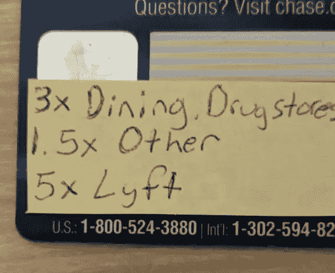
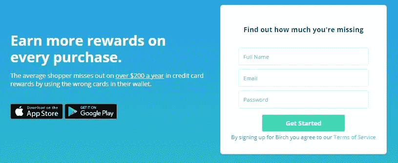
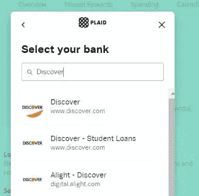
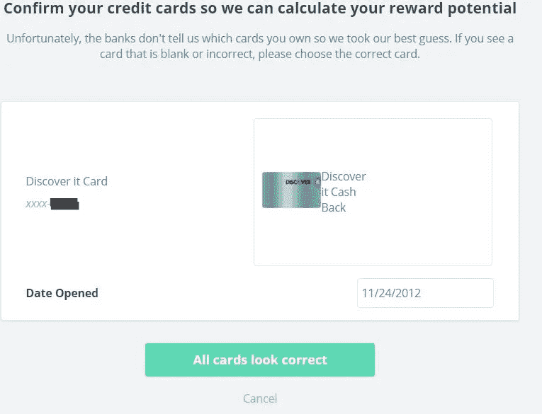
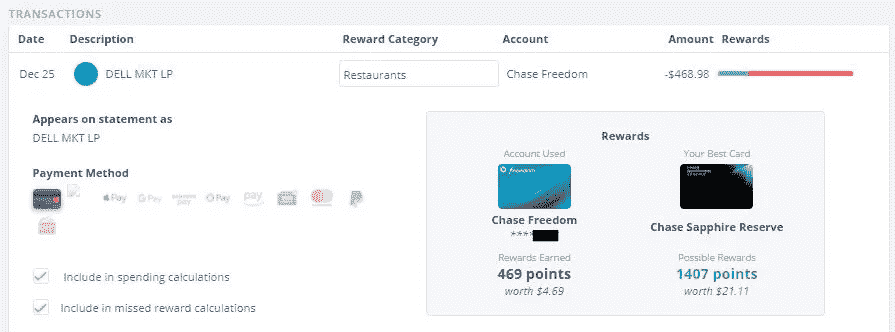
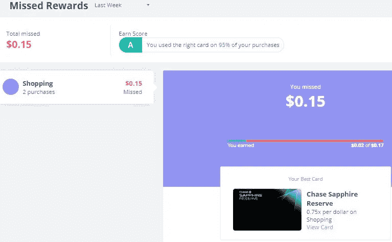
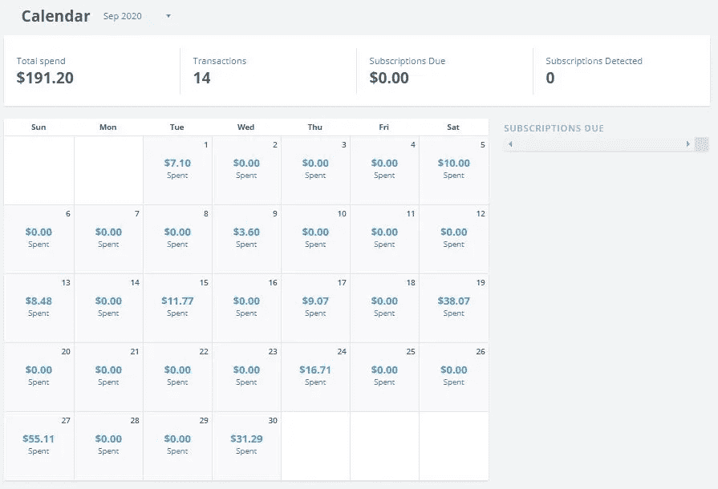

# Birch Finance 让您的信用卡回报最大化

> 原文：<https://medium.datadriveninvestor.com/maximizing-your-credit-card-rewards-with-birch-finance-7396cd3b5775?source=collection_archive---------16----------------------->

## 你有没有想过你错过了多少信用卡积分？找出答案。

Photo by [Avery Evans](https://unsplash.com/@averye457?utm_source=medium&utm_medium=referral) on [Unsplash](https://unsplash.com?utm_source=medium&utm_medium=referral)

当谈到赚取信用卡积分和返现时，我们都有一个共同的目标，那就是最大化我们通过消费得到的价值。对于我们这些可能有很多信用卡的人来说，决定使用哪一张信用卡才不会错过可能是一件棘手的事情。

你有没有想过你可能错过了多少分？这听起来像是第一世界的问题(有点像)，但这正是**白桦金融**的用武之地。

[Birch Finance](https://birchfinance.com/) 是一家金融科技初创公司，通过使用*右*卡购买*右*商品，帮助你“更明智地消费，获得更多回报”。成立于 2015 年，2018 年被[偶金融](https://evenfinancial.com/)收购。他们设计了一个网络平台和移动应用程序，可以分析你的历史信用卡交易数据，让你知道你错过奖励的程度，并帮助你了解你使用信用卡的情况。它还会根据你的消费习惯推荐最好的信用卡。

> 让我们看看它是如何工作的，以及我们如何使用它。

## 怎么知道用哪张卡？—传统方法

我未来的一个人生目标是始终使用正确和最好的信用卡 100%的时间积分最大化。我知道你在想什么——这听起来像是奖励积分上瘾的典型例子。

我过去做过的一件事就是在我的卡片背面贴一个标签，尤其是我注册的新卡片。我经常发现自己在排队付款时，会在手机上快速查找某些信用卡优惠。十有八九，我放弃了，把钱包里的第一张卡递给了收银员。

Image by author

为了跟踪我获得积分的情况，以后我必须在电子表格中进行许多手动、耗时的计算和比较。

随着时间的推移，这帮助我更好地选择我的卡，但这仍然是一个挑战，因为许多信用卡公司在日历年的不同季度或特定时间段有临时促销活动，除此之外还要跟踪多张卡可能会令人不知所措。

## Birch Finance 如何运作

用 Birch Finance 创建和设置一个帐户是免费的、简单的，而且非常容易做到。

你要做的第一件事是用你的名字、电子邮件和密码在 [Birch Finance](https://birchfinance.com/) 创建一个账户。

Birch Finance landing page

**第一步:** **链接您的金融机构账户**

一旦您的帐户激活，导航到您的“钱包”搜索并添加一个帐户。Birch 使用 Plaid 安全地连接到您的财务帐户，以检索帐户和交易数据。

Image by author

根据我的经验，他们提供了大量的选择，包括所有主要的信用卡公司。验证您的登录凭据后，系统会提示您选择并确认您拥有的正确卡。

Image by author

完成后，您就正式链接了一个帐户，您的所有交易都应该被导入并准备好进行分析(尽管这可能需要 24 小时)。您可以对您拥有并想要分析的所有帐户执行此操作。你还可以在将账户链接到你的钱包后“取消检查”，这样它们就不会出现在 Birch 使用的分析和最大化算法中。

**第二步:** **验证为您的交易分配的类别**

一旦你所有的账户都被链接，交易都被载入你的钱包，Birch 将开始分析一切，并根据消费类别提供新卡建议和你错过了多少。

Birch 的做法是在你的钱包中存储不同的积分和积分，并尝试为你账户中的每笔交易正确选择**奖励类别**。拥有正确的奖励类别至关重要，因为最终它将决定如何计算特定交易的潜在奖励。最好扫描一下**支出**(或交易)页面，验证大部分类别看起来是准确的，并更新任何完全关闭的类别。

Example of an incorrect category auto-assigned for a Dell Computer purchase made by author which was updated to ‘Computers & Electronics’

**在我看来，该视图和页面可能是平台上最重要和最强大的功能之一**,因为它允许对每个单独的交易进行简单的审查，以执行以下操作:

*   比较你用过的卡和最好的卡
*   更新或更正交易记录类别
*   从消费或错过奖励计算中包括/排除交易

**第三步:** **分析错过的奖励结果**

最后可以看看我们的**错过的奖励**页面。这将只向您显示您“错过”的交易以及基于其定义的支出类别的金额。它还会告诉你在该类别中你的最佳卡片是什么，以及你在**赢取分数中表现如何。**所有的东西都被转换成美元金额，以便于卡片之间的比较。

Image by author

然而，在玩了这个平台之后，我注意到一些积分乘数并不是最新的。对于我的 Chase Marriott 奖励卡，它显示我在食品杂货交易中获得 2 倍积分。经过仔细检查[卡利益条款](https://www.uscreditcardguide.com/chase-marriott-credit-card/)和我的声明，这是错误的，应该是 1X。

Image by author

在这种情况下，我禁用了钱包中的这张卡，因为它丢弃了许多分析，使我看起来像一个比我想象的更差的点数获得者！另外——我很少用那张卡，因为它最适合在酒店交易时使用，我不常用，尤其是在今天的疫情。

## Birch Finance 的其他优势

除了评估您的支出以帮助优化您的奖励，Birch Finance 的仪表板和分析还提供了许多其他好处。

一个很好的功能是能够通过他们的日历视图跟踪你每天或每月的花费。

Example of a Calendar-view of spending

然后和其他平台类似，可以收到钱包推荐新卡。这些建议将包括根据您的历史消费习惯预测的奖励金额和福利。

## 最后的想法

总的来说，Birch Finance 提供了一个非常简洁的仪表板和对你的信用卡消费的可视化洞察，这是许多其他流行平台也提供的(Mint，Penny，Credit Karma 等)。)，但他们的**主要区别是让你跟踪错过的奖励，我还没有见过任何其他平台这样做。**

然而，获得正确的积分估值是困难的，仍然有一些领域在未来可能会更好。具体来说:

*   **能够定义或覆盖您自己的积分奖励估值。**这是最难的一个问题，因为积分估值不断变化，取决于消费者最看重哪种积分。一些奖励计划允许您将积分转移到航空公司或其他合作伙伴，或者用特定的商户兑换积分，从而增加积分的价值。著名博客 ThePointsGuy 每月发布一份关于[积分估值](https://thepointsguy.com/guide/monthly-valuations/)的参考资料，旨在帮助人们通过积分/里程最大化旅行。
*   **更准确和最新的促销返现或奖励。Chase Freedom/Flex 和 Discover 等信用卡每季度为某些消费类别提供 5%的返现，目前 Birch Finance 的分析没有考虑这一点。**
*   **能够为预期交易自动推荐最佳卡片。**

尽管如此，桦树金融不应该被盲目地和单独地用来帮助推动你的信用卡购买决定。然而，这是一个非常快速和简单的方法，有助于补充您的决策以及其他事情，如考虑您自己的积分估值、提供的任何其他福利的知识(购买保护保险、折扣等)。)以及你可能瞄准的促销奖金的最低消费。

尽管如此，它为信用卡奖励领域带来的想法和机会是有希望的。简单的设置过程绝对值得让您了解自己的回报潜力。

**免责声明:** *本文仅供参考。作者在 Birch Finance 甚至 financial 没有任何财务利益或股份。*

## 参考

*   [连财收购白桦金融](https://www.prnewswire.com/news-releases/even-financial-to-acquire-birch-finance-300740834.html)
*   [积分指南—积分指南&英里](https://thepointsguy.com/guide/beginners/)