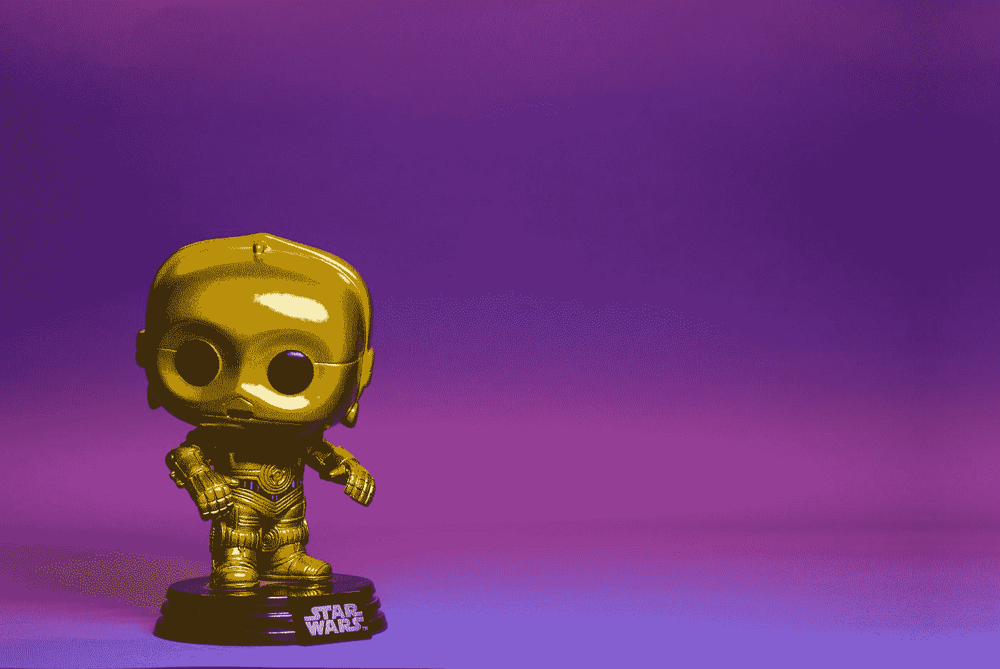

# 也许外星人是来看看这些噪音是怎么回事的

> 原文：<https://medium.datadriveninvestor.com/maybe-aliens-are-dropping-by-to-see-what-all-the-noise-is-about-dc61864095ab?source=collection_archive---------46----------------------->

## 几十年来，外星人的出现越来越多

Photo by [Igor Karimov](https://unsplash.com/@ingvar_erik?utm_source=medium&utm_medium=referral) on [Unsplash](https://unsplash.com?utm_source=medium&utm_medium=referral)

我认为可能是手机的问题。多年来我们一直在不停地爆破。我们没有心灵感应。如果是的话，这将有助于抑制噪音。但我们不是，所以我们别无选择。有什么替代方案吗？

我们可以更加开放我们的思想。我们可以利用我们所有人都拥有的精神能力，但是因为没有人同意而被关闭了。我们可以进行星体投射，但那也很糟糕。有多少次你想到了某个人，然后他们以某种方式立刻联系上了你？这种事在我身上发生过很多次。

## UFO 目击事件

2020 年不明飞行物目击率上升。到目前为止已经有 99 次目击。在过去的 20 年里，2015 年的目击事件最多，为 114 起。也许他们是过来看看这些噪音是怎么回事。我们不断向宇宙发射音乐、电影、对话、战争、火箭等。

此外，我们在地球周围有许多卫星，并且由于埃隆·马斯克和他向空间站的发射，更多的卫星将会到来。脸书和其他公司正计划向近地轨道发射数千颗类似的卫星，让天空充满潜在的不明飞行物。

我们是一个嘈杂的星球。你认为他们是注意到了还是对此感到不快？

纽约的不明飞行物目击事件有所增加；从 151 到 184 称**国家不明飞行物报告中心。**

 [## 外星人入侵最新的 2020 威胁，UFO 目击事件在纽约激增

### 纽约市——把世界之战加入 2020 年对纽约的一切。天空观察者报道了一个巨大的…

patch.com](https://patch.com/new-york/new-york-city/alien-invasion-latest-2020-threat-ufo-sightings-shoot-ny) 

## 为什么我们对此如此惊讶？

我们可能只是外星人的娱乐来源。站在他们的角度想想。有些人已经让自己出名了。他们从来没有感觉到威胁，尽管作为个人，我们除了拍照和报告之外什么也做不了。

甚至伟大的斯蒂芬·霍金也告诉我们要小心我们放入太空的东西。我们可能会后悔。

 [## [人名]斯蒂芬·霍金 (理论物理学家、宇宙学家及作家)

### 斯蒂芬·威廉·霍金(1942 年 1 月 8 日-2018 年 3 月 14 日)是英国理论物理学家、宇宙学家和作家…

en.wikipedia.org](https://en.wikipedia.org/wiki/Stephen_Hawking) 

以上摘录:

霍金担心地球上的生命正面临突如其来的核战争、基因工程病毒、T2 病毒、全球变暖或其他人类尚未想到的危险。[【304】](https://en.wikipedia.org/wiki/Stephen_Hawking#cite_note-nyt2007-304)[【357】](https://en.wikipedia.org/wiki/Stephen_Hawking#cite_note-telegraph_planet_Earth-358)霍金表示:“我认为核对抗或环境灾难几乎不可避免地会在未来 1000 年的某个时候削弱地球”，并认为“[小行星碰撞](https://en.wikipedia.org/wiki/Asteroid)”是对地球的最大威胁。[【348】](https://en.wikipedia.org/wiki/Stephen_Hawking#cite_note-WP-20181015-349)如果人类能够在灾难发生前殖民更多的星球，这样一场全球性的灾难不一定会导致人类灭绝。霍金认为太空飞行和太空殖民对人类的未来是必要的。[【304】](https://en.wikipedia.org/wiki/Stephen_Hawking#cite_note-nyt2007-304)[【358】](https://en.wikipedia.org/wiki/Stephen_Hawking#cite_note-Auto2J-31-359)

霍金表示，鉴于宇宙的浩瀚,[外星人](https://en.wikipedia.org/wiki/Extraterrestrial_life)很可能存在，但应该避免与他们接触。[【359】](https://en.wikipedia.org/wiki/Stephen_Hawking#cite_note-Auto2J-30-360)[【360】](https://en.wikipedia.org/wiki/Stephen_Hawking#cite_note-alien-361)他警告外星人可能会掠夺地球资源。2010 年，他说，“如果外星人拜访我们，结果会和哥伦布登陆美洲时一样，这对美洲土著人来说可不是什么好事。”[【360】](https://en.wikipedia.org/wiki/Stephen_Hawking#cite_note-alien-361)

 [## 理论物理

### 理论物理学是物理学的一个分支，它采用物理对象的数学模型和抽象概念

en.wikipedia.org](https://en.wikipedia.org/wiki/Theoretical_physics) 

夜空中布满了新的卫星，有些人很熟悉，但大多数人并不熟悉。也许发射这些卫星的公司应该告诉我们，这样我们就不会那么害怕了。我们只有在启动 Google 并询问时才会发现。

**是一位作家、父母、书籍爱好者、作家、文案、电影狂热者。她是一个自学成才的人，什么都学，还会自己划船。她在佐治亚州的亚特兰大长大并工作，在那里生活了 60 年。她写关于爱、希望、个人生活故事、建议和诗歌的文章。她是一位已发表的作者，在 2017 年 10 月的《女性世界》杂志上发表了一篇文章。**

* [## SpaceX vs 维珍银河——太空旅游业务主导地位的竞赛|数据驱动的投资者

### 只有 566 个人去过太空。这些人 85%以上来自三个民族。超过一半的…

www.datadriveninvestor.com](https://www.datadriveninvestor.com/2020/11/25/spacex-vs-virgin-galactic-the-race-to-a-space-tourism-business-dominance/) 

获得专家视图— [**订阅 DDI 英特尔**](https://datadriveninvestor.com/ddi-intel)*