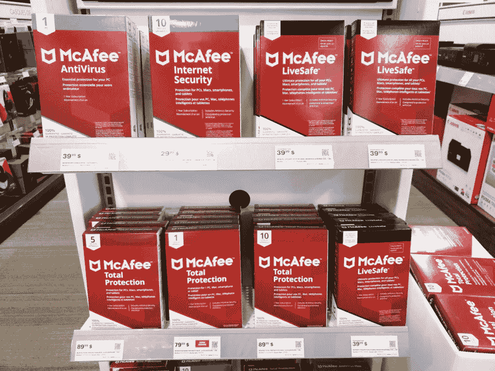

# 迈克菲股票以低于 20 美元的发行价开盘

> 原文：<https://medium.datadriveninvestor.com/mcafee-shares-open-below-ipo-price-of-20-c388be1ae045?source=collection_archive---------19----------------------->

网络安全公司迈克菲(McAfee)周四重返华尔街，开始在纳斯达克交易，股票代码为“MCFE”。在这次 IPO 交易中，迈克菲出售了 3700 万股股票，筹集了 7.4 亿美元的资金。McAfee 是一家防病毒软件提供商，为数据中心和云服务提供网络安全解决方案。

该股开盘价为 18.60 美元，低于 20 美元的发行价。随后进一步跌至 18.50 美元以下，周四收于 18.70 美元。截至收盘，迈克菲的市值约为 80 亿美元。

 [## 为私募基金带来定义速度|数据驱动的投资者

### DeFi 给合作所有制的旧观念带来了新的激情。客户获得代币，赚取费用，并投票…

www.datadriveninvestor.com](https://www.datadriveninvestor.com/2020/10/22/bringing-defi-speed-to-private-funds/) 

迈克菲成立于 1987 年，是杀毒软件开发的先驱之一，2011 年，该公司被英特尔以 77 亿美元收购，2014 年更名为英特尔安全。但在英特尔将其多数股权出售给私募股权公司德克萨斯太平洋集团(TPG)后，该名称被恢复。

截至今年 6 月，该公司的收入为 14 亿美元，而去年同期为 12 亿美元。与此同时，该公司目前负债 48 亿美元。

> 迈克菲首席执行官彼得·李维说:“我们所处的市场很大，不断增长，非常重要，我们意识到人们非常需要我们的产品。”。“我们将投资于快速增长的消费者业务和企业业务，这些领域需要更广泛的投资组合，”他补充道。

## 访问专家视图— [订阅 DDI 英特尔](https://datadriveninvestor.com/ddi-intel)