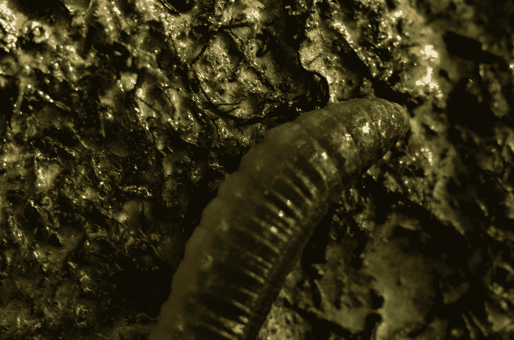

# 喂养欧洲民众的黄粉虫和昆虫

> 原文：<https://medium.datadriveninvestor.com/mealworms-and-insects-to-be-fed-to-european-populace-66f4c1c564c3?source=collection_archive---------38----------------------->

## 我们应该担心这有多恶心，还是应该庆幸我们有了一个新的投资机会？

Photo by [Viktor Talashuk](https://unsplash.com/@viktortalashuk?utm_source=medium&utm_medium=referral) on [Unsplash](https://unsplash.com?utm_source=medium&utm_medium=referral)

干燥的黄粉虫，黄粉虫甲虫的幼虫形式，已经被欧盟食品监督机构批准。

这是在[决定由一个食用昆虫的法国昆虫农民 **EAP 集团 SAS (Agronutris)** 提出的申请](https://www.msn.com/en-us/money/companies/bugs-head-for-european-menus-after-mealworms-get-green-light/ar-BB1cImuv?tblci=GiCL3fpWBGW4cJo3Jt9YSKRiwXu8QmeZ3aesKVG9S15MQyCC-00)之后。

这是欧盟官员必须批准销售含有昆虫成分的食品之前的第一个障碍。

根据*独立*，

> 欧盟每年总共浪费 8920 万吨食物(Yeung)。

英国议会上院上议院认为，这一数字将会上升，并将对经济和环境造成巨大消耗。浪费这么多食物是非常低效的。

欧洲的粮食损失仅次于北美。欧洲委员会进行的一项研究表明，这种食物损失的 3/4 是可以预防的，许多被扔掉的食物包括谷物、动物脂肪、鱼和肉，它们仍然可以被利用。

那么为什么欧盟考虑在食品中使用黄粉虫幼虫呢？

不受约束的资本主义可能是答案之一。尽管效率极低，欧洲还是想给那些将昆虫放入人们食物中的公司开绿灯。

研究人员 Arcluster 预测，到 2025 年，全球昆虫养殖业务将增长 10 倍，超过 41 亿美元。尽管这些公司保证这些产品在未来将是低碳排放物和可持续的食物来源，但问题仍然是欧盟其他食品的低效率。

很明显，欧盟其他食品的产量是充足的，但是将这些产品送到人们手中的供应链却是低效的。说粉虫是关于可持续性的是一个无效的论点，试图掩盖其实施的真正原因——利润。

昆虫的生产成本很低，而且不需要像鱼、哺乳动物或鸟类那样的条件。它们的繁殖率将意味着昆虫养殖户将在人们的食物中放入蛆虫而获得巨额利润。如果这是为了让人们减少工作或提高生产效率，但这不太可能发生。过去，生产效率和技术的提高并没有导致工人工作时间的减少或工资的提高。

如果任何人曾经看过任何反主题的电影，比如《Soylent Green》或《T2 Snowpiercer》中，这些社会的政府用昆虫和死者的遗体喂养穷人，他们就会认识到这个概念是多么的荒谬。他们宁愿在可持续发展和减少碳排放的幌子下进行令人厌恶的资本剥削，而不是解决欧洲供应链对他们人民的低效率。

> “这对整个行业来说是一个明确而重要的里程碑，”法国 Ynsect SAS 公司的联合创始人安托万·休伯特(Antoine Hubert)说，该公司饲养黄粉虫，并计划扩展到运动营养领域。“会有滚雪球效应。这将增加投资于进一步产能的潜力，并吸引更多资金来支持增长。”(德索萨，彭博)。

是的，很明显，一旦这一计划获得批准，渴望赚钱的人将会无休止地在这一领域获利。下一步是什么？把我们的死人喂给人吃还叫有效率？需要明确的是，假装这与利润无关是一场闹剧。

无论如何，如果进一步批准，这将导致一个巨大的投资机会。但是代价是什么呢？