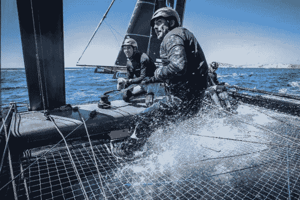

# 像赛船选手一样衡量进度

> 原文：<https://medium.datadriveninvestor.com/measure-progress-like-a-regatta-racer-837d56c3916a?source=collection_archive---------14----------------------->

设计你的未来和跟踪你的进展的最起码的事情是在每年年底做一个清单，列出你那一年做了什么。你今年过得好吗？
你完成了哪些项目？
你开始了什么而没有完成？呃，这最后一个列表通常很长。

然后你开始设计明年你想如何做得更好。

如果你真的有你的大便在一起，你设置 6 个月，季度和每月的目标。然后，在接下来的一个月里，你计划好你的星期和日子。

你做了这一切，但不幸的是，当你被生活抛给你的锚拉下时，你很快又掉下了公共汽车。

然后明年你又重新开始。

好的，这是很多人的普遍情况。

现在让我们说，你确实设法坚持你的计划和目标。周日晚上，你回顾过去的一周，评估并计划下一周。你或多或少对自己保持生活秩序和前进的方式感到满意。
如果你发现自己慢慢落后了，很可能是因为你调整得太晚了。所以我提出如下类比:

**像赛船会中的船长一样执行。**

航海是一个有趣的类比，因为其中有许多变数。让我解释一下。

在一场有多艘船参赛的帆船赛中，开始是一片混乱。这是因为船只没有排成一列，一动不动，等待着枪响。

 [## 想知道领导是谁？请他决定。数据驱动的投资者

### 一个有效的领导者能为组织提供的最有价值的东西之一是决策能力…

www.datadriveninvestor.com](https://www.datadriveninvestor.com/2019/01/25/want-to-know-who-the-leader-is-ask-him-to-decide/) 

他们转身争抢位置，互相躲避，小心翼翼地盘算着该往哪里走。确保方向、风力和速度都恰到好处，在出发时尽可能靠近起跑线。起跑时的错误位置会严重影响比赛结果。

这里有一个视频可以给你一个思路。

帆船运动是一场芭蕾舞，每个队员都在自己的准确位置上，有着明确的任务。船长是监控活动部件的负责人——有很多这样的部件，他会给出下一步需要做什么的指示。

比赛一开始，船长就不断检查船帆、船位、风向和风力。他需要了解竞争对手的确切位置以及他们的意图。随着风向的变化，他决定展开或调整哪些帆，这些决定可以增加或减少宝贵的几秒钟，甚至几分钟的比赛时间。他必须再次基于所有这些参数计算理想的航行角度和转向点。

战略和战术是紧密相连的，计划会很快调整。

因此，船长需要不断地优先考虑参数的演变。他必须授权、延迟、改变、加速。

一旦一个参数看似处于控制之下，他就可以肯定其他任何参数都会失控。

## 那么这和我们在陆地上有什么关系呢？

随着你一天的进展，新的任务、电话或会议总是会打乱你的计划。你做分类，评估优先次序，决定时间表的哪些改变是合理的，哪些是不可改变的。只是办公室里普通的一天，对吗？

对此，我想补充两点:

1.  执行的紧迫性
2.  评估频率

在一场比赛中，清晰的终点线意味着车队将在比赛过程中全力冲刺，集中注意力。你可能会说，对于一场最多持续几个小时的比赛来说，这一切都很好，但你不能整天都在工作中冲刺，对吗？

好吧，那就拿一项长距离比赛来举例，比如环球帆船赛。我们谈论的是连续几周或几个月的比赛。无论在什么情况下，队长都需要全神贯注，为未来做好准备，并在那一刻干净利落地执行。他的评估频率仍然很高。其中一些可能是自动化的，但是对船在哪里、前方是什么、哪些参数已经改变或即将改变的评估是持续的。

因此，当你在一天中前进时，你也应该不断地寻找如何 a)给你的行动注入更多的紧迫感，b)调整你的优先事项，更频繁地评估你的成就。

不要仅仅满足于在一天结束时总结一下，然后设定明天的目标。

不要简单地把要做的事情留到第二天或下一周，然后就不管了。

对于船长来说，任何决定都可能意味着精确和快速前进，或者翻船。他在不断调整和重新评估。

你如何将这种思考和执行的方式融入到你的日常活动中？

你如何设置你的环境，让你移动得更快、更清晰、更专注？

## **解决方案:**

如果你每小时追踪一次你的进展，你就能看到你已经走了多远，以及在设定的时间内你还需要完成什么。你可以每小时朝着你的目标调整你的行动，而不是仅仅在一天结束时评估你做了什么。

你会惊讶于在同样长的时间内你能取得如此多的成就。

一种方法是在你的手机上设置一个每小时一次的铃声。有很多应用程序可以做到这一点。下载一个并设置你的手机每小时整点发出嘟嘟声。当你听到哔哔声时，花十秒钟，或者更长时间，如果你想，快速评估你在哪里。

此时此刻你正在做的事情是你度过时间的最好方式吗？

为了达到你的目标，你还能或者应该做些什么？

评估、决定、调整或继续，然后继续工作。

你会发现，当你习惯了这一点，当它成为一种习惯，你的执行力会变得更强。你对坚持你的计划的紧迫感变得更加直接，你会更加活在当下。

因此，更频繁地评估，更紧急地执行。

试试看，这是一个游戏改变者。