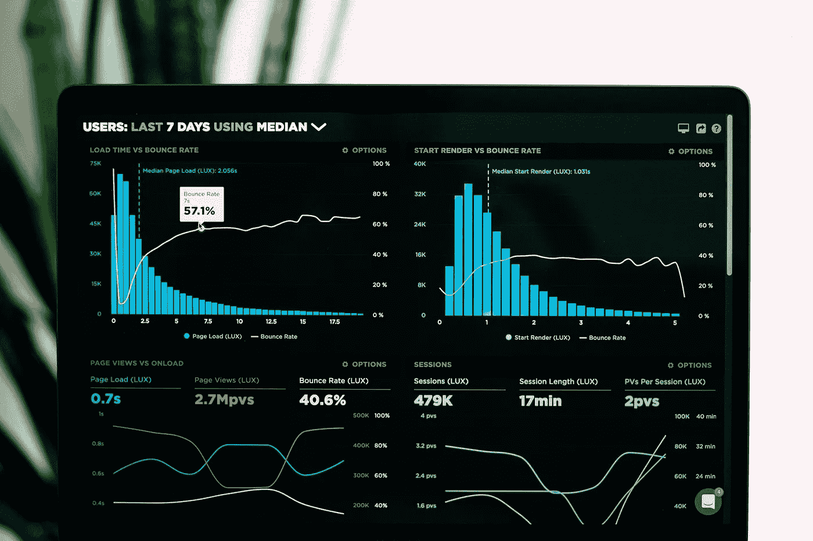

# 衡量客户生命周期成功指标

> 原文：<https://medium.datadriveninvestor.com/measuring-customer-lifecycle-success-metrics-5c8264d711ba?source=collection_archive---------1----------------------->

Photo by Sunil Thomas on [Clevertap](https://clevertap.com/blog/bringing-a-paradigm-shift-to-customer-lifecycle-management-with-rfm/)

在我的上一篇文章中，我分享了从执行客户生命周期分析中获得的六个关键经验。客户生命周期分析为公司的客户和潜在客户与其产品和服务的接触点提供关键见解。在本文中，我将进一步介绍这些关键知识，并概述五个领域的成功指标，公司应该监控这些领域，以便在客户生命周期的每个阶段做出有价值的业务决策。

# **收购指标**

Photo by [Luke Chesser](https://unsplash.com/@lukechesser?utm_source=unsplash&utm_medium=referral&utm_content=creditCopyText) on [Unsplash](https://unsplash.com/s/photos/metrics-ltv?utm_source=unsplash&utm_medium=referral&utm_content=creditCopyText)

收购对于推动任何现代公司的可扩展增长都至关重要。营销团队通常需要想出策略来系统地吸引现有和潜在客户，并将他们带到企业中来，以创造终身价值。他们需要跟踪用户交互以及在给定时间段内网站或应用程序上的独特访问者。通过特定的流量来源来衡量用户互动和访问是很重要的，这样营销团队就能够识别表现最好和表现较差的获取来源。此外，您需要从已获取的用户中识别关键事件。这些事件包括用户帐户创建、免费或付费试用注册以及客户购买等。将告诉您，当这些事件到达您的网站或应用程序时，它们中的哪些可以以更高或更低的速率激活。从最初访问网站或应用程序，到创建帐户，到免费或付费试用注册，再到客户购买，这些转化都是关键指标，有助于了解客户是否能够获得营销活动承诺的价值，并有助于确定营销团队应关注的领域，以提高投资回报，并让他们测试和检查哪些内容或产品最适合您的现有和潜在客户。

 [## 成为数据科学家所需的 8 项技能|数据驱动型投资者

### 数字吓不倒你？没有什么比一张漂亮的 excel 表更令人满意的了？你会说几种语言…

www.datadriveninvestor.com](https://www.datadriveninvestor.com/2019/02/07/8-skills-you-need-to-become-a-data-scientist/) 

# **保留指标**

企业将需要能够通过与客户的持续互动来提高保留率，保持他们的参与，并确保他们保持成功和满意的客户。保留指标衡量的是继续使用公司产品和服务的已获得客户，以及之前流失的客户，这些客户对产品和服务的价值很高，足以再次光顾。与保留相反的概念是客户流失。根据他们的业务模式，有不同的方法来衡量保留率和流失率。一种常见的方法是从滚动期窗口的角度来衡量保留率或流失率。例如，您可以通过寻找在连续 30 天期间结束时保留的客户，并与连续 30 天期间开始时获得的客户进行比较，来衡量连续 30 天保留率。另一种方法是基于在同一群组期间获得的客户群来跟踪保留率和流失率。使用相同的示例，虽然您能够基于 30 天的滚动窗口来衡量保留率和流失率，但您也可以通过查看给定客户群在周年日之后保留 30 天的比率来计算 30 天群组保留率。对于还提供订阅服务的公司，另一个重要的保留指标是衡量计划或功能升级，如选择升级计划或功能的客户的数量和百分比。

# **产品性能**

为了实现可扩展的增长，企业需要能够加强和扩展产品和服务的核心价值，以确保客户积极使用他们的产品和服务。产品使用度量提供了关于用户与产品功能的交互、花费的时间和使用产品功能的频率的有价值的信息。您还需要随着时间的推移监控产品的耐用性和健康状况，以了解产品的经济性。

# **客户满意度**

Photo by [Proxyclick Visitor Management System](https://unsplash.com/@proxyclick?utm_source=unsplash&utm_medium=referral&utm_content=creditCopyText) on [Unsplash](https://unsplash.com/s/photos/customer-lifecycle?utm_source=unsplash&utm_medium=referral&utm_content=creditCopyText)

客户满意度不同于保留率。如果您的客户对他们在端到端旅程中的体验感到满意，那么您可以期待看到客户满意度平均有所提高。然而，满意的客户最终还是会因为你无法控制的原因而流失。因此，了解客户满意度将让您发现当前的瓶颈，并改善客户体验。净推介值(NPS)是衡量客户满意度的常用指标。NPS 可以表明你的客户向其他人推荐产品和服务的可能性。虽然有些公司可能没有完全采用 NPS，但您可能希望检查产品审查和客户支持指标，它们也能够提供客户满意度的有力指标。例如，客户服务呼叫的数量以及响应和解决支持问题的平均时间是很好的指标，可以反映出您的客户支持团队对客户请求的响应速度以及他们解决客户问题的速度。

# 经济学单位

Photo by [Austin Distel](https://unsplash.com/@austindistel?utm_source=unsplash&utm_medium=referral&utm_content=creditCopyText) on [Unsplash](https://unsplash.com/s/photos/churn?utm_source=unsplash&utm_medium=referral&utm_content=creditCopyText)

经济学单元是发现公司商业模式可行性的关键，也是公司能否将 LTV 货币化的关键。衡量经济单位的指标包括客户终身价值(LTV)和客户获取成本(CAC)。从会计角度来看，每用户平均收入(ARPU)或每月经常性收入(MRR)等指标也可以表明企业的整体增长和盈利能力。LTV 展示了该公司在保持现有客户回头客和重复购买方面做得有多好。CAC 记录了获得一个客户所花费的营销费用。当 CAC 超过 LTV 时，通常表明获得客户的成本远远高于公司从现有客户身上获得的价值。它提供了一个强烈的信号，表明商业模式是不平衡的，有时，甚至可以表明企业的失败。跟踪指标，如 LTV 与 CAC 的比率以及恢复 CAC 的时间，对于企业的生存至关重要，并将揭示哪些营销活动、计划和活动可以让您的客户再次光临。

# 结论

如今，越来越多的公司从客户生命周期的角度思考问题，并利用分析来做出数据驱动的决策。采用客户生命周期分析框架来识别、跟踪和监控成功指标已经变得越来越重要，这将有助于了解您的客户和您的业务绩效。它也将是你的公司。发现需要改进的地方，并能够对优化客户体验的计划进行优先排序。

**阅读更多:**

*   [从客户生命周期分析中获得的六大经验](https://towardsdatascience.com/six-key-learnings-from-customer-lifecycle-analytics-3d2fa335f3d6)
*   [了解和预测客户终身价值(CLTV)](https://towardsdatascience.com/understanding-and-forecasting-customer-lifetime-value-cltv-634fe34f522b)
*   [预测性销售线索评分](https://towardsdatascience.com/predictive-lead-scoring-cefd8240778c)