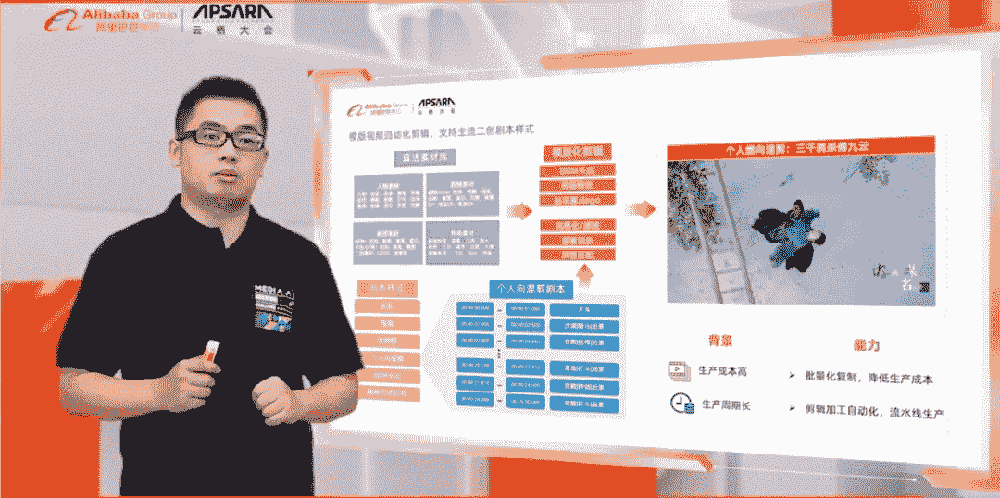
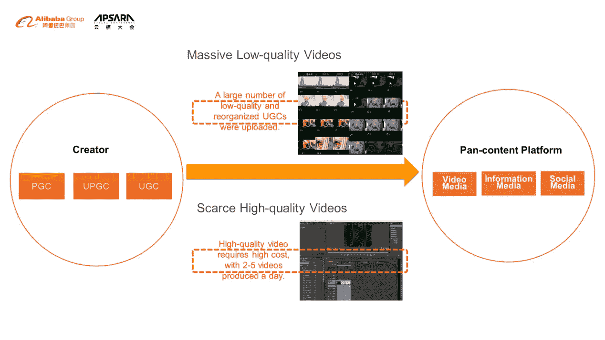
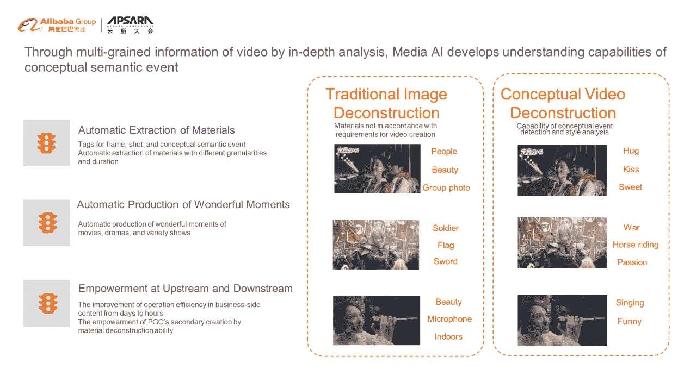
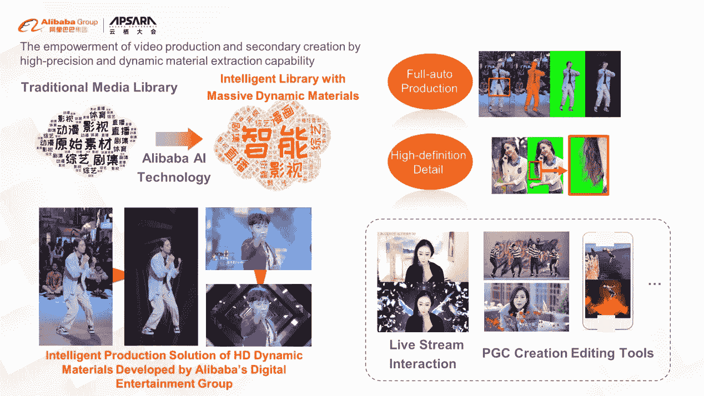
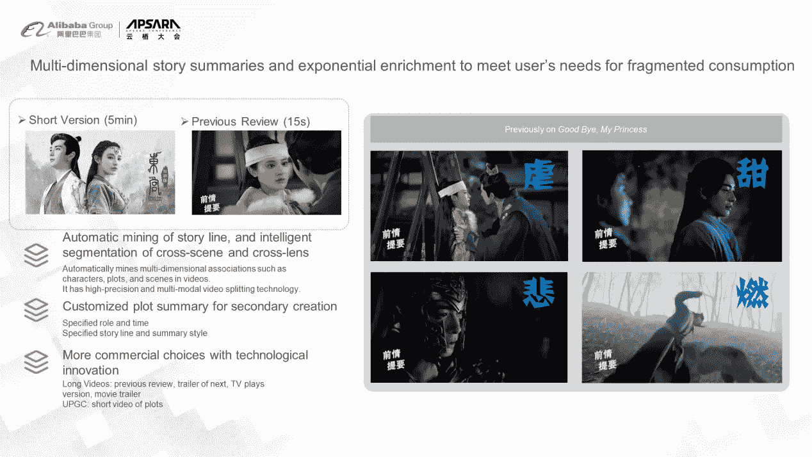

# 媒体人工智能:智能视频制作的实践

> 原文：<https://medium.datadriveninvestor.com/media-ai-practice-of-intelligent-video-producing-50f658b7d6af?source=collection_archive---------28----------------------->

*在* [*赶 2020 Apsara 大会重播此链接*](https://www.alibabacloud.com/apsara-conference-2020/live-streaming) *！*

*由外国人*

在 Apsara Conference 2020 的智能娱乐产业实践分论坛上，阿里巴巴数字娱乐事业群高级算法专家胡瑶做了演讲。基于视频的内容生产困境，他分享了媒体 AI 平台的技术能力和应用实践。它将通过自动化、大规模和实时视频制作功能，帮助提高业务和消费设备上内容创作的效率。通过这样做，媒体人工智能平台可以帮助实现娱乐行业的结构升级。

**以下内容是他演讲的总结。**

人们的生活节奏逐年加快。随着这种情况的发生，客户碎片化消费的时间在增加。随着移动设备的普及和网络带宽的加速，短视频行业诞生了。最新数据显示，每天消费的短视频超过 7.73 亿条，市场规模已经超过 2000 亿元。

短视频行业正在蓬勃发展，但仍然存在大量低质量视频的问题。每天有数百万个视频在各种平台上被创作和发布。然而，这些视频具有极化特征。这意味着由专业创作者创作的高质量专业生成内容(PGC)是稀缺的，因为这些视频需要专业的提炼和大量的准备。导致短视频大多内容重复，质量不高。

综合来看，制作好的视频内容很难，因为两个方面:创作和工具。阿里巴巴娱乐集团今年推出了媒体人工智能平台，为视频制作人提供内容平台方面的帮助。

媒体 AI 平台通过 AI 技术实现了动态素材的提取、视频模板的制作、智能剪辑技术、智能素材处理、交互效果等。

这些功能与传统视频编辑的区别在于，它们针对的是视频制作。例如，在传统的人工智能处理方法中，很少有技术或产品考虑子场景和子镜头的整体分割和跟踪。还有，很少有产品考虑如何基于同一个镜头制作出不同的具有美感的视频。但是，通过了解娱乐行业的业务特点，阿里巴巴的娱乐集团专注于视频制作和剪辑。在镜头结构、动态素材提取、快看短视频的制作、模板类短视频的制作和特效等方面给予了很多关注。这些能够提高智能商业设备的操作效率，编辑高质量的内容，并自动制作大量的预告片。它们还可以帮助生产和提取动态材料，并建立大规模的动态材料库。此外，阿里巴巴的娱乐集团可以为分发平台实现自动化和定制化的捕捉。通过提取视频的模板，可以在全网范围内找到高质量的短视频，制作出风格相似的短视频。阿里巴巴的娱乐集团拥有大量的 IP 内容，从中可以衍生出大量的二次元消费内容和新内容。而且，对于二次编辑能力，用户也可以获得视频编辑能力，帮助他们以更低的成本制作更好的短视频。

# 动态材料提取

基于视频结构，媒体人工智能平台可以深入分析视频的多粒度信息，并在概念层面上开发语义事件的理解能力。传统的视频和图像结构往往针对更具体的信息，如人或物。例如，静态关键词，如女孩和合影，可以基于传统的图像结构提取，但这并不满足视频创作的材料要求。在视频创作和分发中，创作者需要更多概念性的关键词，比如拥抱、亲吻、搞笑、甜蜜、战争。这样的动态素材的视频结构，更符合当前 5G 趋势下的内容呈现。因此，阿里巴巴的娱乐集团实现了创意素材的自动提取。它可以自动提取框架级、镜头级和概念级的不同强度的语义材料。同时，材料也可用于质量亮点的自动生产。比如创作者想找一个偶像的短视频片段，平台可以快速生成一系列素材，供创作者进行下一步制作。

# 智能材料处理

基于媒体人工智能平台的智能技术，阿里巴巴的娱乐集团为娱乐行业建立了一个拥有海量高清动态素材的图书馆。比如利用街舞 IP，可以提取每个舞者的姿势、动作、跨场景素材。它理解自动化和无人化生产以及“头发级别”的高清细节。这些技术完全可以应用到 PGC 的内容制作中，为流媒体直播互动提供更多的互动工具。这些技术还可以为客户提供强大的编辑工具。

*超高清动态素材智能制作图*

阿里巴巴的娱乐事业群在内容结构的基础上，把 AI 和美学结合了起来。例如，设计需要一套材料。基于 AI 和美学以及不同大小的纵横素材，结合玩家可以实现无缝切换。这样做可以提升用户体验，降低运营成本，加速产品迭代。这项技术现在已经有了。

 [## 机器学习和人工智能如何改变电子商务的面貌？|数据驱动…

### 电子商务开发公司，现在，整合先进的客户体验到一个新的水平…

www.datadriveninvestor.com](https://www.datadriveninvestor.com/2020/11/19/how-machine-learning-and-artificial-intelligence-changing-the-face-of-ecommerce/) 

# 智能编辑技术

更细粒度、指数级集中的故事摘要可以更好地满足用户碎片化的消费需求。用户在观看长视频的同时，还会继续观看长视频衍生的 IP 内容。每个人对 IP 内容的偏好是不一样的。比如，有的女性观众更喜欢看“甜”“搞笑”的故事，有的则更喜欢“严肃”“悲伤”的情节。因此，这项技术可以向不同的用户展示不同的快看剪辑。这样用户就可以用自己有限的碎片化时间观看到更有深度的内容。

阿里巴巴的娱乐集团有快看剪辑编辑，时长从 15 秒到 5 分钟不等。此外，还可以根据用户的特点自动定制不同类型的剪辑。通过跨场景、跨镜头的智能自动分割能力，可以实现事件的完整提取。此外，基于对内容结构的分析能力，故事与用户情感的自动完美结合满足了用户多样化的观看需求。同时具备自动制作不同时长短视频的能力，制作成本非常低，为填补用户对 IP 的碎片化消费带来了新的广告机会。以*再见，我的公主*为例。在一集里，制作团队可以创建很多不同类型的故事概要，满足用户不同的观看体验需求，实现更好的视频消费。

# 模板视频制作

用户在看短视频时，倾向于看一些电影或电视剧的解说词。人们会在解说词中融入带有个人风格的创意，但制作成本相对较高。因此，阿里巴巴的娱乐集团开发了一个创新的新功能。当制片人输入场景或文本的描述时，媒体人工智能平台可以自动生成基于视频、文本和音频的剪辑。通过结合海量的优质 IP 内容，可以规模化、实时化完成海量内容的自动化生产。因此，自动生成的内容与普通制作者创建的内容没有质量差异。此外，当制作人任意输入一段文字，无论是制作人创作的，还是粉丝为偶像编辑的，平台都会自动处理原视频中的文字。然后，平台配音字幕，阐述制作方的观看体验，比传统的弹幕评论更立体直观。

网上有大量用户上传的有趣视频，都有模型和模板。阿里巴巴依托自身深厚的 AI 技术积累，智能提取娱乐和创作的模板。媒体 AI 平台通过智能语义分析，提取出基于一段视频的拍摄模板。然后，它制作更多风格相似的内容并呈现给用户，这样用户可以在短时间内观看几个风格各异、内容丰富的视频。该平台还可以将视频分解为场景或帧级别的拍摄元素。此外，它可以基于这些元素创建基于模板的拍摄脚本，并制作具有类似风格的视频。

基于之前的技术积累，阿里巴巴娱乐事业群实现了算法素材丰富的库，包括剧情素材、场景素材、人物素材、通用素材。实现了模板编辑，可以为客户提取流行的拍摄模板。比如长短镜头交织的技巧，比如“某个偶像特别甜”“某个偶像特别有活力”，都可以在模板里找到。该技术克服了生产成本高、生产周期长的缺点，大大减少了人力，可以批量复制进行流水线生产。通过积累技术和产品，阿里巴巴的娱乐集团可以提供物质生产能力，如人工智能辅助创作和设计。与此同时，阿里巴巴的娱乐集团协助业务端运营提高效率，并服务于客户的创作，帮助实现娱乐产业的结构升级。

# 未来前景

未来，阿里巴巴的娱乐集团希望在技术方面更高效地推动分发，为行业创造更好的产品和工具。而且在客户端，阿里巴巴的娱乐集团将为用户提供更多消费模式和视频互动的新体验。在产业端，阿里大文娱集团希望与更多的商业端 PGC 或多渠道网(MCN)合作，用积累的经验和工具帮助创作。同时，阿里影业集团希望从 PGC 和 MCN 获得创作经验，实现双赢。

# 原始来源:

 [## 媒体人工智能:智能视频制作的实践

### 阿里巴巴 Clouder 年 10 月 27 日 642 点击此链接观看 2020 年 Apsara 大会重播！在智能…

www.alibabacloud.com](https://www.alibabacloud.com/blog/media-ai-practice-of-intelligent-video-producing_596797) 

**进入专家视角—** [**订阅 DDI 英特尔**](https://datadriveninvestor.com/ddi-intel)