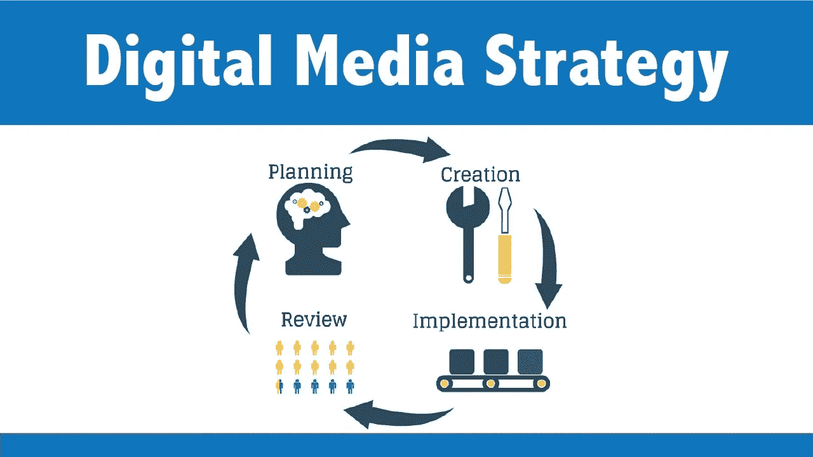

# 媒体策略是你成功的关键

> 原文：<https://medium.datadriveninvestor.com/media-strategy-is-the-key-to-your-success-e48b5c504836?source=collection_archive---------10----------------------->

媒体战略是一个中期传播计划，考虑到你的品牌的营销任务。媒体战略的主要目标是对品牌产品的传播渠道和营销推广做出基本选择，并评估其实施的估计成本。媒体策略也是三个主要问题的答案:为了实现你的目标，何时、何地以及如何推广。媒体战略首先是一个推广计划，考虑到已确定的营销挑战。媒体策略的发展追求以下目标:选择最有效的传播渠道和评估品牌推广的估计成本。媒体策略是形成成功品牌故事的最重要因素之一。一个精心设计的方案是广告活动成功的保证。创建媒体战略是一个复杂的过程，由几个经过深思熟虑的步骤组成。

**1。** **定义目标受众。**

对这一阶段的处理不够彻底，可能会导致整个广告活动的失败。应该非常准确地确定目标受众。这取决于行动策略的有效性。并且将目标受众进一步区分为目标群体将有助于更精确地指导广告活动。

**2。** **分析。**

在这一阶段，分析竞争对手的策略、市场条件和消费者行为。然而，应该理解的是，并不总是能够获得这样的信息。有时很难猜测竞争对手或消费者的行为。结果，形成了不完整或不完全相关的图像。但是这方面的研究可以让你根据市场中主要参与者的行为来调整媒体策略。

**3。** **广告活动的地点，或传播渠道的选择。**

广告传播渠道的选择应考虑以下因素:

特定渠道的优势和劣势；

解决任务的沟通渠道的可能性；

促销产品或服务的特点和细节；

预算规模

从各种渠道中选择最接近你目标的渠道并不容易。为此，并不总是有所有必要的数据。

**4。** **实施媒体战略的预算管理。**

媒体战略的形成应该严格按照分配给推广的资金来建立。在这种情况下，有必要从可能的方法中选择那些能够最有效地向消费者传达信息的方法。

媒体策略应该是品牌整体传播策略的一部分。主要目标是在分配给广告的预算范围内最大限度地扩大受众覆盖面。广告发布渠道的选择应基于五个因素:

特定渠道的利弊；

按年龄、性别、社会地位、居住地划分的消费者受众；

竞争对手的广告策略；

促销产品的优势和劣势；

分配给广告公司的预算

但是，即使研究了所有这些细微差别，许多重要的问题仍然存在:

1.重点关注哪些广告渠道？

2.各大城市或地区的广告是否值得关注？

3.什么时候开始做广告才能达到预期的覆盖面，同时又能节省预算？

经常发生的情况是，一家新公司进入市场，从一开始就给消费者“加载”大量的广告信息，随着时间的推移，逐渐减少“媒体权重”的数量。这是一个有效的系统，但它并不适用于所有产品。开展广告活动可以有很多种选择，从经典的开始，到有创意的个人方式结束。为此，您需要处理上面列出的所有细微差别。

只有 3-5%的媒体行为会影响可能的利润。我们称这样的行为为“赚钱”。吸引“赚钱”行为并为此管理所有工具的能力是关键的营销首选价值之一。营销计划是一个操作性文件，概述了一个组织将实施的广告战略，以产生线索，并达到其目标市场。任何策略都会回答三个主要问题:

**1。** **该怎么办？**

为了开始获得追随者、订户、用户、投资和利润，需要做哪些行动或改变？比如，拉开与竞争对手的距离，打造 pivot、ICO、IEO 或 STO，启动广告、公关活动等等。

**2。** **我该怎么办？**

使用什么工具、仪器和方法。例如，定向广告、上下文、促销、特别优惠等等。

**3。** **以什么方式实现？**

如何正确构建动作序列？例如，首先—研究市场，然后—竞争对手，然后—竞争对手的产品等等。只有清晰深刻的了解如何从竞争对手中脱颖而出，如何反对目标受众，如何发现并转化它，你才会增长你的利润，而不是你的营销预算。战略文件包括两个主要部分:分析和产品营销包。分析包括:

市场分析

竞争对手分析

目标群体分析，即项目受众关键因素细分。

产品营销套件描述了:

定位——关于我们与竞争对手有何不同、我们解决了哪些客户问题以及我们如何谈论这些问题的信息

营销说明。这应该是一个关于如何开展广告活动的详细计划，告诉我们正在处理的活动信息，以便任何团队成员都可以实施

使用多渠道的营销策略总是有很好的效果。由于消费者的注意力分为不同的沟通渠道，如果营销人员希望优化其接触受众并与其互动的机会，使用不同的沟通渠道和方式是有意义的。

在营销计划中，我们必须规定计划执行者的结构:

谁将参与战略的实施

谁对什么负责

谁有什么 KPI？

一个公司的营销目标应该与其存在的核心商业使命和长期目标相一致。然后，我们检查假设，调整媒体计划和促销工具，并完成 USP(独特的销售主张)。然后，我们正在扩大我们的目标。向 [**Crynet**](https://crynet.io) 团队了解更多信息:

如何制定促销策略。

营销策略在项目周期的哪个阶段有用

如何有效地分析市场和竞争对手

目标受众画像的例子

媒体策略也是成功开发你的加密或区块链项目的一个基本要素。为什么密码行业需要媒体战略？

1.**独立见解**。如果用户不在项目网站上阅读，而是在第三方面对媒体、记者、社交网络和博客作者谈论时，他们会更容易接受关于您产品的信息。

2.**沟通工具。从第一次见面开始，机构投资者需要几个月的时间来决定投资你的项目。为了保持关于你自己的对话和提醒，一个很好的选择是给大型投资者写信，提及你在专业出版物上的采访，或者放置一篇关于你的项目的文章的链接。记住普通投资者也会看这类刊物，收集项目信息。**

3.**礼仪规则。在你有前途的创业网站的主页上最好有媒体或关于我们的部分。它包含的商业和区块链媒体标志越多，你的位置就越有利。媒体上的出版物和新闻稿越多，指数化就越好**

4.**利用别人的知名度。**有时，一家初创公司会让一个有名字的人担任首席执行官或顾问。这样的人处于领导地位是媒体策略的一个要素，必须 100%地加以利用。

crypto 或区块链项目的媒体策略与任何其他业务或创业项目一样。策略算法是:

公关或传播战略的发展

针对媒体制定信息活动和内容计划

通过社交网络、意见领袖、使用传统营销工具(横幅广告、重新定位等)发展品牌认知度

通过会议、论坛、路演进行交流

在这种情况下，如果利用所有影响公众意见的渠道，算法将是一致的:

加密、商业和专业(关于您的项目)媒体

企业博客(媒体、网站、Steemit、Golos 等。)

企业社交媒体(SMM)

电子邮件简讯

Bitcointalk、Reddit 等等

专业会议和区块链会议

YouTube、Twitter 等上的意见领袖。

以及其他工具和渠道

实施媒体战略的预算可能不同。这里的一切都是个性化的，预算的大小取决于:

项目及其必须解决的任务的复杂性

重新定位和重新营销目标(受众和国家)

项目开发的总预算(包括技术实施、法律支持和管理的费用)

最重要的是有效和胜任地分配预算资金。原则适用:在正确的时间，在正确的地点。媒体战略和 KPI 工具应用于:

增长品牌认知度；

对项目的信心；

瞄准项目产品的 USP(独特销售主张)的关键点

上面提到的其他媒体战略目标

数字机构团队 [**Crynet 营销解决方案**](https://crynet.io) 将帮助您了解创建有效媒体策略的所有技巧。

我们的联系人:

[www.crynet.io](http://www.crynet.io)

[https://www.linkedin.com/company/crynetio](https://www.linkedin.com/company/crynetio)

@id013(电报)

[ads@crynet.io](mailto:ads@crynet.io)