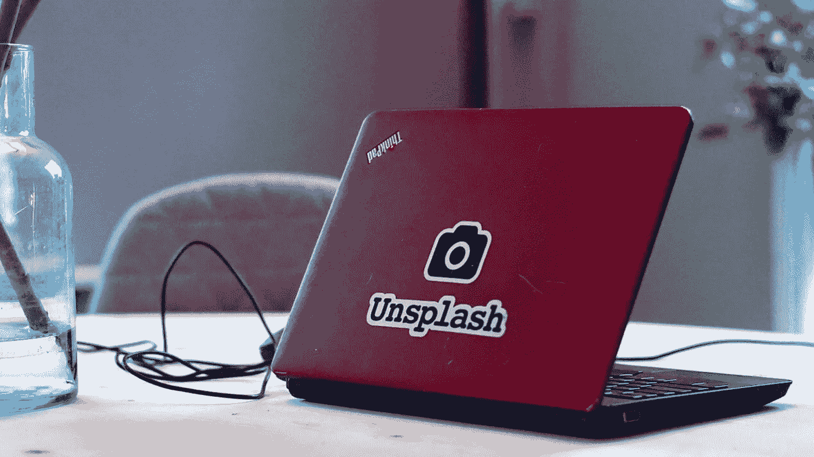

# 中型与谷歌:为什么我花时间在中型上

> 原文：<https://medium.datadriveninvestor.com/medium-vs-google-why-i-spend-my-time-on-medium-f5734affb321?source=collection_archive---------16----------------------->

看似无穷无尽的多样选择，中号是我的最爱。

事实上，媒体对我来说不仅仅是一种娱乐选择，它已经成为我日常生活的一部分。阅读他人创作的文章几乎和提交自己的文章一样令人满意。创造性思维、写作和媒体编辑的质量为我自己的演讲设置了很高的标准。我觉得我的写作因为它而提高了。

我从今年五月开始投稿。我最近才发现*追随*和*被追随所带来的互动的好处；回复*到文章*和*让其他*回复。一个意外的祝福，可能会增加我的技能。*

 [## 擅长谷歌是一种技能|数据驱动的投资者

### 擅长‘谷歌’是一种技能。是的，你听到了。知道什么和如何谷歌或搜索的东西是一个…

www.datadriveninvestor.com](https://www.datadriveninvestor.com/2020/08/11/being-good-at-google-is-a-skill/) 

通过媒体，我意识到了书面交流领域的竞争有多激烈，有多少优秀的作家在争夺同样的一双眼睛。小的风格差异没错，但似乎让中型划线员与众不同的是创造力。

谷歌是事实的工具；媒介是一种在创造性的体验中汇集事实的工具。

媒体非常欢迎所有文字爱好者——读者和作家。我很早就意识到有很多平台可以让作者展示他们的才华。我看到许多会员有很多渠道可以获得收入。靠涂鸦养活自己和家人并不容易。

我希望把我的媒介故事汇编成一本关于我在房地产行业的职业生涯的书。起初，我怀疑自己是否有足够有趣的经历来做这件事。然后我突然意识到我已经在房地产行业工作了 40 年。如果我一年只有两个可报告的发现，我会有足够多的时间写一本书。非常可行！

我现在已经 80 岁了，还在写作。当我完成一个故事时，我会继续获得一种巨大的成就感。

是的，谷歌很棒；所以你管，所有的社交媒体和大多数其他娱乐，我们人类必须保持我们的平衡，不断受到负面影响，2020 年版本。

中等，我这一年花的最好的 50 美元；全食超市 4 磅 Beyond Berger 的价格

**访问专家视图—** [**订阅 DDI 英特尔**](https://datadriveninvestor.com/ddi-intel)