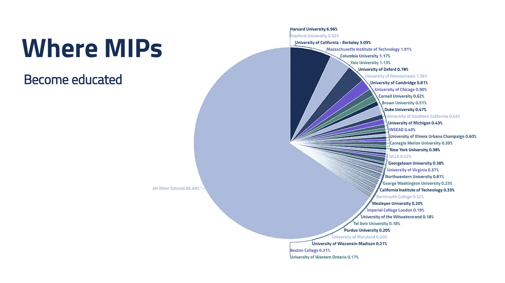
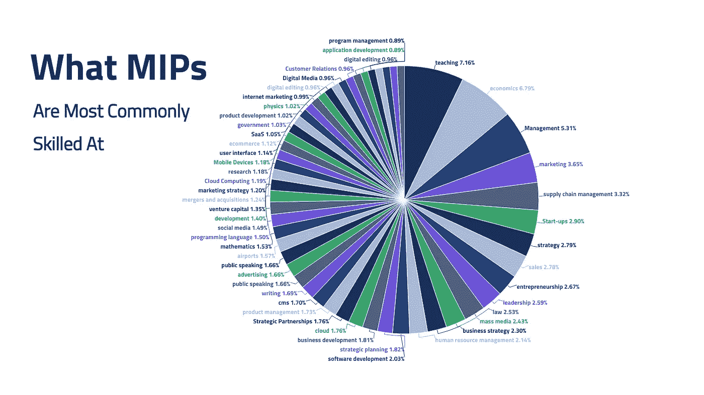
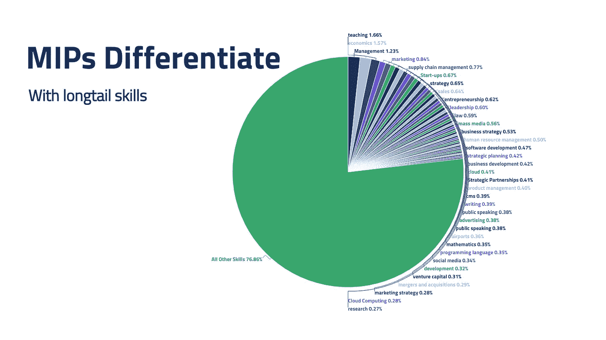
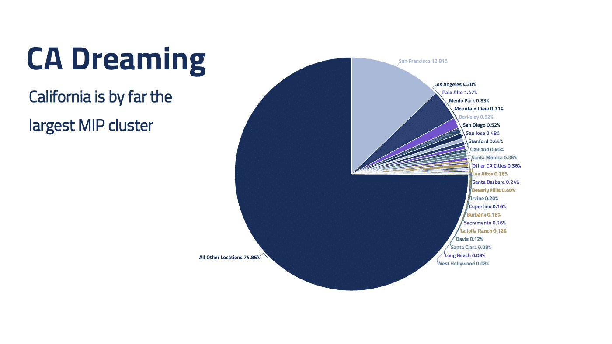
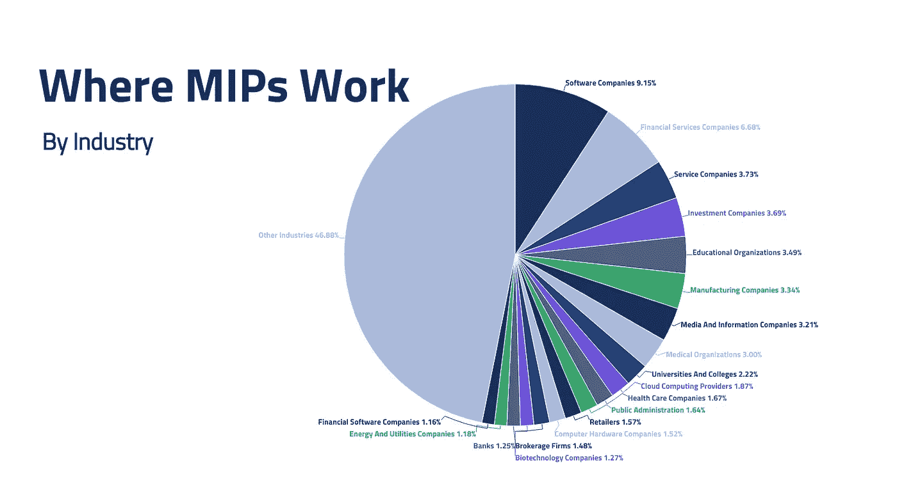

# 认识世界上最重要的 10 万人(根据一个人工智能)

> 原文：<https://medium.datadriveninvestor.com/meet-the-10k-most-important-people-in-the-world-according-to-an-ai-8a1e221779e6?source=collection_archive---------8----------------------->

## 是什么让人类对网络爬虫如此重要？

是什么让人类变得重要？他们的人性，当然。但是什么让你真正重要呢？一个平衡的陪审团会从你的生活中发现什么？

也许作为父母你很努力。或者是产品制造的一部分。也许你在公共场合震撼了世界，或者只是和一些人度过了特别快乐的时光。

艾米莉·狄金森几乎没有离开过她的房子。在她生命的最后二十年里拒绝访客。但最终在文学史上留下了不可磨灭的印记。

撇开生命固有的重要性不谈，在所有这些场景中，我们所看重的东西都有一个潜在的潜在结构。它可以被人工智能读取。

语义三元组遵循*主谓宾*的结构。

“史蒂夫毕业于哈佛”

"山姆 37 岁"

"玛丽莎·梅耶尔是雅虎的首席执行官！"

“我妈妈是一个熟练的长笛手”

这些都是语义三元组。当大规模进行时，从中得出推论的行为是关联数据的名副其实的金矿。

这个结构提供了[知识图](https://en.wikipedia.org/wiki/Knowledge_graph)的底层组织。为了简单起见，您可以将知识图想象成一个关系数据库。但是基本上它们由节点(实体)和边(实体之间的关系)组成。

历史上大多数数据库的结构都是保留每个条目的结构(把一行想象成一个电子表格)，而知识图是围绕实体之间的关系构建的。这种关系优先的结构一直被视为语义网的基石。今天，我们刚刚看到这些成果通过 Siri、更丰富的搜索结果、数据丰富工具等工具得到了广泛应用。

可能有两个特别值得注意的公共知识图。谷歌的[知识图谱](https://en.wikipedia.org/wiki/Google_Knowledge_Graph)可能是最广为人知和最常用的。Diffbot 的[知识图](https://www.diffbot.com/products/knowledge-graph/)是来源于公共网络的最大、最准确的知识图。

使用 Google KG 数据中的所有关系没有公共端点。因此，为了这次探索的目的，我们使用了来自 diff bot KG 的数据。

**那么这和重要性有什么关系呢？**

如前所述，我们倾向于根据个人接触了多少生命或实体来认为个人更重要或更不重要。反过来，这些生命和实体有多重要。无论是通过代理(做一个产品，或者一首诗)，还是亲自(当老板，或者朋友，或者参加什么活动)。

知识图表的关系优先性质在表现我们实际看待世界的方式方面做得很好。Diffbot 知识图中的一个因素是每个实体的“重要性”分数。这基本上是用来确定如果你询问苹果公司，你更可能指的是谁。你是指苹果公司还是水果？

苹果公司(Apple Inc .)拥有数百万个联系(知识图谱中的“边”)。新闻提到，许多员工，投资者，产品，评论。当然苹果很受欢迎。但是在以组织和人为中心的知识图表的背景下，你可能会在苹果公司之后。

请记住，知识图来源于公共网站。本质上，人工智能是为了阅读网页和推断事实而建立的。肯定有很多关于苹果种植的书。但这并不是网络的一大部分。

那么，我们能从 10k 最重要人物(“MIPs”)身上学到什么呢？怎样才能拥有比世界上几乎任何人都多的人脉？

# 世界上最重要的人

如上所述，知识图中的“重要性”是与一系列实体具有或多或少联系的函数。我们正在谈论一个来源于公共网络数据的知识图表。所以这肯定是一个长期在网上被公开提及的人。

那么，怎样才能成为世界上最重要的人呢？

怎么样:

*   拥有 7 支专业运动队
*   拥有一个专业的运动场
*   创建一家十亿美元的投资公司
*   经营自己的慈善基金会
*   制作一部艾美奖获奖纪录片
*   担任 3 家财富 1000 强公司的董事会成员
*   经营电影制片厂
*   写一本畅销书
*   从 90 年代一直上升到 21 世纪初，成为美国在线的总裁

**泰德·莱昂西斯**是世界上最重要的人物(至少在世界上最大的知识图谱中)。

虽然你可能想知道这怎么不是英国女王，或者前任或现任总统，但请考虑一下人工智能构建信息的方式。

知识图是通过爬取网页、定位实体(如人)并推断关于它们的事实来构建的。

因此，形成额外联系的两个先决条件包括定期的在线报道，展示一个人与其他实体的关系，以及一系列与一个人有联系的重要实体。对于里昂西斯来说，这个故事始于乔治敦，一所备受推崇的学校。然后，它从 AOL 一路晋升到管理公司(在其全盛时期)。它继续作为多个主要运动队的数十年所有者(所有者经常在新闻中公开引用)。并继续进行一系列大型投资，在三大公司的董事会任职，创建基金会，出版书籍，赢得纪录片奖项，以及其他活动。

虽然他可能不是许多人会挑选出来作为世界上最重要的人，但可以理解一个读取整个网络的机器人会这么想。

既然我们已经涵盖了知识图表中联系最紧密的个人。让我们来看看前 10 名最重要的人物(“MIPs”)中的其他人。

# 教育

正如人们可能预期的那样，某些学校会受到巨大的影响。

看看这个群体中最常参加的学校，以下学校可能在每 200 个 MIPs 中出现不止一次。

特别是:

*   哈佛大学—14 个百万分之一
*   斯坦福大学—每 28 个 MIPs 中有一个
*   加州大学伯克利分校—32 个百万分之一
*   麻省理工学院—1/52 MIPs
*   宾夕法尼亚大学——64 个百万分之一
*   哥伦比亚大学—85 个百万分之一
*   耶鲁大学——88 个百万分之一
*   芝加哥大学—百万分之一
*   剑桥大学—1/124 MIPs
*   西北大学——1/124 MIPs
*   牛津大学——1/127 MIPs
*   康奈尔大学——1/162 MIPs
*   伊利诺伊大学—1/165 MIPs
*   加州大学洛杉矶分校—百万分之一
*   布朗大学——196 百万分之一

我们的 10，000 名 MIP 就读于总共略多于 3，000 所学校。其中 65 所学校每所都有 30 多名移民。以及由数百名 MIP 参加的前几名。

然而，65%的 MIP 没有进入这 65 所顶级学校。一小部分人没有接受高等教育。

一群大学预科学校也浮出了水面。对于个人来说，他们的大学预科培训在网上列出。

大约每 200 名 MIP 中就有 1 名上过伊顿公学(英国预科学校)。

**大约每 375 名 MIP 中就有一名就读于布朗克斯科学高中。**

**大约每 1000 名 MIP 中就有 1 人就读于以下高中:**

*   菲利普斯学院
*   霍瑞斯·曼学校
*   伯克利高中
*   菲利普斯·埃克塞特学院
*   盖瑟斯堡高中

**大约 3000 名 MIP 中有 1 名**参加了以下活动:

*   斯图文森高中
*   格里利中心高中
*   陶森高中
*   霍勒斯·格里利高中
*   圣伊格内修斯高中
*   贝弗利山高中

在国际上，集群没有那么极端。但是最常见的非美国大学包括:

*   剑桥大学
*   牛津大学
*   INSEAD
*   伦敦经济学院
*   伦敦帝国学院
*   耶路撒冷希伯来大学
*   威特沃特斯兰德大学
*   特拉维夫大学
*   西安大略大学
*   不列颠哥伦比亚大学
*   印度理工学院
*   伦敦商学院
*   滑铁卢大学
*   新加坡国立大学
*   巴黎高等商学院
*   伦敦大学
*   麦吉尔大学
*   曼彻斯特大学
*   开普敦大学
*   台湾大学
*   伦敦大学学院
*   伦敦国王学院

# 技能

最终，教育只会让你走得更远。在我们高度专业化的经济中，有很多方法可以获得成功。以及很多值得解决的问题。让我们来看看我们的 MIPs 拥有的最常见的技能。

总的来说，我们的 10k MIPs 已经列出或证明了大约 6000 种独特的技能组合，这表明有相当大的重叠。

如果你不得不猜测这些人中最普遍的一项技能，你可能不会猜出来。即使是选择题也不行。

我们的 10，000 MIPs 最常见的技能是教学。

在每一项归功于 MIPs 的技能中，每 55 项中就有一项是教学技能。这可能不太符合你对我们创造帝国的干部的期望。但在一个更大的与人相关的技能群中，它开始变得更有意义:教学、管理、领导力、人力资源管理。

除此之外，大部分被调查的人都拥有高等学位，并且一度是大学助教，也许这个数字并不令人惊讶。

按照降序排列，我们的 MIPs 最常见的 50 项技能包括:

*   教学
*   经济学
*   管理
*   营销
*   供应链管理
*   初创企业
*   战略
*   销售
*   企业家精神
*   领导力
*   法律
*   大众传媒
*   人力资源管理
*   软件开发
*   业务发展
*   云技术
*   战略伙伴关系
*   产品管理
*   内容管理系统
*   写作
*   公开演讲
*   广告
*   数学
*   社会化媒体
*   风险资本
*   兼并和收购
*   研究
*   移动技术
*   用户界面
*   电子商务

在整个技能列表中，出现了三组技能:与金融相关的技能、与工程相关的技能以及营销或面向公众的技能。

与金融相关的顶级技能包括:

*   经济学
*   风险资本
*   兼并和收购
*   投资
*   和筹款

与工程相关的顶级技能包括:

*   云技术
*   移动技术
*   企业软件
*   网络技术
*   和机器人技术

面对公众的顶级技巧:

*   营销
*   销售
*   大众传媒
*   公开演讲
*   和在线广告

**大部分的 MIP 也是专业的。**虽然许多 MIP 共享一组技能(如上图所示)，但大多数技能是一次性的，没有或很少其他 MIP 共享。

虽然有太多的专业可以列出，但为了举例说明所代表的行业和能力领域的范围，下面提供了一个随机样本。

*   工会谈判
*   电子竞技
*   植物化学物质
*   群体感应
*   香精油
*   联邦预算管理
*   打印解决方案

# 位置

虽然我们刚刚见证了远程工作的一年，但位置仍然很重要。特别是在网络密集、政府、研究和资本密集型行业，如制造业，MIP 倾向于集群。

事实上，尽管这些人中的许多人无疑至少在 2020 年的部分时间里一直在远程工作，但**只有 1/100 的人将远程工作**列为当前或过去的工作地点。

我们的 10k MIPs 被列为一生中在总共 1，800 个地方工作。考虑到世界上有超过 4000 个中等城市，这表明了一个明确的集群。我们 10k MIPs 中每个 MIP 的最新位置列表将这一数字降低到约 600 个城市，其中只有 36 个城市拥有超过 1/250 的 MIP。

**在美国前 100 个 MIP 托管位置中，三分之一位于加利福尼亚州，六分之一位于纽约，十五分之一位于华盛顿。没有其他位置与之接近。**

除了大型金融、政府研究和技术中心，值得注意的小型集群包括遍布美国和欧洲的著名大学城。

此外，在 MIPs 中有明确的“踏脚石”位置。这些是与 MIPs 相关的过去的位置。这一系列位置吸引了一系列大学城，其中领先的几个包括:

*   马萨诸塞州剑桥
*   加利福尼亚州斯坦福
*   加州伯克利
*   新泽西州普林斯顿
*   英国牛津
*   康涅狄格州纽黑文
*   科罗拉多州博尔德市
*   密歇根州安阿伯
*   伊利诺伊州埃文斯顿

# 职位名称

最大规模的影响来自于他们的工作。虽然 MIP 的工作范围很广，但也出现了明确的集群。

*   超过八分之一的 MIPs 从事计算或信息科学工作
*   超过八分之一的 MIP 从事金融相关行业
*   超过十分之一的 MIP 在软件相关行业工作
*   超过 1/20 的 MIP 在医疗保健相关行业工作

对于职位头衔，许多 MIPs 多年来积累了相当多的数字，并同时拥有几个。

**我们的 MIPs 最常见的头衔是董事会成员。**尽管其中许多人也领导或帮助领导他们自己的企业。

正如人们所料，MIPs 的几大职位包括:

*   董事会成员
*   董事长
*   首席执行官
*   创始人/联合创始人
*   物主
*   执行理事
*   总理
*   和合作伙伴

MIPs 目前从事的所有工作中，大约有一半是由上述头衔派生出来的。对于另一半，出现了各种各样的标题。取样包括:

*   天使投资者
*   游说者
*   首席谈判代表
*   新闻工作者
*   哲学家
*   管理者
*   司法部长
*   一般
*   贝斯手
*   首席科学家
*   作者
*   生产者
*   参议员
*   校长
*   福音传道者
*   主教
*   主教练

# 那么我们学到了什么？

在一个层面上，个人的公众(在这种情况下是来自公共网络的事实)可见性永远不会捕捉到“重要”人的真正整体视野。重要性本身是主观的。

但大规模构建和量化关系的能力是新的。特别是从非结构化的自然语言和网络上的视觉效果中。

这个简单的例子证实了许多你可能已经知道的事情。权力和影响力集群。教育很重要。有几种方法可以获得很大程度的影响力，它们往往围绕着公共服务，在某个特定领域做到最好，建立一家公司，或者拥有一些东西。这似乎符合一个常识性的观点，即谁能够真正地改变许多人的生活。或者与世界有更多的“接触点”。