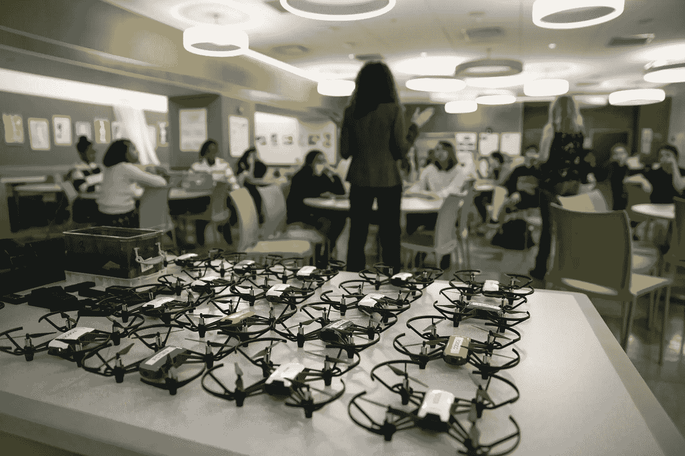

# 认识一下那些将无人机引入 STEM 教育的企业家

> 原文：<https://medium.datadriveninvestor.com/meet-the-entrepreneurs-bringing-drones-to-stem-education-ff5bd1f0d274?source=collection_archive---------6----------------------->

Image: STEM.org Educational Research™ / Classroom Drone Lesson

*作者:* [*安德鲁·b·劳普*](https://medium.com/u/d8c8d333927a?source=post_page-----bc7b73a1ac7b----------------------)*/*[*@ stem CEO*](https://twitter.com/stemceo)

如果你注意到无人机在你家上空嗡嗡飞来飞去，你肯定不是一个人。自从 2010 年美国联邦航空管理局(FAA)开始发放许可证和取消对娱乐用无人机的限制以来，需求稳步攀升。到 2016 年，消费无人机市场的价值为 15 亿美元，最新的商业资讯报告预测，未来十年该行业的复合年增长率(CAGR)为 12%。

 [## STEM 玩具的兴起

### STEM 玩具可以帮助所有的学生，但是 STEM 玩具都有帮助吗？

stemceo.medium.com](https://stemceo.medium.com/the-rise-of-the-stem-toy-4f57cc64e871) 

随着无人机的制造成本越来越低，越来越容易使用，普通人想要分一杯羹也就不足为奇了。无人机可以像玩具一样使用，就像遥控车和飞机一样。对于业余摄影师和摄像师来说，它们也是获得惊人照片的好方法，这通常需要起重机甚至有人驾驶飞机等重型设备才能实现。

随着无人机进入日常生活，人们越来越清楚，它们是向儿童和青少年教授科学、技术、工程和数学(STEM)技能的出色工具。

# STEM 教育中的无人机

Image: STEM.org Educational Research™ / Students Programming Drone At School

因为无人机通常是微型奇迹，所以它们的尺寸和价格都非常适合带进教室，为教育提供了很大的帮助。它们能迅速抓住学生的注意力，激发他们的想象力，这是任何学习计划的关键的第一步。一旦他们迷上了，学生们就可以使用无人机探索 STEM 的许多方面，包括:

*   设计的要素，特别是关于功能如何支配形式
*   改变无人机性能的工程改造
*   建筑基础，包括组件
*   飞行的预测和实验
*   现实世界的问题解决
*   飞行物理学
*   空气动力学
*   编程；编排

当然，无人机可以作为许多基础实验的核心，帮助学生实践科学方法。即使是年轻的学生也可以设计简单的测试，看看无人机可以携带多少东西，找到最有效的飞行路线来递送包裹，等等。

 [## 对早期 STEM 学习的见解

### 教育者需要指导和支持来为孩子们创造积极的体验。

stemceo.medium.com](https://stemceo.medium.com/insights-into-early-stem-learning-5d9d3bf50a49) 

地球系统信息合作伙伴(ESIP)的教育委员会开发了一个充满无人机特定活动的课程[来指导学生调查，并鼓励科学教师进一步探索无人机的激励力量。同样，贝宁飞行实验室(BFL)最近使用无人机帮助](https://scied.ucar.edu/learning-zone/activities?field_learning_zone_category_tid=8)[打破西非学生的障碍](https://blog.werobotics.org/2019/07/19/using-drones-to-engage-students-in-stem-education/)，激发他们对航空和其他科学领域相关职业道路的兴趣。

# 桑杰·钱德拉姆和卡利伯环球公司

桑杰·钱德拉姆是一位成功做到了许多人认为不可能的事情的企业家。他通过成为亚马逊上的畅销书建立了 4000 万美元的业务——亚马逊是一个因独立卖家的狂野西部而臭名昭著的空间，也是一个没有人能长时间保持领先的地方。但是 Chandiram 做到了。

Image: STEM.org Educational Research™ / Sanjay Chandiram

Chandiram 于 2004 年从印度移民到美国，他从玩具反斗城的店铺抢购产品，然后在亚马逊上以更高的价格转售给 T4。他认识到，现在已经破产的连锁店并没有提供一个有趣的，甚至是方便的购物体验。如果玩具从头到尾都不好玩，那还有什么用？

Chandiram 创立了 Kaliber Global 公司，部分原因是为了让购买玩具变得更加令人兴奋。多年来，Kaliber Global 向市场推出了许多令人兴奋的产品，包括无人机。2018 年， [Kaliber Global 的 Force1](http://www.prnewswire.com/news-releases/kaliber-global-announces-kourtney-kardashian-feature-of-force1-top-camera-drones-for-beginners-300767220.html) 无人机系列登上了科勒·卡戴珊的节日礼物指南。这种经济实惠的技术、简单的订购和美国最大的流行文化影响者之一的认可的结合，以前所未有的方式将业余爱好无人机推向了公众意识。

# 3 家值得关注的公司

Image: STEM.org Educational Research™ / DroneBlocks Discovery Day

随着业余爱好无人机在市场份额中所占的比例越来越大，许多企业家已经认识到了成功的潜力，并投身于无人机设计和制造。当谈到教室中的无人机时，有三家公司因其深思熟虑的方法而特别突出。

**DroneBlocks:** DroneBlocks 创建了一个在线课程和一个免费应用程序，以帮助学生拥抱无人机背后的迷人技术。该应用程序专注于现实世界的编码，具有直观的拖放界面，让学生可以轻松地为他们的无人机制定计划。该公司还提供 [DroneBlocks 会员资格](https://news.yahoo.com/drone-programming-courses-membership-droneblocks-122400144.html)，提供在线课程，引导学生编写无人机代码——非常适合疫情期间的独立和远程学习。DroneBlocks 由 Marisa Vickery、Dennis Baldwin 和 Dave Erath 领导。

Image: Alex Cook / Jeff (left) and Steve (right) Rehkemper

**Aero-Puck:** 说到飞行玩具，没有人比 Rehco 的 Steve 和 Jeff Rehkemper 做得更好。在 21 世纪初，这些玩具发明家开发了[并明智地申请了](https://patents.google.com/patent/US7100866B2/en)专利，这是一种利用物体反射的红外信号的飞行器控制系统。该系统允许用户控制玩具，而无需触摸或使用复杂的遥控器，使其成为儿童可以轻松享受的飞行玩具。虽然这项技术现在很普遍，但雷肯珀夫妇首先做到了这一点，今天他们推出了绝密玩具公司的 Hovertech Aero-Puck，这是一款最先进的自动飞行无人机，非常安全，适合室内玩耍。

Drobots 公司:在首席执行官罗伯特·埃尔伍德的领导下，Drobots 公司以其座右铭“技术与新鲜空气相遇”而生存 Drobots 提供[夏令营](http://www.prweb.com/releases/2017/06/prweb14464291.htm)和青少年项目，旨在利用无人机带来的兴奋，为一门课程服务，让孩子们离开沙发到户外解决技术问题。游戏化学习和团队合作是学生在有趣的实践环境中探索 STEM 方法的路标。除了无人机产品，Drobots 公司还经营游戏开发、人工智能(AI)、动画等项目。

有许多与 STEM 相关的产品和公司都在寻求利用 STEM 标签赚钱，并不是所有的 STEM 玩具都是生而平等的。但是无人机确实值得教育工作者长期关注，因为它们天生具有吸引力，可以用来教授如此广泛的技能。从编码到检查大型基础设施项目，无人机肯定会在全国各地的家庭、科学教室和创客空间中占据一席之地——特别是如果这些有进取心的企业家对此有什么要说的话。

 [## STEM 玩具启发他们进入流行文化

### 玩具制造商和品牌为科学、技术、工程和数学教育助一臂之力

medium.com](https://medium.com/swlh/stem-toys-inspire-their-way-into-popular-culture-b7b58b8786a2) 

这篇文章最初于 2020 年 12 月 8 日作为*福布斯技术委员会*的帖子发表，并于 2020 年 12 月 11 日*更新为*媒体*。*

[安德鲁·b·劳普](https://medium.com/u/d8c8d333927a?source=post_page-----bc7b73a1ac7b----------------------)是创始人/执行董事 [@stemdotorg](https://twitter.com/stemdotorg) 。*“通过健全的政策实践使科学、技术、工程和数学(STEM)教育民主化……应用 STEM 以更好地理解它。”*