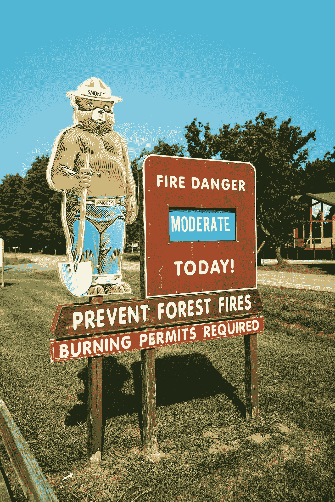

# 特大火灾与气候变化无关！

> 原文：<https://medium.datadriveninvestor.com/mega-fires-have-nothing-to-do-with-climate-change-1d3c2d52a9d6?source=collection_archive---------27----------------------->

Photo by [Evan Wise](https://unsplash.com/@evanthewise?utm_source=unsplash&utm_medium=referral&utm_content=creditCopyText) on [Unsplash](https://unsplash.com/s/photos/forest-fires?utm_source=unsplash&utm_medium=referral&utm_content=creditCopyText)

这里有一个有争议的观点:特大火灾与气候变化无关，但这是一个相对较新的问题，可以追溯到大约 100 年前。我不是说气候变化不存在；我是说这是一个独立的论点。就我而言，气候变化与火灾无关，不管政客和官僚们试图告诉我们什么“尽我所能获得更多的权力”。

这个问题可以追溯到 100 年前，当时我们开始救火，而不是顺其自然，让火自然熄灭。扑灭森林大火，尤其是在偏僻的地方，会使问题变得更糟，而不是更好。它不允许自然减少森林，燃烧助长这些特大火灾的灌木丛。

这可以追溯到 60 年代，当时我们是基于观点和过度反应而不是事实来禁止伐木的——一路上摧毁了当地经济和历史城镇。尽管我们现在比 150 年前拥有更多的树木，但伐木的缺乏导致了在太小的面积上有太多的树木，为火灾储存了前所未有的燃料。

这可以追溯到我们允许地方和州的官员，那些社会上最愚蠢的人，为了他们的政治利益而放弃他们的责任给联邦政府。这些白痴盲目地遵循联邦环境保护局和环境保护局的命令，这伤害了投票选举他们的选民。

这又回到了允许每英亩生长 500-1000 棵树，而不是健康的 50-100 棵树。由于这种拥挤，许多树木因缺乏阳光和水而不健康，使它们容易受到破坏性甲虫和疾病的影响，也是巨大火灾的完美燃料。它还允许入侵植物物种生长，这些物种不仅生长得更快更高，而且燃烧得更好。

这可以追溯到我们沉迷于“我们这边对他们那边”而不是为一个集体而战的时候。让政客们制定荒谬的建筑法规，不仅增加了消防成本，更糟糕的是，增加了生活成本。

这可以追溯到我们让公用事业垄断在各个州占据主导地位，消除所有竞争。其结果是，无论电力公司提供的产品是什么，它们都保证有特定的回报。如果你永远不必竞争，为什么要担心维护设备，伤害那些遭受糟糕服务和随后的停电、限电和火灾的人。更妙的是，公用事业公司向他们收取更高的费用，因为他们享受不到应有的服务。此外，如果没有其他选择来缓解压力，竞争的对立面就会发生，因为没有尖端维护的紧迫性。

它始于我们停止维护森林，让矮树丛和枯树(即燃料)大量繁殖。我们停止了“清扫”树林。没有魅力、不为人知的累人工作。公众看不到这样的工作，因此它对政客和他们的议程毫无用处。你知道适合做什么吗？帮助小火变成大火！

它始于我们在环境问题的幌子下，大幅削减可控燃烧。在加州，私人土地所有者可以获得这种焚烧的许可，但要获得听起来非常共产主义的“加州环境保护委员会”或 CalEPA 的许可。这些白痴认为 10，000 英亩的小型可控燃烧是一种环境危害，并且很少允许它们发生。然后，他们和我们其他人坐在一起，看着窗外浓烟滚滚，遮挡了整整一个星期的阳光。

它始于伐木道路年久失修，不允许消防队员到达需要扑救的火场。没有伐木，原本可以用来拦截火灾的道路杂草丛生，无法使用。

它始于繁重的建筑法规迫使开发商在森林中间建造房屋，而林业法规阻止他们稀疏树木和灌木丛。查找“荒地-城市界面”，它显示了加州建造的房屋数量，这些房屋都紧靠着偏远、高火灾风险的荒地。去年全年，这个数字总计为 450 万。

它始于俄勒冈州将其 60%的空军舰队运往阿富汗打一场没有出路的战争，而不是在必要时将它们留在这里灭火。无论哪个天才批准移动飞机都应该立即开火，但我不会屏住呼吸；是政府。

它始于我们一代又一代地选举各级政府中的政治家，他们没有能力领导明智的环境政策。

为什么这些火灾大多只发生在西海岸？为什么我们不问问十几个森林覆盖良好的州中的一个，他们做了什么来减轻他们的特大火灾，然后复制他们做的！为什么这只发生在美国西海岸？也许其他州没有森林？西海岸肯定是大陆上唯一有森林的地区。那就是它的本来面目。

它始于我们试图每砍一棵树就种十棵树。结果是，在公共土地上，每砍伐一棵树，一场大火就会烧掉近 10 万棵树。《俄勒冈人报》十年前报道说,“我们每英亩移除不到 50 棵成熟的树，但同样的一英亩又重新种植了 435 棵树。那些是今天火的燃料。太多的树，没有一棵在争夺水、天空和养分中茁壮成长；燃料不足、发育不良的森林等待着火，因为监管力量束缚了管理者的手脚，我们别无选择。"

它始于我们让环保组织根据糟糕的科学和意识形态做出决定。不要怪川普。如果你想责怪任何人，那就责怪奥巴马、布什、克林顿、布什、里根、卡特、福特、尼克松以及 100 年前的所有总统。然而，这些人并不是真正的罪魁祸首。所有这一切的错误都归咎于地方和全州的政客。几十年来，他们忽略了这一点，视而不见，或者根本不关心他们的选民，盲目地将环境置于人们之上。很容易归咎于气候变化，积聚更多的权力控制平民，并在下一年重复。我们都傻到让它继续下去——当你看着自己的房子被烧毁时，环保的爱是值得的。

加利福尼亚州有 20 亿美元的预算来缓解和扑灭森林火灾，俄勒冈州似乎有 5000 万美元的预算，(俄勒冈州的预算有点难以确定。)不管数字是多少，这些钱都花在了救火上，没有钱用于减灾——这些火是政客们制造的。在如何处理这个问题上，世界是颠倒的。

要怪就怪州长、县行政官员、市长和官僚。他们，最接近受火灾影响的人，却什么也没做。他们是坏人。

它始于根深蒂固的部落主义和党派偏见开始影响我们国家最基本的决策。它在克林顿执政时站稳脚跟，在布什和奥巴马执政时被注入类固醇，在特朗普执政时爆发。在这种环境下，什么都没有改变，问题依然存在。

这些只是几个真正的问题，没有一个与气候变化有关。我们在处理这个问题上落后了 100 年，我们等待的时间越长，情况只会越糟。这里有一些我们需要立即实施的想法。毕竟，我们只落后了 100 年:

监督伐木，用收益“清扫”下层灌木丛。

停止现有水平的植树。

以德克萨斯州和田纳西州为榜样，改变关于我们可以在哪里和多高建造的建筑和居住规则。

允许更多的受控燃烧。

摆脱公用事业垄断。

让尽可能多的自然发生的火燃烧，以自然的方式。

对于我们所有生活在西海岸的人来说，我知道这是一厢情愿的想法，但一个人可以梦想。什么都不会改变；大火会年复一年地持续下去。

毕竟，橙色人不好，自由主义者是魔鬼，没有人被追究责任，我们都继续部落了，而让罗马燃烧，不理会谁造成的。

正是政客们想要的。