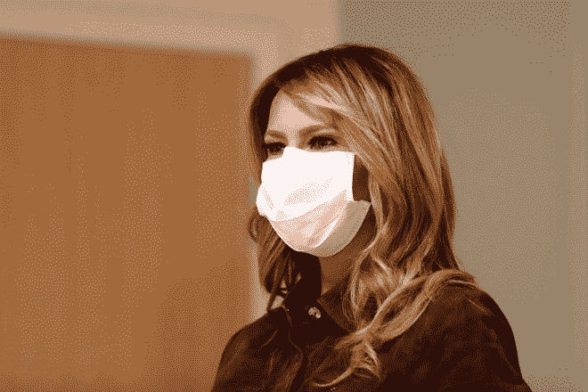
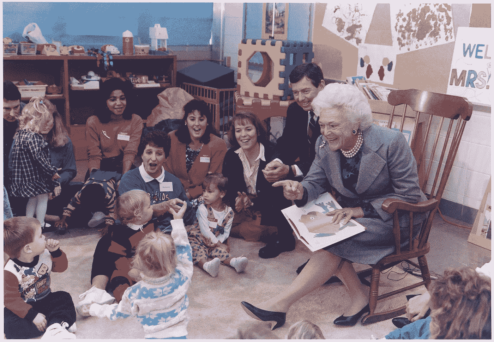

# 别忘了梅兰妮·特朗普也有新冠肺炎

> 原文：<https://medium.datadriveninvestor.com/melania-trump-has-covid-19-too-3809f49c1faa?source=collection_archive---------24----------------------->

## 但似乎没人在乎

Melania Trump wearing a mask. Image source: [USA Today](https://www.usatoday.com/story/entertainment/celebrities/2020/10/02/melania-trump-face-masks-sometimes-she-wears-sometimes-doesnt/5893940002/)

美国总统唐纳德·特朗普，尽管他的立场，仍然是人——所以，他抓住了新冠肺炎，就像所有不蒙面、否认 COVID 的人容易做的那样。他的妻子，第一夫人梅兰妮·特朗普也感染了这种疾病，尽管她遵守了新冠肺炎的安全指南。

但是所有媒体的注意力都集中在唐纳德身上。虽然我明白——他毕竟是总统——但这不公平。人们想知道他们的第一夫人过得怎么样。*川普的*医生已经[透露了关于他病情的重要信息](https://edition.cnn.com/2020/10/03/politics/donald-trump-coronavirus-walter-reed/index.html)(甚至到他正在服用的实验性药物)，但我们对梅拉尼娅的情况几乎一无所知。

以下是我们的发现。

 [## 为什么我们投资 Totient，也就是人工智能如何帮助我们生产抗癌药物和 Covid | Data…

### 9 月 10 日，一家人工智能驱动的药物研发公司宣布与……建立关键合作伙伴关系，从此悄然出现

www.datadriveninvestor.com](https://www.datadriveninvestor.com/2020/09/13/why-we-invested-in-totient-aka-how-ai-can-help-us-produce-drugs-against-cancer-and-covid/) 

# 我们所知道的——一无所知

同样，我们对梅拉尼娅的新冠肺炎病情几乎一无所知。在被诊断出患有冠状病毒后不久，她在推特上发布了“轻微症状”。关于她的状况还没有官方报道——其他一切都是纯粹的猜测。

# 关于第一夫人们

你可能会想，既然第一夫妇坐在如此崇高的宝座上，妻子的角色将会更加重要。是的，但没你想的那么多。

根据维基百科，第一夫人主要是白宫的女主人。组织和参加重要的活动和仪式是她的(非正式)职责。

然后，她要保持一个伟大的公众形象——忠诚的妻子、聪明、坚强、优雅的女人，以及女权主义者。毕竟，她是整个国家的母亲。因此，她应该参加慈善活动，为穷人和有需要的人说话，促进妇女和儿童的权利。

First Lady Barbara Bush, reading to children. Image source: Wikipedia

## 川蜷螺属

虽然不像丈夫那样喧闹，但特朗普夫人的生活(成为 FLOTUS 之前和之后)非常丰富多彩。她是前超级名模、移民和时尚偶像。她支持帮助非洲儿童的组织，并且是妇女赋权的积极倡导者。梅兰妮·特朗普也支持新冠肺炎法规，自己也遵守这些法规。

我写政治、社交媒体、隐私和一般有趣的事情。看一看:

 [## 2020 年不是 1984 年，但也很接近了

### 我们离生活在乔治·奥威尔的反面乌托邦有多近

medium.com](https://medium.com/illumination-curated/2020-wasnt-1984-but-it-came-really-close-5b88b8b3f08b)  [## 一张鸡蛋照片如何获得 5400 多万个赞

### 你的品牌也可以

medium.com](https://medium.com/illumination-curated/how-an-egg-photo-got-54m-likes-c3d0f6484067) 

## 访问专家视图— [订阅 DDI 英特尔](https://datadriveninvestor.com/ddi-intel)