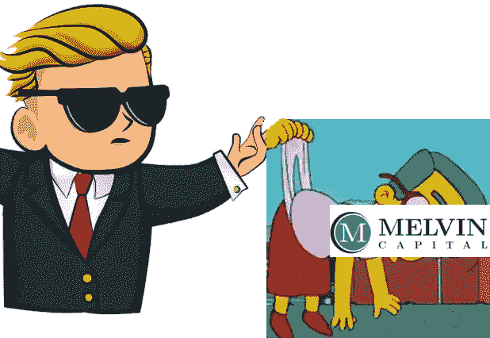

# “梅尔文”已经是挤压书呆子短裤的俚语了…

> 原文：<https://medium.datadriveninvestor.com/melvin-is-already-slang-for-squeezing-a-nerd-s-shorts-8c95e147f5b5?source=collection_archive---------30----------------------->

~ *这是一种怪异投资心态的首次胜利~*

**TL；**博士——关键的弱点永远是什么都不会发生，*因为* ***没有理智的*** *投资者会那样做*……’【我只能指出被称为[弗洛伦西奥](https://www.youtube.com/watch?v=HxN2568zcWA&t=701s)的天才，来最生动地证明*对的* ***种*** *种错的*对于打破敌人的计划是完美的。]

要清楚 Gamestop 的“恶作剧”不是一种可靠的谋生方式！相反，华尔街赌注的疯狂小子们正在评估一个新的参数:痛苦。就像娱乐、地位、安全或所有其他赋予无形价值的东西一样；根深蒂固的幸灾乐祸给志同道合的公司带来了丰厚的红利。而且，当牌桌上的一个玩家开始重视自己的**【获胜】*时，游戏中没有其他人可以依靠理智，他们经常会变得麻痹。这就是“弗洛伦西奥”毒液，通过它们的大脑发挥作用。*

*千禧一代可能一直在电脑游戏中浪费青春——然而，从这些模拟战斗中，机构投资者无法理解的一种战斗方式诞生了。没有人指望“赌博游戏”的回报率会高于运气，他们也不应该这样。相反，想想谁在餐桌上有一席之地。一条鲸鱼可以把一个小玩家推下牌桌。Wallstreetbets 意识到，即使他们是小人物，鲸鱼也是坐在液压千斤顶上的。只按下一个，所有其他玩家就开始在座位上扭动。对大玩家来说，这种风险意味着他们不得不转移赌注，他们的战略前景需要改变。每一个移动的物体都会在它们周围引发一点涟漪，搅动其他物体。我认为今天广泛的市场低迷，而 Gamestop 上涨，是一个预兆。所有这些投资公司，都有些波动，相互抵触，会造成比任何人预期的更多的不可思议的波动。*

*这是华尔街赌注*可以赢得的战略环境——一旦所有老手都弃牌，每个人都争先恐后地想一会儿新鲜事。至少，这是一张娱乐表演的门票！**