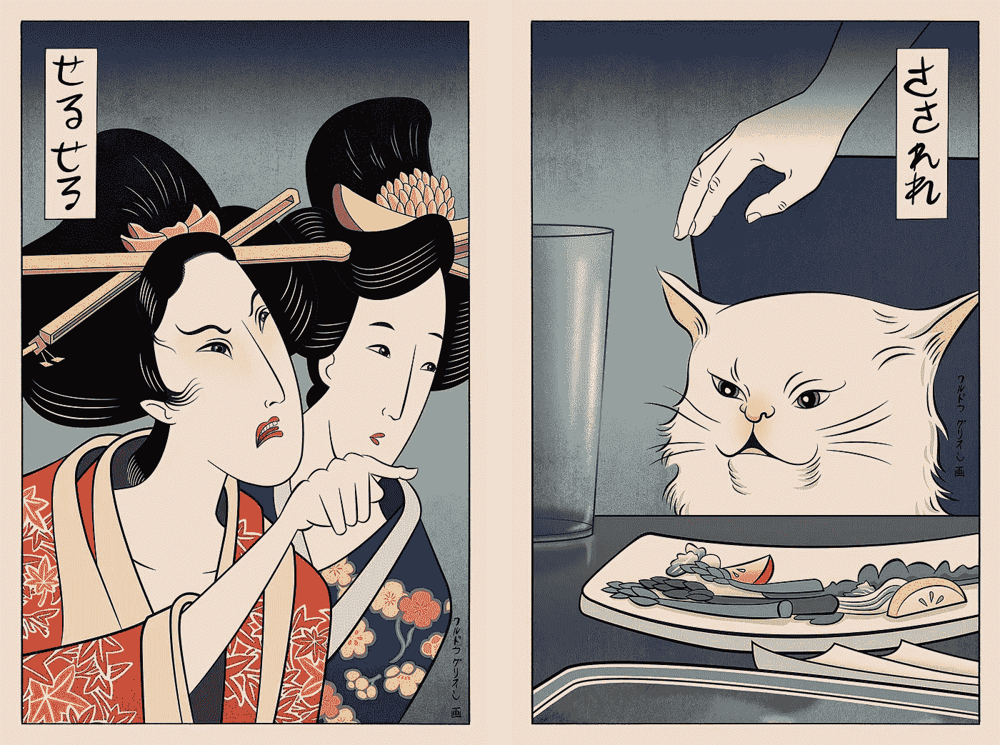

# 超越时空的模因

> 原文：<https://medium.datadriveninvestor.com/memes-beyond-time-and-space-6276a8152976?source=collection_archive---------2----------------------->

## 进化数字时代的文化

Source: [https://society6.com/griffinisland](https://society6.com/griffinisland)

Meme 就有这种神奇的力量，可以凭空出现雷同。他们像一些天才的箭一样跨越文化和社会地理的维度。最不可思议的是，天才可能不知道迷因的未来影响。

> 迷因是元小说层面上的动态艺术，对社会有着巨大的潜在影响。

迷因是特定文化参照的分裂者，从这些参照中解放出来，却成为无数新的参照。他们正在形成和瓦解我们的文化。分析这种模因的考古学和词源是令人兴奋的(也是至关重要的)(幸运的是，有大量的学术研究和众包平台，如[knowyourmeme.com](http://knowyourmeme.com))。

我最近被这个迷因迷住了:

它包含了一切:人工智能社区之外的人的恐慌和焦虑，一方面是缺乏数字能力，另一方面是前 AGI 时代的缺陷和弱点。

前者正在对人工智能天启进行占卜，而人工智能研究人员和开发人员仍在努力完成模式识别和模型训练等简单任务。

我想进一步挖掘——在全球数字互联的时代，这很简单:所以迷因“[女人对着猫](https://knowyourmeme.com/memes/woman-yelling-at-a-cat)大喊”有一段典型的(有据可查的)历史。

## 模因诞生的四个步骤

**步骤一**。**2011 年 12 月 5 日**。在一部真人秀电视连续剧(*贝弗利山庄的真实主妇，第二季第十四集:*《来自地狱的马里布海滩派对》)中有一个场景**泰勒·阿姆斯壮**吓坏了:

**第二步，2011 年 12 月 6 日**:这一幕在《每日邮报》一篇关于最近一集的文章[中提到过——还有事件的剧照。这个图像应该成为一个著名迷因的一部分。](https://www.dailymail.co.uk/tvshowbiz/article-2070491/Real-Housewives-Of-Beverly-Hills-Taylor-Armstrong-meltdown-husband-Russell.html)

Source: [DailyMail](https://www.dailymail.co.uk/tvshowbiz/article-2070491/Real-Housewives-Of-Beverly-Hills-Taylor-Armstrong-meltdown-husband-Russell.html)

**第三步(七年后)2018 年 6 月 19 日:** Tumblr 用户 **DeadBeforeDeath** 贴了这张猫在吃饭时的照片(参考一个模因的由来， [lolcats](https://knowyourmeme.com/memes/sites/cheezburger) ):

 [## 所有美好的事物

### 他不喜欢蔬菜🚫🥗

deadbeforedeath.tumblr.com](https://deadbeforedeath.tumblr.com/post/175034192749/he-no-like-vegetals) 

人气:“一年 50300 赞，再博”。

**第四步 2019 . 5 . 1:**推特用户[**@ missing girl**](https://twitter.com/missingegirl/status/1123647491025428480)在一条推文中组合了上面两张图片:

影响:两个月内 78900 次转发，276800 个赞。

> 迷因诞生了。

## 生而有命。

这个迷因在网上有无数的重复使用，比如 KnowYourMeme 提供的列表[或者 ebaumsworld](https://knowyourmeme.com/memes/woman-yelling-at-a-cat) 中的元小说迷因混音:

 [## 66 个最佳“对着猫大喊大叫的女人”模因已经风靡互联网

### 《对着猫模因大喊大叫的女人》是贝弗利山庄演员泰勒的《真实主妇》的电影剧本

www.ebaumsworld.com](https://www.ebaumsworld.com/pictures/woman-yelling-at-cat-memes/86009016/) 

甚至还有*“女人对着猫大吼”*——发电机:

 [## 女人对着猫迷因生成器大喊大叫

### 地球上最快的迷因生成器。轻松地将文本添加到图像或迷因中。这是一个免费的在线图像制作工具…

imgflip.com](https://imgflip.com/memegenerator/Woman-Yelling-At-Cat) 

但最令人兴奋的发展是**没有用自己的文本**重复使用模因，而是**视觉上重新想象模因**。新生活。在不同的文化背景下。文艺复兴的本义。

这就是日本在*江户时代*的模因(由 [***格里菲斯兰***](https://society6.com/griffinisland) 制作):

中文版(由***tikkafromeast***制作):

埃及版本(作者**克里斯·c·凯利**)——这是几个流行模因的综合库——隐藏在背景的象形文字中:

乌克兰语版本(强制民族元素包括 [Vyshyvanka](https://en.wikipedia.org/wiki/Vyshyvanka) 和 [Varenyky](https://en.wikipedia.org/wiki/Pierogi#Ukraine) ):

**乔·德维拉**制作了一系列关于现代流行文化的各种互文参考:

包括这个高元级，价值一个*的安伯托·艾柯*:

这是毕加索和 T2 的合作:

甚至对整个故事戏剧性的重新诠释:

视频艺术家**鲁本·弗罗** ( [我写过他的摄影测量艺术](https://medium.com/narrative/transient-eternity-cf3987012cec?source=friends_link&sk=d776edace919573af77458cd46a82175))也有他自己对这个迷因的奇妙诠释:

基于参考文献的工作成为新的参考文献。

从迷因生命的微观角度来看，这就是文化进化的方式。