# 使用深度学习的迷因检测 Android 应用程序

> 原文：<https://medium.datadriveninvestor.com/memes-detection-android-app-using-deep-learning-d2c65347e6f3?source=collection_archive---------1----------------------->

# 1.商业问题

## 1.1 问题描述

WhatsApp 如今拥有超过 12 亿的日活跃用户。WhatsApp 已经成为我们生活中不可或缺的一部分。该应用程序让我们与朋友保持联系变得更快、更容易。然而，当聊天应用程序自动下载所有那些愚蠢的迷因、音频文件、视频和照片时，有时会有点烦人。这不仅让手机的图库看起来一团糟，还会耗尽你的移动内存。太多的 WhatsApp 图片、视频让你的手机变慢。删除整个 WhatsApp Images 文件夹是一个糟糕的选择，因为它可能包含我们重要的个人图像。因此，我们需要以某种方式分离出不必要的迷因图片和我们的个人形象。

**能否建立一个可以识别迷因图像和真实图像的模型？**

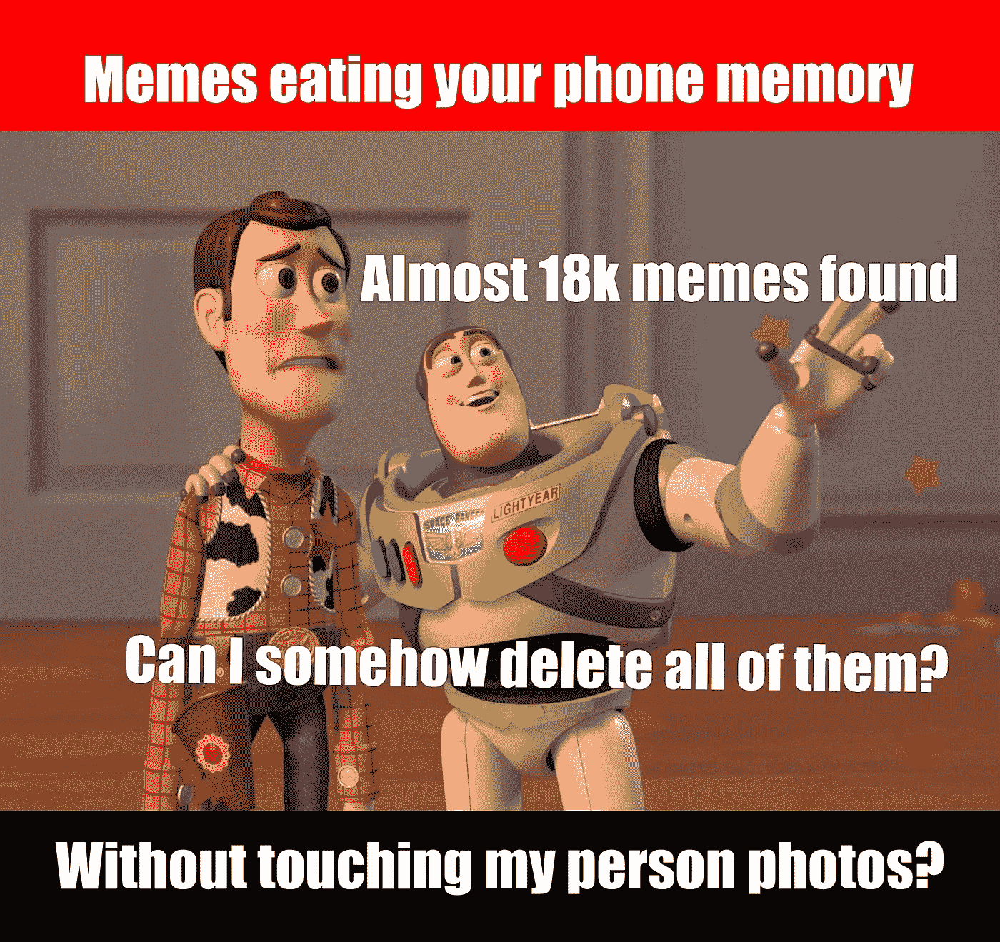

你能从下面的博客中学到什么？

*   如何微调预先训练好的 Keras 模型？(迁移学习)
*   在谷歌云服务器上部署 flask 应用。
*   使用 TF-Lite 库在 android 平台上部署 MobileNet 模型。

## 1.2 问题陈述:

在不接触个人图像的情况下，对手机图库中的模因图像进行分类。从图库中找出迷因图片。

## 1.3 现实世界/业务目标和约束:

*   错误分类的代价可能非常高。因为假设如果一个图片不是迷因，而我们把它归类为迷因，那么它对应用程序没有好处。
*   延迟问题。该模型应该能够快速识别图像迷因。不然 app 就扔垃圾桶了。

## 1.4 机器学习公式

这仅仅是一个**两级分类**的问题。我们需要建立一个能够区分迷因图像和非迷因图像的分类器。

## 1.5 绩效指标:

我们将把**二进制交叉熵**或 **LogLoss** 作为性能度量。我们将把**准确度**视为一种性能衡量标准。

# 最终目标

建立一个名为 MemesDetectionApp 的 android 应用程序，它可以区分“meme”图像和“非 meme”图像。这样我们就可以从手机图库中分离出模因图片，并删除所有不必要的图片。

# 2.数据

## 2.1 数据采集

坦率地说，没有现成的数据集可用于现实世界的问题类型。我们通过从各种数据源收集图像来创建这个数据集。我们从下面的链接中收集了一些数据。

*   [https://www.crcv.ucf.edu/data/Selfie/](https://www.crcv.ucf.edu/data/Selfie/)

## 2.2 数据集大小

我们从互联网上收集了近 11k 模因图像和 11k 非模因图像。我们确保 t **数据集是平衡的**。

## 2.3 数据清理

市场上有如此多的图像扩展。像 JPG，JPEG，PNG，SVG，GIF，PSD，RAW 等等。

我们决定把重点放在 JPG 和 JPEG 图像上。我们试图将所有图像转换成 JPG 格式。

## `2.4 Sample Not-Memes Images/ Real Images`

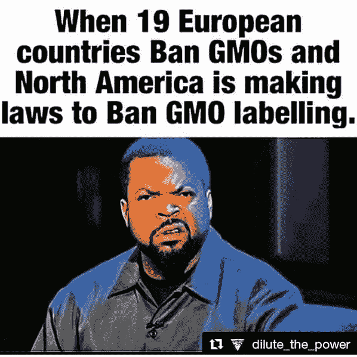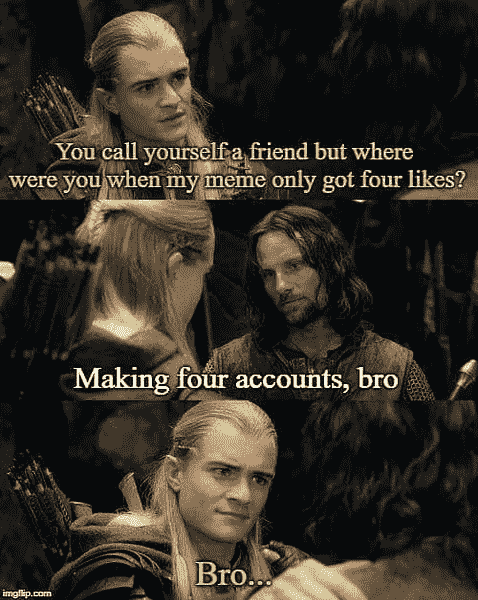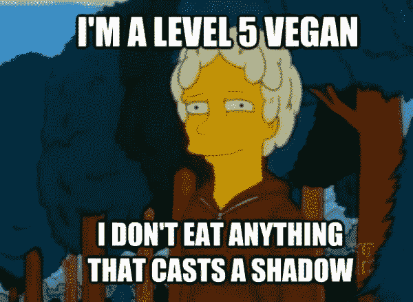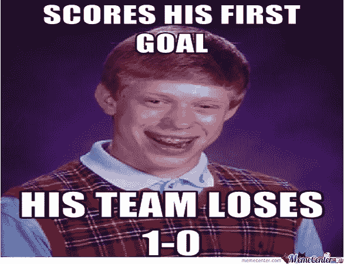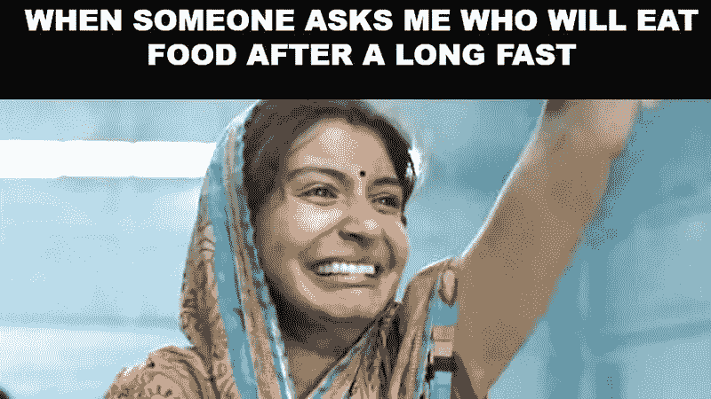

Sample memes images

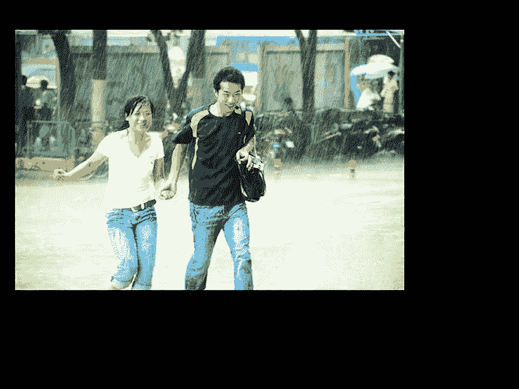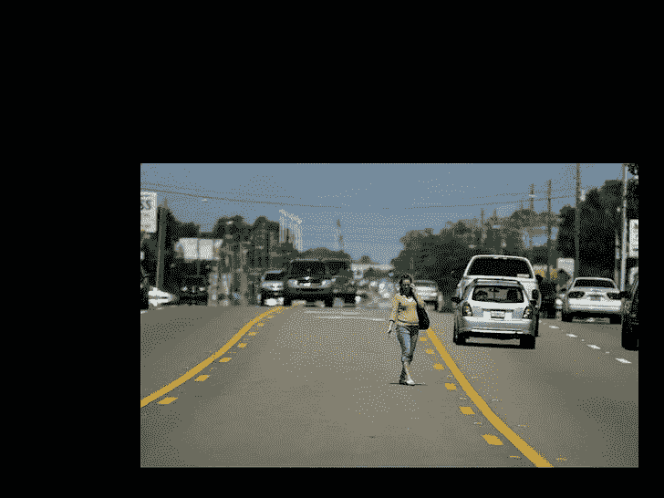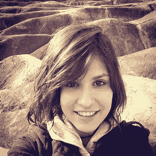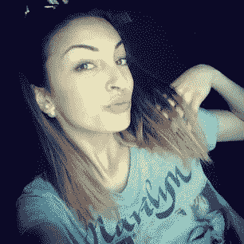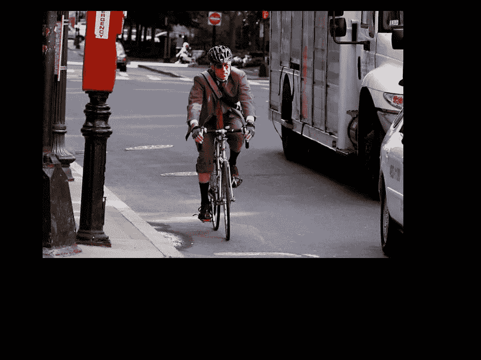

Sample Not Memes images

# 3.战略

我们将训练两种不同的模型。

*   一个可以在 android 环境中本地识别“模因”和“非模因”图像的模型。
*   另一个模型将部署在服务器上的某个地方，我们可以向服务器发出 HTTP REST API 请求，服务器将以 JSON 格式做出响应，无论请求的图像是“Meme”还是“Not Meme”。

# 4.模型

我们尝试了 **VGG-16，VGG-19，雷斯内特-50，盗梦空间**模式。

下面是 Keras 预训练的 INCEPTION 模型图。我们可以看到高度过度拟合的模型。它学不到任何东西，所以我们将放弃这个选项。

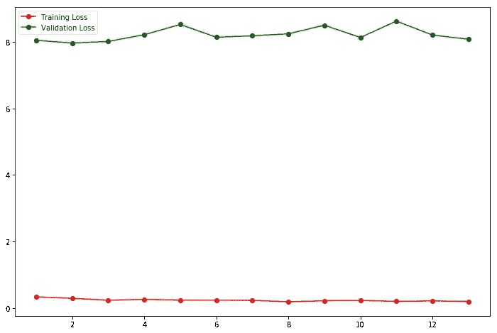

Inception model graph

下面是 RESNET50 型号。它比 inception 模型好得多，但并不比 VGG19 好。

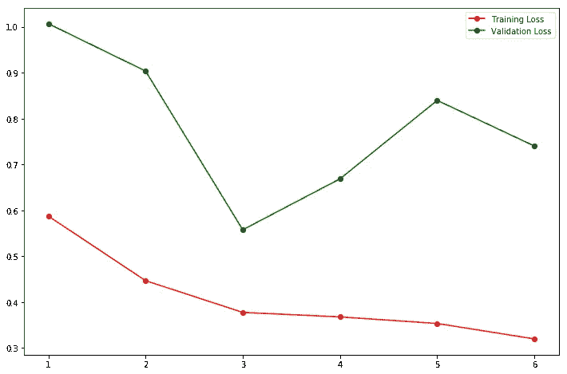

ResNet50 model performance

在尝试了各种型号后，我们决定使用 VGG19 型号。

我们已经对以下参数进行了超参数调整，

*   顶层之后添加或删除的层。
*   尝试不同的辍学率
*   选择不同的优化器
*   尝试不同的学习速度
*   已尝试不同的批量

在对各种值进行实验后，我们发现最佳值如下:

*   顶部之后没有附加层。(即 TOP= false)
*   辍学== 0.5
*   优化器== Adamax
*   学习率== 0.0005
*   批量== 100

我们已经广泛使用**张量板**进行超参数调谐。

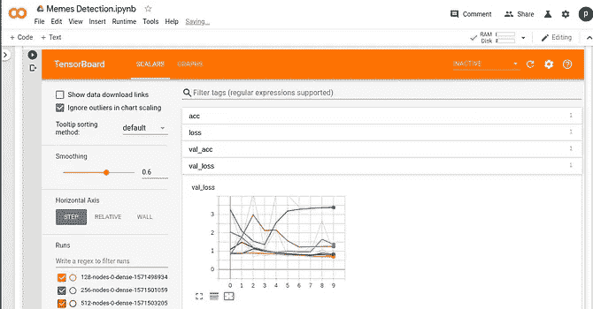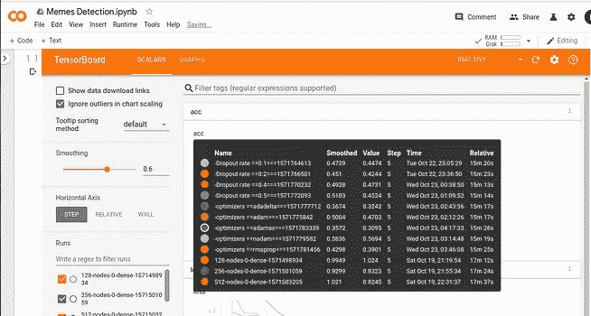

Tensorboard graphs

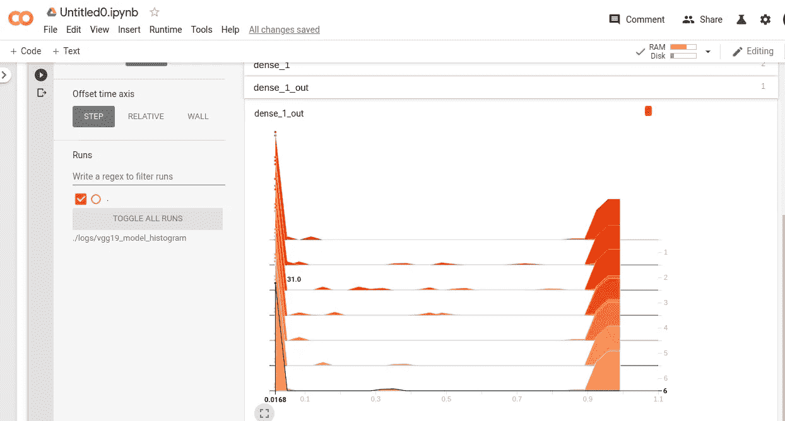

fine tuned model weights visualization

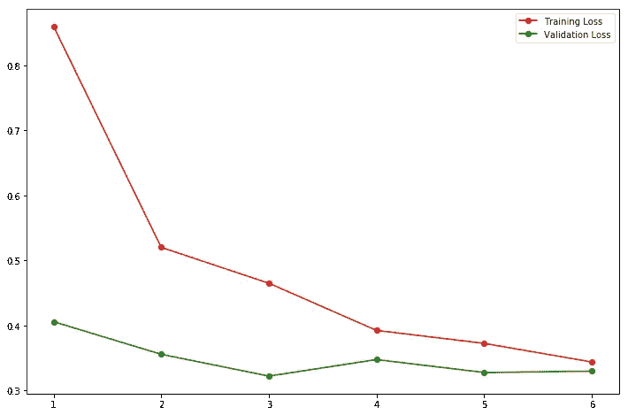

final model graph for Training loss vs Validation loss.

# **4。结果**

训练 LogLoss = 0.19593
训练准确率= 97.95%

验证 LogLoss = 0.28459
验证准确率= 97.20154%

测试 LogLoss = 0.25857
测试准确度= 97.43742%

在可视化训练损失与验证损失图和上述结果之后，我们可以肯定地说，模型**没有过拟合**。

然后，我们可以保存微调后的模型以供进一步操作。

```
model3.save("/content/drive/My Drive/Meme Detection/best_model.h5")
```

这个案例研究项目的关键部分是在 Google 云服务器和 Android 平台上部署一个模型。

# 5.安卓应用

## 1.登录页面

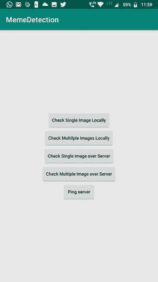

landing page

*   在本地检查单个图像
*   在本地检查多个图像
*   检查服务器上的单个图像(Flask REST API)
*   检查服务器上的多个图像(Flask REST API)
*   砰

## 1.在本地检查单个图像

这意味着 **Mobile-Net tflite** 模型正在本地运行，并且只测试一个图像。

## 2.在本地检查多个图像

这意味着 **Mobile-Net tflite** 模型正在本地运行，我们正在测试多个映像。

## 3.检查服务器上的单个图像(Flask REST API)

这意味着微调后的 VGG19 模型在 GCP 服务器上运行 flask 应用程序，并且只测试一张图片。

## 4.检查服务器上的多个图像(Flask REST API)

这意味着微调的 VGG19 模型正在 GCP 服务器上运行 flask 应用程序，并在多个图像上进行测试。

# **6。总结**

*   没有现成的数据集可用于本案例研究，我们创建了一个，从互联网上收集各种图像。数据集平衡。
*   我们选择二进制交叉熵作为损失度量，准确度作为性能度量。
*   尝试了各种模型，如 VGG16、VGG19、ResNet50 和 Inception 模型。其中 VGG19 表现较好。
*   然后，我们用各种超参数对模型进行了微调。
*   最后，我们取得了 97.44 %的测试准确率和 0.258 的日志损失

不要错过将 tf-lite 机型部署到 android 平台**[**part 2**](https://medium.com/@pranaysawant22/deploy-mobilenet-model-to-android-platform-2886789a7628?sk=94b9093d249ce57c134c46600c9b90b1)**。****

**另外，不要错过将 Keras 模型部署到 flask app [**part3**](https://medium.com/@pranaysawant22/deploy-keras-model-to-flask-app-rest-apis-f9f4e834e3bd?sk=d8f7c429f0c1410e9f0be236a7e5b487)**

****

**如果你喜欢这个博客，请欣赏我们的努力。**

**你可以看看类似的有趣博客[这里](https://medium.com/@passionatedevs/taxi-demand-prediction-on-time-series-data-with-holt-winter-forecasting-loss-0-02-2bcdeec48499)和[这里](https://medium.com/@pranaysawant22/zomato-restaurant-rate-prediction-2093cb685430)。**

**Github 源代码可以在[这里](https://github.com/pranaysawant/Memes-Classification-Model-End-to-End-Solution)找到。**

# **参考:**

*   **[https://www.youtube.com/watch?v=oDHpqu52soI&list = plzbt5o _ s 2 xrwrnxk _ ycptnqgo 4 _ u2YGL&index = 13](https://www.youtube.com/watch?v=oDHpqu52soI&list=PLZbbT5o_s2xrwRnXk_yCPtnqqo4_u2YGL&index=13)**

**特别感谢**

*   **[https://www.appliedaicourse.com/](https://www.appliedaicourse.com/)**