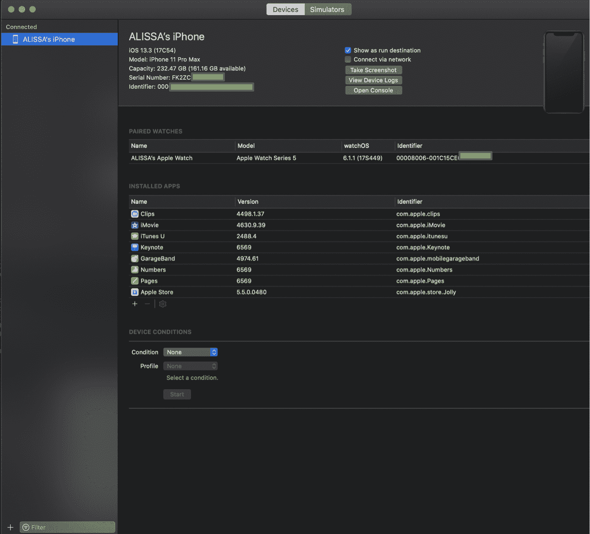
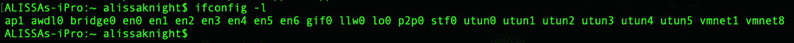
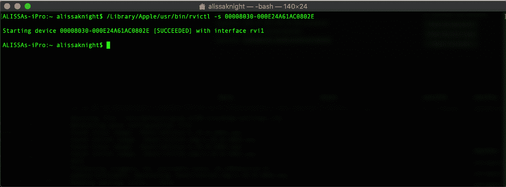
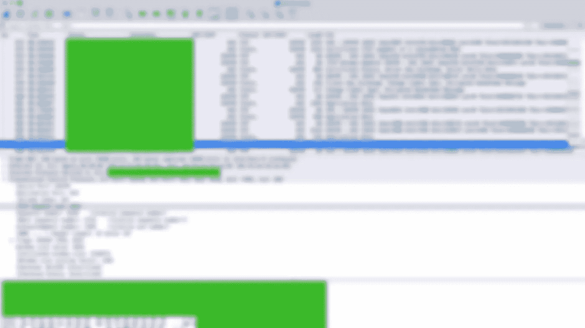
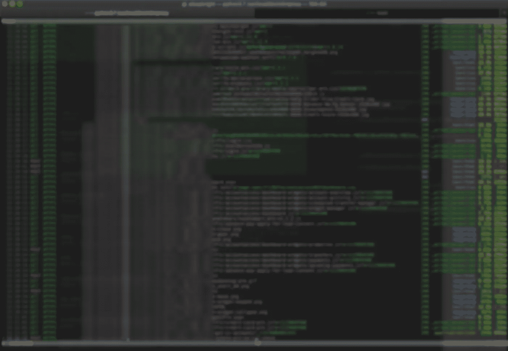
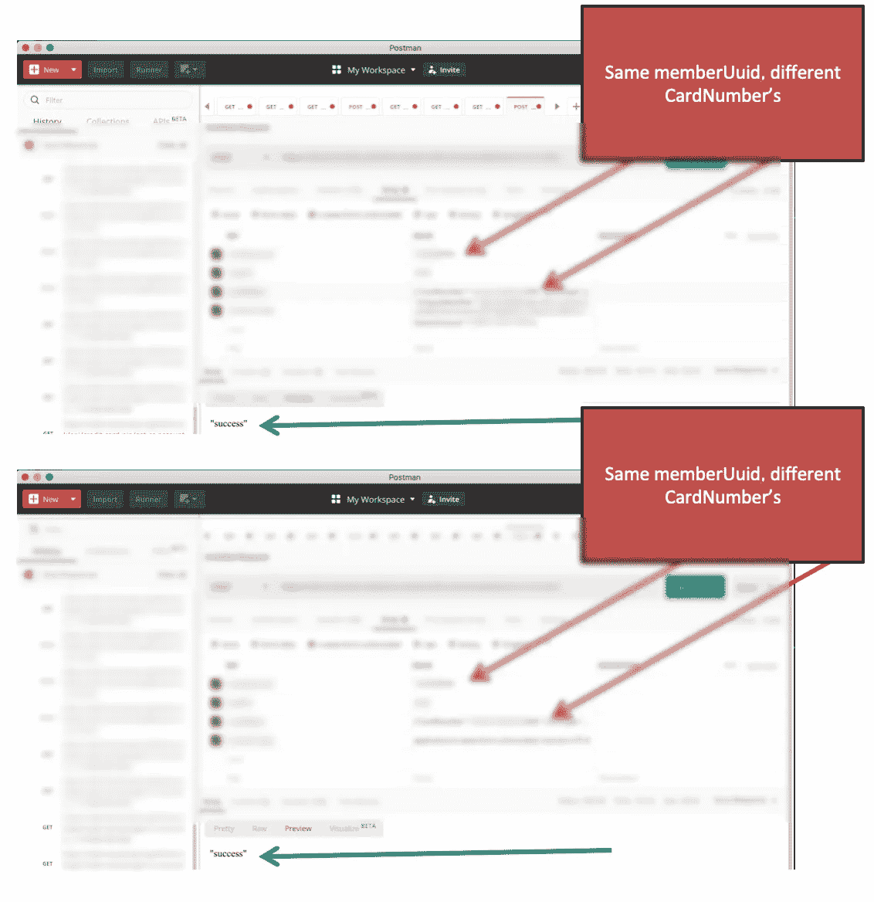

# API 黑客回忆录:拦截加密的移动流量以入侵银行的 API 服务器

> 原文：<https://medium.datadriveninvestor.com/memoirs-of-an-api-hacker-intercepting-encrypted-mobile-traffic-to-hack-a-banks-api-server-4f74e421197d?source=collection_archive---------1----------------------->

“羞愧的魔鬼站在那里，感觉到善良是多么可怕，看到美德在她身上是多么可爱；并渴望着他的损失”——约翰·弥尔顿


在一家大型银行最近的渗透测试中，我能够通过移动应用程序与之通信的银行 API 服务器向任何账户转账，并更改任何客户的 ATM 借记卡 PIN，而无需进行身份验证。虽然我能够使用 [MobSF](https://github.com/MobSF/Mobile-Security-Framework-MobSF) 成功地对 Android 应用程序进行逆向工程，但在发现移动应用程序在与银行通信时使用的大量 POST 和 GET 请求时，我并不那么成功。HTTP POST 是一种 HTTP 请求，它指示接收 web 服务器接受并存储 HTTP 请求正文中的内容，通常是文件上传或用户对 web 表单字段的输入。

于是，我开始寻找一种更具创造性的方法，通过拦截运行在我 iPhone 上的银行应用程序和银行 API 服务器之间的流量，手动找到正确的 API 调用。一旦我在我的手机和银行的 API 服务器之间传递的众多字符串在 [mitmproxy](http://www.mitmproxy.org/) 中被拦截，我就能够将 POST 请求连同预期的 HTTP 头字段一起加载到 [Postman](http://www.getpostman.com/) 中，这是一个能够向 API 服务器发送请求的 API 客户端，允许用户检查响应以进行进一步的分析或调试。

本文中显示的 Wireshark 在成功设置我的 iMac 以捕获我的 iPhone 流量后，提供了捕获网络流量的证据。Mitmproxy 被用作 SSL 中间人(PITM)工具来解密 SSL 流量。虽然 Wireshark 不能用于检查离开手机的 SSL/TLS 加密流量，但在渗透测试中使用它来确认移动应用程序没有通过 HTTP 发送任何未加密的敏感数据是很重要的。因此，我将本文分成了两种方法，一种是使用 Wireshark 检查未加密的流量，另一种是使用 mitmproxy 在获得 URIs 后对 API 服务器进行攻击。

本文解释了如何使用 Mac 拦截流出 iPhone 的流量。在我的设置中，我使用的是运行 MacOS Catalina 10.15.2 的 iPhone 11 Max Pro 和 iMac Pro 2017。

***第一步:发现你手机的唯一标识符。*** 在做任何事情之前，你首先要确定你的 Mac 上安装了 XCode。为此，只需在 Mac app store 中搜索 XCode 即可。安装好 XCode 后，使用 lightning 线缆将你的 iPhone 连接到 Mac，然后寻找你手机的标识符，如我在下面**图 1 中的截图所示。**



Figure 1

不要担心必须手动写下整个标识符，因为该字段允许在下一步复制/粘贴时高亮显示。

***第二步:在 Mac 上为你的 iPhone 创建网络接口。*** 接下来，您需要创建一个接口，我们将使用 Wireshark 监听该接口。这是一个网络接口，iPhone 的所有网络流量都将通过它传输，供您使用 Wireshark、tcpdump 或您选择的任何其他网络嗅探器进行监听。通过启动应用程序抽屉中的终端并运行 *ifconfig* ( **图 2** )，列出系统上当前启用的网络接口。



Figure 2

***第三步:启动界面。*** 使用 rvictl，启动网络接口，让你可以嗅探离开 iPhone 的网络流量(**图 3** )。这将创建一个名为 *rvi0* 的新接口名称。



Figure 3

***第四步:抓取 iPhone 网络流量。*** 通过使用 Wireshark，您可以确认您的 Mac 正在查看来自您的 iPhone 的所有流入/流出流量。

接下来，您需要启动 Wireshark 来捕获和检查离开 iPhone 的未加密流量，确保选择您用 rvictl 创建的新接口来监听(**图 4)** )。在下面的截图中，你可以看到我的 iPhone 和 API 服务器之间的流量，这表明你的新 rvi0 接口正在工作。



***第五步:安装并运行 mitmproxy。*** 接下来，您需要下载并安装 mitmproxy，这是一个免费的开源工具，用于拦截、检查和/或重放 SSL/TLS 加密流量。要在 Mac 上安装 mitmproxy，使用名为 *Homebrew* 的命令行实用程序相当简单。安装完成后，使用 brew 安装 mitmproxy。

```
$ /usr/bin/ruby -e "$(curl -fsSL https://raw.githubusercontent.com/Homebrew/install/master/install)"
```

$ brew 安装 mitmproxy

在 iPhone 上启动网络浏览器，访问域名 [http://mitm.it](http://mitm.it) ，点击 iOS 图标，将证书安装到您的设备上。

只需使用-P 标志或-T-host 启动 mitmproxy。

$ mitmproxy -T —主机

第六步:在你的 iPhone 上设置代理。接下来，找出你运行 mitmproxy 的 Mac 的 IP 地址。您的 iPhone 和主机应该在同一个无线网络上。将 iPhone 上的代理设置为运行 mitmproxy 的 IP 地址和端口号。

为此:

*设置>Wi-Fi>【I】信息(用于您的无线网络)>配置代理>设置为手动*

在下面的截图中，你会看到我现在可以在加密的 SSL/TLS 流量中看到 URIs(**图 5** )。单击其中一个 API POST 请求后，我就可以记录下在下一步中在 Postman 中正确格式化我的 POST 请求所需的内容。



你完了。此时，您应该能够拦截和解密您的移动设备和 API 服务器之间的所有 SSL/TLS 流量，只要您从中捕获流量的应用程序没有任何安全功能来使应用程序崩溃(如果设置了代理或使用证书锁定)。证书锁定应该在任何敏感的应用程序中使用，它有效地将特定主机与预期的 X.509 证书/公钥进行映射，以防止*person*in-the-middle 攻击，就像我们在这里尝试做的那样。

这一努力最终使我能够在没有身份验证的情况下为任何银行客户进行转账和更改 ATM 借记卡 PIN 码(图 6)。



喜欢和分享。您支持我在网络安全领域继续进行内容开发和影响者工作的最佳方式是喜欢并分享我的文章。请现在就做！


订阅并关注。[订阅我的 YouTube 频道](http://youtube.com/c/alissaknight?sub_confirmation=1)以获得每周上传的我的 VLOG、直播流和 Vodcast/Podcast 剧集的通知，并在 [Twitter](http://www.twitter.com/@alissaknight) 上关注我。要查看我最新的内容日历，请访问我们公司的网站 [Knight Ink](http://www.knightinkmedia.com/) 。