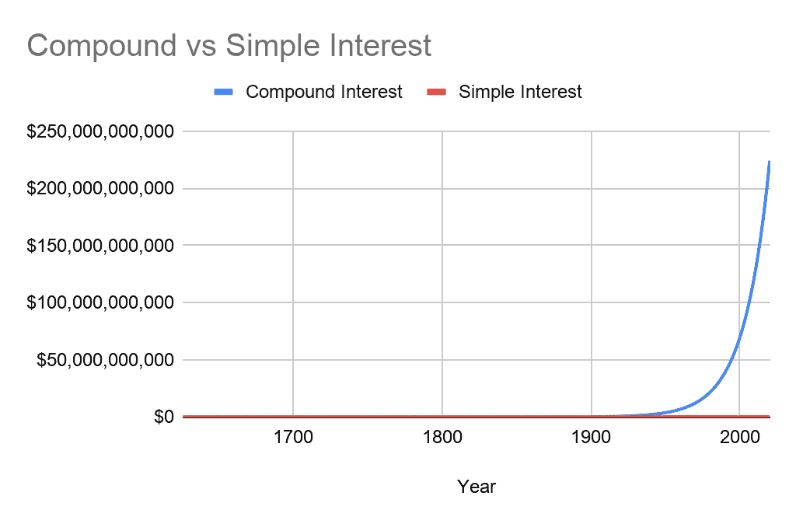
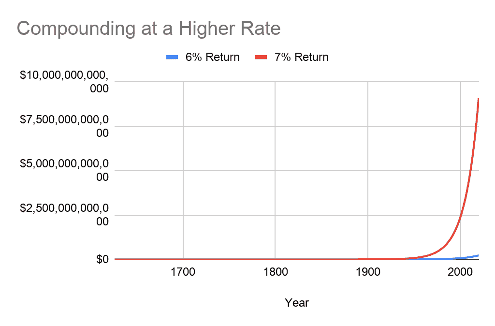
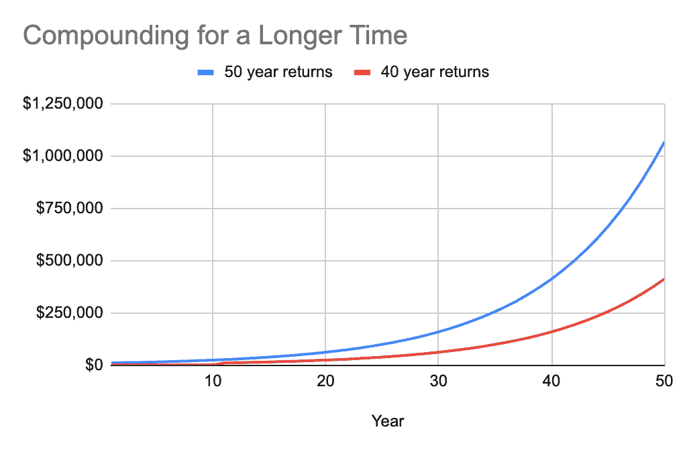
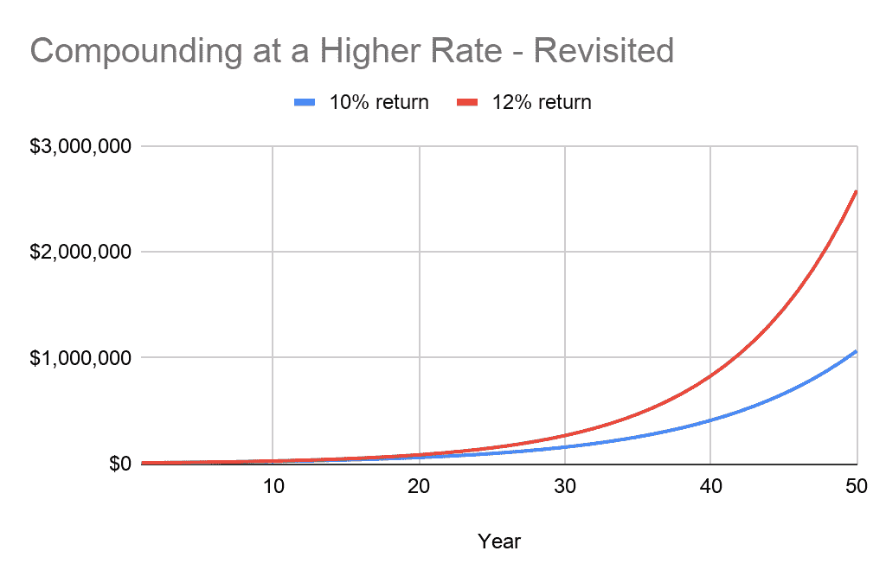
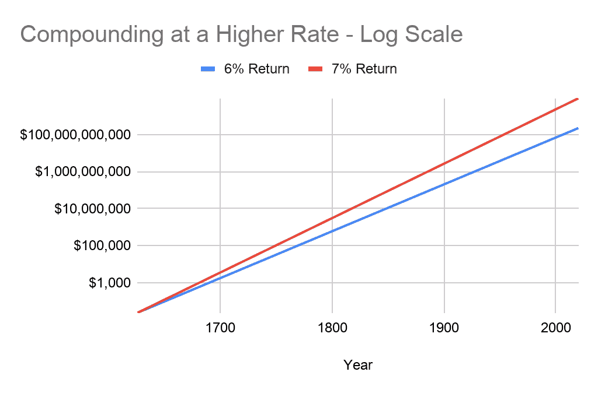

# 心理模型 Lollapalooza:复利

> 原文：<https://medium.datadriveninvestor.com/mental-model-lollapalooza-compound-interest-10f62acba5d2?source=collection_archive---------9----------------------->

## 世界第八大奇迹如何让你变得难以想象的富有(如果你活得够久的话)

# 心理模型 Lollapalooza

查理·芒格是沃伦·巴菲特的商业伙伴，也是有史以来最成功的投资者之一。他非常相信从各种学科中收集基本心智模型的“网格”,以改善你在商业、学术研究和几乎生活所有方面的决策。通过这个系列，心理模型 Lollapalooza，我们将探索大约 100 个心理模型(芒格自己使用的数量)，用一个多学科的工具包武装我们，以了解我们周围的世界。

[**点击这里**](https://david-r-phillips.medium.com/the-mental-model-lollapalooza-or-how-charlie-munger-became-a-billionaire-c7c9ebfd0d4c) 链接到 lollapalooza 文章的主要心智模型。

Photo by [Taton Moïse](https://unsplash.com/@moyse?utm_source=unsplash&utm_medium=referral&utm_content=creditCopyText) on [Unsplash](https://unsplash.com/s/photos/einstein?utm_source=unsplash&utm_medium=referral&utm_content=creditCopyText)

# 什么是复利？

> “复利是世界第八大奇迹。理解它的人，赢得它；谁没有，谁付钱。”——阿尔伯特·爱因斯坦

**复利是在贷款或存款的本金上加上利息——这是在先前赚取的利息上赚取的利息。**

当以前赚取的利息再投资时，而不是以现金支付时，就会获得复利(单利就是这种情况)。因此，在接下来的时间里，本金加上先前累计的利息会产生利息。这是指数增长的金融例子。

正如数学中的许多事情一样，复利最好用图形来解释。

# 购买曼哈顿

Fig 1: Compound vs Simple Interest. *Here we see the difference between compound interest (where interest is reinvested) and simple interest (where interest is not reinvested).*

大约在 1626 年，彼得·米努伊特用价值 24 美元(相当于 2020 年的大约 1000 美元)的小饰品从印第安人手中买下了曼哈顿岛，这笔交易通常被认为是有史以来最划算的投资。

让我们想象一下，在 1626 年有足够的投资机会，你可以赚取 6%的利息，然后再投资，明年再赚取 6%的利息。在这种情况下，我们的 24 美元现在将价值 2240 亿美元。*这就是复利在起作用。*

相反，如果我们把第一年赚取的 1.44 美元利息拿出来，而不是再投资，只是以现金形式保存，经过同样 394 年的利息，我们总共只有 591 美元。*这是单纯的兴趣在起作用。*

Fig 2: Compound Interest at 6% and 7% Rates | Here we see the difference a 1% interest rate makes over time.

如果印第安人能够像上图所示，以每年 6%的复利计算他们的 24 美元，他们今天会有 2240 亿美元。在这种情况下，他们可能做出了一个出售岛屿的可怕决定，因为据估计，今天该岛的价值约为 8000 亿美元。

然而，如果他们有足够的机会以 7%的回报率投资他们的钱，今天他们会有 10 ***万亿*** *。*在这种情况下，购买曼哈顿而不是追求这 7%的投资的机会成本将是巨大的。

# 对个人投资者的影响

鉴于大多数人没有近 400 年的投资视野，读者可能会对在现实时间框架内看到大多数(年轻)投资者的类似例子感兴趣。

Fig 3: Compound Interest at 10% for 40 and 50 Years | When compounding, a longer runway is your best friend.

通过复利增加财富的最好方法是尽早开始。你的钱复利越长，你就越富有。虽然沃伦·巴菲特和查理·芒格不可否认地拥有令人羡慕的超出市场的投资回报率，但他们的总体回报肯定受到了帮助，在沃伦的案例中，他们从非常年轻的时候开始投资，在他们的案例中，他们都在比大多数投资者高得多的年龄继续投资。

Fig 4: Compound Interest at 10% and 12% for 50 Years | *Even over such short investment timelines as 50 years, the difference of a couple of percentage points is enormous.*

除了尽早开始，增加你的回报率(仅仅增加一两个百分点)从长远来看有巨大的影响。

你不能比今天更早开始，但你可以找到系统的方法来提高你的回报率。

众所周知，就投资者的长期回报而言，大多数积极的投资经理都无法跑赢指数基金。这主要是由于他们收取的费用增加了。相对于主动管理而言，购买标准普尔 500 这样的指数花费很少，每年节省的费用从长远来看会越来越多。

此外，有一些证据表明，以不同于传统的市场加权指数基金(如等权重指数)的方式对指数内买入的每只股票进行加权，可以系统性地提高回报。

# 奖金部分:对数刻度

Fig 5: Fig 2 Revisited with Logarithmic Scale *| Logarithmic scales are commonly used when visualising exponential data to stop the charts being almost completely empty.*

从本节的前四个图表中可以看出，复利导致图表在大部分时间范围内看起来几乎完全平坦。这些以这种方式展示，以显示复合的力量。

然而，传统上，这种指数过程是以对数标度表示的。使用这些尺度，相同物理距离的移动代表更大的值变化，通常是 10 的倍数。在上面的例子中，使用系数为 10 的对数标度，1，000 美元和 100，000 美元之间的距离(增加 100 倍)与 10 亿美元和 1，000 亿美元之间的距离(也增加 100 倍)相同。

# 心理模型 Lollapalooza 目录

感谢您读到这里！如果您喜欢这篇文章，请务必查看其他心智模型文章的目录( [**单击此处获取链接**](https://david-r-phillips.medium.com/mental-model-lollapalooza-catalogue-29fba57979ad) )，以进一步拓宽您的多学科思维。