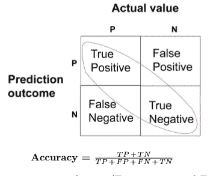
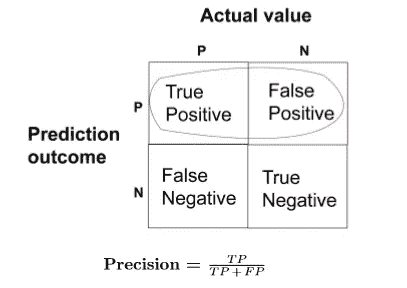

# 机器学习算法的评价指标

> 原文：<https://medium.datadriveninvestor.com/metrics-for-evaluation-of-machine-learning-algorithms-8814c51a0cb2?source=collection_archive---------8----------------------->

在处理数据和训练模型之后，下一步是检查模型的有效性。不同的性能指标用于评估不同的机器学习算法:

# **精度**

当数据中的目标变量类接近平衡时，精确度是一个很好的衡量标准。准确度是二进制分类器的一个相关指标。对于将实例分类为正(1)和负(0)实例的二元分类器，任何单个预测都可以归入下面四个术语中的一个。

 [## 如何使用自动化从您的数据中获得更多价值？数据驱动的投资者

### 去年的新闻故事不停地谈论机器学习变得多么先进。电脑现在…

www.datadriveninvestor.com](https://www.datadriveninvestor.com/2020/02/27/how-to-use-automation-to-get-more-out-of-your-data/) 

a.真阳性(TP):真阳性是指数据点的实际类别为 1(真)而预测类别也为 1(真)的情况

b.真阴性(TN):真阴性是指数据点的实际类别为 0(假)且预测类别也为 0(假)的情况

c.假阳性(FP):假阳性是指数据点的实际类别为 0(假)而预测类别为 1(真)的情况。False 是因为模型预测不正确，而正数是因为预测的类是正数。

d.假阴性(FN):假阴性是指数据点的实际类别为 1(真)而预测类别为 0(假)的情况。“假”是因为模型预测不正确，而“负”是因为预测的类是负的。

分子中是我们的正确预测(真阳性和真阴性)(在上图中标记为红色)，分母中是算法做出的所有预测的类型(正确的和错误的)。

# **精度**

精度说明了正面预测的度量，即 1(真)的预测实际上是正面的。

# **回忆**

回忆告诉我们实际阳性数据点的比例，即 1(真)被预测为阳性，即预测为 1(真)

**访问专家视图—** [**订阅 DDI 英特尔**](https://datadriveninvestor.com/ddi-intel)