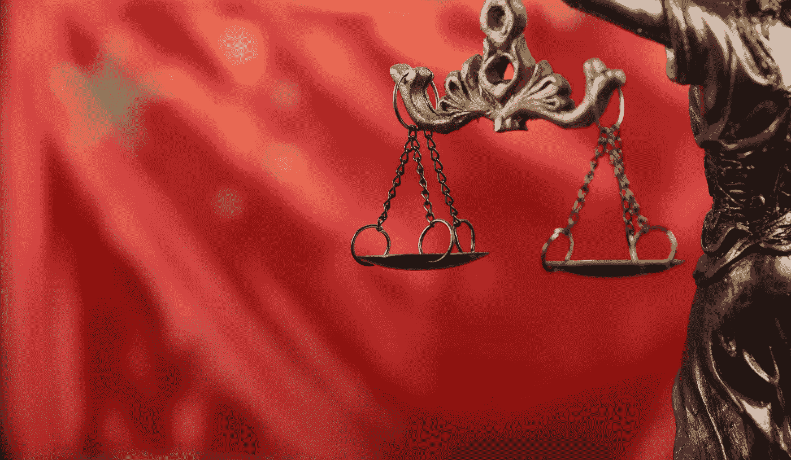
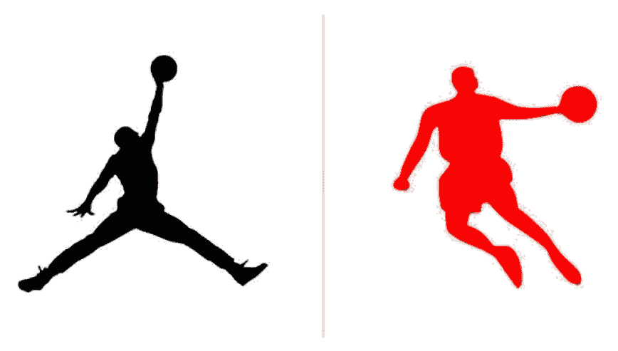
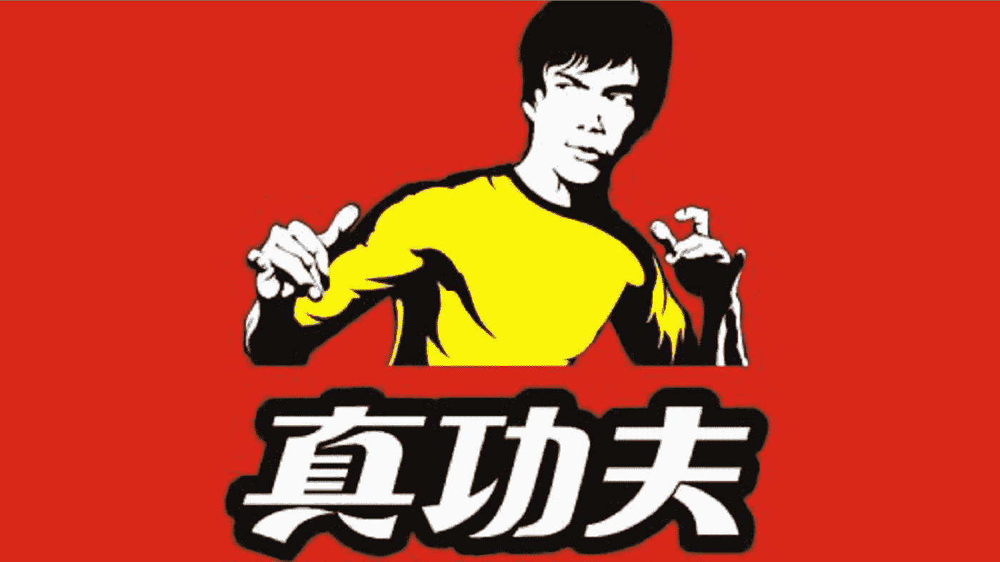

# 迈克尔·乔丹、李小龙和中国商标的未来

> 原文：<https://medium.datadriveninvestor.com/michael-jordan-bruce-lee-and-the-future-of-trademarks-in-china-ed18a80a16ff?source=collection_archive---------32----------------------->

Image via: [Adobe Stock](https://stock.adobe.com/)

# 摘要

近年来，迈克尔·乔丹和李小龙在中国商标领域不断制造新闻，他们的案件旨在保护外国个人和实体在中国的合法知识产权。中国商标法的修正案应该为所有公司提供更广泛的保护；然而，不太知名品牌的所有者是否能像家喻户晓的名人那样有效执法的问题依然存在。

***想呆在对一切都了如指掌的中国？订阅我们的时事通讯让真知灼见直接送达您的收件箱:【www.thechinaguys.com】*******。****

*………*

*知识产权是目前困扰中美关系的许多最棘手问题的核心。强制技术转让、猖獗的版权侵权和难以保护商业秘密都是外国企业在中国每天面临的主要问题。然而，随着成熟的中国公司开始呼吁对他们现在有价值的版权、商标和专利进行更好的知识产权保护，改善知识产权执法的动力也在增长。企业对知识产权保护的需求增加，这与美国和其他国家推动中国兑现更有效执法承诺的努力非常吻合，在所有改善知识产权保护的候选名单中，商标几乎排在首位。最近涉及迈克尔·乔丹(Michael Jordan)和李小龙(Bruce Lee)的案件表明，商标在中国正获得越来越多的敏感性和微妙待遇。*

# *中国商标法的保护和漏洞*

*与中华人民共和国的许多法律一样，商标法没有特别长的历史，最初是在 1982 年改革开放初期颁布的(与其余大部分中国民法典一起)。与邓小平开始引导中国远离毛时代的革命活力后颁布的许多法律一样，中国的标志性制度更类似于欧洲和日本的制度，而非美国的制度。*

*中国的商标政策在几个方面不同于美国的政策。虽然今天的美国商标法基本上是由联邦法规推动的，但它的发展很大程度上可以追溯到反映 20 世纪初美国经济蓬勃发展的案例。因此，美国商标法包括在商业中实际使用注册商标的具体要求。在美国，企业必须在注册后的一段时间内证明商标在商业中的实际使用，否则他们将失去对商标的权利，而中国的申请人可以注册他们认为可能有价值的任何商标。这个系统自然会导致域名被抢注，这个问题已经困扰中国一段时间了，最能说明问题的或许是苹果公司在 2012 年支付 6000 万美元，从一家在它之前注册了这一有价值商标的公司那里获得了 iPad 在中国市场的商标。*

*然而，中国最近对商标制度的修改确实纠正了令人震惊的抢注行为，并为外国实体提供了更多的权利，以保护它们在中国市场的合法商标。2019 年生效的中国商标法增加了新的语言，对没有使用意图的商标申请采取了更强有力的防御措施。*

*然而，并不是所有勇敢的商标申请人都只是蹲在他们的商标前等待外国实体收购他们。一些公司实际上利用了它们，当这种利用可能侵犯外国实体的利益时，诉讼必然会随之而来。近年来的两个案例说明了这一点。*

# *约旦对乔丹*

*After meandering unsuccessfully through lower courts for years, efforts by Michael Jordan to stake claim to his own name in China finally found some success in March 2020\. While Jordan’s dispute was with the Qiaodan Sportswear Company, the case brought by Jordan, which eventually found its way to the Supreme People’s Court of China, was actually against the China National Intellectual Property Administration, naming Qiaodan Sportswear as a third party. The Supreme People’s Court ruled that Jordan had a name right in 乔丹 ( *Qiáodān*) — the transliteration of ‘Jordan’ in Chinese — effectively depriving Qiaodan Sportswear from the ability to use many of its long-held trademarks. Specifically, [the court held](https://wenshu.court.gov.cn/website/wenshu/181107ANFZ0BXSK4/index.html?docId=5175ed72c38840c1bd87ab8a011600ae) “Natural persons have name rights in accordance with the law. Willfully using the name of another who holds prior name rights to register a trademark without permission . . . violates the Trademark Law.”*

*几十年前，在迈克尔·乔丹的全盛时期，乔丹运动服注册了“*乔丹*”的商标，远在 NBA 在中国市场建立强大影响力之前。现在，该公司在中国是中国运动服装行业的巨头，尽管它在国外市场仍相对不为人知。从乔丹无与伦比的名气中获利对该公司早期的许多成功至关重要，自那以后，他们一直不愿承认盗用了这位篮球明星的名字。除此之外，这家运动服装企业辩称，“”仅仅是“乔丹”的音译，这是英语国家中一个常见的姓氏，因此这个词本身并不是指迈克尔·乔丹。然而，他们的论点被证明是没有说服力的，毫无疑问，部分原因是该公司多年来注册了一系列其他与迈克尔·乔丹相关的术语，包括数字 23(迈克尔·乔丹在其职业生涯巅峰时期的数字)，以及乔丹两个儿子的名字。*

*不过，乔丹的胜利只是部分的，因为同时提出的撤销使用他肖像的标志的要求被驳回了。乔丹运动服成功地保护了一个篮球运动员在飞行中的关键商标形象的权利。在某种程度上，这让人想起了耐克的许多飞人乔丹篮球鞋上使用的图像(迈克尔乔丹从中获得了可观的版税)，但这一图像与耐克使用的图像截然不同。*

*评论家们指出这个标记与迈克尔·乔丹手拿球飞向篮筐的标志性形象有相似之处。然而，90 年代充斥着迈克尔·乔丹在空中飞翔的标志性照片。商标通常呈现为白色背景上的红色轮廓，或者相反。因此，一些人认为这只不过是一个普通篮球运动员的形象——也许是受迈克尔·乔丹的启发，但缺乏足够独特的特征来确定。此外，迈克尔·乔丹已经对耐克公司注册的飞人乔丹形象感兴趣，阻止一个人对跳跃的男运动员的所有轮廓主张权利似乎是一个足够合理的判断。*

**

****Left:*** *Nike’s ‘Jumpman’ logo, Michael Jordan has earned more than US$1 billion from endorsement deals with Nike.* ***Right:*** *The logo of Qiaodan Sportswear, under the current ruling, the company loses exclusive rights to the name, but not the logo.* *Source:* [*hypebeast.com*](https://hypebeast.com/2018/3/jordan-brand-countersued-qiaodan-sports)*

*或许最重要的是，该裁决似乎在中国得到了有效执行，至少在诉讼方面是如此。2020 年 8 月，一家下级法院驳回了乔丹运动服提起的诉讼，该诉讼要求禁止在中国 Amazon.com 销售乔丹品牌的商品，并确认乔丹运动服在条款上没有权利自裁决做出后，乔丹运动服已经从其网站上的标识中删除了“”一词，该词现在大多以“乔丹网”的形式出现，受美国和中国不同法律的管辖。*

# *李小龙 vs 小笼包*

*The loss of Michael Jordan’s claim against Qiaodan Sportswear for the supposed rip-off jump-man image serves to set a precedent in another prominent case still making its way through the Chinese legal system. In late 2019, the Bruce Lee Company and Shannon Lee (Bruce Lee’s daughter) filed suit against the Guangzhou-based 真功夫 (‘ *Zhēngōngfū*,’ or simply ‘ *Kungfu*’ as the company brands itself in English), one of China’s largest fast food chains. The chain’s name ‘ *Zhengongfu* ‘ is a play on words, meaning both “real kungfu” and “skilled steaming,” marketing itself as a healthier alternative to deep fried fast food. While the chain’s Chinese name makes a weak connection to the world of martial arts, the logo identifying its stores across China is more problematic.*

*该标志图像似乎只不过是直接从李小龙电影《死亡游戏》(Game of Death)中提取的一个画面的艺术风格化，配有标志性的黄色和黑色运动服，面部细节与这位武术家电影明星有着短暂的相似之处。虽然乔丹运动服使用的跳跃篮球运动员的轮廓可能在一定程度上阻碍了迈克尔·乔丹今年早些时候的努力，但*真功夫*使用的图像并没有那么模糊，乍一看似乎是一个简单的案件。具体来说，本案指控违反了*中华人民共和国民法通则*第一百条:[公民享有肖像权。未经本人同意，不得以营利为目的使用公民的肖像](http://english.mofcom.gov.cn/aarticle/lawsdata/chineselaw/200211/20021100050859.html)。当然，还有很多问题需要解决，比如李小龙去世的事实可以通过其他相关法律来解决，前提是有直系亲属参与。*

*李小龙公司提出的索赔金额为人民币 2.1 亿元(约合 3100 万美元)。虽然这不是一个小数目，但对于一家在中国和东亚成功经营了 600 多家店面的全国性快餐连锁店来说，这是一笔不小的数目。更让真功夫不安的是李小龙公司要求在 90 天内公开宣称与李小龙无关。追溯到去年 12 月该案件提交之前的谣言表明*真功夫*正在与李小龙公司谈判，争议几乎解决。显然，和解还没有实现。然而，完全有可能的是，李小龙公司可能只是利用此案作为杠杆，从真功夫那里获得更好的交易。*

*最终，有证据表明，李小龙公司不会很快在 mainland China 出售清蒸馒头，合乎逻辑的举动将是与*真功夫*达成某种许可协议，继续使用李小龙的肖像(否则，*真功夫*可以随时尝试接近甄子丹，只是稍微修饰一下面部特征，既然你可以让【演员扮演】大师，为什么要满足于学生呢)。*

**

**Zhengongfu*’*s* preferred logo. Facial features and the iconic yellow-black tracksuit leave little doubt as to who the logo is representing. *Source:* [*http://www.zkungfu.cn/*](http://www.zkungfu.cn/)*

# *成熟的知识产权制度*

*迈克尔·乔丹·李小龙两案都代表了中国知识产权制度的成熟。在这两个例子中，大型中国企业都投入了数百万元人民币来打造自己的品牌，尽管它们的品牌取决于国际巨星的形象。在乔丹案中，最高人民法院做出了细致入微的判决，似乎合法地保护了双方的合理利益，而不是简单地做出“乔丹运动服先注册了商标，所以乔丹运动服胜诉”的下意识反应虽然李小龙案件还没有判决，但李小龙公司已经获得了中国商标局的意见，确认其对李小龙的名字和肖像的权利。虽然这些高调的案件可能是中国知识产权执法的胜利，但问题仍然是，当中小企业的合法商标受到侵犯时，它们是否也能在中国找到有效的救济，无论它们是国内企业还是外国实体。*

***进入专家视角—** [**订阅 DDI 英特尔**](https://datadriveninvestor.com/ddi-intel)*

**原载于 2021 年 1 月 7 日 https://thechinaguys.com**[*。*](https://thechinaguys.com/michael-jordan-bruce-lee-and-the-future-of-trademarks-in-china/)**