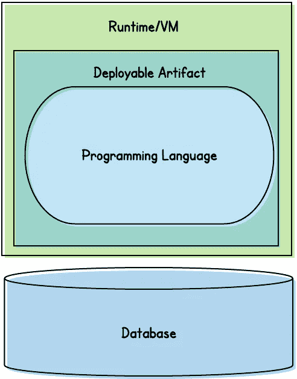
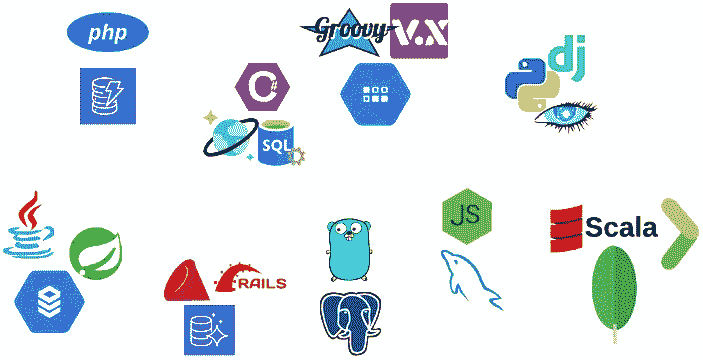
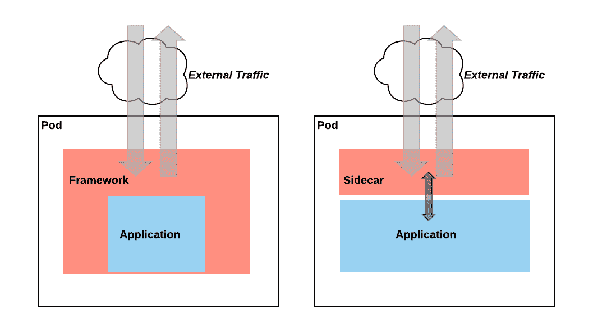

# 微服务是说我们想用什么语言就用什么语言？真的吗？

> 原文：<https://medium.datadriveninvestor.com/microservices-means-that-we-can-use-whatever-language-we-want-really-6ec740ea0f32?source=collection_archive---------0----------------------->

## 当我们说团队可以为他们的微服务选择他们自己的技术时，我们真正的意思是。

Photo by [Sneha Chekuri](https://unsplash.com/@snehachekuri93?utm_source=medium&utm_medium=referral) on [Unsplash](https://unsplash.com?utm_source=medium&utm_medium=referral)

快；让我们列出微服务的一些优势:

*   更敏捷的开发团队，拥有更强的主人翁意识
*   可以更频繁发布的解耦组件
*   根据需要缩小/扩大单个组件的能力
*   团队能够选择实施微服务的技术
*   更多弹性…

坚持住。让我们回到第四项:为我们的微服务选择我们想要的任何技术。这是否意味着，无论我们渴望尝试什么语言，无论我们刚刚读到什么框架，无论什么数据库目前似乎最受欢迎……我们都可以自由、明确地使用它们？

“我们一直在使用 Ruby/Java/。Net/etc 这么久。现在终于可以用 Go/Scala/Node/Python/Kotlin 了！MySQL 变得有些无聊；现在我们可以使用 MongoDB 做任何事情了！”

几乎没有。我们是工程师，受雇解决问题。我们不是糖果店里的孩子，睁大眼睛惊奇地看着摆在我们面前的美味。事实是，这种经常被吹捧的好处伴随着一些主要的警告。

 [## 干净的代码在软件开发中至关重要——这就是为什么|数据驱动投资者

### 干净的代码是“容易理解和容易改变的”，它是关于对细节的关注。但是开发人员为什么要担心…

www.datadriveninvestor.com](https://www.datadriveninvestor.com/2020/05/27/clean-code-is-crucial-in-software-development-heres-why/) 

# 承诺

有了单片代码库，我们的代码被打包并作为一个相互依赖的原子单元进行部署。所以我们通常局限于单一的编程语言，利用单一的框架。

除了我们的 monolith 之外，我们通常还被单一的数据库所困扰。当我们发展到考虑迁移到微服务的时候，我们可能已经进化出一个巨大的关系数据库，充满了外键关系。

Basically, our options with a monolithic codebase

当然，也有例外。一些运行时将执行用混合语言编写的代码。Node 或 JVM 可能允许团队分别引入像 Kotlin 或 TypeScript 这样的语言。或者我们的组织可能混合了一些使用，比如说，MongoDB 来存储文档。但不可避免的是，这些选择非常有限。

当我们的代码库被分成微服务时，这样的技术限制就消失了。理论上，每个微服务都可以用不同的编程语言编写。使用不同的框架。将数据存储在不同的数据库引擎中。

So many options to choose from!

理论上是这样。然而，现实并非如此简单。要理解为什么，我们先来打个比喻。

## 建筑师是城市规划者，有限的环境是区域

在他的书[构建微服务](https://www.oreilly.com/library/view/building-microservices/9781491950340/)中，Sam Newman 著名地讨论了软件架构师的角色。为此，他提出了“城市规划师”的比喻。

城镇规划师负责确保城镇或城市平稳高效地运行。规划者关注更高层次的问题。规划者*对城市进行分区*,保留城市的不同部分用于不同用途(住宅、零售、工业等),而不是规定应该建什么。

此外，规划者还绘制出各区域之间发生的事情*。*

Photo by [JUNHØ](https://unsplash.com/@junhochak?utm_source=medium&utm_medium=referral) on [Unsplash](https://unsplash.com?utm_source=medium&utm_medium=referral)

人员和货物必须能够有效地穿越这些区域，电力、水、天然气、污水等资源也必须如此。因此，在许多情况下，规划者必须确定要部署的最佳基础设施。当然，这座城市可能需要道路，但需要什么样的道路呢？全是路面，还是部分高架？交通怎么样…地铁系统或高架单轨铁路是最好的吗？或者轻轨系统？

重要的是，规划者做出战略性的、全市性的决策来解决城市的当前需求，同时保持足够的灵活性来适应未来的需求。他们保持高水平，关注各区之间发生的事情，这样城市作为一个整体可以为其居民和工人有效地互动和运作。

## 作为区域的有界上下文

然而，规划者并不强制要求在每个区域建造哪些独立的建筑，也不规定每一个建筑的精确位置。正是*区居民*决定了在每个区内到底要建什么*。*

因此，如果建筑师是城镇规划者，那么[有界环境](https://medium.com/datadriveninvestor/if-youre-building-microservices-you-need-to-understand-what-a-bounded-context-is-30cbe51d5085)就是区域。

就像区域居民决定建造什么建筑和在哪里建造一样，有界环境的成员决定:

*   他们需要构建哪些特定的微服务
*   他们需要实施哪些资源，如数据存储、缓存等

毕竟，团队最了解他们的领域。并且他们——而不是架构师——处于设计系统的最佳位置，他们需要这些系统来使他们的领域发挥作用。

# 在有界环境之外发生的事情由架构师决定

就像一个城市的区域不是孤立存在的，我们有限的环境也不是。虽然各区可以自由地在他们认为合适的地方建造他们的建筑，但他们也必须适应城市内的共存。为了允许跨区域旅行，每个都必须提供公交车站(或地铁隧道，或单轨轨道等)。水、电、污水和煤气都必须通过共用管道在不同区域之间流动。当然，每个区域都必须遵守城市的分区法律法规。

类似地，当有限的上下文与组织的其他部分相遇时，团队必须遵守架构师制定的标准和规则。这些标准可能包括:

*   RPC 调用的标准机制——无论是 ReST、Thrift、gRPC 还是其他协议——每个团队都必须遵守
*   **一个标准的消息平台**——可以是 Kafka、Kinesis、Pub/Sub 或其他平台——有界上下文通过它发布和消费事件
*   **标准化的可观察性实践**——例如，通用的日志格式、度量标准的发布、分布式跟踪框架等
*   每个团队必须遵守的安全标准和协议。

因此，在我们有限的上下文之外，我们团队对技术的选择实际上属于我们的架构师。

# 在有界环境中发生的事情，会留在有界环境中(嗯，有点……)

所以这意味着在有限的环境中发生的事情完全取决于我们的团队。对吗？只要我们能(例如)

*   公开和使用这些 gRPC 端点
*   向/从 Kafka 发布/消费
*   使用 Zipkin 将 traceIDs 附加到我们的日志中
*   向 influxdb 发出指标
*   使用信封加密来加密 PII

我们可以选择自己的语言、框架和数据库？让我想想…

## 我们需要复制现有的库

我们将面临的第一个问题是:*所有现有的工具怎么样？*

我们已经讨论了我们团队需要满足的无数要求。十有八九，我们有某种平台团队提供满足这些需求的库。这些库可能是自己开发的，也可能是第三方的。无论哪种方式，它们都被放在一起，以轻松、一致地满足我们组织的要求。

假设我们的组织已经标准化了 *Python。*我们队的工程师要引进*围棋*。因此，我们需要在 Go 中重新实现所有这些功能——迄今为止，任何新的 Python 服务都可以使用这些功能。因为平台团队很可能没有时间、专业知识或兴趣来为我们做这件事。

这可能意味着在 Go 中重写我们自己开发的库。这可能意味着找到兼容的第三方库。但我们会继续工作。此外，像这样的库很少是静态的。所以维护它们也是我们的责任。*永远*。

## 我们需要成为常驻专家

我们将发现的下一件事是——与我们的标准技术堆栈不同——在我们的组织中很少有工程师了解我们想要引入的新技术。

这意味着从一开始，我们就需要成为常驻专家。尝试一项新技术是一回事。但是我们需要足够快的速度来赶上最后期限。此外，一旦我们部署了新玩具，我们将负责保持它们的运行。

我们准备好了吗？

不久前，我监督了几个工程团队，他们已经开始了一个全新的绿地项目。我们的公司最近开始从 Oracle 支持的 monolith 迁移到在 AWS 上运行的 MySQL 支持的微服务。其中一个团队想到了一个主意。由于他们是从零开始，并且将在 AWS 中运行他们的服务，他们将采用 DynamoDB 作为他们服务的数据存储。

我立即怀疑 DynamoDB 是否真的适合团队的用例。但我不是从那里开始的。相反，我提醒团队我们内部的 DBA 团队。这个团队是 Oracle 的专家，也对 MySQL 有很深的了解。但是他们几乎没有使用 DynamoDB 的经验。*你准备好了吗* —我要求团队— *放弃 DBA 支持，成为 DynamoDB 专家？*当然，AWS 将保持 DynamoDB 正常运行。*但是你知道如何优化使用 DynamoDB 吗？当您遇到性能问题时——如果您误用了 DynamoDB，您很可能——您准备好调试它们直到它们被解决吗？*

该团队重新审视了这个想法，并有点不情愿地决定继续使用 MySQL。

## 如果我们离开，组织会不高兴的

即使我们已经决定愿意重新实现组织的所有库和工具，即使我们已经成为新技术堆栈中的常驻专家，我们仍然可能给整个工程组织带来另一个问题。当我们团队的成员离开时，这个问题就会出现。

他们可能会离开公司，或者干脆离开我们的团队。无论哪种情况，都需要有新人来取代这些团队成员。有人需要精通我们引进的任何新技术。

因此，除非我们都从未打算离开团队，更不用说离开公司，或者除非我们的新技术如此引人注目，以至于组织中的其他人都决定学习它，否则我们在团队中引入新技术可能会对我们的组织产生负面影响。

# 那么，自主选择技术真的有好处吗？

在这一点上，我们可能想知道混合技术是否值得。也许我们应该放弃，在我们所有的团队中为我们所有的微服务坚持一个单一的、通用的堆栈？

没那么快。虽然我们在引入新技术时需要谨慎和深思熟虑，但我们仍然可以——也应该——利用微服务给我们带来的这种自由。

*   **某些技术适合特定的用例**。使用函数式语言进行数据转换要比使用通用语言容易得多。每请求线程和基于事件循环的框架各有千秋。关系数据库虽然很有用，但通常不是存储文档或键/值对的最佳选择。
*   事实上，员工满意度(和招聘)是一个问题。如果我们强迫我们的团队坚持静态的、老化的技术堆栈，最好的工程师可能会在其他地方寻找更新的技术。
*   **团队选择不是非此即彼的**。团队仍然可以保留大量的选择和独立性，即使他们都坚持单一的技术栈。我们一会儿就知道是怎么回事了。

因此，让我们看看如何利用微服务给我们带来的技术自由，同时将潜在风险降至最低。

## 让团队选择他们自己的版本

巨石柱最棘手的问题之一仅仅是升级。即使是一个简单的库的小升级也可能对一个完整的代码库产生潜在的负面影响，因此必须仔细完成并彻底测试。升级编程语言本身可能非常困难(例如，这就是为什么如此多的大公司似乎停留在旧版本的 Java 上)。

有了微服务，团队可以更加自由地升级软件版本。无论是库、编程语言、运行时还是数据库的版本，变化的范围通常很小，足以使这些事件变得微不足道。

这并不完全是*自主选择技术*。但是我们不能低估选择自己版本的自由对团队的重要性。即使我们的组织坚持团队使用单一的语言、框架和数据库，让团队容易升级(或不容易升级)将对团队的生产力和士气产生奇迹。

## 一堆被禁止的技术

我们之前已经指出*不同的技术适合不同的用例*。因此，工程组织应该考虑建立一个官方认可的技术库。理想情况下，这个库应该包含一个针对组织面临的每个主要用例的解决方案。

例如，微服务架构在 Java 业务和数据服务之上同时运行 Node.js 服务(通常作为前端服务的[后端)并不罕见。同样，一个组织可能混合使用 MySQL、MongoDB 和 DynamoDB。](https://samnewman.io/patterns/architectural/bff/)

建造这个游泳池的最好方法是什么？组织如何做出两种选择:有意地建立池*，或者让它有机地成长*。**

****有机增长的技术池***
当从整体服务转移到微服务时，工程组织通常会从单一语言和框架开始。*

**

*Photo by [David Boca](https://unsplash.com/@davidboca?utm_source=medium&utm_medium=referral) on [Unsplash](https://unsplash.com?utm_source=medium&utm_medium=referral)*

*在开发和部署了第一组微服务之后，组织中的一部分人(通常是横向的*职能*团队——例如，前端工程)可能会确定所选择的语言/框架不能满足他们的需求。出于必要，该团队通常会承担引入新平台所需的额外工作。考虑到这通常是由水平团队完成的——其成员跨越组织的垂直团队——对新语言/框架的支持通常增长很快。*

*这可能是一个典型的例子，我曾经加入一家公司，帮助它建立蓬勃发展的微服务堆栈。由于该公司的 monolith 是基于 Java/Spring 的，该公司决定将 Java 和 Spring Boot 作为其微服务平台。*

*这是所有工程师的标准平台，包括前端工程师。但事实是，前端工程师不习惯使用 Java 或 Spring。所以前端团队采用 Node.js 作为他们的微服务平台。不可否认的是，他们在 Java/Spring 堆栈方面还有很多工作要做。但最终他们做到了，并随后获得了平台和 devops 团队的支持。*

****有意开发的技术池***
另一方面，一些组织开始有意定义工程团队可以决定使用的有限技术集。组织可能会列出某些预期的用例，并预先确定每个用例将使用哪些技术。*

**

*Photo by [Patric Wong](https://unsplash.com/@patricwong?utm_source=medium&utm_medium=referral) on [Unsplash](https://unsplash.com?utm_source=medium&utm_medium=referral)*

*这有利于确保每个受支持的平台都受到平台团队的同等关注，并且每个平台都与其他平台保持同等水平。缺点是技术的选择是预先决定的。此外，选择通常不是由“在战壕中”的工程师做出的，而是由架构团队——或者可能是平台团队——做出的，他们可能不太了解其他工程团队的日常需求。*

*一个很好的例子是数据库的选择。我之前提到过，不久前，我领导的一些团队表示有兴趣尝试一些其他的数据库引擎。我们不想要的是不同数据库的大杂烩，每个团队在众多可用的数据库中进行选择。*

*因此，我们组建了一个小型工程师团队，请他们研究可供我们使用的各种数据库。然后，我们讨论了每种方法的优缺点，并根据一般用例对它们进行了分类。然后我们确定了三个标准:*

*   *用于关系用例的 MySQL*
*   *用于面向文档存储的 MongoDB*
*   **用于键值存储的 DynamoDB**

*支持替代方案的平台
我们现有的应用程序可能会利用支持多种语言的运行时。在这种情况下，我们可以开始用不同的、受支持的语言开发服务，同时仍然使用我们组织的库。*

*例如，如果我们官方支持的语言是 Java，那么我们可以很容易地采用另一种 JVM 语言——例如 Kotlin 或 Scala。同样，在一个支持 Node.js 微服务的组织中，我们可以很容易地切换到 Typescript，同时仍然利用该组织的官方模块。*

*这延伸到数据库和相关的基础设施。如果我们要部署微服务，很可能是部署到云提供商那里。假设我们已经在使用某个提供商的托管数据存储解决方案，切换到另一个托管数据存储解决方案可能很简单。*

***Sidecars**
随着容器和容器编排的兴起(特别是[Kubernetes](https://levelup.gitconnected.com/what-does-kubernetes-do-anyway-fa4efc3b57f8))[Sidecars](https://dzone.com/articles/sidecar-design-pattern-in-your-microservices-ecosy-1)模式越来越流行。*

*简而言之，sidecar 是在同一个 pod 中，与我们的主应用程序服务并行运行的辅助服务。我们的应用程序和其他 pods 服务之间的流量首先通过 sidecar*路由*。这意味着 sidecar 可以处理常见的“框架级”活动，如加密/解密、负载平衡和电路断开、日志记录和指标发出等。*

**

*On the left, a typical approach in which our application code and our org’s framework run as the same executable. On the right, our application code is one executable, and our org’s sidecar is another. This means (among other things) that the two executables can be written in entirely different languages.*

*那么，这如何为我们的团队提供选择自己技术的自由呢？那么，我们的库执行的许多东西——迄今为止需要导入到我们的应用程序代码中——现在可以卸载到一个完全独立的服务中。此外，服务可以用一种语言编写并在一个运行时上运行，而我们自己应用程序可以在完全不同的环境中编写和运行。*

*例如，网飞最初用 Java 编写了所有的微服务。结果，它用 Java 实现了[一组健壮的库。几年后，尽管大多数微服务仍然是用 Java 编写的，但该公司意识到必须允许团队有一些额外的选择(例如，用于 web 应用程序的 Node.js)。因此，网飞开发了自己的边车实现，](https://netflix.github.io/)[普拉纳](https://netflixtechblog.com/prana-a-sidecar-for-your-netflix-paas-based-applications-and-services-258a5790a015)。Prana 整合了该公司 Java 库提供的功能，使得非基于 JVM 的微服务可以通过 sidecar 模型访问这些功能。*

*因此，假设我们的微服务在容器中运行，并且我们的组织已经开始采用 sidecars 代替框架，我们可能需要用新语言重写的功能要少得多。*

## *启用团队领导*

*到目前为止，我们表现得好像我们的团队是由工程师组成的，他们唯一的愿望就是玩最新的技术。当然，在现实中，这并不是真的。*

*首先，大多数工程师——包括初级工程师——都有足够的专业素养将公司的需求置于他们的技术享受之前。此外，*任何工程团队都应该包括至少一个强有力的工程领导*。在考虑采用新技术时，该领导应该能够冷静地考虑许多因素，包括:*

*   *采用新技术的好处。例如，一个特定的项目可能更适合，比如说，一个键/值存储，而不是公司的标准关系数据库。这个项目可能更适合函数式语言，而不是过程式语言。或者也许团队相信使用新的框架他们会更有效率。*
*   *需要做的额外工作。当然，增加一项新技术会增加团队的工作量。但是增加多少呢？例如，团队需要多长时间才能达到熟练的程度？团队需要复制多少现有的工具？*
*   ***团队拥有新技术的能力。**团队对他们不仅学习新技术，而且成功部署并保持其高效运行的信心如何？当事情在凌晨 3 点出错时，团队能够在没有任何帮助的情况下解决问题吗？*

*因此，领导者应该能够权衡利弊，并引导团队做出明智的决策。*

*此外，领导应该定期与其他团队的领导以及工程领导进行沟通。这样，他们可以评估(并争取)团队之外的支持——其他垂直团队、平台团队和工程管理——来采用新技术。*

# *给工程师的建议*

*如果你是一名渴望尝试一门新语言的工程师，请记住，仅仅因为你的公司使用微服务，你就不是糖果店里的孩子。不要认为你有权利简单地选择一种很酷的新语言——迄今为止你的公司还不知道——并使用它来开始构建你的下一个微服务。在将任何新技术引入您的组织之前，有许多考虑事项需要解决。*

## *考虑你的动机*

*如果你想在你的组织中开始使用一项新技术，首先问问自己*为什么*？是因为你觉得用起来会很好玩吗？或者你认为它会给组织带来真正的好处吗？*

## *考虑它将如何帮助您的组织*

*请注意，这两个问题并不相互排斥。一项新技术可能既有趣又对组织有益。事实上，如果你的组织冒着失去厌倦使用陈旧、过时的堆栈的工程师的风险，员工的快乐可能*就是好处*。*

*也就是说，混合技术的主要好处之一是使用最适合您公司用例的技术。当你考虑是否提议引入一种新的语言、框架或数据库时，请记住这一点。例如:*

*   *引入一种全新的语言，并期望它有稍微好一点的性能，这可能是一种很难的推销。但是引入一种承诺将微服务的占用空间减少几个数量级的语言是另一回事。*
*   *引入一个替代组织已经使用的关系数据库可能是不值得的。但是引入一个全新的数据库类别——比如 MongoDB 或 dynamo db——来释放一组全新的用例可能会。*

## *考虑(并最小化)不利因素*

*前面，我们讨论了将新技术引入工程组织的负面影响。你的提议会带来多大的负面影响？如果你的提议是简单地用科特林编写你的下一个 Spring Boot 微服务，那没什么坏处。引入一种全新的语言和运行时？那是另外一个故事。*

# *给工程领导者的建议*

*当然，每个工程组织都有自己独特的需求和要求。但是，为了给他们的团队提供选择和标准化之间的良好平衡，组织可以考虑如下的方法:*

## *允许团队自由升级*

*任何跨职能团队都不应该被阻止升级其技术组件的版本——至少，不应该被团队本身之外的力量所阻止。这意味着我们组织的*文化*应该允许并鼓励团队的频繁升级。从*实用*的角度来看，这意味着任何自主开发的库都应该最小化传递依赖，这可能会使升级更加困难。*

## *当风险较低时，给予团队更大的灵活性*

*在某些情况下，引入新技术的风险相对较低。如前所述，面向 Java/Spring 的组织中的团队可能很容易引入 Kotlin 作为编程语言。不仅从 Java 到 Kotlin 的学习曲线相当短，Spring 和 JVM 都支持 Kotlin 成为一等公民。此外，Kotlin 可以与现有的 Java 库很好地共存。*

## *建立技术库*

*为了帮助控制使用的语言/技术的数量，同时利用针对不同用例使用不同工具的机会，组织应该考虑创建一个受支持的技术池。*

*我们之前讨论过，这些池可以有意或有机增长。在可能的情况下，我们应该稳妥地从小池塘开始，有机地种植它们。这将有助于我们在满足未来需求和技术趋势方面保持灵活性，同时仍然保持我们的池容量。*

*此外，随着库的增长，我们不应该回避贬低一些语言/框架，并最终将它们作为受支持的组件移除。但这也应该是有机驱动的。*

## *考虑库和框架的替代品*

*提供一套官方的库，或者一个官方的框架，是帮助工程团队用他们编写的每一个服务来满足我们的架构需求的一个很好的方法。不幸的是，这也是将团队局限于单一技术选择的好方法。*

*相反，我们应该考虑库和框架的替代品。例如，sidecar 模式提供了一个有前途的选择，它提供了库/框架的好处，同时允许团队为他们的微服务选择他们自己的技术。*

## *不要忽视开发者的快乐*

*我们喜欢将这样的决定建立在“理性”因素的基础上。然而，在决定是否采用新技术时，我们不能完全忽略开发者的快乐。*

*首先，开发人员的快乐通常等同于开发人员的生产力。此外，我们的工程师的幸福感会影响员工的留任。虽然一个好的工程师可能不会因为不允许使用 X 语言而离开*独自一人*，但这可能会影响他们整体的工作满意度。此外，如果新员工知道他们将能够使用一种新的或有趣的语言/框架工作，并且他们知道他们将有各种技术可以使用，那么招聘工程师就变得更加容易。*

# *参考*

*   *[https://www . oreilly . com/radar/micro services-need-architects/](https://www.oreilly.com/radar/microservices-need-architects/)*
*   *[搭建微服务](https://www.oreilly.com/library/view/building-microservices/9781491950340/)*
*   *[http://high scalability . com/blog/2016/10/12/lessons-learn-from-scaling-Uber-to-2000-engineers-1000-ser . html](http://highscalability.com/blog/2016/10/12/lessons-learned-from-scaling-uber-to-2000-engineers-1000-ser.html)*
*   *[https://netflixtechblog . com/prana-a-sidecar-for-your-网飞-PAAs-based-applications and-services-258 a 5790 a 015](https://netflixtechblog.com/prana-a-sidecar-for-your-netflix-paas-based-applications-and-services-258a5790a015)*

***访问专家视图—** [**订阅 DDI 英特尔**](https://datadriveninvestor.com/ddi-intel)*

*觉得这个故事有用？想多读点？只需[在这里订阅](https://dt-23597.medium.com/subscribe)就可以将我的最新故事直接发送到你的收件箱。*

*你也可以支持我和我的写作——并获得无限数量的故事——通过今天[成为媒体会员](https://dt-23597.medium.com/membership)。*