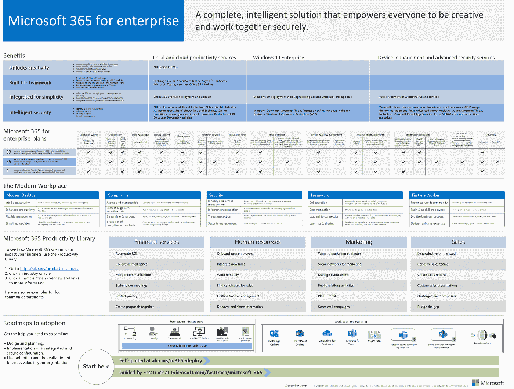
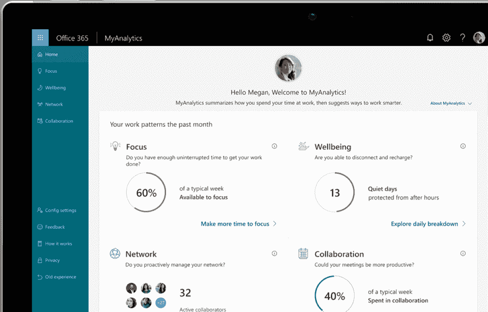
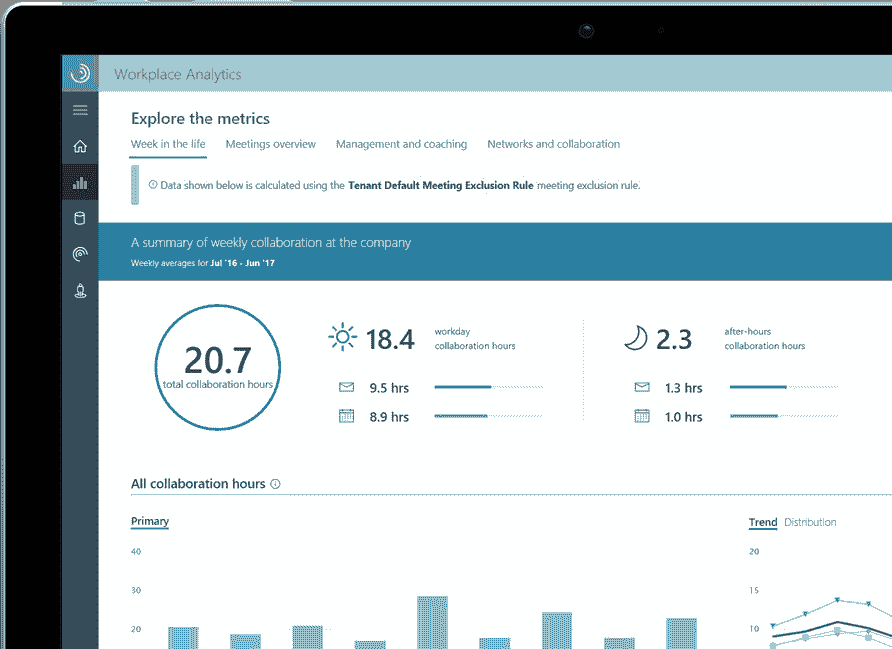
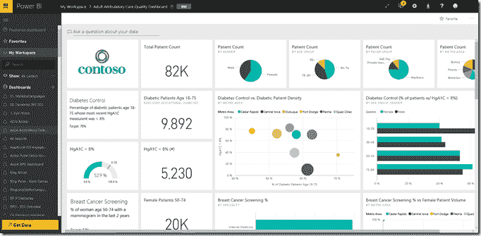
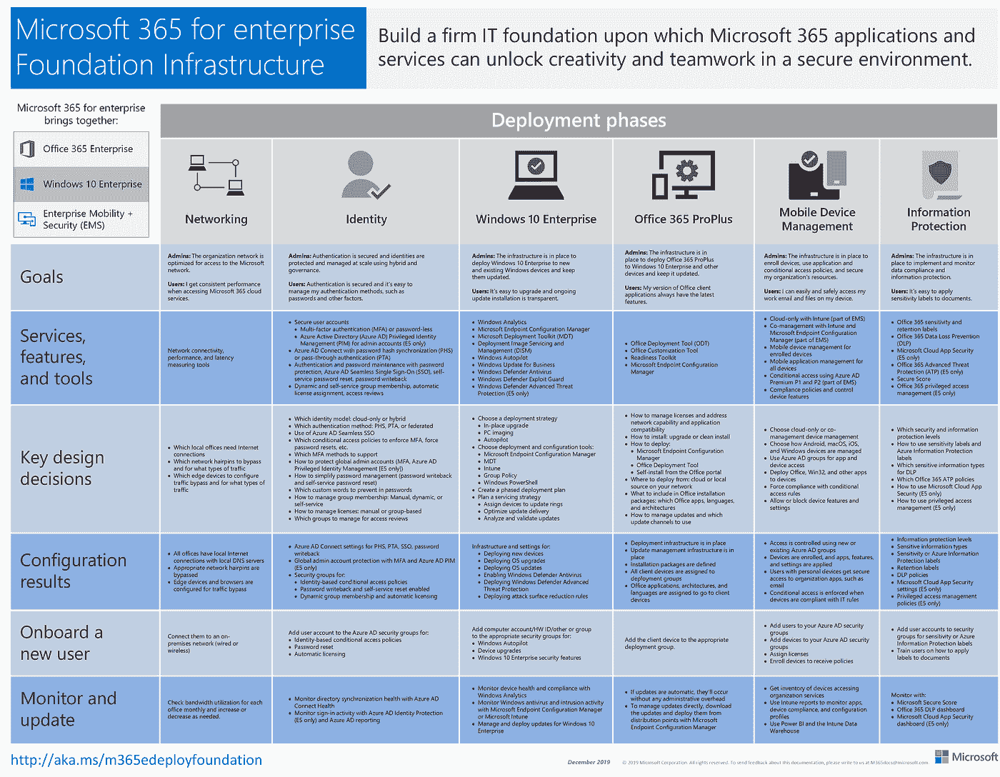

# 微软 365 基础知识

> 原文：<https://medium.datadriveninvestor.com/microsoft-365-fundamentals-c065786a6aa7?source=collection_archive---------10----------------------->

微软 365 是 SaaS 应用和服务的捆绑套件，企业可以订阅。微软 365 提供 Windows 10、Office 365 和企业移动+安全，都捆绑在一起。Microsoft 365 产品和服务增强了安全性和工作效率，并有助于满足合规性要求。在这篇文章中，我将介绍微软 365 的所有特性、功能和机会。我将解释每个主要的主题和技术，并针对关键场景进行演示。您将学习如何管理 Microsoft 365，并帮助您通过 Microsoft 365 考试和认证。

Microsoft 365

# 面向 IT 专业人员的微软 365 简介

微软 365 是 Windows 10、Office 365 和企业移动+安全的 SaaS 捆绑包，以订阅方式出售。在这篇博客中，我将对微软 365 做一个总体介绍，解释它是什么，产品和服务以及好处。微软 365 和 Office 365 的区别，如何从现有的 Office 365 更新到微软 365 订阅。微软 365 的组件、安全特性、微软 365 如何支持现代工作场所并提高用户生产力。这是为[微软 365 基础](https://docs.microsoft.com/en-us/learn/certifications/microsoft-365-fundamentals)做的准备。Office 365 于 2020 年 4 月 21 日成为微软 365 新名称，新优势，相同价格。Office 365 Business 和 Office 365 ProPlus 都将成为微软 365 应用。微软将使用“商业”和“企业”标签来区分这两者。Office 365 企业 E、教育 A、政府 G 和一线工人 F 订阅将没有变化。

# Microsoft365 简介

微软 365 是企业可以订阅的 Windows 10、Office 365 和企业移动+安全的 SaaS 捆绑包。微软 365 有三个版本。

*   微软 365 教育，教育提供商的解决方案。
*   Microsoft 365 Business，适用于多达 300 名用户的小型企业的解决方案。
*   微软 365 企业版，是大型组织的完整解决方案。

SKU 是一个库存单位，它对库存管理很有用，换句话说，是产品的一个特定版本。微软 365 提供的三个 SKU 是微软 365 教育版、微软 365 商务版和微软 365 企业版。

[**微软 365 教育**](https://docs.microsoft.com/en-us/office365/servicedescriptions/office-365-platform-service-description/microsoft-365-education) 是针对高校等教育提供商的解决方案。它包括 Office 365 教育版、Windows 10 教育版以及企业移动性和安全性的核心组件，这些组件以 A3 版本提供，具有较少的工具和解决方案。教育版包括一些特殊的补充，如《我的世界》教育版，旨在促进团队合作和创造力，以及微软教育 Intune，包括一些基于向导的工具，帮助机构管理他们的课堂 IT 资产。

[**微软 365 商务**](https://www.microsoft.com/en-us/microsoft-365/business#compareProductsRegion) 是一款面向多达 300 名用户的中小型企业的解决方案。它包括 Office 365、企业移动性和安全性的商业版本，并且如果您已经拥有 Windows 7 专业版、Windows 8.1 专业版或 Windows 10 专业版许可证，则提供 Windows 10 商业许可证升级。商务 SKU 中包含的许多特殊业务功能和产品旨在帮助没有 IT 部门的小型企业轻松迁移到云。其中包括许多以业务为中心的应用程序，如用于里程跟踪的 MileIQ、为您的账单和付款开具发票以及 Bookings，后者为您的客户提供了一个在线预订系统来进行预约。

[**微软 365 Enterprise**](https://www.microsoft.com/en-us/microsoft-365/compare-microsoft-365-enterprise-plans) ，是面向任何规模组织的云服务和应用的完整解决方案。在 Microsoft Enterprise 中有一个 E3 和一个 E5 订阅。这些产品的 E5 版本提供了最全面的服务和工具，尤其是在安全性和分析方面。E5 包括 Azure Active Directory P2 和 Azure Information Protection P2 许可证。它还包括其他服务，包括微软云应用安全、客户锁箱、MyAnalytics 和高级数据治理。这两种 SKU 还包括 SharePoint、Exchange 和 Skype for Business 的内部服务器权利。

如果您需要一项未包含在原始 SKU 中的服务，您可以随时购买该服务作为现有计划的附加服务。例如，您可以添加安全性、分析和语音功能，以及高级合规性或 Power BI Pro。借助 Microsoft 365，您可以随着业务需求的变化快速轻松地进行伸缩。要为额外的用户或服务扩展您的 Microsoft 365，只需购买额外的许可证。微软将立即提供云基础设施，并管理增加的资源需求。如果您需要存储额外的数据，没有额外的费用，因为这些都包含在每月固定套餐中。

我们将关注微软 365 企业版。

# 微软 365 概述

Microsoft 365 是捆绑在单一订阅中的产品和服务的集合。微软 365 包括 Office 365 ProPlus。这是 Outlook、Word、Excel、PowerPoint 和 OneNote 附带的。这些应用可以通过云访问，也可以本地安装在多个平台上，包括 Windows 10、iOS 和 Android。您还可以将 Office 应用程序安装到每个用户的五个不同设备上。企业还可以使用 SharePoint Online 创建工作组网站和内部网，使用 Microsoft 工作组进行协作，并使用 Exchange Online 保护用户的电子邮件。使用 Office 365 ProPlus，除了流行的 Office 应用程序，您还可以访问 40 多个其他应用程序。这些应用包括 Microsoft Stream、Power BI、Microsoft Flow 和 PowerApps 等应用。Windows 10 企业版许可证包含在 Microsoft 365 企业版订阅中。Windows 10 是一个现代化的云操作系统，支持生物识别登录、触摸和通用应用等功能。它还支持 Windows 自动驾驶仪的现代化管理和设备部署。Windows Autopilot 是一种部署方法，可以减少为用户设置设备所需的时间。管理员可以快速预配置设置，以便设备可以直接发送给用户。一旦这些设备登录到您的 Microsoft 365 租户，它们将被自动配置并注册到您的移动设备管理解决方案中。微软 365 还包括微软企业移动和安全(EMS)，这是一套产品，包括提供基于云的身份和访问服务的 Azure Active Directory，提供文档标记、分类、保护和安全的 Azure Information Protection，以及提供实时监控和针对恶意软件威胁的保护的微软高级威胁分析。微软 365 设备管理，使用 Intune 提供移动设备和应用程序管理解决方案。微软 365 设备管理使用 Intune 来管理多个平台上的设备和应用程序，包括 Windows 10、Android 和 iOS 设备，允许设备访问公司资源，如数据和应用程序，确保设备在访问资源之前合规，通过管理访问限制来保护公司信息，并控制用户如何使用和共享数据以及管理设备上的应用程序，包括应用程序部署、访问和使用。

# 微软 365 的核心服务

让我们看看微软 365 包含的核心服务。微软 365 企业 E3 或 E5 订阅包括 Windows 10 企业版许可证。Windows 10 包括现代安全措施，如 BitLocker 驱动器加密和 Windows Hello。应用程序支持，包括通用的 Windows 应用程序和工具，如 AppLocker、应用程序部署功能、使用配置包和 PowerShell。以及使用 Windows AutoPilot 部署现代设备的能力。Windows 10 采用 Windows 即服务模式交付。以前，Windows 版本更新每隔几年发布一次。但是，在 Windows 即服务模式下，更新会在准备就绪时定期发布。功能更新计划每年两次，提供新功能，而质量更新至少每月发布一次，并提供补丁和修复以及改进安全功能。微软 365 包含的第二个核心服务是 Office 365。Office 365 包括一组应用程序和一组服务。Microsoft 365 企业 E3 版或 E5 订阅包含 Office 365 ProPlus。Office 365 应用程序包括熟悉的 Outlook、Word、Excel、PowerPoint 和 OneNote。OneNote 提供了额外的笔记本，用于存储笔记、注释、数字剪辑等。和 Access 数据库，但这仅适用于 Windows 10 PCs。Office 365 包括各种服务。其中包括 Exchange Online，这是一个基于云的消息和电子邮件服务器。SharePoint Online，它提供了一个功能齐全的基于 web 的协作平台。OneDrive for Business，这是一种云存储服务。Skype for Business，方便在线会议和通话。微软团队，一个合作平台，正在取代 Skype。还有 Yammer，这是一个内部社交网络服务。微软 365 包含的最后一项核心服务是企业移动性和安全性(EMS)。EMS 提供恶意软件保护、信息保护、设备和应用程序管理以及控制。它还包括法规遵从性和归档功能。借助 EMS，您可以获得企业级恶意软件和信息保护。这包括扫描所有附件和 URL 链接中的恶意负载。统一标签，有助于控制和管理数据，并防止数据被外部共享。信息保护，有助于识别和保护敏感数据。和数据丢失防护策略，可用于检查文件和数据的内容。这有助于意外泄露或窃取客户银行信息。EMS 还包括 Microsoft Intune，这是一个移动设备管理(MDM)解决方案。Intune 通过管理和控制手机和 Windows 10 PCs 等设备如何访问和使用应用程序，为设备和应用程序提供保护。Intune 支持所有流行的平台。包括 Windows、macOS、Android 和 iOS 设备。注册后，您可以通过策略控制设备，并部署和管理应用程序。最后，许多企业正受到 HIPAA 和 GDPR 等法规要求的约束，他们必须完全遵照这些法规来管理数据。Microsoft 365 中的企业移动性和安全性提供了归档和数据保存功能，以及更多功能来帮助您履行这些义务。服务信任门户和合规经理提供信息和工具来帮助您实现合规。

# 其他微软 365 服务

Windows 10、Office 365 ProPlus 以及企业移动性和安全性是微软 365 订阅提供的核心服务。这些服务允许部署、管理和保护设备和应用程序。但是，Microsoft 365 订阅还包括其他服务，可帮助提供身份验证和分析功能。Azure Active Directory 或 Azure AD 是基于云的身份验证和身份服务，它管理用户身份，并为所有 Microsoft 365 服务和应用程序提供访问控制。Azure 广告服务连接并集成了所有微软 365 服务、应用和用户。所有 Microsoft 365 订阅都包括 Azure AD，企业 E3 级订阅为您提供 Azure AD P1 许可证，企业 E5 许可证包括 Azure AD Premium 2 许可证，它提供了增强的功能。终端用户和设备需要经过身份验证才能访问您基于云的资源和应用。Azure AD 是身份管理层。它为用户、设备和资源提供身份，包含用户、设备和资源及其相关权限的数据库。Azure AD 提供单点登录(SSO)，允许用户仅使用一个用户名和密码(身份验证令牌)来访问他们被授权访问的所有云服务。这些服务可以是外部服务，如 Office 365、您的企业 Twitter 或 Instagram 帐户，也可以是内部服务，如您定制的基于云的企业应用或内部应用。一旦实施了 Microsoft 365，您就可以使用 analytical services 从存储的数据以及 Microsoft 365 服务的使用情况中获取有意义的信息。分析可以提供关于如何使用数据、数据模式和用户交互的见解，可用于简化和改进您的流程。微软 365 分析服务包括:Workplace Analytics 是一个应用程序，它使用 Office 365 中日常工作的数据来确定影响生产力、员工效率和员工参与度的协作模式。Workplace Analytics 通过让您深入了解整个组织中的团队如何协作，帮助您了解您的组织如何投资时间。Workplace Analytics 对 Office 365 协作进行量化，为业务决策者提供基于证据的文化转型的强大工具。；MyAnalytics(以前称为 Delve)，为最终用户提供个人分析，识别用户如何度过工作时间，并为他们提供更智能的工作方式。MyAnalytics 让员工深入了解个人生产力中的两个关键因素——他们如何支配时间，与谁一起；Power BI 是一种强大的方式，可以可视化您的数据并在整个组织内共享见解。为中小型企业设计的业务应用程序，包括发票、预订和用于里程跟踪的 MileIQ。Power Apps 是一套应用程序、服务、连接器和数据平台，可提供快速应用程序开发环境来构建满足您业务需求的定制应用程序。使用 Microsoft Power Automate(以前的 Microsoft Flow)轻松创建自动化工作流，通过业务流程自动化提高工作效率。微软 ToDo 是一个基于云的任务管理应用。它允许用户从智能手机、平板电脑和电脑上管理他们的任务。

# 与微软 365 的合作

Microsoft 365 旨在提供多种 Microsoft 服务之间的更好集成。这种增强的集成为企业提供了改进的协作功能，允许用户以更高效的方式一起工作。Intune 提供的移动设备管理服务允许用户在旅途中保持联系，无论他们身在何处，都能够访问公司信息。协作是指两个或更多的人一起完成一项特定的任务或项目。团队成员合作提出想法，并提供解决方案。借助 Microsoft 电子白板这一数字画布，利用与 Microsoft 团队集成的 web 电子白板，就工作中的想法进行协作。使用 Microsoft SharePoint online 共享和管理内容、知识和应用程序，增强团队协作能力，快速查找信息，并在整个组织内进行无缝协作。团队和 SharePoint 团队网站都是按主题、项目、组织或团队的其他焦点来组织的。因此，在任何给定的组织中，团队和渠道通常遵循与 SharePoint 团队和项目网站相似的结构。其实这是设计中固有的。每个 Microsoft 团队都自动有一个与之关联的现代 SharePoint 团队网站；那是存储频道文档的地方。每个频道都与 SharePoint 网站文档库中的一个文件夹相关联。此外，在团队渠道之外的用户之间发送的文件存储在发件人的 OneDrive for Business 文件夹中。Microsoft SharePoint 与 Microsoft Teams 集成，帮助团队成员更顺利地运行项目。通过这种方式，可以共享关于最佳实践的信息，并且可以在团队成员之间分配工作量，将任务标记为个人技能。Microsoft 365 还包括其他几个协作工具。这些工具汇集了团队所需的资源，使他们能够更好地合作。这些服务包括从云中提供的在线会议通信服务，使用微软团队(取代 Skype for Business online)，可以共享通话、笔记、文件和图像。您还可以使用 outlook 查看包括共享收件箱在内的电子邮件，以及会议室等资源。您还拥有领导关系，使用 Yammer、Office 365 和微软团队提供单一的沟通和参与解决方案。也是学习和分享，这是你可以众包知识的地方。使用 SharePoint Online 工作组网站在组织内共享最佳实践和信息。通过 Exchange Online 发送电子邮件服务，该服务为 Office 365 ProPlus 提供电子邮件和日历服务，以便在 OneDrive for Business 中共享数据、安排会议和小组活动以及文档存储。提供安全的基于云的存储，可从任意位置跨多个平台访问，并可与他人共享。Office 365 ProPlus 包含在 Microsoft 365 中。但是，有时您可能需要与可能无法访问 Office 应用程序套件的外部协作者共享或共同处理文档。为了实现这些合作，微软提供了 Office on the web。其中包括 Office 应用程序的免费版本，任何人都可以从任何地方在线访问。这些是完整 Office 应用程序的精简版本，因此并非所有功能都可用。然而，它们是协作项目的重要资源。多人可以同时使用同一个文档，并发输入。您还可以轻松地从在线版本切换到桌面版本。

# 企业移动性

企业移动性允许员工使用笔记本电脑、智能手机和平板电脑等各种移动设备在世界任何地方工作。您可以使用移动设备管理来管理、控制和保护您的设备、应用程序和数据。微软 365 包括微软 Intune。Intune 允许您管理 iOS、macOS、Android 和 Windows 设备，如 Windows 10 PCs。您可以注册 Apple 设备、Android 设备和 Windows 设备，甚至可以使用 Windows Autopilot 自动部署 Windows。通过软件更新，您可以将 Windows 更新(如质量和功能更新)部署到您的远程设备。一旦设备注册到 Intune，就可以对其进行全面管理。这包括设备配置，我们可以通过建立规则和要求来配置设备的行为，即在设备上强制执行密码、实施设备加密以及限制允许访问公司数据的移动设备上的操作系统版本。有条件访问，我们可以通过设备策略使用有条件访问来阻止不符合您的策略规则的设备的访问。Microsoft Intune 可用于部署、更新和管理您的应用程序。保护对于需要防止丢失、损坏、泄露和被盗的公司数据至关重要。该保护策略可用于保护企业电子邮件等应用程序中数据的访问和安全性。策略允许您阻止应用程序功能。例如，限制应用程序内的剪切、复制和粘贴，要求加密，以及阻止打印组织数据等功能。这些策略允许您管理应用程序访问，并控制哪些应用程序可以在受管设备上使用。

# 微软 365 分析

分析为您提供了执行数据查询的能力。它允许信息中的模式被发现和解释。然后，您可以基于这些分析做出业务决策。例如，发现仓库中的某个特定产品卖得不太好，但却占据了大量空间，这就允许以不同的方式管理库存水平。微软 365 附带了许多分析工具和应用程序。在您的 Microsoft 365 订阅中，在 Office 365 仪表板上，您可以在右侧看到常用应用程序。当你点击所有应用程序时，我们可以看到许多你可能不熟悉的不同应用程序。让我们在这里回顾一些与分析相关的应用程序。首先，我的分析。这包含在所有 Microsoft 365 Enterprise E5 订阅中。它为您提供生产力跟踪工具，能够分析数据，并建议您可以不同的方式和更聪明的工作。它可以让你专注于你的活动，它可以让你计划你的会议时间，也涵盖了你的福祉。你有多少天的生产力？你保持了多少平静的日子？它分析你如何度过你的时间，和谁一起度过。例如，您网络中的合作者。MyAnalytics 让员工深入了解个人生产力的两个关键因素——他们如何花费时间以及与谁一起度过时间。通过使用 MyAnalytics，您和您的团队可以完成伟大的事情。改善你的人际关系:增加你的协作时间，改进你的团队会议，扩大你的人际网络。获得更多的专注时间:找到更多的时间来排除干扰，停止多任务处理，专注于你的核心优先事项。改善你的工作生活平衡:改善你安静的日子，减少你花在工作上的时间，以获得更好的工作生活平衡和整体幸福。

MyAnalytics

Workplace Analytics 通过让您深入了解整个组织中的团队如何协作，帮助您了解您的组织如何投资时间。Workplace Analytics 对 Office 365 协作进行量化，为业务决策者提供基于证据的文化转型的强大工具。仪表板通过引导式探索突出显示潜在的问题区域，而自定义查询提供灵活的数据访问以创建有价值的分析。通过用业务成果数据扩充 Office 365 数据，从业者可以确定最佳实践、开发预测模型并建立组织基准。借助附加咨询服务，Workplace Analytics solutions 专家将帮助您使用这些数据来识别业务机会、实施变革和衡量成功。Microsoft Workplace Analytics 是一项基于云的服务，可提供对贵公司通信和协作趋势的丰富、可操作的见解，帮助您做出更有效的业务决策。Workplace Analytics 将您的公司选择提供的组织数据与 Office 365 的电子邮件和日历元数据相结合，使分析师能够为企业领导者提供前所未有的关于人们如何花费时间以及与谁一起花费时间的见解。这些见解使企业领导人能够推动销售、员工参与和生产力计划的战略。您可以使用 Workplace Analytics 仪表板浏览数据，并通过使用自定义查询和查询模板更深入地了解您公司的行为指标。Workplace Analytics 提供了以下方法来分析和探索您的数据。

WorkplaceAnalytics

Home 提供分析范围信息和基于研究的行为洞察，了解您的组织如何完成工作，包括员工体验、组织敏捷性和以客户为中心的洞察。作为新用户，您将只能看到新的管理员设置体验，直到您第一次设置 Workplace Analytics。

分析包括以下数据分析工具:浏览仪表板帮助您分析按周、按会议、按网络连接汇总的组织数据趋势，用于管理和指导以及外部协作。查询帮助您调查组织数据以回答特定的问题。人员、会议、组对组和人员对组的不同查询类型使您能够灵活地从多个角度查看数据，并产生强大的洞察力。

Plans 目前提供了一个团队合作改进计划，通过使用 Workplace Analytics 和 MyAnalytics 的组合功能，使团队能够建立更好的协作习惯并掌握他们的时间。您可以使用 Workplace Analytics 来发现团队正在努力应对的挑战，如协作过载，然后将团队登记到 MyAnalytics 的行动计划中，以帮助解决这些挑战。

通过设置，您可以使用以下内容自定义工作场所分析:

*   来源—查看仪表板以验证 Office 365 和组织数据是否已加载。
*   上传—准备并上传组织和客户数据。
*   分析设置—自定义会议排除规则以帮助确保数据准确性。
*   管理设置—配置系统默认值和隐私设置。

我要介绍的最后一个工具是 Power BI。Power BI 是一个强大的数据可视化工具。它汇集了整个组织中不相关的业务数据源，然后分析数据并将其整理到实时仪表板和报告中。让我们来看看。在 Power BI 主页上有许多收藏夹和项目。这些被组织到工作空间中。我们可以看到 Power BI 仪表盘并打开它们。这个实时仪表板让我们可以询问它。它包括可视化。这些是代表数据的图表、地图和图形。我们还可以访问数据集，在那里我们可以创建新的可视化效果，还可以查看与一组数据相关的快速洞察。我们可以访问报告，这是一个页面上的可视化集合，允许共享可视化和报告。和平铺，它们是在报告或仪表板中找到的单个可视化。

Power BI

# 深入了解 Microsoft 365 和 Office 365 产品和服务

[Office 365](https://www.microsoft.com/en-us/microsoft-365/business/compare-more-office-365-for-business-plans) 是云中的办公应用程序，旨在提高业务效率和协作。它包括 Word、Excel、SharePoint Online、用于电子邮件的 Exchage online、用于聊天和会议的 Microsoft Teams 以及用于存储文件的 OneDrive for Business 等产品和服务。它适用于所有设备类型和平台，包括 PC、智能手机和平板电脑，包括 Android 和 iOS。[微软 365](https://www.microsoft.com/en-us/microsoft-365/business/compare-more-office-365-for-business-plans)SaaS 捆绑 Windows 10、Office 365 和企业移动+安全(Azure Active Directory、Azure Information Protection 和 Intune)，企业可以订阅。软件即服务是一种软件交付方法，在这种方法中，第三方(在本例中为微软)在订阅的基础上通过互联网托管和分发应用程序。Office 365 于 2020 年 4 月 21^st^成为微软 365 的新名称、新优势、相同价格。Office 365 Business 和 Office 365 ProPlus 都将成为微软 365 应用。微软将使用“商业”和“企业”标签来区分这两者。Office 365 企业 E、教育 A、政府 G 和一线工人 F 订阅将没有变化。

M365 Foundations

微软 365 包括**微软 365 应用** (Office 365 ProPlus)，分别是 Word、Excel、PowerPoint、OneNote、Publisher(仅限 PC)、Access(仅限 PC)。

**电子邮件和日历连接**:将企业级电子邮件、日历和联系人全部放在一个地方，保持井然有序。 *Outlook，Exchange Online* for Mail。

**会议和语音**:通过先进的通话功能和一个用于会议、聊天、内容和与*微软团队*通话的中心枢纽，提供更高级的会议体验。

**社交和内联网:**通过智能的移动内联网和企业社交网络，在您的整个组织内进行联系和互动。 *SharePoint Online* 是一个用于存储、共享数据和协作的网络平台。 *Yammer* 分享想法和新闻的内部社交网络。

**文件和内容:**随时从任何设备访问文件。使用智能视频，在几分钟内创建引人注目的视觉内容。 *OneDrive* 用于文件存储和文件共享业务。 *Microsoft Stream* 视频流服务使团队或整个组织内的创建、安全共享和互动变得更加容易。Microsoft Sway 是一个数字故事展示平台，用于创建和分享交互式报告、时事通讯、故事等。一种简单、直观的组织团队工作的方式。 *Power Apps* 是一套应用、服务、连接器和数据平台，可提供快速应用开发环境，以构建满足您业务需求的定制应用。使用 *Microsoft Power Automate* ，以前的 *Microsoft Flow* ，轻松创建自动化工作流程，通过业务流程自动化提高工作效率。*微软 ToDo* 是一款基于云的任务管理应用。它允许用户从智能手机、平板电脑和电脑上管理他们的任务。

**高级分析:**借助个人和组织的生产力洞察，更智能地工作。借助高级分析功能，做出快速、明智的决策。使用 *MyAnalytics* 探索您的工作模式，并学习更智能地工作的方法——提高您的关注度、幸福感、网络和协作。*Microsoft Workplace Analytics*是一项基于云的服务，可提供对贵公司通信和协作趋势的丰富、可操作的见解，帮助您做出更有效的业务决策。使用 *Power BI Pro* 与同事协作、建立数据模型、创作内容、共享仪表板、发布报告以及执行即席分析。通过使用 *Power BI Pro* 进行自助式分析来创建数据驱动的文化，并在交互式数据可视化上轻松共享和协作。

**设备和应用管理:**帮助用户随时随地高效工作，同时确保公司信息的安全。灵活的管理和强大的安全解决方案让您能够在任何设备上提供受保护的移动体验。(Windows、macOS、IOS、Android) *微软 365 管理中心*管理微软 365 服务中的应用、服务、数据、设备和用户。*微软终端管理器*有助于提供现代化的工作场所和现代化的管理，以确保您的数据在云和内部的安全。Microsoft Endpoint Manager 是用于管理所有终端的单一集成终端管理平台。Endpoint Manager 包括 Intune、Configuration Manager、Desktop Analytics、Autopilot、设备管理管理控制台中的功能以及用于管理和监控移动设备、台式计算机、虚拟机、嵌入式设备和服务器的服务。*微软 Intune* 是基于云的移动设备管理(MDM)和移动应用管理(MAM)。Intune 包含在微软的企业移动+安全(EMS)套件中，使用户能够在保持组织数据受保护的同时提高工作效率。它与其他服务集成，包括微软 365 和 Azure Active Directory (Azure AD)以控制谁有权访问，他们有权访问什么，以及 Azure 信息保护以保护数据。当您将它与 Microsoft 365 配合使用时，您可以让您的员工在其所有设备上高效工作，同时保护您组织的信息。 *Windows Autopilot* ，微调用户体验，以及 Windows Analytics 设备健康状况。 *Windows Autopilot* 是一个零接触、自助式 Windows 部署平台。Windows Autopilot 流程在新计算机首次开机后立即运行，使员工只需点击几下鼠标，即可将新设备配置为业务就绪。

**身份和访问管理:**保护人员、设备、应用和数据之间的连接。利用单一、全面的身份解决方案提高您的安全性和工作效率，为您提供灵活性和控制力。 *Device Guard* 是 Windows 安全功能之一，结合了企业相关的硬件、固件和软件安全功能。当一起配置时，它将锁定设备，以便它只能运行可信的应用程序。

*凭证保护*使用基于虚拟化的安全性来隔离机密，以便只有特权系统软件才能访问它们。设备防护和凭证防护是这样的功能，当实施和启用时，通过要求在设备上启用额外的保护器来减少恶意软件的暴露攻击面。

***【Azure AD】***Azure Active Directory 是基于云的身份和访问管理服务，帮助您的员工登录和访问外部和内部资源。外部资源，如 Microsoft Office 365、Azure 门户和数以千计的其他 SaaS 应用程序。内部资源，如公司网络和内联网上的应用程序，以及您自己的组织开发的任何云应用程序。

*   **Azure 活动目录免费。**为云用户提供用户和组管理、内部目录同步、基本报告、自助密码更改，以及跨 Azure、Office 365 和许多流行的 SaaS 应用的单点登录。
*   **Azure Active Directory 高级 P1 版。**除了免费功能，P1 还允许您的混合用户访问内部和云资源。它还支持高级管理，如动态组、自助服务组管理、Microsoft Identity Manager(一种内部身份和访问管理套件)和云回写功能，允许您的内部用户自助重置密码。
*   **Azure Active Directory 高级版 P2。**除了免费和 P1 功能，P2 还提供 [Azure Active Directory 身份保护](https://docs.microsoft.com/en-us/azure/active-directory/identity-protection/overview-identity-protection)来帮助提供对您的应用和关键公司数据的基于风险的条件访问，以及[特权身份管理](https://docs.microsoft.com/en-us/azure/active-directory/privileged-identity-management/pim-getting-started)来帮助发现、限制和监控管理员及其对资源的访问，并在需要时提供即时访问。
*   **Azure Active Directory B2C**(Azure AD B2C)是一项身份管理服务，支持您的客户在使用您的 iOS、Android、.NET、单页(SPA)和其他应用程序。Azure Active Directory B2C 提供企业对客户身份即服务。您的客户使用他们首选的社交、企业或本地帐户身份来获得对您的应用程序和 API 的单点登录访问。在 Azure Active Directory B2C(Azure AD B2C)中，租户代表您的组织，是用户的目录。每个 Azure AD B2C 租户都是不同的，并与其他 Azure AD B2C 租户分开。Azure AD B2C 租户不同于 Azure Active Directory 租户，后者可能已经存在。
*   **Azure AD 企业对企业** (Azure AD B2B)协作，与任何组织的访客用户和外部合作伙伴安全地共享您公司的应用程序和服务，同时保持对您自己公司数据的控制。Azure AD B2B，合作伙伴使用他们自己的身份管理解决方案，因此您的组织没有外部管理开销。合作伙伴使用他们自己的身份和凭证；无需管理外部帐户或密码，也无需同步帐户或管理帐户生命周期。

**信息保护**随时随地保护您的敏感数据，即使是在移动中或共享时。借助全面、集成的信息保护解决方案，获得对任何文件使用方式的可见性和控制。防止敏感数据泄露的数据丢失防护。符合法规和数据保护法规的数据隐私。 [*Azure 信息保护*](https://azure.microsoft.com/en-us/pricing/details/information-protection/) 帮助您对数据进行分类、标记和保护。控制并帮助保护公司内外的电子邮件、文档和敏感数据。从轻松分类到嵌入标签和权限，使用 Azure 信息保护随时增强数据保护，无论数据存储在何处或与谁共享。Azure Information Protection 是一个基于云的解决方案，可以帮助组织通过应用标签来分类并选择性地保护其文档和电子邮件。标签可以由定义规则和条件的管理员自动应用，也可以由用户手动应用，或者结合使用这两种方式向用户提供建议。 *Office 365 数据丢失防护*有助于防止意外或不当的信息共享。为了遵守业务标准和行业法规，组织必须保护敏感信息，防止无意中泄露。敏感信息可能包括财务数据或个人身份信息(PII)，如信用卡号、社会保险号或健康记录。借助 Office 365 Security&Compliance Center 中的数据丢失防护(DLP)策略，您可以识别、监控和自动保护 Office 365 中的敏感信息。 [*微软云应用安全*](https://docs.microsoft.com/en-us/cloud-app-security/) 全面的云安全，帮助保护和控制云应用中的敏感数据。*微软云应用安全*是一家多模式云访问安全代理公司(CASB)。它提供丰富的可见性、对数据传输的控制和复杂的分析，以识别和应对所有微软和第三方云服务的网络威胁。Microsoft Cloud App Security 是一个云访问安全代理，支持各种部署模式，包括日志收集、API 连接器和反向代理。 *Windows 信息保护(WIP* )，以前称为企业数据保护(EDP)，有助于防止这种潜在的数据泄露，而不会影响员工的体验。WIP 还有助于保护企业应用和数据，防止员工带到工作场所的企业自有设备和个人设备上的意外数据泄漏，而无需更改您的环境或其他应用。最后，另一种数据保护技术 Azure Rights Management 也与 WIP 一起工作，以扩展对离开设备的数据的数据保护，例如当电子邮件附件从权限管理邮件客户端的企业感知版本发送时。*借助 Office 365，您的数据在静态和传输过程中都会被加密*，使用多种强大的加密协议和技术，包括 Bitlocker、传输层安全/安全套接字层(TLS/SSL)、互联网协议安全(IPSec)和高级加密标准(AES)。静态数据加密包括您上传到 SharePoint 库的文件、Project Online 数据、您上传到 Skype for Business meeting 的文档、您存储在 Office 365 邮箱文件夹中的电子邮件和附件，以及您上传到 OneDrive for Business 的文件。传输中的数据加密包括正在传递的邮件消息，或者在联机会议中进行的对话。在 Office 365 中，每当用户的设备与 Office 365 服务器通信时，或者当 Office 365 服务器与另一台服务器通信时，数据都在传输中。使用 Office 365 邮件加密，您的组织可以在组织内外的人员之间发送和接收加密的电子邮件。Office 365 邮件加密与 Outlook.com，雅虎！、Gmail 和其他电子邮件服务。电子邮件加密有助于确保只有目标收件人可以查看邮件内容。

**威胁防护:**检测和调查您的内部和云环境中的高级威胁、泄露身份和恶意行为。利用自适应的内置智能保护您的组织。*Microsoft Threat Protection*是一款统一的漏洞前和漏洞后企业防御套件，能够跨终端、身份、电子邮件和应用进行本机集成，以检测、预防、调查和自动响应复杂的攻击。借助集成的微软威胁防护解决方案，安全专业人员可以将这些产品收到的威胁信号缝合在一起，并确定威胁的全部范围和影响；它是如何进入环境的，它受到了什么影响，以及它目前对组织有何影响。Microsoft Threat Protection 会自动采取措施来防止或阻止攻击，并自我修复受影响的邮箱、端点和用户身份。 [*Office 365 高级威胁保护*](https://products.office.com/en-us/exchange/advance-threat-protection) 保护您的组织免受网络钓鱼和零日恶意软件等复杂威胁，并自动调查和修复攻击。 *Microsoft Defender 高级威胁防护*是一个旨在帮助企业网络预防、检测、调查和响应高级威胁的平台。微软 Defender ATP 使用 Windows 10 内置的以下技术组合和微软强大的云服务:

*   端点行为传感器:嵌入在 Windows 10 中，这些传感器收集和处理来自操作系统的行为信号，并将这些传感器数据发送到您的私有、隔离的 Microsoft Defender ATP 云实例。
*   云安全分析:利用跨 Windows 生态系统、企业云产品(如 Office 365)和在线资产的大数据、机器学习和独特的微软光学技术，行为信号被转化为对高级威胁的洞察、检测和建议的响应。
*   威胁情报:由 Microsoft hunters、安全团队生成，并由合作伙伴提供的威胁情报进行补充，威胁情报使 Microsoft Defender ATP 能够识别攻击者的工具、技术和程序，并在收集的传感器数据中观察到这些信息时生成警报。

*Azure 高级威胁防护(ATP)* 云服务有助于保护您的企业混合环境免受多种类型的高级针对性网络攻击和内部威胁。Azure 高级威胁保护(ATP)利用您的内部活动目录信号来识别、检测和调查针对您的组织的高级威胁、受损身份和恶意内部操作。Azure ATP 通过捕获和解析网络流量并利用直接来自域控制器的 Windows 事件来监控域控制器，然后分析攻击和威胁的数据。利用分析、确定性检测、机器学习和行为算法，Azure ATP 了解您的网络，实现异常检测，并警告您可疑的活动。

设备防护，保护设备硬件免受恶意代码攻击。隔离和保护关键系统和密码的凭证保护，提供沙盒环境的 Windows 沙箱，用于生物识别的 Windows Hello。

**安全管理**

获得对您的云应用和服务的可见性，通过复杂的分析建立洞察力，并控制您的数据传输方式，以便您可以响应和应对网络威胁。*安全得分*获得您需要的可见性、洞察力和指导，以最大限度地提高您组织的安全状况，并充分利用 Microsoft 365 和 Azure security。Microsoft 安全分数是对组织安全状况的一种衡量，数值越高，表示采取的改进措施越多。遵循安全分值建议可以保护您的组织免受威胁。通过 Microsoft 365 安全中心的集中控制面板，组织可以监控和处理其 Microsoft 365 身份、数据、应用程序、设备和基础架构的安全性。目前有针对 Office 365(包括 SharePoint Online、Exchange Online、OneDrive for Business、Microsoft Information Protection 等)、Azure AD 和云应用安全的建议。其他安全产品的推荐，如 Azure ATP 和 Microsoft Defender ATP，即将推出。这些建议不会涵盖与每个产品相关的所有攻击面，但它们是一个很好的基准。您还可以将改进措施标记为由第三方负责。微软安全与合规中心*微软 365 合规中心*可让您轻松访问管理组织合规需求所需的数据和工具。*Office 365 安全&合规*中心旨在帮助您为您的组织管理整个 Office 365 的合规功能。指向现有 SharePoint 和 Exchange 合规性功能的链接汇集了 Office 365 的合规功能。使用简化的评估工具评估您的合规风险。借助高级 eDiscovery、客户锁箱、高级数据治理、使用客户密钥的服务加密和特权访问管理，智能地响应请求并保护设备、应用和云中的数据。*微软服务信任门户*提供关于微软安全、隐私和合规实践的各种内容、工具和其他资源。*微软 Azure Sentinel* 是一款可扩展的云原生安全信息事件管理(SIEM)和安全协调自动响应(SOAR)解决方案。Azure Sentinel 在整个企业中提供智能安全分析和威胁情报，为警报检测、威胁可见性、主动搜索和威胁响应提供单一解决方案。Azure Sentinel 是您在整个企业中的鸟瞰图，缓解了日益复杂的攻击、不断增加的警报量和长时间的解决方案所带来的压力。跨内部和多个云中的所有用户、设备、应用程序和基础架构收集云规模的数据。检测以前未检测到的威胁，并使用微软的分析和无与伦比的威胁情报最大限度地减少误报。利用人工智能调查威胁，大规模搜寻可疑活动，利用微软多年的网络安全工作。借助内置的流程编排和常见任务的自动化，快速响应事件。

# 微软 365 合规性

Most organizations need to meet regulatory compliance standards. These can be government standards, such as the General Data Protection Regulations, or GDPR in the EU, or the Health Insurance Portability and Accountability Act, or HIPAA, and the Sarbanes-Oxley Act in the U.S. There are also industry specific standards that need to be met. Microsoft 365 includes a dedicated security and compliance center within the Microsoft 365 portal. This allows you to manage security and compliance controls across Office 365 ProPlus, Windows 10, and EM + S services from one location. Within Microsoft 365 Admin Center under Admin centers in the Security and Compliance we can see the Microsoft 365 Security and Compliance center. All our data controls and information, including reports, are shown in one portal across Microsoft 365 and Office 365, including Threat management, and Service assurance. In addition, the Microsoft 365 security and compliance components each have a dedicated portal which you can access from Microsoft 365 Security and Compliance center. The Microsoft 365 Security and Compliance Center include specialist tools for data loss prevention, which helps identify and protect your organization’s sensitive information preventing it from being shared with the wrong people. Data governance which allows you to set data retention policies, data classification, which allows you to classify and label sensitive information types contained within your online documents. Threat management includes reports on the current status of your system and allows you to review quarantined items. Service assurance shows how Microsoft are meeting their own compliance obligations through the compliance reports and trust documents which you can use to help in your business. Data privacy provides access to the GDPR dashboard and allows you to respond to GDPR data requests, and finally, the search and investigation portal allows you to perform e-discovery content and audit logged searches in support of your data compliance requirements. Other tools are also included with Microsoft 365 to help you keep control of your data. These include Azure Information Protection, which protects sensitive information in emails and documents by using labels, encryption, and controls, Microsoft Cloud App Security, which allows you to monitor all cloud based traffic passing through your network firewall, and Secure Score which helps you to understand your organization’s security position by scoring your current security provisions. It also provides help and guidance on how you can improve your security protections. Outside of your Microsoft 365 subscription you can also access other Microsoft compliance resources. The Service Trust Portal provides information, tools, and resources which show you how to manage your own security compliance and privacy. The Service Trust Portal is divided into sections of compliance with Microsoft audit reports by independent third party audit assessors and also access to the Compliance Manager tool to help you track and manage your own compliance progress. You could also see industries and regions, which provide information on industry and region specific compliance information. Also within the Service Trust portal you can see documents and resources with Microsoft security and design information such as white papers, FAQs, and How-To articles regarding their service assurance. Microsoft Trust Center provides information about cloud service functionality which you can use to support GDPR compliance. My Library component is a document storage area where you can save relevant compliance documents for easy access and retrieval and the Admin is the administrative area to manage settings and access controls. To access the Service Trust Portal you can use the Service Trust portal or navigate from the Microsoft 365 Admin Portal. From the Microsoft 365 Security and Compliance Center, scroll all the way down on the left hand side and click Service Assurance. Here we can see the dashboard compliance reports, trust documents, compliance manager, and settings section. The dashboard allows you to configure industry and regional settings for your business. Select Region like North America. Select the market or industry that you belong to. And then click save. We can now access documents provided by Microsoft that relate to specific region and vertical market. Select the Compliance Manager, use the links here to direct to the Service Trust Portal. The Service Trust Portal allows to access a variety of tools and third-party audit reports and other resources that Microsoft provides to help with security, privacy, and compliance needs. The Compliance Manager, helping track and manage compliance controls within an organization. Here you can see the assessments dashboard of the compliance manager and it allows you to focus and record all information relating to a specific compliance requirement, such as GDPR. You can track your customer controls and delegate them to members of team, or set the Microsoft Managed Controls and see a fully worked example of how Microsoft implemented GDPR within their organization. You can see specific controls, the details relating to them, and also how they tested and implemented the control. Furthermore, if you want to export the whole report to Excel you can do this either for Microsoft controls or controls within your business. Click export and then launch Excel. Here we can see the Microsoft Managed Controls relating to the specific GDPR components that we need to be compliant for. We can see the description, compliance score, status implemented and also the test plan and the details of how Microsoft provided compliance with this standard. Compliance Manager provides an easy to use workflow control tool to help you track your compliance progress against multiple regulatory frameworks, including GDPR and HIPPA, all from a single dashboard. It also provides examples of how Microsoft managed their own compliance goals against a number of frameworks. Within Compliance Manager you can delegate compliance tasks that need to be completed to members of your team. You can track their progress and once tasks have been successfully completed, Compliance Manager is updated to show you your compliance progress, your organizational progress, and the example from Microsoft is available to download in Excel format from the Compliance Manager. In addition to the Office 365 Security and Compliance Center compliance administrators have access to the Microsoft 365 Compliance Center. Microsoft 365 Compliance Center, which is a specialized workspace for your compliance, privacy, and risk management needs. The Monitoring and reports section allows you to view data loss prevention issues and policy matches. It also pulls in information related to MCAS, or Microsoft Cloud App Security, and provides links directly to those tools. You can view your classification, labels, label policies, and review sensitive information types. You can view your data subject requests related to GDPR and other regulations, and review your tenant permissions for your security and compliance roles. The more resources item provides links to other resources such as your Security Center, Security and Compliance Center, Azure Active Directory, and Azure Information Protection.

# 从 Office 365 升级到 Microsoft 365

Office 365 于 2020 年 4 月 21 日成为微软 365 新名称，新优势，相同价格。订阅费用不会改变。Office 365 Business 和 Office 365 ProPlus 都将成为微软 365 应用。微软将使用“商业”和“企业”标签来区分这两者。Office 365 企业 E、教育 A、政府 G 和一线工人 F 订阅将没有变化。许多 Office 365 订阅自动成为 Microsoft 365 订阅。你不需要采取任何行动。

以下 Office 365 for enterprise plans 没有变化:

*   G1 A1 区 365 号办公室
*   365 号办公室，A3，G3
*   办公室 365 E5，A5，G5

现有的 Office 365 Business、Office 365 Business Essentials、Office 365 Business Premium 或 Microsoft 365 业务计划不需要采取额外的措施。这些变化会自动发生。

从 Office 365 Enterprise 升级到 Microsoft 365 Enterprise 是许可证和订阅的升级。任何时候，你都可以注册 30 天的微软 365 试用版。您可以在您的 Office 365 管理门户的“计费”部分完成此操作。一旦您准备好升级，有三种方法可以完成。这些是

*   咨询您的云解决方案提供商(CSP)。这是您用来购买 Microsoft 服务的供应商。
*   如果您使用批量许可购买了 Office 365，请联系您的 Microsoft 合作伙伴或 Microsoft 授权教育合作伙伴安排升级。
*   请致电 Microsoft 支持部门，要求他们更改您的许可计划。

*最初发表于*[*【https://github.com】*](https://github.com/ealtili/Blog/blob/master/Microsoft365/Microsoft365Intro.md)*。*