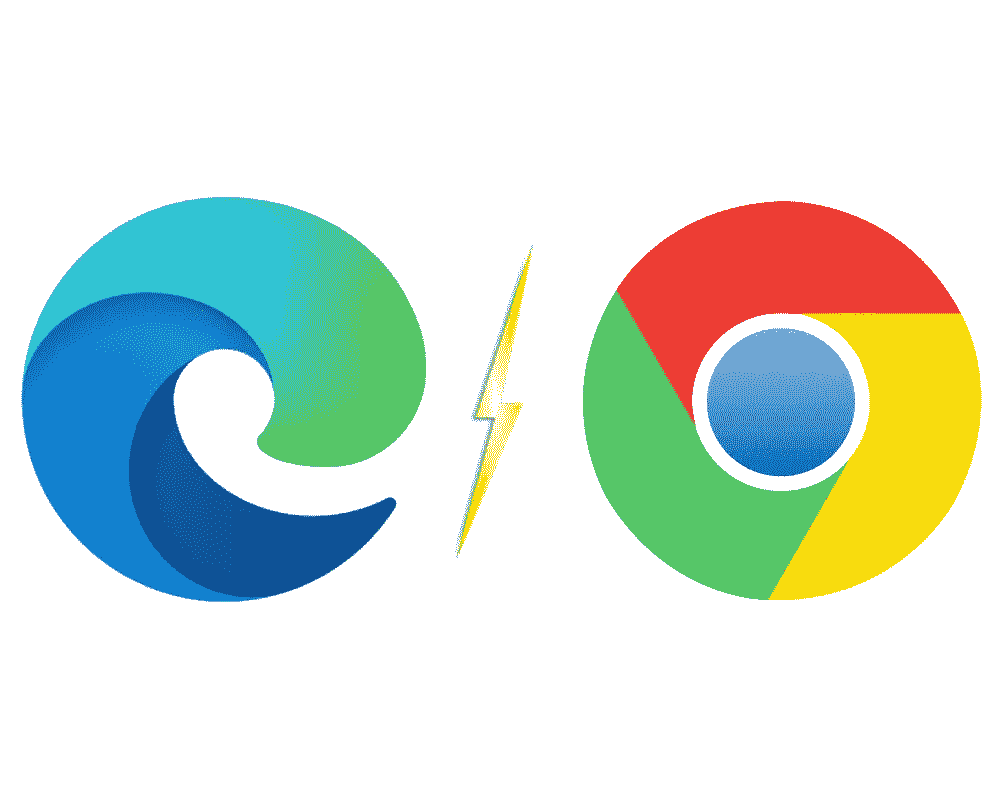
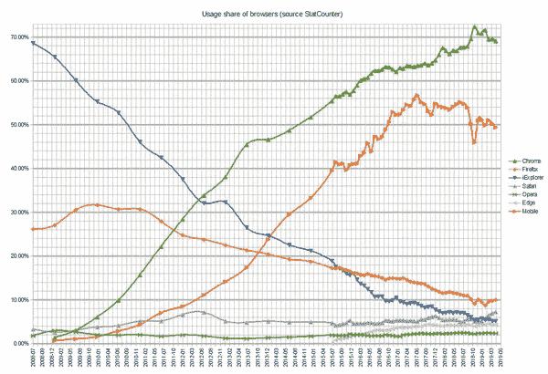
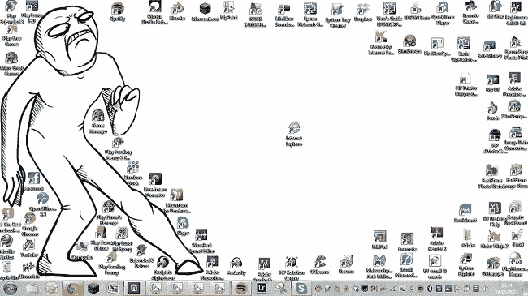
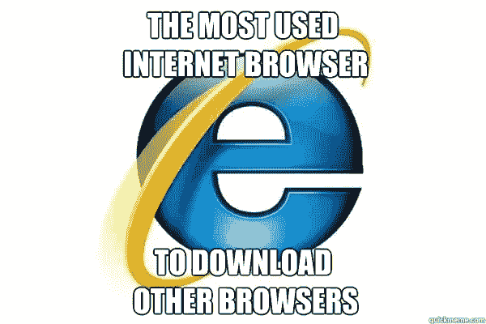
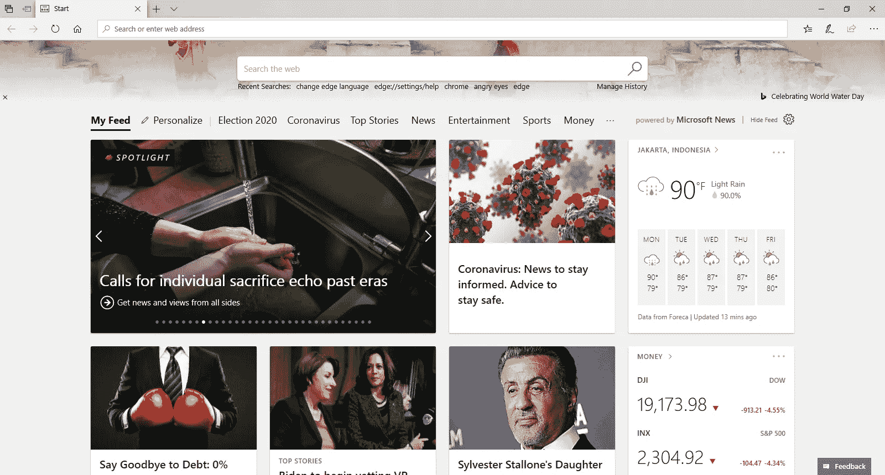
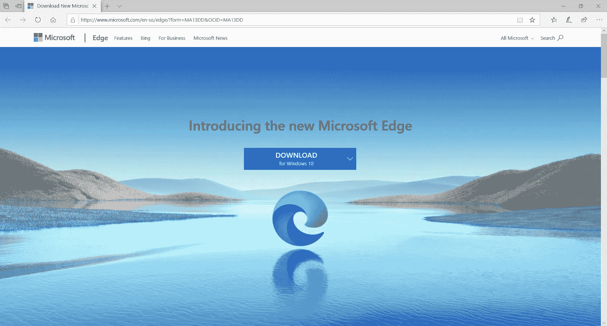
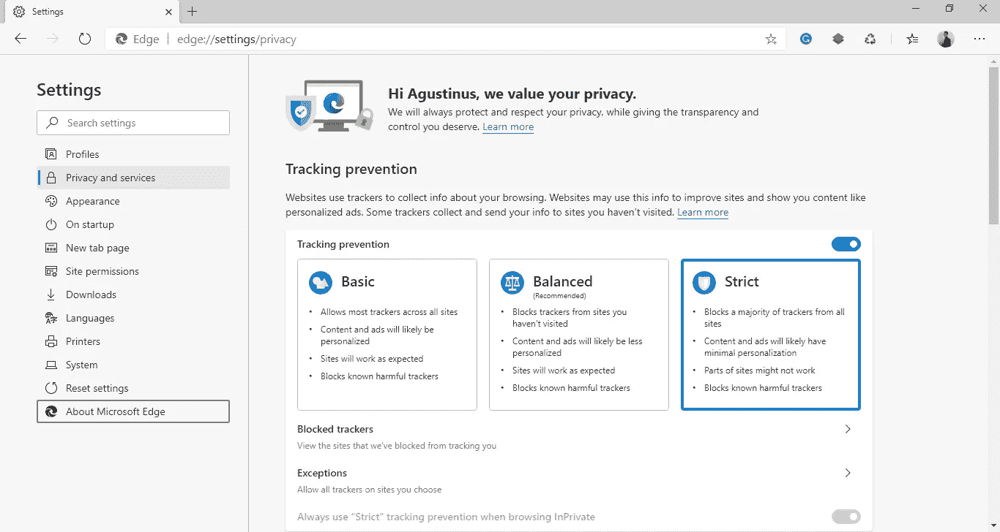

# 微软比 Chrome 有“优势”

> 原文：<https://medium.datadriveninvestor.com/microsoft-having-an-edge-over-chrome-41e4eadfdc80?source=collection_archive---------20----------------------->

## 受人尊敬的失败者的回归

*Illustration of Edge and Chrome rivalry*

## 简史

我从来都不是浏览器的粉丝，确切地说，我只是一个浏览器的粉丝，Chrome。在过去的 5 年里，它一直是我最信赖的浏览器，没有一个真正的竞争者能给出我放弃 chrome 的好理由。总的来说，它对我来说是一个完美的浏览器。我使用 Chrome 进行浏览(显然)和 web 开发，对于 web 开发来说，它是一个必不可少的工具。为 Chrome 开发的调试工具有很多，我最喜欢的是 [Vue.js](https://chrome.google.com/webstore/detail/vuejs-devtools/nhdogjmejiglipccpnnnanhbledajbpd?hl=en) dev tools、 [Wappalyzer chrome 扩展](https://www.wappalyzer.com/)、 [Clear cache chrome 扩展](https://chrome.google.com/webstore/detail/clear-cache/cppjkneekbjaeellbfkmgnhonkkjfpdn?hl=en)等等。微软的 Edge 是对其过时浏览器 Internet Explorer 的回应。Edge 是 Windows 10 的默认浏览器，自 2015 年发布以来一直是微软的海报男孩。

*Usage share of browsers from 2009–2016 by StatCounter (Source: Wikipedia)*

## 浏览器使用份额

根据 StatCounter 公布的一项统计数据，该市场仍在很大程度上由 Chrome 主导。似乎没有什么能夺走 Chrome 的桂冠。多年来，以前由 Internet Explorer 主导的市场迅速转移。Internet Explorer 在许多方面有所欠缺，用户体验令人不舒服。用户界面也不是什么值得夸耀的东西。最糟糕的是，Internet Explorer 甚至不支持一些现代网络功能，页面加载速度有时非常糟糕。这对微软的浏览器声誉造成了不可逆转的损害。为了进一步说明我的观点，这里有一个关于 Internet Explorer 的迷因。

没错，就是**那个** **坏了**。Internet Explorer 唯一擅长的事情可能就是为新安装的 Windows 下载 Chrome。于是，就有了这个迷因。Internet Explorer 是互联网社区的一大失望，它的名字将永远被玷污。微软试图通过制作 Edge 来重新启动，但没有多少人理解。

# 边缘

## 第一印象

当我第一次使用 Edge 时，我不得不承认它是对 Internet Explorer 的一个巨大改进。它一点也不像它的前身。一个全新的外观和感觉，这里是一个边缘的快照。它色彩丰富，标签看起来很现代，导航条干净而时尚。它似乎是 Chrome 的有力竞争者(嗯，除了 Firefox，但老实说我不使用 Firefox)。

Microsoft Edge Start Page (Screenshot of Edge 2019)

## 小挫折

我开始浏览，然后当我点击搜索时，我意识到我在使用必应。与谷歌相比，我认为必应毫无胜算。我发现使用谷歌搜索更准确，所以我去谷歌搜索并开始浏览。这种体验与 Chrome 密不可分，无论是在 Chrome 上还是在 Edge 上使用谷歌，我都没有感觉到任何不同。然后我打开 Youtube，没什么不同。我试着点击视频，没什么奇怪的。直到我点击右键，然后我看到了第一个不同之处。Chrome 的右键是通用的，而 Edge 有一些动画。一开始感觉不一样，但是看了选项之后我很快就习惯了。最大的不同是当我加载图形密集型网站时。

 [## 数据驱动的投资者|微软比 Chrome 有“优势”

### 简史我从来不是浏览器的粉丝，确切地说，我只是一个浏览器的粉丝，Chrome。这是我的…

www.datadriveninvestor.com](https://www.datadriveninvestor.com/2020/03/29/microsoft-having-an-edge-over-chrome/) 

## 问题

我喜欢在一个名为 [Photopea](https://photopea.com) 的开源照片编辑网站上编辑照片。在 Chrome 上，所有的控件都运行良好，所有的快捷键都是无缝的。我认为 Photopea 是用 Chrome 制作的，因为控件和快捷方式很乱。这些问题并不严重，但足以让我回到 Chrome。老实说，我从来没有用过 Edge，直到…

# 东山再起

## 受人尊敬的失败者来了

The New Microsoft Edge

最近，微软有了新的更新。当我更新我的 Windows 时，Edge 浏览器突然弹出这张图片。*“哇，酷！”*我点击下载按钮时也是这么想的。当我打开安装程序时，我对我将要体验的东西有点兴奋。几秒钟后 Edge 被更新，一切准备就绪，我点击快捷方式运行新的 Edge。窗户打开了，我感到一种熟悉的感觉。新的优势是 Chrome？等等，让我看看。

原来新的 Edge 是建立在开源的 Chromium 浏览器之上的，Chromium 本质上就是 Chrome。如果你想看到未来的 Chrome 更新，你可以看看 Chrome。反正如果 Edge 是基于 Chromium 的，那就说明 Edge 用的是 Chromes V8 引擎 for Javascript。使用 Edge 加载东西开始感觉很像 Chrome。到目前为止，我的新 Edge 没有任何问题，加载速度非常快。就渲染而言，它与 Chrome 不相上下。Photopea 不再有问题。

# 新的优势

The New Microsoft Edge

## 标志

首先，我只想说新的 Edge 标志点亮了。我真的很喜欢它，它看起来不像一个标准的微软标志。设计是如此时尚和现代。它看起来太酷了！

## 扩展ˌ扩张

因为新的 Edge 是基于 Chrome 的，所以它的重生是光荣的，Edge 现在支持 Chrome 扩展。这是浏览器大战中的一个关键特征，Chrome 的成功很大一部分在于它的扩展。如果你使用新的 Edge 进入 Chrome 网络商店，点击屏幕最上方的**允许来自其他商店的扩展**。然后点击**添加扩展**按钮，将 Chrome 扩展添加到你的 Edge 浏览器中。

## 隐私设置

Privacy and services settings on the new Edge

最重要的是，新的优势带有内置的跟踪预防。这一功能可以阻止个性化广告，并可以防止跟踪网站。设置也是可定制的，你可以选择你想要的*【开启】*。虽然它不像勇敢浏览器那样屏蔽广告，但我认为这是一个值得注意的特性。

# 最后的想法

我已经使用 Chrome 多年，唯一让我停止使用 Chrome 的浏览器是新的 Edge。微软真的在 2020 年重启了微软 Edge。到目前为止，这是一次美妙的经历。还有一点，作为 Linux 用户，很遗憾新的 Edge 在 Linux 上不被支持(可能很快)。希望你考虑试试新的 [Edge](https://www.microsoft.com/en-us/edge/?form=MY01BV&OCID=MY01BV) 。到目前为止，是微软 2020 年发布的最好的东西。

*原载于 2020 年 3 月 29 日 https://www.datadriveninvestor.com***。**