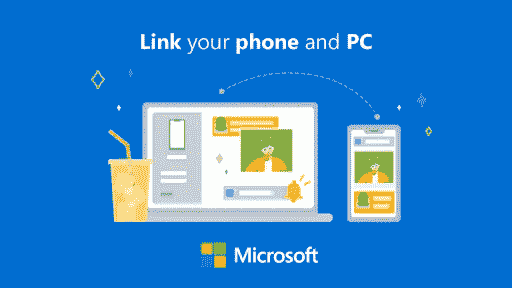

# 微软推动个人身份识别密码很可能是受了合众国际社的启发&沿着合众国际社的思路

> 原文：<https://medium.datadriveninvestor.com/microsofts-ms-push-for-pin-personal-identification-number-over-passwords-is-likely-inspired-38ffc4caa881?source=collection_archive---------21----------------------->

[Source](https://www.linkedin.com/posts/pratyushchoudhury_bizit-productmanagement-technology-activity-6652940788776955905-L7tV)

微软(Microsoft)推动个人识别码(PIN)取代密码，很可能是受到了合众国际社的启发&沿着合众国际社的思路。

乍看之下，这似乎令人困惑，但更深入的探究将会澄清许多事情。

为了让设备无密码，微软正通过转向多因素身份验证(PIN/生物识别)来推动更无缝的登录体验。

PIN 将物理身份验证与网络访问身份验证分离开来。换句话说，PIN 是本地的，与设置它的特定设备相关联&永远不会传输到服务器，从而降低了在传输过程中被拦截或从远程服务器被盗的可能性。

这与密码不同，密码一旦泄露，就可以从任何地方登录您的 MS 帐户/设备。在某种程度上，一个 4/6 字符的小 PIN 可能比一个 15 字符的“非常强”的 p/w 更安全。在无处不在的计算世界中，一个帐户可以跨多个设备使用。因此，账户安全至关重要。

 [## 认知计算——一套被广泛认为是……

### 作为它的用户，我们已经习惯了科技。这些天几乎没有什么是司空见惯的…

www.datadriveninvestor.com](https://www.datadriveninvestor.com/2020/02/19/cognitive-computing-a-skill-set-widely-considered-to-be-the-most-vital-manifestation-of-artificial-intelligence/) 

有趣的是，一个类似的概念，分离用户认证和支付授权，一直是合众国际社成功背后的关键，这是许多在线支付方式如网上银行/信用卡交易没有/不做的事情。

关注 [#bizit](https://www.linkedin.com/feed/hashtag/?highlightedUpdateUrns=urn%3Ali%3Aactivity%3A6652940788776955905&keywords=%23bizit&originTrackingId=E9zcuUNXw9KivzRWc1q8Vw%3D%3D) 了解更多信息。[#产品管理](https://www.linkedin.com/feed/hashtag/?highlightedUpdateUrns=urn%3Ali%3Aactivity%3A6652940788776955905&keywords=%23productmanagement&originTrackingId=E9zcuUNXw9KivzRWc1q8Vw%3D%3D)[#技术](https://www.linkedin.com/feed/hashtag/?highlightedUpdateUrns=urn%3Ali%3Aactivity%3A6652940788776955905&keywords=%23technology&originTrackingId=E9zcuUNXw9KivzRWc1q8Vw%3D%3D)

— — — — — — — — — — —

本帖原载[此处](https://www.linkedin.com/posts/pratyushchoudhury_bizit-productmanagement-technology-activity-6652940788776955905-L7tV)。

— — — — — — — — — — —

在这篇文章中表达的观点是我自己的，并不代表我现在或过去的雇主的观点。