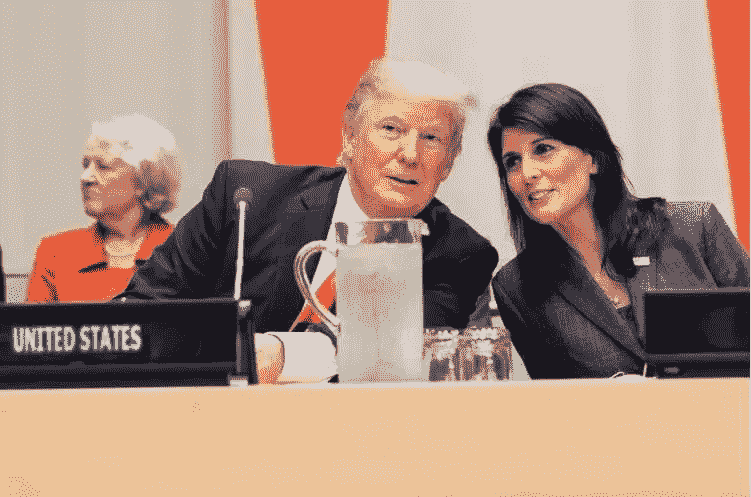
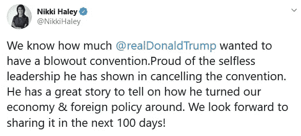

# 特朗普可能会在最后一刻更换副总裁吗？

> 原文：<https://medium.datadriveninvestor.com/might-trump-do-a-last-minute-vp-switcheroo-17a22332917e?source=collection_archive---------0----------------------->

High times at the U.N. early in his term with then-Ambassador Nikki Haley

## 尽管我们讨厌疯狂的、完全未经证实的理论和场景，并且通常会尽力避免它们，但我们确实偶尔会放纵一下自己。

这是我们自己的一个例子:离总统大选还有不到 100 天。我们相信，如果川普在民意调查中，特别是在郊区女性(或他所说的“家庭主妇”)中，不能很快开始复苏，他很可能会在最后一刻耍花招，提名他的前驻联合国大使和南卡罗莱纳州州长妮基·黑利作为他的竞选伙伴，而不是现任副总统迈克·彭斯。

是什么让我们产生了这种想法？Haley 最近发了一条推文，肯定我们对此看得太多了，但她听起来确实认为这是可能的:

特朗普有一个完美的方式来实现这一点，他没有表现出任何外在的弱点(尽管肯定会被视为恐慌之举，这确实降低了可能性)，并让彭斯完全挽回了面子。总统可以说，作为白宫冠状病毒特别工作组(T3)的负责人，彭斯拥有我们这个时代最重要的工作，因为这太重要了，他将没有时间竞选。事实上，彭斯非常关心美国人民的利益，他将做出巨大的牺牲，并同意管理该工作组，直到疾病被根除，美国的疫情应对橱柜再次储备充足。这是至少两年的承诺。

简单。

牵强？

我们会看到…