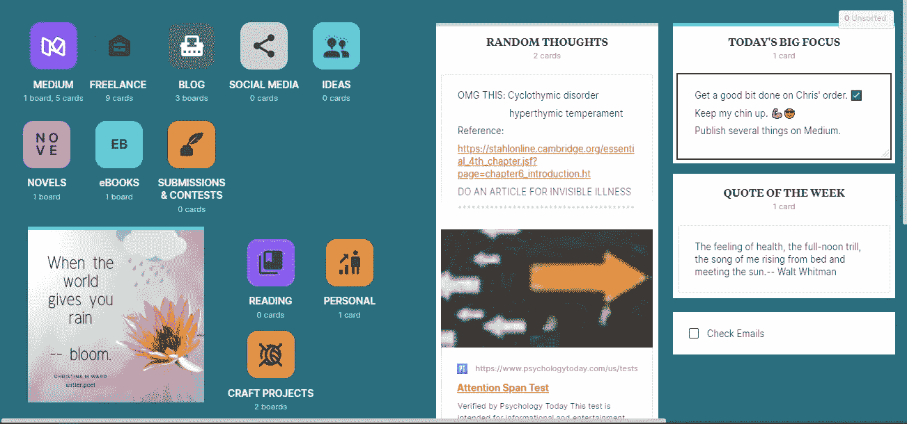
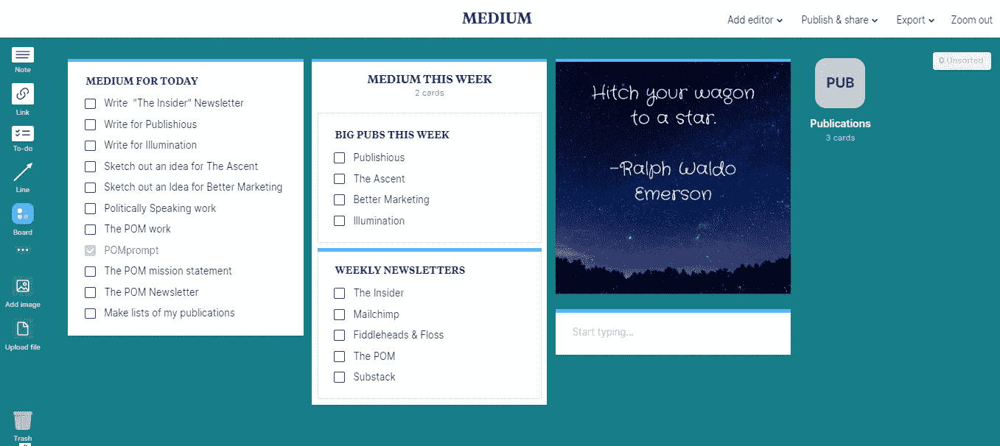
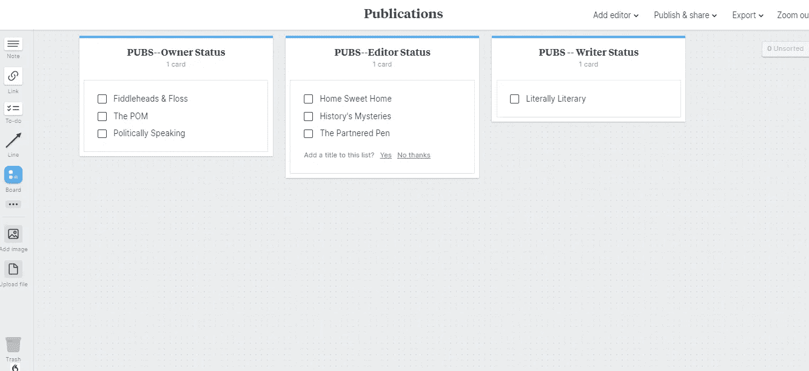
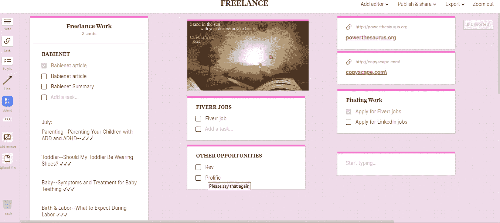
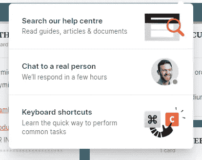

# 创意组织的 Milanote

> 原文：<https://medium.datadriveninvestor.com/milanote-for-creative-organization-7c5d4c18a968?source=collection_archive---------5----------------------->

## 生产率

## 对于丰富多彩、井然有序的虚拟办公桌，您需要掌控自己的生活

Author’s screenshot

我不记得我是如何偶然发现米拉诺特的，但可惜我做到了。我已经为我的电脑尝试了至少十几个组织应用程序，但尚未找到合适的解决方案来组织我的写作工作、个人生活中的事情，甚至只是记下一天中出现的随机想法。最后，解决方案。

不知何故，宇宙认为昨天在我的面前放一个广告是合适的，不管我碰巧在哪个网站上，Milanote 成了我的虚拟办公桌。当我今天早上起床时，我几乎迫不及待地坐在我的虚拟办公桌前，转移我的想法，计划我的一天，并在我的屏幕上查看所有美丽的组织。今天一整天，在任务之间，我都回到了板上，更新或添加新的东西。

简而言之，我很激动。想象一下——杂乱无章的思维被包装成一个漂亮的愿景板！这是作家和创意专业人士的天堂。*我一生都在哪里？*

那么，这与所有其他组织应用程序有何不同呢？首先，它确实有免费和付费版本，但似乎相当慷慨。我昨天和今天投入了大量的工作，我本以为我会撞上付费墙，被迫注册每月 9.99 美元的费用来使用我新喜欢的虚拟助手。但到目前为止，我在免费版上运行得很好。其次，它比我迄今为止见过的任何东西都更具交互性和可定制性。一直以来，我都在寻找组织日历——事实证明，我需要的是一个更有创造性的、以愿景为导向的界面。

## 因此，请允许我向您介绍米拉诺特，并分享我迄今为止的经验

首先，你可能会喜欢它。你是一个“有创造力的人”，对吗？很有可能，你的生活(大脑)有时会有点混乱。你可能会带着日历，可能会在便签本上记笔记，或者你可能会在手机上安装一个日志应用程序来记录你一整天的想法。但是我发现这个简单的程序为我消除了所有这些。这是我找到的唯一解决办法，把我大脑中所有杂乱无章的部分放到一个有意义的地方。

上面的截图是我的主页或主页“板”的当前外观。把它想象成你在学校时墙上的一块大黑板。还记得你的老师用圆点或一些令人兴奋的颜色在外面贴上波浪穿孔纸边框的时候吗？然后他们会放一些与你的课程相关的材料或者那一周的重点材料。这一切都非常令人兴奋，而且布局完美，你的老师可能花了几个小时把那块板拼在一起。

你的主板有点像这样，有一点例外。

想象一下，你的老师在黑板上放了一个项目来代表你将在一年或一周内涵盖的每个类别。同样，想象有一个地方可以让你走上去，写下你的想法，这样你就不会忘记。还有一个方便的清单，让你知道任务什么时候完成。你在 Milanote 上的主板就是以这种方式运行的。

只有使用虚拟教室板，您才能将各种项目拖放到您的板上，使其个性化。您可以更改背景的颜色以及放在板上的每个项目的颜色。您可以放置的一些东西有:

*   媒体
*   链接
*   待办事项列表(您可以选中和取消选中项目，或者将它们设置为一旦选中就删除。)
*   笔记
*   列
*   评论
*   可调线形图
*   其他电路板

注意最后一项:其他板。这意味着在你的主页板上，你可以为你想要组织的生活中的每一件事情创建看起来像小方块图标的板。举个例子，你可以在我的图中看到，我有一个中等的，一个自由职业的，甚至还有一个我的工艺活动的。在主控板上，我使用我的一般想法，这些想法没有特别的类别，还有鼓舞人心的或个人的目标，这些目标有助于我专注于任务并富有成效。

## 让我们来看看其中的一块板，看看如何设置它。

(请记住——我不是一个技术人员——这个网站只花了我几分钟就弄明白并开始使用。)

Medium board — author screenshot

正如你所看到的，到目前为止，我在这块板上做了很多工作。你可以看到我的每日任务清单，本周的一些重点，以及拉尔夫·沃尔多·爱默生的一句励志诗。我甚至有一份清单，上面列有我这一周需要写的所有时事通讯。注意在右手边还有一个写着出版物的小方块。当你点击它的时候，你会看到出版物委员会——还在建设中。(下图。)

New board under construction — Author screenshot

我刚刚创建了这个出版物委员会，我目前正在做它，正如你可以从简单的背景和我已经开始但还没有完全填写的列表中看到的。我写了 50 多篇文章，所以我需要一些时间把它们上传到我的文章列表中，但是当我这样做的时候，当我在那个月为他们写完一些东西的时候，我就可以进入那里并在一篇文章旁边打上勾号。在月底，很容易就能看到我这个月在多少刊物上发表了我的作品。这也让我知道谁可能需要我的文章。

 [## 开发人员提高工作效率的三位一体|数据驱动的投资者

### 在这个被大量工作负载轰炸的世界里，每个人都在寻找新的方法来提高工作效率…

www.datadriveninvestor.com](https://www.datadriveninvestor.com/2019/08/29/triad-for-developers-to-increase-productivity/) 

我还会添加一个地方来投放文章，并列出当前投放的工作和我投放的日期，这样我就知道何时跟进。

或者，我可以为某些有文章想法的出版物创建注释，链接到我所有策展的谷歌表单，甚至包括我提供给潜在自由职业客户的作品组合。

说到自由职业，让我们回到主页，进入自由职业者版块——另一个我已经投入了大量工作的版块。

Freelance board — author screenshot

正如你在这块板上看到的，我也有一个配色方案和一些鼓舞人心的东西。您可以为每个客户单独列一个清单和待办事项列表，或者任何有用的注释或链接，您需要为该客户保留并准备好。

如您所见，我在电路板的右侧列出了一些参考资料。我也有一些地方可以做笔记或者制定求职的待办事项。如果你有大量的信息，并且需要对它们进行分类，你也可以为你的每个客户创建一个新的白板。

## 相比其他组织应用和网站，我更喜欢这个平台

我已经使用 ToDoist 大约一年了，对这个程序还算满意。我可以创建要完成的任务，组织它们，并将它们添加到我的日历中，这非常好。但是没有任何个性化，我真的很喜欢 Milanote 的个性化。

我喜欢其他人可以使用我创建的相同的板；例如，如果我想为 POM 出版物的共同编辑创建一个信息板，我可以这样做，然后邀请那些人成为该板上的编辑，以使用它作为参考。

## 简而言之，Milanote 的优点和缺点:

## 优点:

*   非常可定制，看起来很舒服！这是我最喜欢的功能。
*   优秀的创意和视觉激励的笔记应用程序。
*   可以用它做很多事情来保持组织——链接、思维导图、层次嵌套板。
*   有一个免费的计划。
*   伟大的帮助中心:

author screenshot

*   您可以共享讨论板并与其他团队成员协作。
*   可检查的任务清单很可爱！
*   你可以改变你的董事会的颜色和图标-是的！
*   我在网上看到的任何地方，他们都有很好的评价(4.5-5 颗星)。当我决定使用免费还是付费版本时，这对我来说意义重大。

## 缺点:

*   付费版每月 9.99 英镑——对我来说很贵。但是现在我上瘾了，而且有条理了——感谢 Milanote 的人们！
*   没有日历——但它本身并不是真正的日历。这是一个愿景板。一个整理你大脑中正在发生的事情的地方。(如果你有一个可链接的日历——在主页上放一个链接！)
*   我在网上看到反对者提到整合。显然，这个应用程序是相当新的，仍然在增长/改进，所以你需要检查你的设备可用的版本。

这是你自己查看 Milanote 的链接——不，它不是任何类型的附属链接。我只想和其他像我一样的创意者分享这个令人兴奋的发现！

Milanote，以下是关于这家公司的一些情况。
[在这里你可以找到 Milanote 并亲自尝试一下。](https://www.milanote.com/refer/rcCgkjfKbS9s6gEeB6)

*更新:自从撰写本文以来，我发现了这个方便的投票，在这里你可以投票选出你希望集成到应用程序中的功能。

 [## 即将推出的功能- Milanote

### 查看 Milanote 中即将推出的功能，并为其投票。

milanote.com](https://milanote.com/poll) 

如果你喜欢这篇关于生产力和创造力的文章，你可能会喜欢我的其他文章。我喜欢和我的读者分享有成效的技巧和窍门！

[在亚马逊 KDP 上传畅销书籍的完整指南](https://medium.com/better-marketing/the-complete-guide-to-uploading-a-marketable-book-on-amazon-kdp-64f70eddfd2c?source=friends_link&sk=3f1ed83f641f72067a51384265b930c5)
[8 个让你昏昏欲睡的博客起死回生的简单技巧](https://medium.com/better-marketing/8-easy-tips-for-reviving-your-sleepy-blog-e09e29c9065c?source=friends_link&sk=2c18af6127715fe1dc8d29266aa752b6)
[一旦你的品牌建立起来，你能改变方向吗？](https://medium.com/better-marketing/can-you-change-directions-with-your-branding-once-its-established-6f413974b215?source=friends_link&sk=9d28b15c08c4e3d37e211b5b6b45e661)

感谢您的阅读，

[*克里斯蒂娜·m·沃德*](https://medium.com/u/87a63af50103?source=post_page-----7c5d4c18a968--------------------------------) *之
提琴手&牙线写作*

## 获得专家观点— [订阅 DDI 英特尔](https://datadriveninvestor.com/ddi-intel)