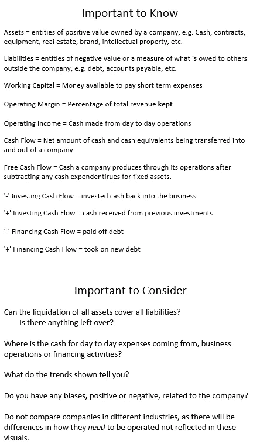
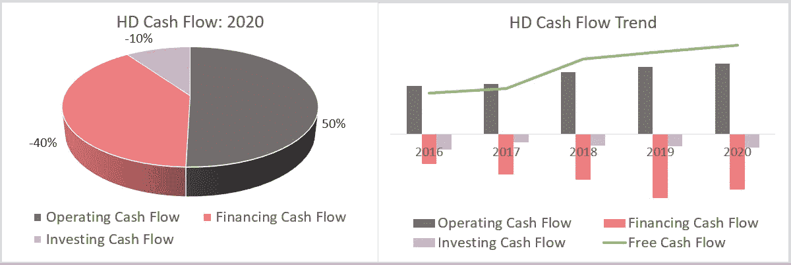
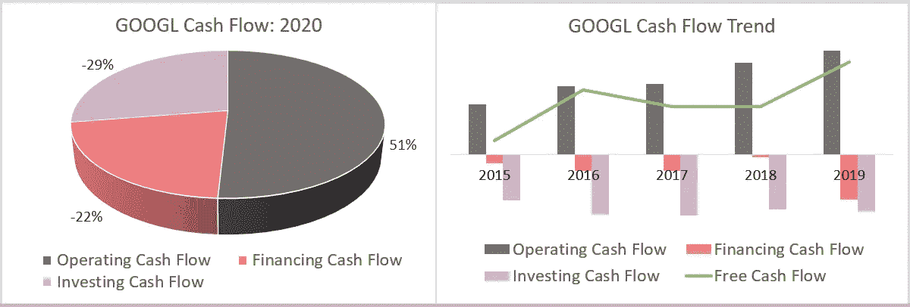
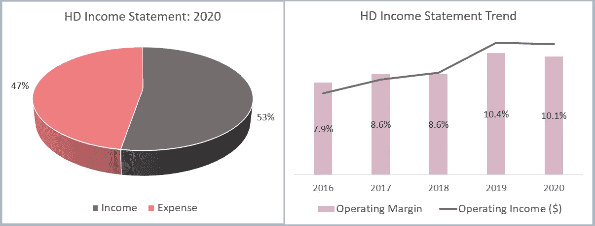
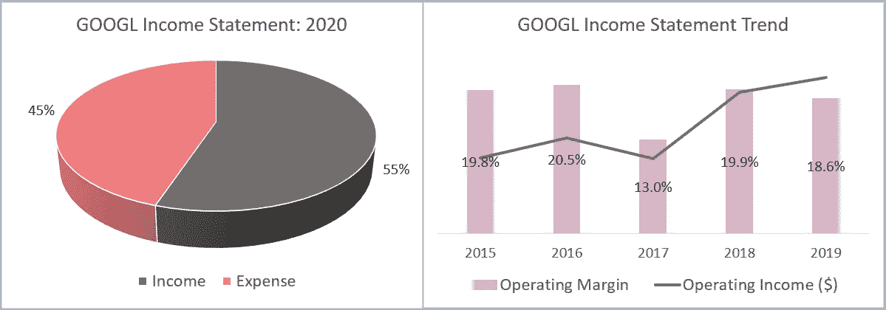
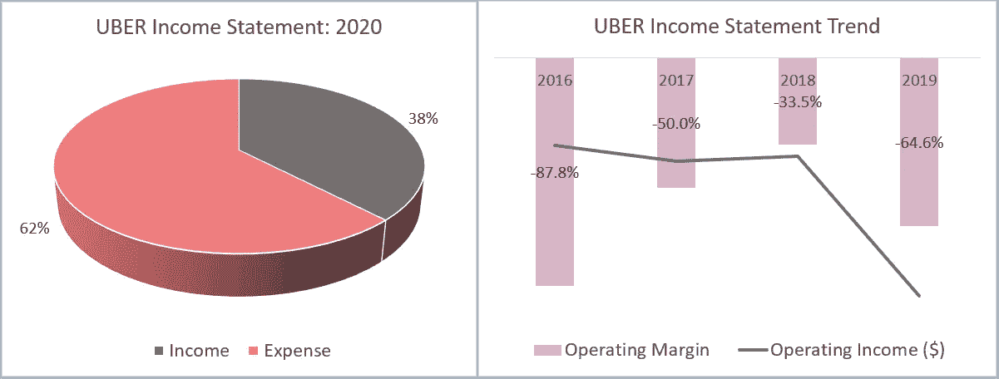

# 千禧一代在烧钱，如何帮我们停下来

> 原文：<https://medium.datadriveninvestor.com/millennials-are-burning-money-how-to-help-us-stop-dc4ba61ff4db?source=collection_archive---------30----------------------->

## 提高金融知识的人类系统方法

## 如何在散户投资的新时代促进明智的决策

两年前，在毫无经验的情况下，我在罗宾汉和 M1 金融公司开设了经纪账户。为了资助他们并开始学习，我和妻子每月花 20 美元，让自己想怎么花就怎么花。我认为在市场上失去它和买油炸圈饼有非常相似的最终结果。到目前为止，只有我的浴室秤不同意。

当我走进赌场时，我用的是同样的方法，不要带你不愿意输的东西。

我不知道如何在选股时做出正确的决定，甚至不确定哪种投资策略适合我。我的金融素养很低，我想改变这一点。

随着我知识的增长，我找到了自己喜欢的策略，我开始看越来越多的财务报表，越来越沮丧。即使拥有火箭科学学位，我也很难理解这一切意味着什么，以及这些文件对一家公司及其未来意味着什么。

一年过去了，尽管我的投资组合已经增值(并将相当好地挺过 2020 年)，但我仍然没有完全理解我在看什么；感觉还是有点像赌博，我不喜欢这样。

我正在亚利桑那州立大学攻读人类系统工程(又名人为因素)的理学硕士学位，并利用接受任务的机会自学了如何正确阅读和理解财务报告。我能够看一看为什么我在理解财务报表上有如此大的困难，提高我的财务知识并在一篇论文中获得学分。

我发现我的问题始于小学，财务报表的设计方法可以改进。

更多的细节和我认为可以做些什么来解决这个问题，请继续阅读。

# 面向散户投资者的财务报告

**摘要**

最近的零佣金股市交易竞赛，以及由科技和有吸引力的用户界面驱动的经纪平台的兴起，让华尔街进入了公众的口袋。

现在，几美元、18 岁生日和轻轻一击，就足以让你做出重大财务决策，承担重大财务风险。

上市公司的财务报告的呈现方式尚未更新，以方便这些缺乏财务培训和全面理解财务报告所需专业知识的散户投资者做出合理的决策。

本白皮书将讨论影响散户投资者及其决策的系统，当前财务报告格式对那些不太熟悉和不太熟悉其复杂性的人的影响，并提供克服这些缺陷的可能解决方案。

**问题陈述**

散户投资者，或者那些可能在金融领域之外拥有职业，在没有专业人士帮助的情况下自己进行投资的公众，正在“改变市场的整体特征”[1]。最近，散户投资者的力量被证明是巨大的。

券商正在吸引对股市几乎没有经验、金融教育程度最低(如果有的话)的新手投资者。这些年轻投资者正被诞生于科技行业的新型在线券商所吸引。

他们使用引人注目的功能，如零交易佣金和获得零股，来吸引新的账户持有人。此外，新的经纪公司正在使用成熟的技术行业方法来吸引用户的注意力，并保持他们的参与，如行为轻推，“游戏化”，以及有吸引力和易于使用的界面[2] [3]。

在这种背景下，当用户的血汗钱面临风险时，而不仅仅是他们的注意力和时间，这些方法正在被应用。由于散户投资者缺乏金融经验，他们在阅读上市公司发布的财务报表时会有困难，这将降低他们做出明智的财务决策和充分理解其行为可能带来的风险的能力。

这方面的误解会对生活质量和心理健康产生灾难性的影响；散户投资者损失数百万美元并自杀的例子屡见不鲜，因为他们对金融世界的内部运作缺乏了解，也不了解这些新平台像科技一样令人上瘾的本质[3]。

**信息**

在 2020 年的 Q1 中，当比较查尔斯·施瓦布账户持有人的行为与那些在罗宾汉拥有类似美元价值账户的人的行为时，罗宾汉用户

*   采取了更多的行动
*   进行了更多“高风险”交易。
*   股票交易量增加了 40 倍
*   买入和卖出 88 倍以上的期权

比查尔斯·施瓦布账户持有人多。[3]

*学校金融教育*

现有数据显示，越来越多的证据表明，当高中生具备财务知识时，他们将在以后的生活中做出更好的财务决策。

散户投资者和新经纪账户持有人的平均年龄为 31 岁，其中大多数人几乎没有投资经验，在他们人生的任何阶段都很少接受过金融教育[3] [5]。

千禧一代在高中的时候

*   大约 40 个州的教育标准中包含了个人理财
*   20 个国家要求实施这些标准
*   10 个要求高中课程，只有
*   10 测试这些概念的个人理财。

2020 年，

只有 15 个州有必修课，只有 5 个州有考试。

加州对个人理财教育标准没有任何要求，而纽约要求将个人理财的某些方面纳入其他课程，但不集中或测试[5]。

在 2011 年的调查中，不到 20%的教育工作者认为在教授学生金融知识方面“非常称职”[6]。

如果教师不具备教授这些信息的知识，学生就不太可能对这些信息有很深的理解，即使他们接触到了这些信息。

在学校和成长过程中缺乏金融教育阻碍了新手投资者在试图阅读和理解上市公司提供的财务报告时的能力，因为他们甚至在开始之前就没有背景和概念的糟糕心理模型。

(心智模型:系统如何操作和使用的背景知识和感知方案)

*财务报告*

正如我们今天所知，自 1934 年证券交易委员会成立以来，财务报告已经实行了很长时间[7]。

资产负债表可以追溯到 15 世纪的僧侣。

现金流量表和损益表促成了美国铁路和公司的诞生[8]。

SEC 要求向公众提供经审计的财务数据，以保护投资者不被欺骗，不承担他们不知道也不可能了解的风险。成立证交会的行动在很大程度上是对导致大萧条的股市崩盘的回应。

公司使用复杂的会计实践来创建这些文件并向公众提供数据，这些实践在正规的金融教育机构之外是不会教授的[8]。

因此，对于投资新手来说，这些财务报告可能很难阅读和理解，尤其是对于评估一家特定公司所需的水平。

*财务报表设计缺陷*

今天以电子表格格式发布的财务报表给没有经验的财务人员带来了一些问题。

散户投资者没有他们的专业同行的技能和专业知识，因此没有开发出快速评估和理解这样一个复杂文档的试探法。

(启发法:用于从广泛的角度评估系统的指导原则)

如果没有启发法，新手投资者必须连续分析每一个数字和每一行，同时试图将它们拼凑成一幅公司的画面。

信息表示方法缺乏统一性，进一步阻碍了这种分析。

(单位化:使用从长期记忆中提取的知识，将信息作为一个整体来感知的能力，或者，被要求一条一条地分析信息，从而付出巨大努力快速或缓慢地提取意义的能力)

在没有该领域背景的情况下分析复杂的信息可能会令人困惑和沮丧，这种情绪可能会产生焦虑和怀疑等其他情绪——这些都不是明智决策的基础。

理解和控制自己的情绪在很多情况下都很重要，尤其是在投资的时候。金融专业人士普遍认为，必须理解和控制情绪和偏见，才能做出正确的决策并取得成功。

散户投资者必须能够理解他们是否对某家公司有偏见。

或者说，在最近的案例中。

例如，仅仅因为某人可能“喜欢”一家公司，或者总是在新闻中看到该公司的名字，并不意味着他们可以接受这种风险。要识别这种风险，他们必须能够了解公司的状况以及它在未来可能受到的影响。[9]

**解决方案**

*走向解决*

投资有许多哲学和策略，每一种都会遵循不同的思维过程来判断什么是“好”的投资公司。

任何解决方案的设计都应尽可能促进对公司财务状况的深入了解，但应保持中立，并允许投资者决定公司如何融入他们的个人战略。

这个解决方案应该被看作是许多用来决定一个公司是否适合个人投资的工具之一。

对于那些缺乏理解现有“电子表格”格式所需的金融培训和经验的人来说，以一种能够充分理解并因此做出明智决策的方式呈现金融信息对于散户投资者的成功是必不可少的。

解决方案应该考虑这些新手投资者的心理模型，即他们可能缺乏金融知识，同时他们渴望改善自己的财务状况。

一个稳健的解决方案不仅有助于他们了解公司当前和未来的财务状况，还能进一步发展投资新手的财务知识基础。

*修复缺陷*

增加所显示的财务信息的单位化将有助于更快地理解数据，以及在创建给定公司的完整图片的过程中增加满意度并减少挫折感。

具有紧急功能的基于对象的解决方案可能是合适的。Wickens 和 McCarley 在他们的书第六章*应用注意力理论*【10】中提供了这个概念的极好概述。

基于对象的解决方案将综合离散的数值，在这种方式下，注意力和感知可以应用于数据的多个维度，以理解基本原理，这比连续处理每一行财务文档并试图在脑海中构建一幅图像更容易。

在今天这个充满科技的世界里，也应该有可能开发一个交互式的解决方案，一个在交互时帮助用户理解更深层次信息的解决方案。

需要注意的是，该解决方案旨在提高新手投资者的知识水平，并为他们的决策提供信息——经验丰富的专业人士可能会希望比该解决方案的初始演示更深入。

*类似的参考实体*

相似性是学习的基础，培养可比关系的解决方案将有助于理解发布的财务数据。

学习时，比较实体是有帮助的。在这种情况下，将感兴趣的公司与真实的或理想化的公司进行比较，根据个人的具体策略，这是一个“好”的投资。

正在讨论的解决方案应该以一种便于比较公司的方式开发。

使用这种解决方案对一个行业内的多家公司进行研究，应该有助于了解该行业中的“一般”公司。这将作为用户的“参考实体”,与他们感兴趣的公司进行比较。[11] [9]

*进一步培养金融素养*

伴随以上段落中讨论的综合数据的应该是某种形式的培训，旨在增加新手投资者对解决方案中使用的行业术语的了解，因为不是所有的都可以删除。

还应包括对这些术语的理解以及关于情绪和偏见以及它们如何影响决策的培训。

应注意保持这一附加内容的简洁，因为其目的是帮助做出决策，而不是进行说教。

*一个可能的解决方案*

我想用下面的图片来作为解决前面讨论的问题的一个可能的方法。

首先，在图 1 中，在下面的图 2-4 中，一个简短形式的信息辅助和启发指南显示在视觉效果旁边。

信息辅助提供了随附可视化图例中使用的术语的简要定义。它们帮助投资新手理解报告数据时使用的最基本的金融术语，并理解公司的运营和财务状况。

启发式指南提供了一些问题，供用户在评估公司时考虑。这两部分也有助于发展用户的金融知识基础，帮助他们在投资时做出更好、更明智的决策。

Figure 1: Short Form Information Aid and Heuristics Guide

第二，在图 2-4 中，每个财务报表—资产负债表、现金流量表和损益表—都是从“电子表格”风格的布局中提取出来的，并被转换成相同数据的可视化的、基于对象的表示。

提供了两个已审计和已发布财务数据的可视化图表。

第一个比较一个选定时间段(年、季度等)内每个报表的最大部分。)并以饼图的形式呈现。第二个以条形图的形式呈现，它绘制了随着时间推移的相同数据，以及为实现最佳整体转换和提高理解潜力而增加的附加数据。

资产负债表的饼状图显示资产和负债，而现金流饼状图显示经营、融资和投资现金流。收入与费用一起绘制，用于损益表的饼图转换。

趋势图使用以前发布的数据显示了一段时间内的信息。营运资本和自由现金流绘制在它们各自的视图中，而营业利润率和营业收入绘制在损益表的转换中。

财务配色方案用于所有地块。

黑色为正，红色为负，现金为绿。

以进一步帮助用户的基础金融知识，并提供所示数据之间的容易比较和对比的关系。肉眼可以很容易地确定饼图上呈现的是更多的黑色还是更多的红色，添加百分比数据标签可以提供确认。

条形图创建了一个易于识别的趋势，通过显示特定的方面来增强趋势并减少视觉混乱。

当多个公司的图像并排放置时，简单的基于对象的解决方案很容易比较。作者承认，在使用完全不同行业的公司时，打破了自己的启发式规则，这具有讽刺意味，然而，说明性的特性仍然保留了它们的价值。

**Figure 2: Balance Sheet**

**Figure 3: Cash Flow Statement**

Figure 4: Income Statement

*交互式解决方案*

虽然此处没有显示，但是交互方面将是对该解决方案的适当且有价值的补充。

光标悬停和弹出风格的信息添加，或类似的东西，将允许进一步发展个人对公司的理解，并有助于散户投资者的基础金融知识发展。

与简短形式的信息辅助交互可以提供每个术语的更细微的定义，并提供一些背景信息来帮助启发式评估。与可视化绘图的交互将提供更多我们今天看到的“电子表格”式数据发布的行项目。

在图表的背景下，这将有助于新手投资者理解财务报表是如何构建的，以及这些数字在业务中的来源。使用这里提出的解决方案，一个新投资者的金融知识将会增长，并随着他们与它的互动越来越多而继续增长。

通过与此处描述的解决方案进行交互，用户群可以得到扩展，交互越深入，提供的数据越多，解决方案的效用就会越大，经验丰富的金融专业人士也会越满意。

**结论**

如本白皮书所述，改变上市公司报告财务数据的方式，有助于那些缺乏培训和经验的市场参与者做出明智的决策，并更好地了解风险。

使用成熟方法吸引用户并保持用户注意力的科技经纪公司的崛起，催生了一批非专业投资者。

这一群体被称为“散户投资者”，他们年轻、有实力，但几乎没有股市经验，也没有接受过多少金融培训。

这一群体在高中时缺乏个人财务要求和课程，这种情况一直持续到今天，是他们缺乏财务心智模型的一个因素。财务报告是复杂的，已经存在了很长时间，几乎没有什么变化。

数据以新手难以理解的方式提供，这妨碍了他们在投资时做出明智决策的能力。财务报告应适应这一新群体，将当前的表述转变为基于对象的表述，并帮助发展散户投资者的基本金融知识。

对于金融专业人士来说，交互式维度也将增加这种转换的效用和满意度。本文提供了使用这些指南的可能解决方案。

版权所有 2021。布兰登·丰特斯

# 参考

[1] T. Clifford，“Jim Cramer 说年轻投资者‘改变了市场的整个特征’”，美国消费者新闻与商业频道，2020 年 12 月 7 日。【在线】。可用:[https://www . CNBC . com/2020/12/07/Jim-Cramer-young-investors-changed-the-whole-character-of-the-market . html](https://www.cnbc.com/2020/12/07/jim-cramer-young-investors-changed-the-entire-character-of-the-market.html.)【2020 年 12 月 8 日访问】。

[2] E. Hinton，“在尝试 Robinhood 之前，确保你先了解这些投资基础知识”， *NBCLX，【2020 年 7 月 19 日。*

[3] N. Popper，“罗宾汉引诱年轻交易者，有时会带来毁灭性的结果”，*《纽约时报》，【2020 年 7 月 8 日。*

[4] E. Rosenbaum，“美国各州如何塑造学生的个人理财智商”，*美国消费者新闻与商业频道，【2020 年 2 月 5 日。*

[5]经济教育委员会，“2020 年各州调查”，CEE，纽约，2020 年。

[6]经济教育委员会，“2011 年各州调查”，中欧和东欧，纽约，2012 年。

[7]History.com，“SEC:证券交易委员会”，历史，2019 年 12 月 6 日。【在线】。可用:[https://www . history . com/topics/us-government/securities-and-exchange-commission。](https://www.history.com/topics/us-government/securities-and-exchange-commission.)【2020 年 11 月 17 日获取】。

[8] Investopedia，“金融历史:会计的演变”，Investopedia.com，2020 年 4 月 24 日。【在线】。可用:[https://www . investopedia . com/articles/08/accounting-history . ASP](https://www.investopedia.com/articles/08/accounting-history.asp.)【2020 年 11 月 17 日访问】。

[9] J. D. Lee，C. D. Wickens，Y. Liu 和 L. N. Boyle,《为人民而设计:人因工程导论》,查尔斯顿，南卡罗来纳州，2017 年。

[10] C. D. Wickens 和 J. S. McCarley，应用注意理论，博卡拉顿:泰勒和弗朗西斯集团，有限责任公司，2008 年。

[11] A. Bhamidipaty，D. Gruen，J. O. Kephart，S. S. Patel，J. Platz，D. Soroker，j .维尔戈和 A. Webb，“走向普遍相似性服务”， *IDA @KDD，【2018 年 8 月 20 日。*

Photo by [Jp Valery](https://unsplash.com/@jpvalery?utm_source=medium&utm_medium=referral) on [Unsplash](https://unsplash.com?utm_source=medium&utm_medium=referral)