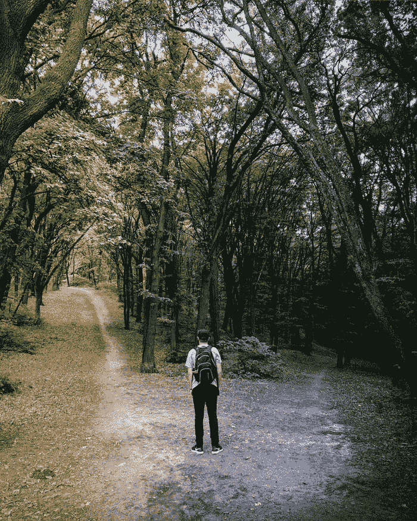

# 千禧一代是人类进化独特十字路口的先锋

> 原文：<https://medium.datadriveninvestor.com/millennials-as-the-pioneers-at-unique-crossroads-of-human-evolution-d121b743c6ea?source=collection_archive---------10----------------------->

# 看着一个崩溃的世界

一方面，看看世界的现状，我们可以说千禧一代是最不幸的一代。他们继承了一个正在崩溃的世界。

另一方面，他们可以认为自己是人类历史上最重要的一代，作为所谓的“最后一代”的第一波，他们有机会重新开始人类发展，启动人类进化的最后一个有意识阶段。

我们人类系统不可避免的崩溃是有目的的。我们先前盲目的本能发展——基于我们固有的自我中心、个人主义和剥削本性——已经耗尽了自己。我们自私的自我已经变得像癌症一样，在我们进化成的全球一体化、完全相互依赖的世界里。

# 进化为我们提供了有意识重新开始的机会

在自然界的完美系统中，没有什么是随机的。一切发生的事情都是由大自然的进化计划预先决定的，这一计划不断地朝着其多样化系统的最终、最佳整合前进。

人类是系统和计划不可分割的一部分，但是——与系统中的所有其他部分和元素相反——我们被赋予了有意识地、自愿地参与整合的机会和自由选择，通过系统地理解我们为什么以及如何需要整合。

 [## 教科书行业如何最终被颠覆，并将继续改变|数据驱动…

### 就此而言，教科书产业在美国乃至全世界都有着悠久的历史。事实上，他们已经…

www.datadriveninvestor.com](https://www.datadriveninvestor.com/2018/09/25/how-the-textbook-industry-has-finally-been-disrupted-and-will-continue-to-change/) 

这就是为什么我们生来就有一种不自然的，“局外人”的本性，并且不得不尝试所有可能的意识形态，由自私的自我设计的系统，直到我们达到今天的状态:毫无疑问地看到，自私地，通过以彼此为代价生存，通过为了我们自己、自私、过度的缘故利用一切，我们将自我毁灭。

# 活着最美好的时光！

现在，我们准备使用我们独特的人类思维，能够进行批判性的自我评估，有意识地建立一个系统，通过使用一种特殊的，有目的的，实用的教育方法来超越和反对我们自私的本能和倾向。

因此，在我们正在经历的厄运、危机和破产中，我们正开始我们历史上最令人兴奋、积极、“真正人类”的一部分，站在前所未有的十字路口。我们都需要感恩，才能生在这一代，成为这个无与伦比的过程的一部分！

