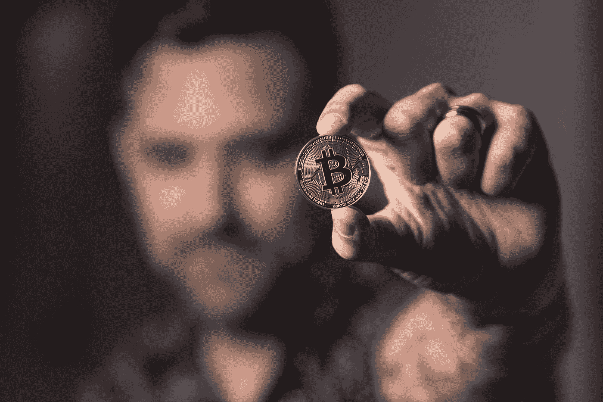

# 比起房地产，千禧一代更喜欢比特币。为什么不给他们两个？

> 原文：<https://medium.datadriveninvestor.com/millennials-prefer-bitcoin-over-real-estate-why-not-give-them-both-da5df0a48c6c?source=collection_archive---------15----------------------->

区块链技术的出现是 21 世纪数字产业最显著的进步之一。比特币已经成为加密货币之王，受到年轻投资者的欢迎和青睐，他们认为比特币是投资的未来。根据 Bankrate 2019 年的[报告，比特币和其他加密货币的投资在短短一年内翻了一番，从 2%增加到 4%。它还显示，在被问及将把 10 年或更长时间内不需要的钱投资到哪里时，所有年龄段中有 31%的人认为房地产是一条出路。](https://www.bankrate.com/investing/financial-security-july-2019/)

然而，当谈到千禧一代时， [45%的人更喜欢比特币投资，而不是股票、房地产，甚至黄金！](https://www.fxstreet.com/cryptocurrencies/news/45-millennials-prefer-investing-in-bitcoin-over-stocks-real-estate-and-gold-survey-202006260342#:~:text=Signals-,45%25%20millennials%20prefer%20investing%20in%20Bitcoin%20over%20stocks,real%2Destate%20and%20gold%20%E2%80%93%20Survey&text=The%20Tokenist%20reported%20that%2047,real%20estate%20and%20even%20gold.)千禧一代似乎信任区块链及其背后的技术，并认为这是投资的未来。它还表明，比特币非常适合被许多人用作长期价值储存手段。比特币只有 10 年的历史，与自古以来就存在的房地产相比，它是一种相对较小的资产。但是，两者有可能结合吗？

是的。得益于过去几年区块链和房地产的无缝结合，两全其美是可能的。这两个最受欢迎的投资选择的美丽融合是“房地产令牌化”。区块链和房地产世界深深交织在一起。用比特币等加密货币购买房产的可能性已经存在了一段时间，然而，区块链技术有更大的潜力来改变整个行业。

 [## 轻松投资颠覆性技术|数据驱动型投资者

### 研究并做好你的尽职调查，找出 10 个可能主宰未来行业的装袋者可能会很难。的…

www.datadriveninvestor.com](https://www.datadriveninvestor.com/2020/07/13/investing-in-disruptive-technology-made-easy/) 

千禧一代现在有机会利用区块链和房地产世界的融合。有两种方法可以解决这个问题:

*   **用比特币直接购买房产**

这是一种简单、众所周知的方法，就像区块链世界的任何其他交易一样。比特币是一个数字分散支付系统，每个用户都有自己的匿名地址和可追溯的交易历史。双方的相互同意是交易生效的唯一条件。使用比特币购买房地产的众多优势之一是花费的时间。文件签署后，交易完成需要 10 分钟到 24 小时不等，取决于网络拥塞情况。不需要银行系统，这对千禧一代来说是理想的，因为他们中 47%的人信任比特币胜过大银行。

*   **房地产令牌化**

只有少数资产的流动性比房地产更差。要卖掉价值 2000 万美元的房产，你必须找到一个有 2000 万美元闲钱的买家。然而，当你将这些数量分割成更小、更实惠、可以有多个买家的数字代币时，你就成功地将房地产进行了代币化。甚至有人声称[令牌化的房地产是建立在比特币](https://news.bitcoin.com/crypto-and-real-estate-were-built-for-one-another/)的基础上，例子可以追溯到 2017 年。主要的观点是，有一段时间，房地产购买完全可以用比特币进行，现在随着房地产令牌化的出现，千禧一代可以选择充分利用比特币和房地产。

许多人声称区块链和房地产是天生的一对。随着越来越多的千禧一代转向加密投资，而不是股票和黄金等传统投资，这种说法正在变成几个成功的故事。长期以来，房地产一直被认为是资本密集型投资。然而，它与区块链的融合使其在同行中占有一席之地。然而，有一点是明确的——比特币和房地产都将继续存在。

关注:LinkedIn 上的文·梅农博士|[Quora 上的文·梅农博士](https://www.quora.com/profile/Dr-Vin-Menon)

**访问专家视图—** [**订阅 DDI 英特尔**](https://datadriveninvestor.com/ddi-intel)