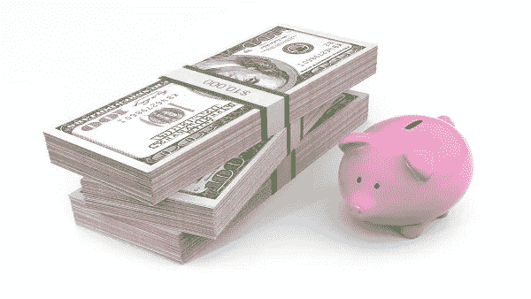

# 百万富翁的习惯真的改变了我的生活

> 原文：<https://medium.datadriveninvestor.com/millionaire-habits-that-actually-really-changed-my-life-b83bec74ecc0?source=collection_archive---------25----------------------->

我们都听说过典型的“读书”和“凌晨 4 点醒来”的建议。但是，这并没有提供一个实际的有形的理解，如何在经济上改善你的生活。

2021 年还在襁褓中，所以是时候完成我们的新年计划了，并开始通过在我们的生活中引入一些健康的习惯来实现它们。

1.  ***打点你的开销。***

我不得不说，如果整篇文章中只有一点是你应该遵循的，那就是这一点，因为我保证，如果你坚持下去，这将对你的余生产生最大的影响。你可以注册一个预算跟踪软件，它可以完全免费使用，还可以帮助你密切关注你赚了多少钱，花了多少钱。我不会把它们中的任何一个都塞进去，但是快速的谷歌搜索肯定能给你找到一个。这对于了解你在自己都没有意识到的事情上花了多少钱，或者这些小支出在一周或一个月内累积起来有多快是很重要的。

**2*。只买必需品。***

我要求你开始养成仔细考虑你想要的一切的习惯，并且只在你能完全负担得起的情况下，经过深思熟虑，并且一旦你确定了其他投资和储蓄目标的优先顺序，才购买。我们都听说过这样一句话:不要本末倒置…这句话也适用于此，就像你不应该把崭新的汽车放在你的应急基金之前。

***3。让你的钱隐形。***

你一拿到工资，或者钱一进入你的账户，马上把它投入到投资中，或者存入你不碰的储蓄账户。这样就看不见，也不想了。你得到了储蓄的直接*——这让你觉得你在为一些实实在在的东西而努力，因为你可以“看到”这些储蓄就在你面前。*

*这将导致另一个影响，迫使你靠更少的钱生活，因为你的投资完全无法实现。反过来，这也会帮助你习惯于少花钱，习惯于多存钱。从心理上来说，这会让你不想打破你的习惯。*

****4。不要投资任何你不了解的东西。****

*善于理财的人不会因为*“很快就来不及了”*——事实是，未来总会有**新的机会，会像今天一些最好的机会一样有利可图。永远不会只有一件事能让你暴富，除非你是华尔街 Bets 的 Redditor。***

******5。不要选择市场时机。******

***我一次又一次地看到这种类型的模式，我注意到的是——等待下跌的人，与在实际下跌时拒绝买入的人是同一时间。哦…讽刺的是。这就像是，他们总是在等待价格越来越低，越来越低——即使价格越来越低，他们也会坚持让价格再降得更低……一旦价格开始上涨，那就太贵了。***

*****⑥*⑥。了解税收是如何运作的。******

***这是我们都害怕的事情，但也是我们必须学习的事情。成年真的让我意识到，我多么希望我高中的生物课能换成对我更有价值的东西。也许教育系统应该创建一个税收研究班。这是我建议你完全沉浸在其中的一步，一旦你完成了所有其他事情的基础工作。所以，一旦你跟踪了你的支出，一旦你减少了需求，一旦你让你的钱看不见了，一旦你投资了你了解的东西，一旦你没有把握市场时机…然后，**真正学习税法**，充分利用你剩下的钱。***

***最后…那个小樱桃顶上了这一切…只是*。你不仅要做上面提到的每一件事…而且，你还必须日复一日地坚持做下去，才能让它发挥作用。捷径很少会持续下去，通常情况下——如果你寻找快速简单的解决办法，你很快就会回到你最初开始的地方，除了现在——如果你从一开始就遵循正确的道路，你会进一步落后于你本来可以达到的地方。****