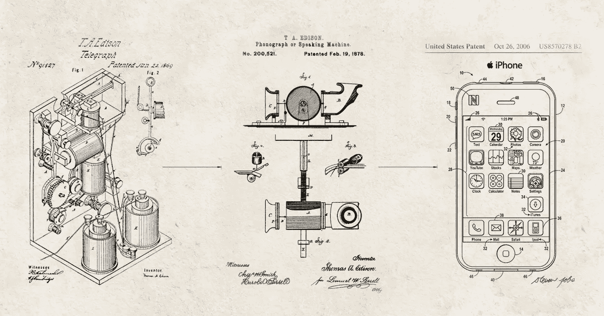
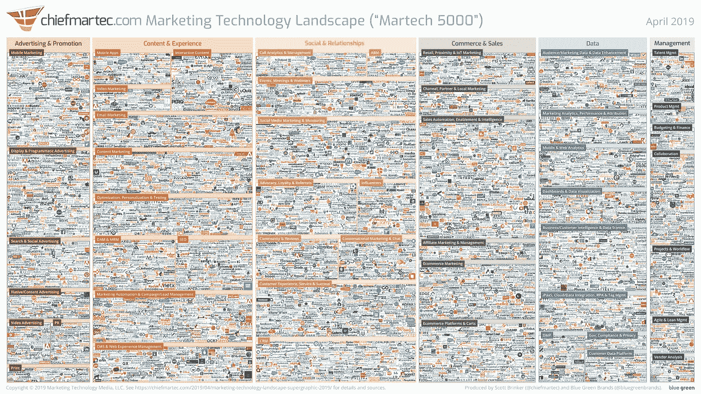
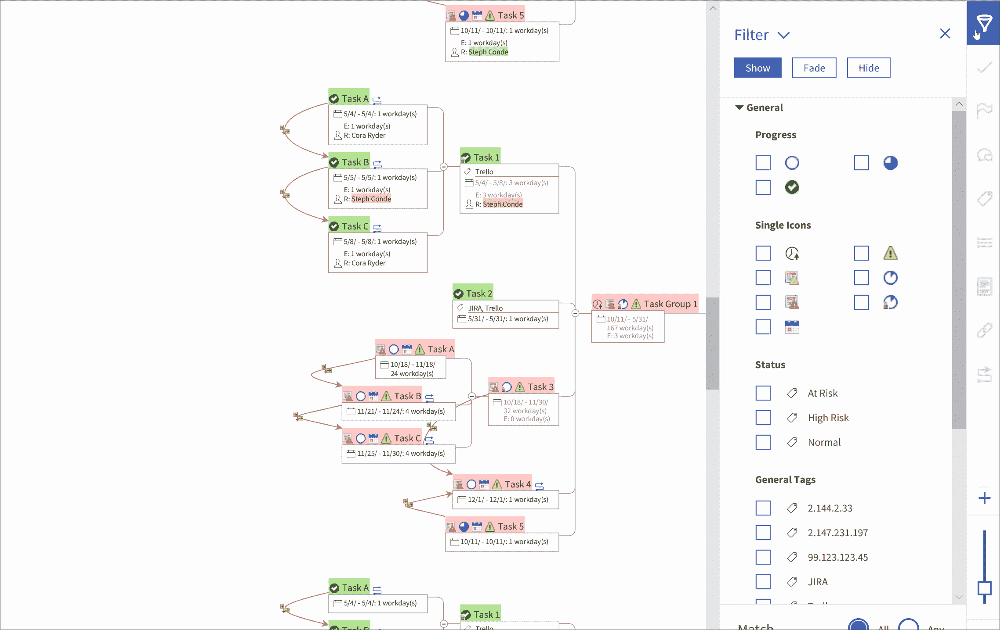
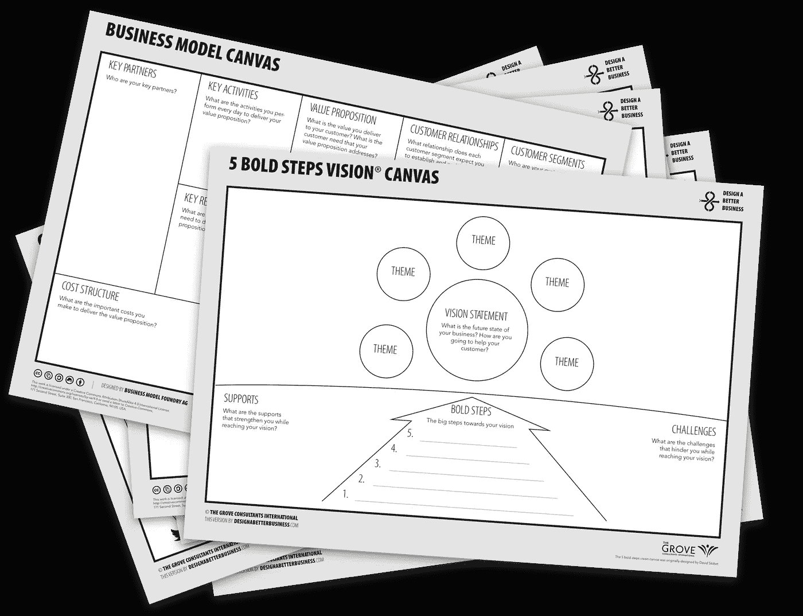
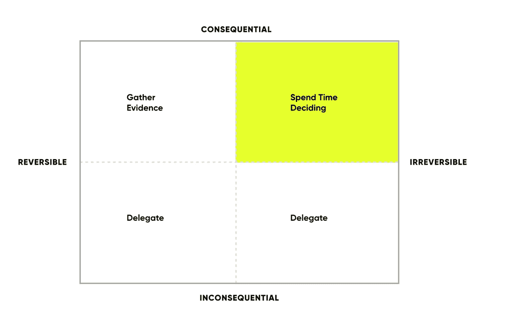
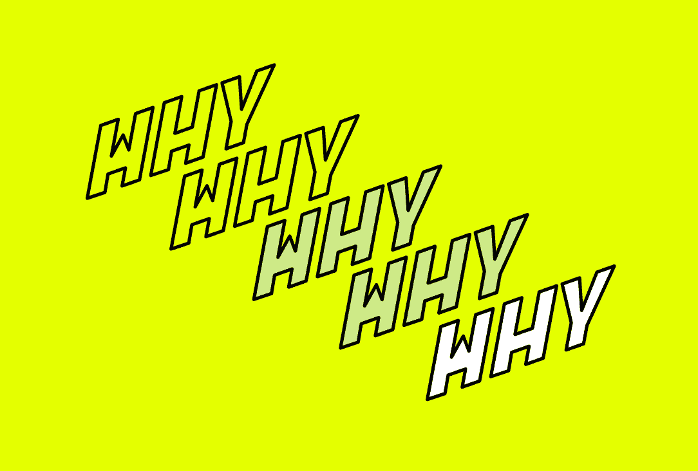
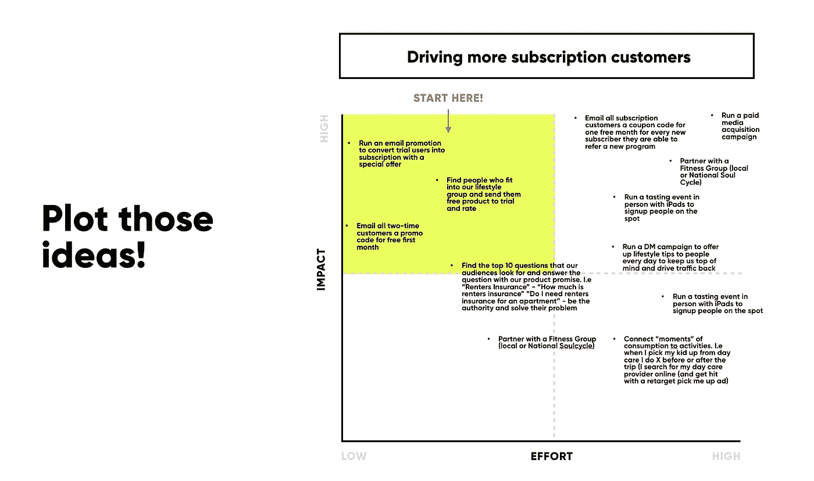

# 注意差距—规划您的数字化转型之路

> 原文：<https://medium.datadriveninvestor.com/mind-the-gap-mapping-your-way-to-digital-transformation-8c7836c2f2b3?source=collection_archive---------4----------------------->

# **传统公司如何实现数字化转型？**

作为一名在市场营销和创新咨询领域工作的数字化原住民，我常常认为整个“数字化转型”是理所当然的。最近，我的一个客户伙伴问了我一个我从未考虑过的问题，这个问题让我开始思考。问题是“传统企业如何实现数字化转型？”

在我开始讨论如何做之前，让我们确保我们都来自同一个参照系。

什么是数字化转型？如果你问那个问题，你会得到很多不同的答案。我认为数字化转型是利用技术来改变和实现您的业务方式，并改善或简化您向客户提供产品、服务和有价值体验的方式。数字化转型现在是一个热门短语，您可能会遇到大量白皮书、研讨会和公司，它们承诺提供神奇的药丸来解决您所有的数字化转型需求。

但我认为人们忘记的是，没有哪种转变是线性的，也没有哪种转变是像《杰森一家》(Jetsons)老卡通剧集那样用神奇的药丸实现的。

我们都赞美并崇拜硅谷的企业家和有远见的首席执行官。

 [## 一个企业在肚子上移动:如何照顾直觉|数据驱动的投资者

### 事实证明，直觉不仅仅是一种感觉。科学很清楚:你的直觉比你知道的更多…

www.datadriveninvestor.com](https://www.datadriveninvestor.com/2018/11/09/a-business-moves-on-its-stomach-how-to-make-allowances-for-gut-feelings/) 

# 这不是另一篇关于颠覆的文章。这篇文章是关于任何人如何开始在他们的企业或组织内进行转型。

我相信，通过我经常解释的数字化转型的四个 D，可以轻松实现数字化转型。

**数据** —您收集了哪些数据(流程、产品、客户等)，您用这些数据做了什么来改善您的业务或进步？

**决策**——你所在的部门、公司或行业是如何做出决策的？

设计——你的企业是如何设计和组织的？你的行业、系统、商业模式或经验是什么，改进的机会在哪里？

**愉悦[交付]** —对你的客户来说，愉悦和交付是什么样的？你的老板？你呢。

# 从电报到电话到心灵感应:转变从昨天开始。

作为一名未来学家，我通过回顾过去获得了一些关于未来的最佳想法，这是对我们不确定的未来的最佳预测。对我来说，像 Dick Tracy 这样的科幻电影和漫画书为我们今天知道的联网智能手表和小工具铺平了道路。

看到未来的两个最好方法是研究过去和自然。

Dick Tracy watch from graphic novels

谈到未来，你不能不想到宇宙飞船和太空航行。《星际迷航》不仅启发了我们如何解决复杂的社会问题或与机器交流——亚马逊甚至让你将 Alexa 的名字改为“计算机”,作为对《星际迷航》的一点点头。

我们不是一夜之间从电报发展到电话的，我相信任何试图实现公司或业务数字化转型的人都需要停下来，首先确认自己在旅程中的位置。

# 你现在在哪里？

如果你今天甚至没有在工作中使用基本的数字营销，你真的认为现在去一个由人工智能驱动的企业云平台对你来说是可以实现的吗？

我看到很多公司“全力以赴”进行昂贵的技术改造，结果却失败了，最后放弃了这个项目，这让我感到恶心。这并不是因为实现这一飞跃很难，事实上，有成千上万的顾问和平台会很乐意牵着你的手(并为此向你收费)，帮助你实现你期望的转型。广受好评的营销技术专家 Scott Brinker 的营销技术前景“Martech 5000(截至 2019 年 4 月，目前为 7，040)”下图是我经常用来教育我的客户合作伙伴的一张图片，让他们了解他们目前在技术方面的许多选择，这些选择可以进一步推动和支持他们的业务。有数以千计的选择，其中大多数可以带你去你想去的地方。

亚历山大·格雷厄姆·贝尔(Alexander Graham Bell)和他忠实的助手托马斯·沃森(Thomas Watson)可能因发明了我们今天所知的电话而获得了荣誉，但他们的工作是后来西里尔·杜克(Cyrillic Duque)、伊莉莎·格雷(Elisha Gray)和许多其他人的重大科学研究突破的迭代。

# 真正的转型存在于灰色阴影中:迈出小步伐，获得大成果

我相信任何数字转型的答案都存在于黑白之间的灰色阴影中。这是渐进的改变，采取更小更渐进的步骤，这将导致你所寻求的结果。

好吧，皮特毕业了，改变这是什么意思？很好的问题，我正要说到这里。我解释这个概念就像能够从不去健身房到通宵跑纽约马拉松一样。有时候，你必须先走，然后才能跑，在我看来，找到一些小胜利是最快的方式。

# 通过设计逐步增长。

就像布莱恩·切斯基不仅仅是从出租他的公寓和充气床垫发展到我们今天所知的全球企业 AIRBNB 一样，真正的转型发生在我喜欢称之为渐进增长的过程中。

改变是艰难的。人类不喜欢改变。

人类需要启动。行为改变最好在小的迭代中实现。正如《纽约时报》畅销书《原子习惯》的作者 James Clear 解释的那样，养成习惯的过程可以分为四个简单的步骤:暗示、渴望、反应和奖励。我认为这不是一种阻碍我们在日常生活中改变的习惯，而是一种暗示。

消费者行为采纳需要缓慢转变；如果你愿意，一步一步来。规模和临界质量位于钟形图的中心，这就是为什么一家技术公司在试图扩大规模时会经常改变其信息和营销方式。脸书、优步和所有今天无处不在的应用程序都是从早期采用者的手中开始的，他们忍受了排长队、产品故障以及作为早期采用者所带来的一切。作为早期采用者，我可以说我经常为了方便而牺牲稳定性。

因此，如果你在工作中受困于自己的角色，无论是硅谷的初创企业、常春藤大学还是《财富》100 强企业，我都鼓励你从自己所处的位置开始。

# 从已经在使用的东西开始:映射。

听说过最好的相机是你随身携带的那台吗？如果你面对的是一种过时的做事方式，我建议你采用同样的思路。

当接近任何转型时，首先我建议人们从我们在[的数字外科医生所说的体验审计](https://www.digitalsurgeons.com/what-we-do/)开始。抛开流行词汇不谈，这就像盘点你的业务、你的内部和面向客户的接触点一样简单。

如果你喜欢，拿出一张纸或使用白板。从画下或写下以下内容开始:

*   你的结构是怎样的(组织结构图)？
*   你想去哪里？
*   阻碍你实现目标的前三件事是什么？

我经常问我的客户伙伴和团队这个问题:**是什么阻止我们做我们生命中最伟大的工作？**

然后开始揭示模式和障碍，其中许多是任何企业都将面临的现实。阶段关口(流程)、利益相关者、预算和时间是我在主持这样的会议时得到的一些最常见的答案。

我们通常从映射所有不同的组件开始；人、过程、事物、系统都是独立的元素。

企业可能会使用机器，但大多数机器是由人驱动的，而人是复杂的适应性系统。

## 从这里到那里练习:

你在这里。你想到达这里。现在让我们向后走，一步一步来。有很多可用的工具来实现这一点，例如这里提供的[5 Bold Steps Vision Canvas](https://www.designabetterbusiness.tools/tools/5-bold-steps-canvas)

## 一个不太视觉化的人？把它写成一个故事。

*我们今天的故事是……*

今天，我们是耳机和音响设备的传统制造商。我们接触和交付客户的系统和方式是有限的。我们的产品和工程团队并不了解市场的需求，而是针对过去的消费者进行设计和营销。

*我们明天的故事将会是……*

我们是面向消费者、专业人士和音响发烧友的音频设备领域的领导者。我们的销售、营销和产品团队通力合作，积极倾听市场的需求。从音乐家到热爱 Tik Tok 的 Z 世代，我们也在寻找潮流，寻找创新产品和客户体验的方法。虽然昨天我们以硬件闻名，但未来的战争将取决于经验，这意味着拥抱人们今天使用的软件和集成。我们将超越像亚马逊 Alexa 或谷歌助手这样的琐碎集成，了解我们的客户是如何真正使用我们的产品的。

## 找到你的 CANS 和罐子

我父亲曾经告诉我，如果你不问或不试，答案总是否定的。所以，在你转动你的眼睛，接受你被“卡住”的命运之前，让我们再深入一点。

*   什么在起作用？
*   什么不起作用？
*   为什么？
*   我们试过什么？
*   我们还没试过什么？
*   你的结构是怎样的？
*   你是一个矩阵组织吗？
*   如何以及谁对什么决策负责？

## 决策的问题在于大多数人甚至不知道他们是如何做出决定的。

每当我遇到这种情况(通常是每周一次)时，我都会感到惊讶的一件事是，整个组织中的人——从实习生到首席执行官——通常不理解他们组织内决策的制定(或阻止)方式。

上周，我与我的一位合作伙伴的几位高管举行了电话会议。他们请我帮忙向董事会提出一个新概念。这让我受宠若惊，并开始探究原因。就在那时，我认识到，尽管他们是非常有才华的高管，对公司治理、战略以及如何发展公司有着全面的了解，但他们背后的决策和情感认同仍然是一个谜。

我发现有一个练习有助于消除做事情的障碍，这个练习集中在做决定的概念上。

## 尝试使用决策矩阵

拿出一张纸，或抓起一块白板，画出以下内容:

我从法南街的创始人[谢恩·帕里什那里学到了这个技巧](https://fs.blog/about/)，这是一个非常棒的关于心智模型的网站。

我列出了我必须做出的所有决定，并将它们分成四种不同的类型。

1.  不可逆转且无关紧要
2.  不可逆转的后果
3.  可逆且无关紧要
4.  可逆的和相应的

现在想想你今天或本周要做的一些决定。

我经常发现犹豫不决的代价远远超过错误决定的代价。

改变游戏规则的创新者不会因为停滞不前而取得重大突破或转变。

福特在发明不用马拉的马车之前，先用马和马车做实验。

一旦你理解了谁以及如何做出决策，那么也只有到那时，你才能得到许可结构，它有助于或限制你在组织内寻求的创新和进步。

可逆的决策应该总是有助于增强你的团队的力量，不管他们有多初级。这些决定在你的环境中创造了突破的温床。

如果你理解了阻碍你做出决定的因素和过程，那么你就可以开始寻找前进的道路，这样你就能离成为下一个亚马逊、谷歌或优步更近一步。

# 数字化转型的语言不仅仅是万维网、零和一

就像数字化转型已经成为捕捉企业如何联系和提供体验的“包罗万象”一样，试图改善体验的团队过于执着于技术，而对他们试图解决或服务的人类问题关注不够。

问题往往比答案更重要。指导我们公司和客户的核心价值观之一是[“保持好奇。”](https://www.digitalsurgeons.com/about/)好奇心从挑战事物的完成方式开始，试图揭示事物的可能或不可能。

虽然我完全赞同西蒙·西内克著名的 TED 演讲“从为什么开始”，但我也看到了问别人一个为什么的问题是多么令人不快。

所以当遇到摩擦时，我喜欢从小处着手。潜入水面。找到根本原因。

我从设计思维世界借来的两个工具是五个为什么和我喜欢称之为“会/不会”的东西

ThinkFWD Five Whys exercise

这是另一种情况，我曾为一家公司提供咨询，这家公司的厨房里有太多的厨师，造成了一种拖慢进度的局面。高级领导团队要求我调查为什么产品设计决策会受到阻碍。

我找到了产品副总裁，他对测试新设计理念的道路上的许多障碍越来越感到疲惫和沮丧。他私下告诉我，他对这家公司越来越厌倦，正在考虑换工作。

**我:**那么你认为事情进展如此缓慢的原因是什么？

**产品副总裁:**嗯，厨房里厨师太多了。每件事都被微观管理，我的手被绑着，等着和另外两个人在日历上安排会议，这两个人需要在设计之前批准狗屎。

*(我的第一想法是看看我是否能让这三个人聚在一个房间里，帮助领导一次共同创造会议，但我能感觉到气氛很紧张，这只会进一步激怒我负责帮助的副总裁。)*

我:我能理解这有多么令人沮丧。让我们看看我们能不能再看一眼这个。我相信公司看到你离开会很难过，我也知道你对这个组织有多信任。你能不能帮我理解一下，为什么这个要三个人批准才能进入设计队列？

**产品副总裁:**因为我们的工程主管需要签署技术可行性。

**我:**好的。那为什么其他两个人需要签署这个决定呢？

产品副总裁:嗯，我们的总裁喜欢在我们将所有产品决策纳入日程之前就批准它们。最后的批准来自我，因为我的工作是开发产品和管理路线图。

**我:**太棒了，为什么你们的总裁喜欢在所有产品决策进入日程之前就批准它们？

**产品副总裁:**在我加入之前，我们有一位经验不足的产品经理，他批准了大量昂贵的变更，但从未投入生产，导致我们错过了两个季度的销售数字。

**我:**明白了。所以你会说你的总统相信你有能力做出能带来增长的决策吗？

产品副总裁:她当然知道。她亲手挑选了我，几年前我们一起工作过。

**我:**太棒了，那么如果下一个产品发布周期她让你在不需要她签字的情况下完成一些项目，那会是什么样子？

产品副总裁:我从没问过。这是一个非常好的主意。

我:太好了！我等不及要听她说什么了。当我们谈到决策和阻止新想法供您的设计团队测试的话题时，您能否帮助我理解为什么您的工程主管需要批准新想法？

产品副总裁:嗯，Ben 是一个控制狂，他讨厌那些在我们现有系统中无法编码的东西。

我:有意思……你说你和本关系好吗？他信任你的技术敏锐度吗？

是的，本和我是朋友，我们一起参加成人冰球联盟，经常在工作之外谈论工作。

我:不错。我希望我能滑冰——上次我尝试的时候，我只是抱着栏杆，倒数着时间，直到我的滑冰时间结束。所以，如果你让 Ben 和你一起参加早期的评审，或者信任你在没有他签字的情况下根据技术可行性来评估想法，他会怎么说？

产品副总裁:他可能会说去吧，因为他参加的会议会更少，这样他就可以和他的工程团队一起发布更多的代码。

我不会用这个故事的其余部分来烦你，但我会快进到结尾。仅仅是这一次奇怪的对话，我们就能够从三个经常不得不一起玩日历扭扭游戏(更多延迟)的决策者，到授权产品副总裁成为唯一需要的决策者。

自从开始实施以来，我已经看到了很多可衡量的结果，从我的客户对他的角色感到满意开始。你能想象我的客户(公司)在寻找另一个有能力的副总裁级别的产品经理时需要花费多少时间和周转成本吗？探索什么会发生或不会发生是我们经常用来让人们进入更有趣的好奇心态的工具。有时候，我们需要做的就是挖掘我们内心的童心，从而走上进步之路。

## 梦想向前。向后工作。

为团队绘制一幅清晰的事情发展方向图是一个强有力的工具，有助于建立理解，并就事情的发展方向建立急需的认同或共识。

本着从你所在的地方开始的精神，我也喜欢介绍一个简单的两两组合，它可以帮助团队产生如何改进他们的产品或服务的想法。

首先，我喜欢挑选一些“目标”来关注。

“假装”阻碍你的事情并不存在。我们该怎么做才能帮助我们在本季度将销售计划提高 10 %?然后设置一个计时器，放一些音乐，让这群人感受到稀缺性。我通常会将这个时间限制在三到五分钟(最多)，并要求小组在每张便利贴上写下或画出一个想法。

时间到了，我让每个参与者站起来，用便利贴和表格分享他们的想法，他们认为这个想法会基于努力(时间或成本)和影响(相对于我们商定的目标，通常是经济或业务影响)而产生。

因为最大的阻碍我们所有人情绪的事情是感觉不到或看不到进步，我想建议我们从最左边的项目(影响大/容易做)开始，我们可以从列表中删除。有时候，即使是最简单的事情也能带来进步。

上周，我坐在一个设计评论会上，看到一整桌来自不同部门的人在为一封电子邮件时事通讯争论不休。我坐在那里数着每分钟的时间和费用，声音越来越大，讨论的质量迅速下降。

你参加过这样的会议吗？我们都经历过。因此，当紧张局势变得无法忍受时，我停下来问大家，有人能告诉我，我们在为谁解决问题，为什么这确实是个问题？我有蟋蟀。原来问题是，他们试图让更多的人使用商店定位器来为一个消费品品牌增加店内流量。当我查看讨论中的电子邮件时，没有一封呼吁采取行动的邮件提到了商店定位器。

我没有增加不舒服感，而是问，如果我们同意，我们会努力让更多的人使用这个商店定位器，我们觉得到达那里的最佳路径是什么？

“给商店定位器加个按钮”一个文案说。

一名开发人员很快加入进来，“用商店里的产品的 photoshopped 图像替换产品的图像，并调用商店定位器”。

“加一个按钮，上面写着找一个离你近的商店，”一个实习生在房间的角落里说。

团队，听起来所有这些想法都是强有力的解决方案。哪一个最容易实现？

“完成了，有人能刷新一下预览链接吗”。没错。就这样实习生做出了改变。“但如果这不是正确的解决方案呢？”现代软件(和硬件)的美妙之处在于，我们通常可以在全面展示之前进行测试。这种类型的实验最初是作为科学方法出现的，现在已经演变成自己的一套现代术语，从六适马到精益创业和设计思维。

所以你可能在想，我需要一些这样的超级实习生。所以我们的思维很快就跳到了*如何*之前*为什么*。为什么是实习生行动如此迅速？因为他们不害怕行动。我觉得一个人的职位越高，他就越害怕行动。我明白了，你比实习生损失更大。

所以希望现在你有一些东西可以尝试，开始迭代前进。

*   是时候用另一种方式与你的老板进行一对一的会谈了？
*   也许在关闭可能导致真正转变的较小可能性之前，开始更频繁地测试？
*   你打算先尝试什么？请在评论中与我分享