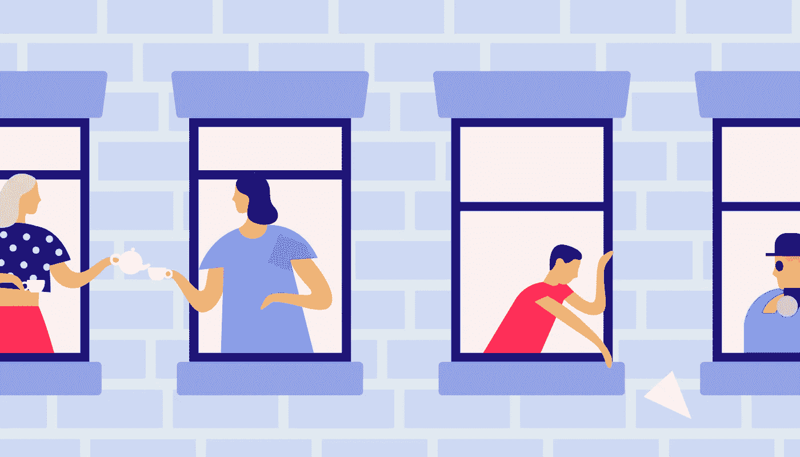

# 新世界中的意识创新

> 原文：<https://medium.datadriveninvestor.com/mindful-innovation-in-a-new-world-2fa4272ba5b8?source=collection_archive---------19----------------------->

危机会导致短期和长期的行为改变。今天对破坏的临时反应可以成为明天的新规范甚至习惯。这些行为变化可以让人们关注帮助人们应对变化的技术解决方案。我们已经知道许多发生在新冠肺炎疫情。例如:

*   随着教育机构关闭并以虚拟形式重新启动其课程，电子学习已经成为最前沿的话题。
*   企业正在迅速找出如何让无接触的最后一英里送货工作(无接触，因为人们练习社交距离)。

分析师姚一奇·米尔钱达尼的文章《[新冠肺炎](https://www.enterpriseirregulars.com/153022/the-positive-impact-of-covid-19/)的积极影响》描述了更多。

接下来是什么？不可避免地，一些技术创新将从这个动荡的时代出现——这些创新将使人民和企业受益。毕竟，需要是发明之母。然而，随着技术创新者找到更好的解决方案来解决长期的行为变化，他们必须注意人类的愿望和需求。以人为中心的设计和设计思维等实践会有所帮助。

# 行为和技术变革

在世界各地，人们继续在生活方式上做出巨大的改变——这是恐惧的结果，是维护自身健康和安全的愿望，也是减缓致命病毒传播的愿望。许多这些变化都得到了科学界(如世界卫生组织和疾病预防控制中心)和联邦/地方当局的支持和实施。例如:

*   社交距离(可以说将成为 2020 年的词汇)，包括:

—完全隐蔽在原地

—彼此保持 6 英尺的距离

—取消(大型)活动:婚礼、会议、生日聚会等。

*   在家与朋友和同事远程协作
*   远程管理健康需求
*   以不同的频率使用送货/无接触/上门收件服务

 [## 艾预测:“颠覆，然后是生产力”|数据驱动的投资者

### 人们越来越担心，随着机器学习和互联网的普及，所有白领工作都将消失

www.datadriveninvestor.com](https://www.datadriveninvestor.com/2018/08/06/ai-forecast-disruption-then-productivity/) 

可以肯定的是，上述一些行为已经存在了一段时间。但是在这个疫情期间，人们越来越频繁地接受这些用途，这导致了更长期的变化——行为。反过来，随着人们适应和创造新的生活方式，他们也需要改变他们使用技术的方式——他们使用哪些技术以及使用的频率。有些是第一次采用数字协作工具。其他人，谁更流利的数字是从偶尔使用到 24/7 依赖数字。例子包括:

*   视频会议(商业和个人使用)
*   在线协作工具
*   在线和语音激活的取货/送货订单
*   使用 Teledoc 等服务进行远程医疗咨询
*   从虚拟欢乐时光到婚礼的多人视频广播
*   脸书、抖音和 Instagram 等数字社交平台
*   允许大众以数字方式聚集的虚拟现实活动
*   电子学习计划/平台
*   游戏应用程序，其中一些在玩游戏时集成了视频会议
*   游戏平台:PlayStation、Xbox 等

最近几周，谁还没见过人们在 Zoom、Facetime 或 Google Hangouts 的社交 feeds 上开会的截图，这是人们如何完成工作并保持联系的可视化表达？

人类正在经历许多行为上的改变，其中一些还有待观察。很难说人们会在多大程度上恢复到新冠肺炎·疫情之前我们所知道的“正常”。新的习惯正在形成，新的工作/协作方式正在被采用——更不用说，家人和朋友正在重新定义相互关心和联系的含义。

如果你感觉世界停止了，按下了重启键，你和很多人的感觉是一致的。重新发明自我、网络、家庭、爱好、生活方式的时候到了，就是现在。

# 当心

在一个社交距离越来越远的世界里，数字技术的迅速普及很容易带来更多的技术创新，例如:

*   基于语音的体验，使用人工智能来帮助人们完成任务和管理他们的生活。
*   虚拟现实打破了社会隔离的沉闷。

事实上，我们可以看到在虚拟现实和语音的采用上的一些戏剧性的突破。虚拟现实使在线会议和协作更加丰富，更加身临其境，远远超出了 Zoom 上的一群对话头。从健康的角度来看，使用智能语音助手管理我们的生活——从订购产品到获取信息——似乎比需要触摸屏幕或点击键盘的界面风险更低。

但是，当企业发现如何开发新的方法来利用技术改善我们的生活方式时，他们理解驱动行为变化的情感潜流是很重要的。是的，人们正在适应，但他们是带着焦虑和不确定性适应的。

我们知道，公司能够对情绪潜流和经济影响保持敏感。看看企业是如何以大的方式(网飞为受到疫情病毒伤害的娱乐业人士建立了一个 1 亿美元的基金)和小的方式(Adobe 为受到疫情伤害的学生和教育工作者提供免费的家庭创意云服务)展示正念的。看到人们和企业以同理心的方式相互支持是一件美好的事情。

这种回馈也延伸到了中小型企业。看看你周围的社区。中小企业正在想方设法帮助那些需要帮助的人，无论他们是向无家可归者收容所捐赠食物和用品，还是支持前线的医护人员。不幸的是，同样的中小企业甚至可能无法度过经济衰退。只有时间才能证明政府发起的救助/贷款计划。尽管这感觉像是一种损失，但我们仍应意识到，财力雄厚的企业正感受到帮助他人的社会责任，并正在这样做。

重要的不仅仅是企业变得慷慨，而是它们感受到了周围社会的情感需求。人们需要希望的理由。在一波又一波的坏消息中保持乐观。随着世界创新者找到冠状病毒和后冠状病毒世界的解决方案，他们需要记住那些今天感觉如此原始的潜流。

怎么会？

# 以人为中心的设计

这很不幸，但却是事实:危机让我们更加意识到需要解决的系统性问题，以及需要解决的人类需求。为什么？首先，重大中断让人们更加关注不当行为、流程故障、供应链缺陷以及其他导致或加剧危机的潜在问题。在危机中，人们会更大声、更清晰、更坚定地表达自己的需求。这两种趋同现象使企业有可能看到、听到和感受到正在引起的紧张和波动，并进行创新以解决结构性问题--并以一种考虑人们的需求和需要的方式。目的驱动的设计和以人为中心的设计这两种思想可以共同发挥约束力。

说得更细一点，关键是通过使用以人为中心的设计等方法来开发新产品或服务，以达到同理心。2019 年，我的同事阿米什·德赛写道:“[虚拟现实需要以人为中心的设计，而不是杀手级应用](http://www.moonshotio.com/2018/01/17/virtual-reality-needs-human-centered-design-not-killer-apps/)。”他写道:

> 以人为中心的设计意味着把我们自己放在用户的位置上，采用一个过程来设计满足用户需求的应用程序。以人为本的设计意味着让人们参与到设计中来，以便企业了解那些可以改变虚拟现实体验的细微差别，例如当一个人使用虚拟现实应用程序进行锻炼等身体要求较高的体验时，他需要在房间内移动多少物理空间。

这些话现在听起来更真实，因为创新者找到了虚拟现实丰富生活的方法，这可能是由社交距离长期定义的。或者，语音技术会成为一种适应手段，让消费者重新融入社会氛围/参与其中吗？

此外，设计冲刺等产品设计/开发工具旨在将人置于产品开发的中心，这有助于企业保持警惕。通过设计冲刺，产品开发团队确定客户需求，并设计出渴望满足这些需求的新产品创意原型。该团队根据客户反馈测试想法，并将它们缩小到一个最小可爱产品的原型(MLP)，或者可以用最少的时间和费用获得最多客户喜爱的产品的初始版本。这是至关重要的，因为在经济困难时期，响应需要多快，并且输出将允许解决方案的人员匹配具有很强的方向准确性。

设计冲刺之所以重要，是因为它们能够让企业更加同情这些产品所针对的人群的情感潜流。

当我们进入一个重新适应正常事物的新世界时(可能是胆怯地/逐渐地)，无疑也会有新的社会规范；人们和企业需要共同适应。正念将是至关重要的，因为技术创新者努力帮助这两者，而更敏锐的目光将放在能够应对这种情况并在消费者需要的时候提供帮助的品牌上。