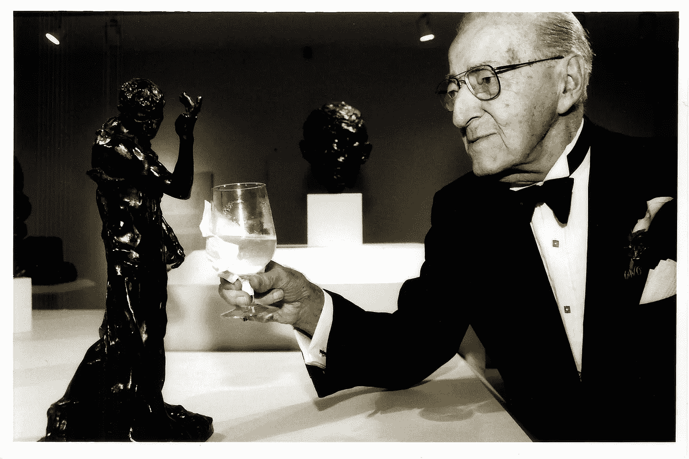

# 心态

> 原文：<https://medium.datadriveninvestor.com/mindset-b765eda6bf81?source=collection_archive---------24----------------------->

## 有两种心态:固定和成长。一个是自残；另一个是自动推进的。这里有一些关于每一个的基础和影响的想法。

Zest for life. © Anthony Fieldman 2017

我的哥哥曾经开玩笑说:“我脑袋里的噪音让你烦恼了吗？”我们常常嘲笑这种*，因为这种荒谬的说法指向了两个事实:我们*都至少有一点点*的边界，有时，近乎疯狂；我们这样做的原因是，最难做的事情是让我们的头脑安静下来。*

*也就是说，我们的头脑不断地对我们所做的，或正在考虑做的，或过去已经做过的事情做出反应。*

*我们都是法官、陪审团和刽子手。或者，老师，啦啦队长，最好的朋友。*

*我们体现的是哪种三和弦，很大程度上取决于我们带给生活的心态。*

*2006 年，Carol Dweck 博士——社会和发展心理学的主要研究者——写了一本很有影响力的书，名为《心态:成功的新心理学》。总之，有两种基本的心态，在我们生活的任何领域，我们都以这样或那样的方式行动(反应)。*

*分别是**固定心态**和**成长心态**。*

# ***固定***

*固定的思维模式基于一个基本假设，即我们生来就有一种特殊的方式；天赋、能力和才能是由*遗传*，从而*固定*；我们所做的一切都无法改变这些“真理”。当我们受到固定心态的困扰时，行为(工作、玩耍、竞赛)都被视为对我们自我价值的威胁；测试我们“继承”的能力是否能帮助我们完成手头的任务，并带来好的结果。*

*对于有固定思维模式的人来说，努力被认为是一种冒犯，因为除了接触我们内在的东西之外，关于我们是否能做某事的任何事情都不取决于我们的行动。*

*一些生来就有惊人天赋的人——创造力、音乐感、脑力——因为固定的思维模式而在生活中失败。因为他们相信自己天生就有天赋，而努力是为那些没有这种天赋的人准备的，当他们遇到困难的挑战而无法自然克服时，他们就会变得沮丧。对于固定的思维模式来说，任务中的失败和作为一个*人的失败是没有区别的。当你相信你生来就拥有你将拥有的一切时，很容易绝望——看到你在生活中所做的一切都是对你的*充足性的判断。***

*患了固定的心态就是患了，*句号。**

*那些有固定思维模式的人真的相信他们不能成长、学习或实质性地改变他们的能力、影响力和财富。根据德韦克的研究，他们认为不得不寻求帮助，或者不得不努力学习——“就像那些不特别的人，比如*我”——*是“承认自己软弱”；“一个不足”。*

*因此，固定思维模式的世界是二元的。德韦克用“典型的”固定思维青少年来说明这一点。对他们来说，一切“都可能暴露他们的缺陷，让他们从赢家变成输家”。事实上，在固定的思维模式中，青春期是一个巨大的考验。*我是聪明还是愚蠢？我长得好看还是丑？我是酷还是书呆子？我是赢家还是输家*？”*

*对于这个可悲的弄巧成拙的群体来说，青春期是对他们脆弱的自我的八年围攻，他们的主要工作是保护他们的自我免受(自我)虐待。*

*在这个过程中，他们成为我前面提到的法官、陪审团和刽子手。更糟糕的是，用我母亲的话来说，他们让这种癌症三联体“免费住在他们的脑袋里”。*

*不是每个人都认为他们的核心工作是保护他们脆弱的自我。*

# ***成长***

*首先，具有成长心态的人相信，无论他们有什么能力，都只不过是当前时间的一个快照，这些东西是可以采取行动和改进的。他们认为实现这一目标的主要手段是付出努力。*

*事实上，具有这两种心态的人都认为努力是两种截然相反的力量。对“固定”阵营来说，努力是对一个人自我的威胁，也暴露了一个人没有能力茁壮成长。对于“成长”阵营来说，努力就是兴旺发达的手段，而自我并不在其中。*

*德韦克讲述了一个又一个的故事，讲述了小孩子和成年人一样，在被给予选择的常规过程中，或者被要求完成一项任务时，要么屈服绝望，要么全力以赴，满怀热情地迎接他们面前的挑战。她的研究表明，唯一的区别是他们如何看待自己的能力:要么他们是遗传的和固定的，在这种情况下，手头的任务是对他们先天能力的威胁；或者他们被培养和成长，在这种情况下，手头的任务是一个有待解决的难题，因此津津乐道。*

*为什么需要像德韦克这样有才干的研究人员来揭示我们所有人都凭直觉认识到的事情超出了我的理解范围。但它做到了；而且很有启发性。*

# ***你是哪个？***

*德韦克要求年轻人列出他们“理想伴侣”的品质。她发现，思维定势的人说，他们的理想伴侣会“把他们捧上神坛”。让他们感觉完美。崇拜他们。”然后，她为我们重新定义了这些答案:“换句话说，完美的伴侣会珍视他们固有的品质。”有增长思维的人的答案非常不同。他们的理想伴侣会“看到他们的缺点，并帮助他们改正。挑战他们，让他们成为更好的人。鼓励他们学习新东西。”德韦克所说的“促进他们的发展”。*

*值得在我们自己的关系中仔细思考这个问题，看看哪个对我们每个人都适用，在我们和我们的伴侣之间，甚至是我们的朋友之间。*

*稍后将详细介绍。*

*人是复杂的。我们不是二元的——非此即彼。我们在灰色的天平上滑动，在心理心态和生理倾向的每个领域都处于极端之间。因此，没有人是完全“固定”或“增长”的。我们可以在一个领域以成长为导向(如体育)，同时在人际关系或智力方面完全固定。反之亦然。关键是，衡量我们自己的唯一健康的人是我们自己。而这个“衡量”，实际上，甚至不是一个健康的词，或者心态。*

***正念**是更好的一种。*

*如果我们意识到，在从我们现在所处的位置到我们明天*可能*所在的位置的旅程中，我们是孤独的，那么前进的步伐、方向和*原因*完全存在于——或者*应该*存在于——我们自己的道德和抱负范围内。我们中的大多数人都被其他人包围着，这些人毫无帮助地将自己的愿望、梦想、不安全感和恶魔投射到我们身上(父母、配偶、同事、朋友)。我们需要认识到这些事情是他们自己心态的反映。虽然有成长心态的人对别人教给我们的东西感兴趣，但这些东西不会与我们作为一个人的欲望、轨迹、节奏或价值观相混淆，也不会被强加于我们。*

*将一个人的幸福外包给外部的判断标准是最具自我毁灭的行为之一。)至少有时，在人生的某个阶段，我们确实如此。*

*父母们经常对孩子这样做——不仅仅是那些老掉牙的“虎妈”。奖励或惩罚我们孩子努力的*结果*，而不是*努力本身*，教导他们结果才是最重要的，如果他们的努力没有产生直接或足够的回报，实际上*会抑制他们进一步努力。换句话说，它把他们的思维模式固定下来:“足够好或者不够好”。另一方面，当我们赞扬努力时，会鼓励更多的努力，因为他们知道他们的精力和投资是值得称赞的。**

*这些事情甚至可能导致可见的增长。*

*多么新奇的概念。*

*配偶们也经常这样对待彼此，无论是寻找“补品”还是陷入“如果他/她是……”的兔子洞。我们中有多少人私下里希望我们的配偶在任何一个方面都与众不同，专注于困扰我们的事情，而不是把对方视为进化的生物？如果我们意识到我们今天所处的位置只不过是时间的快照，我们可以把我们的关系重新塑造成一起冒险，作为共同的发现者，专注于共同的经历，而不是结果。*

*每一次旅行都包括许多步骤。*

*为了用一个可笑的例子来说明这一点，让我们来看一次去街角商店买苹果的旅行。假设离我们家门口有 398 步，在第 326 步之后——大部分——我们开始诅咒自己没有*已经*在商店了。“白痴！如果我再高一点，我已经只用了 326 步就到了。”或者，“我的邻居住得更近，杂货店的距离只有 198 步。没有用的！我永远不会这么快。”可笑吧？像街角商店的例子一样，诽谤我们自己不在某个地方，同样是荒谬的。*

***教师**和**教育系统**在所谓的“天才儿童”项目中对任何人都没有任何好处，将天生有天赋的人从正在进行的工作中分离出来，同时在这个过程中完全忽视了孩子的心态。发现自己站在“非天才”一边，是成年人做出的苛刻判断。它也错失良机。Dweck 讨论了世界著名舞蹈编导 Twyla Tharp 所著的《创作习惯》一书。标题说明了一切。创造力是努力的产物，是一种习惯，是后天培养的，而不是天生的才能。*

*我是一所小学的“艺术轨道”的产物，该学校有一个天才项目。作为一个十岁的孩子，当我被挖掘时，我非常兴奋。虽然参与这些活动很有趣，但我从不认为我在那里的出现必然不仅仅是一个意外，也不认为我在艺术方面比其他人更好或更差。对我来说，绘画只是我喜欢做的事情，没有任何后果，因此是“纯粹的”。因此，我从不过度思考它，不像在传统学术界，我允许我哥哥的卓越成就来削弱我。因此，在这个项目中，我没有把自己看得太重，我决定简单地尝试一些我以前从未有机会做的事情——我从未接触过的事情，*，因为我认为学习新东西会很有趣——从*到*玩*。*

*关于创作过程，我至今仍保持着这种方式:感觉自己毫无特别之处，但对它的好奇心和享受保持不懈——无论是写作、摄影、建筑、素描、绘画、诗歌还是家具制作。*

*马尔科姆·格拉德威尔也许是所有冠军中最著名的“失败者”。他写了一本书又一本书，讲述孤独的天才的神话，或者“特殊”的名称，除了我们自己的影响力之外的力量的汇合。他的书《局外人》是一部关于是什么让我们中的一些人出名或成功的专著。这可以归结为你可能已经想到的三件事:*努力*(自我导向的部分)，加上他人的*支持*，以及在正确的时间处于正确的地点的*环境*。乔布斯和盖茨开创了计算机时代，部分原因是因为他们出生的时间，以及他们可以接触到的地方和人，这让他们可以摆弄公众还无法接触到的新技术。*

*他们利用这些机会所做的事情使他们与众不同。他们完全是成长型的人，全身心地投入到工作中，这样他们就可以开拓尚不存在的事物。*

*如果他们在遇到障碍或缺乏先例后放弃了，或者认为失败反映了他们的能力，而不是他们的行动，你可能会在一个非常不同的设备上阅读这篇文章——比如一本书。如果爱迪生没有把他 10，000 次著名的失败中的每一次都看作是让他离自己的“街角商店”——灯泡——更近一步，你可能会在完全不同的光线下阅读这篇文章——一盏煤气灯。*

*当然，努力并不能保证结果。但这也不反映你作为一个人的能力。我们当前的能力状态——或者我们的孩子、配偶和同事的能力状态——可以被看作是固定的、不变的(因此值得判断),或者被看作是他们可能已经开始的地方和他们可能将要去的地方之间的一个时间点。*

*【Psst:是后者。]*

*在这种背景下，我们要么认为我们在他们生活中的角色是不得不赞扬或责骂他们努力的*结果*，要么我们可以认为自己是*接受*他们本来的样子，并作为*他们*发现和学习之旅*的共同冒险者，而不带有对结果或时间表的*偏见。*

*换句话说，我们可以(也应该)放手，学会享受存在的过程，把精力放在发现和成长上。*

# ***衰老与透视***

*当我年轻的时候，我总是被大人吸引，而不是其他孩子。我认为他们更善良，而且有更多的东西可以教我。我小时候和其他孩子有很多问题，因为我经常是他们残忍行为的首当其冲者，这让我害怕他们。但即使在这种情况下，我总是有一小群和我同龄的密友。出于自我保护，我只是避开群体和不成熟的人。*

*然而，当我从成人组(我父母或祖父母的朋友)转到儿童组，再转回来时，我不禁注意到一些明显的事情:一些 12 岁的孩子——就像我选择与他们共度时光的那些人——比我祖父母的许多 75 岁的朋友更成熟；正如你所料，一些白发苍苍的人比折磨我的人更成熟。*

*教训是年龄本身并不能预测成熟。一些老年人仍然患有发育停滞症，和/或我现在认为明显固定的思维定势。就好像他们在梦游中度过了几十年的生活，却没有吸收我认为他们那个年龄的人会吸收并从中吸取的许多教训。*

*坦率地说，我自己的父母完美地展示了这种二分法。我父亲在 84 岁时的思维模式在它生命的一英寸之内被固化、焊接和束缚；而我的母亲*总是无法获得足够的知识，在这个过程中，她经常表现出标志性的好奇和谦逊。**

*我的叔祖父泰迪展现了和她一样的品质。在他九十多岁的时候，他仍然每天在加州大学洛杉矶分校旁听大学生的课程。我母亲的父亲伊莱也很相似。在他八十多岁的时候，他第一次加入了一家健身房，开始在鹦鹉螺设备上锻炼，并有一名教练；当他 90 多岁时，他决定是时候学习第五种语言——西班牙语，他一有机会就使用它。*

**

*My grandfather, Eli, at 94\. © Andrew Lichtenstein 2001*

*如果这些人中的任何一个人认为天赋是天生的、固定的，而不是努力和态度的结果，他们永远也不敢做这些事情，更不用说在流行文化仍然坚持我们在认知上下降的观点的时代；此外，在我们六岁或八岁之前，我们只能在 T2(T3)和 T4(T5)学习一门新语言；从那个年龄开始，我们的能力逐渐减弱。*

*这是可笑的。*

*我的祖父不仅在 98 岁时西班牙语非常好；我有自己的经验可以借鉴。直到我 20 多岁搬到意大利时，我才听说过意大利语，不知何故，在大约 9 个月的沉浸之后，我不仅能流利地说意大利语，还能说地道的意大利语，甚至连意大利人都搞不清楚我的出身。在我回到北美 30 年后，很大程度上没有从实践中受益，并且在此期间失去了很多词汇，我仍然让一些意大利人感到困惑——直到对话深入——他们坚持认为我是他们中的一员。*

*我们的教育、文化和社会体系对我们的生活和我们所做的一切都没有任何好处。*

*我们应该做的是帮助每个人理解——就像格拉德威尔做的那样——任何人都可以在合理的范围内学习任何东西。我们关于缺乏能动性的理论、我们与生俱来的天赋、固定的时间表和努力的极限是从根本上破坏我们、阻碍我们发展的原因。*

*像那些关于种族和基因的叙述，有赢的一方也有输的一方；关注结果而不是过程和灵感的父母和老师；以及关注赢家和输家，而不是合作轨迹的竞赛。*

# ***最终想法***

*我们的精力主要集中在两个领域之一。要么**我们寻求保护我们已经是**的东西，要么**我们专注于探索我们还不是什么……***。当我们做这些事情时，我们要么把我们的发现——无论是成功还是失败——视为我们不足的证据，要么视为我们成长机会的亮点。因此，根据我们对这些现实的感知，其他人要么是对我们自我价值的威胁，生活是一场丑陋的竞赛，要么是我们可以从中学习和成长的合作者和老师，因此生活是一个不断充实和玩耍的地方。**

**如果我们对自己诚实，在我们生活的每个领域，在这方面，我们大多会有这样或那样的感觉。同样，我们可以在某些领域保持增长的心态，而在另一些领域保持不变。有时，在我们的勇气和信心允许的情况下，我们有时会在两者之间摇摆不定。经常(一直？)其他人合谋帮助播种这种或那种心态。**

**这最后一点就是为什么当我第一次听到企业家吉米·罗恩的下面这句话时，我产生了深深的共鸣:“**我们是与**相处时间最长的五个人的总和。”当然，格拉德威尔知道这一点，因为他的“局外人”——我们都在谈论的人；那些因其成就而名留青史的名字——如果没有帮助他们实现这些成就的人，以及他们周围的环境，这些名字将一无是处。他是对的。当这“五个人”有成长的心态时，我们从他们的行动、他们的言语和他们的*星尘*中学习，因为没有更好的描述。另一方面，当我们被“黛比·唐纳斯”或堂吉诃德式的想象中的巨人所包围时，我们的世界变小了，我们更容易陷入一种固定的思维模式，被烟尘所覆盖。**

**诀窍是记住我们今天是谁只不过是时间的快照；我们看起来与昨天的我们和明天的我们大不相同；我们是自己轨迹和步伐的唯一*船长；流行的叙述充其量是不完整的，而且更经常是完全错误的；我们与他人的互动要么为我们打开大门，要么由他人关上大门。***

**我们的选择非常重要。**

**这是个好消息。**

****访问专家视图—** [**订阅 DDI 英特尔**](https://datadriveninvestor.com/ddi-intel)**