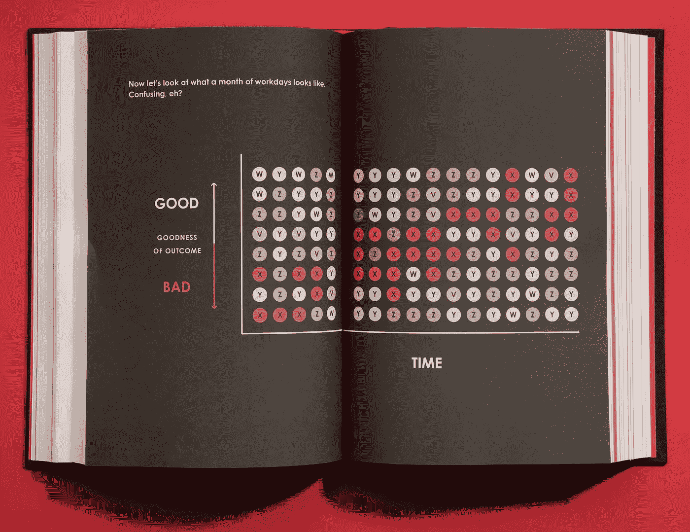
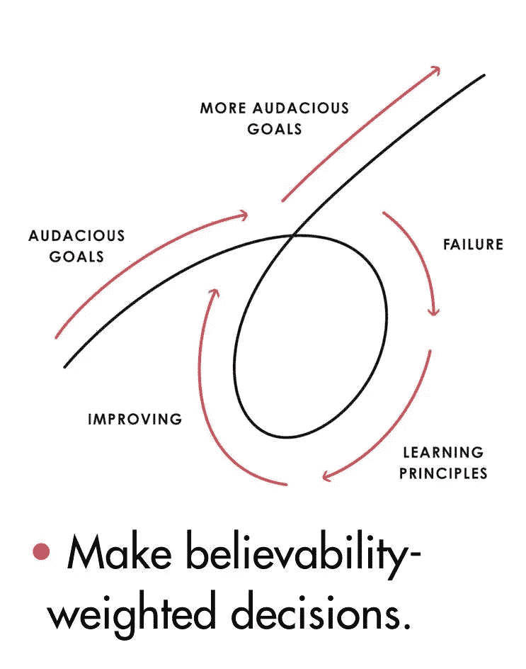

# 策略:拥抱现实，面对现实

> 原文：<https://medium.datadriveninvestor.com/mindset-pain-reflection-progress-d393f516d8f4?source=collection_archive---------7----------------------->

Principles

## 努力保持，拥抱你内心的斗士，与你最狂野的梦想融为一体。现在，当你在家漂亮舒适的时候，是时候深入你的思想，原则世界了。

# 思维模式

> “我们想什么就成为什么。”——托尼·罗宾斯

很容易理解你在哪里，为什么你会这样做，你是积极的还是消极的。是因为你的思想，蓝图。

我们的大脑注定要战斗或逃跑，采取行动或逃跑，勇敢或被束缚。我们都有相同的蓝图，但为什么有些人似乎不可动摇，而另一些人却很容易崩溃？

> 这是因为与选择逃离的人相比，他们的思维模式和线路更有效。—菲特巴德

 [## 艾预测:“颠覆，然后是生产力”|数据驱动的投资者

### 人们越来越担心，随着机器学习和互联网的普及，所有白领工作都将消失

www.datadriveninvestor.com](https://www.datadriveninvestor.com/2018/08/06/ai-forecast-disruption-then-productivity/) 

那些看起来在任何情况下都不会崩溃的人，他们已经发展出有效的系统来处理不确定性和逆境。他们发展了一些原则来帮助他们处理他们的世界，而不是想象它是不同的。

让我邀请一位有几十年创建公司经验的人，他既是运用原则的英雄，又是投资之王。下面的文字是从《原理，雷伊·达里奥》一书中“剪贴”下来的。

# 生活原则

Ray Dalio, the founder of investment firm Bridgewater Associates, speaking at the WEF in Davos, Switzerland, on January 22, 2019.

根据第二点，自己思考决定 1)你想要什么，2)什么是准确的，以及 3)你应该做什么来实现第一点，并带着谦逊和开放的心态去做，这样你就可以考虑你能得到的最好的想法。

> “关注那些影响你的事情的模式，以理解驱动它们的因果关系，并学习有效处理它们的原则。”—雷伊·达里奥

## 1.拥抱现实，面对现实

**1.1 做一个超现实主义者**

a.梦想+现实+决心=成功的人生

**1.2 真相——或者更准确地说，对现实的准确理解——是任何好结果的重要基础。**

**1.3。保持彻底的开放和彻底的透明**

a.彻底的开放思想和彻底的透明对于快速学习和有效改变是无价的。

b.不要让害怕别人对你的看法成为你的绊脚石。

c.拥抱彻底的真实和彻底的透明会带来更有意义的工作和更有意义的关系。

向大自然学习，了解现实是如何运作的。

a.不要纠结于你对事物“应该”如何的看法，因为你会错过了解它们如何的机会。

b.要成为“好的”，某些东西必须与现实法则一致地运作，并有助于整体的进化；这是最大的回报。

c.进化是宇宙中最强大的力量；它是唯一永恒的东西，它驱动着一切。

d.进化或者死亡。

进化是人生最大的成就和回报。

a.个人激励必须与团队目标一致。

b.现实是为整体优化，而不是为你。

c.通过快速试错来适应是非常宝贵的。

d.意识到你既是一切又是虚无——决定你想成为什么样的人。

e.你将成为什么样的人取决于你的观点。

**1.6 了解大自然的实际教训。**

a.最大化你的进化

b.记住“没有付出，就没有收获。”

c.获得力量是自然的基本法则；一个人必须挑战自己的极限，这很痛苦。

**1.7 痛苦+反思=进步**

a.走向痛苦，而不是逃避痛苦。

b.拥抱严厉的爱。

**1.8 权衡二阶和三阶后果。**

通过认识到更高层次的后果，自然优化。我发现，那些过于看重决策的一阶后果而忽视二阶和后续后果的人很少能达到他们的目标。

> “这是因为一阶后果往往与二阶后果有相反的目的，导致决策中的重大错误。”—雷伊·达里奥

例如，运动的一阶后果(疼痛和花费的时间)通常被认为是不可取的，而二阶后果(更健康和更有吸引力的外表)是可取的。同样，味道好的食物往往对你不好，反之亦然。

通常情况下，一级后果是那些让我们失去真正想要的东西的诱惑，有时它们是挡在我们面前的障碍。这几乎就像是大自然通过扔给我们两种后果的恶作剧选择来对我们进行分类，并惩罚那些只根据一阶后果做出决定的人。

相比之下，那些选择自己真正想要的东西，避开诱惑，克服痛苦，远离自己真正想要的东西的人，更有可能拥有成功的人生。

1.9 掌控自己的成果。

**1.10 从更高的层面看机器。**

a.把你自己想象成一台在机器中运行的机器，并且知道你有能力改变你的机器来产生更好的结果。

b.通过比较你的结果和你的目标，你可以决定如何修改你的机器

c.区分你是你机器的设计者和你是你机器的工人。

d.大多数人犯的最大错误就是没有客观地看待自己和他人，导致自己一次又一次地撞上自己和他人的弱点。

e.成功的人能够超越自我，客观地看待事物，并管理这些事物以改变现状。

f.在你薄弱的领域寻求他人的帮助是一项你无论如何都应该发展的伟大技能，因为这将帮助你发展护栏，阻止你做你不应该做的事情。

g.因为很难客观的看到自己，所以需要依赖别人的输入和全身的证据。

h.如果你足够开明和坚定，你几乎可以得到你想要的任何东西。

# 选择适合你的

Principles

所以，现在你有了，选择适合你的。让我知道它是如何为你工作的。选择大胆的目标，并遵循你的计划和过程。