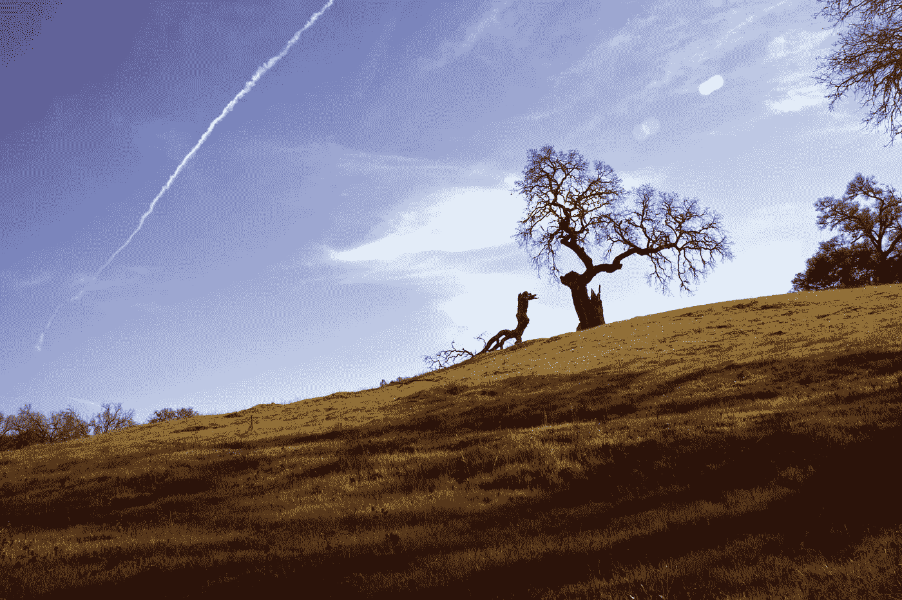
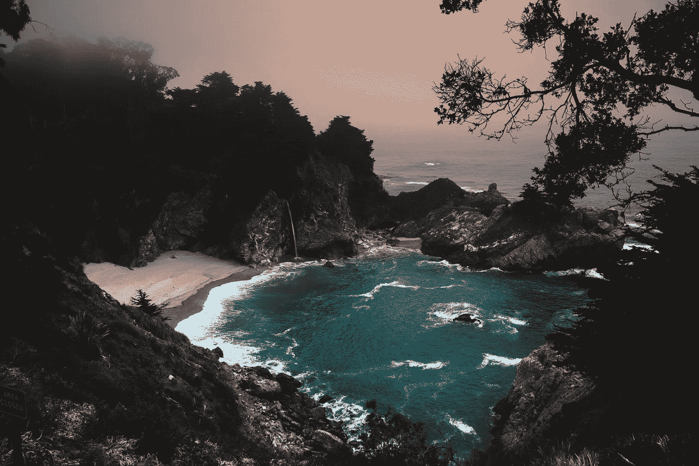
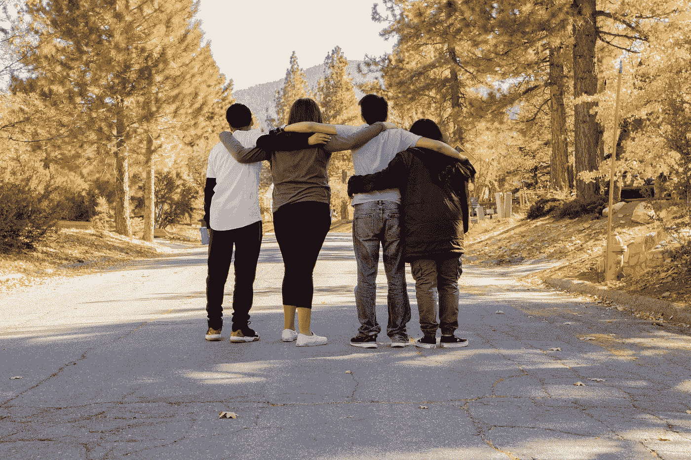

# 心态:在这场新冠肺炎危机中，你会屈服还是屈服？

> 原文：<https://medium.datadriveninvestor.com/mindset-will-you-bend-or-break-in-this-covid-19-crisis-c938e3ff2315?source=collection_archive---------17----------------------->

Photo by [Tim Mossholder](https://unsplash.com/@timmossholder?utm_source=unsplash&utm_medium=referral&utm_content=creditCopyText) on [Unsplash](https://unsplash.com/s/photos/broken-tree?utm_source=unsplash&utm_medium=referral&utm_content=creditCopyText)

## 你的精神蓝图、健康的心态和有弹性的想法是你能否在这个锁定家庭试验中成功的关键指标。

知道今天有人正在死去是令人悲伤的；我们应该停下来流一滴眼泪。对于我们中的许多人来说，这是一个真正意识到我们的立场，我们的信仰，我们如何照顾自己的身体，以及我们是否接受这一教训，学习或重复同样的错误的时候。

# 塞翁失马焉知非福

我相信，在新冠肺炎，我们现在都被迫放慢脚步，从更广阔的角度看问题。每次坐飞机，我都觉得离所有的问题和挑战那么远。一旦我下降，我就回到游戏中，精神饱满，准备好征服下一个挑战。

但还没有确定。一个小时或几个小时，你有机会真正地喘口气。这并不意味着你会去看网飞或者拖延时间。你花时间去琢磨，去反思，自己一个人和自己在一起。

 [## 医疗保健的未来正在被一场大型技术入侵所塑造|数据驱动型投资者

### 过去十年，全球经济的所有部门都经历了大规模的数字颠覆，而卫生部门现在…

www.datadriveninvestor.com](https://www.datadriveninvestor.com/2018/11/02/the-future-of-healthcare-is-being-shaped-by-a-big-tech-invasion/) 

**瑜伽挑战:**接下来的 30 天，每天早上花几分钟时间在日记中写下你的感受和经历。机会是，你会在 30 天内成为一个更好的版本。

# 不要害怕独自一人

*我们很多人害怕独处，害怕思考、反省和面对自己的心魔。也许，是因为我们被伤害的次数太多，或者我们总是试图逃避现实。*

在这个危机时刻，当我们被禁闭时，我们中的许多人陷入沮丧、焦虑和绝望。当我们意识到我们中的许多人坚持去工作以避免孤独时，这是一件可怕的事情——这是一个超级悲伤的现实。

在远程工作已经成为许多公司的第二天性的时代，我们仍然没有花时间去反思我们的内部环境、我们的心态和性格。

> “让我告诉你:如果你遇到一个孤独的人，不管他们告诉你什么，这不是因为他们喜欢孤独。这是因为他们以前曾试图融入这个世界，人们继续让他们失望。”
> ――朱迪皮考特，我妹妹的守护者

皮科特女士的话是一个很好的例子，说明人们总是把希望寄托在别人身上，而不是做功课，弄清楚抵抗损害的真正含义。我哪里知道？我经历过，做过，迷失过，被伤害过，直到我跌到谷底！

Photo by [Joe Yates](https://unsplash.com/@josephyates_?utm_source=unsplash&utm_medium=referral&utm_content=creditCopyText) on [Unsplash](https://unsplash.com/s/photos/big-tree?utm_source=unsplash&utm_medium=referral&utm_content=creditCopyText)

我崩溃了吗？是的，我必须挑选零碎的东西，建立自己，塑造自己的性格，变得有意识。那是大约 15 年前。我改变了我的观点，拥抱积极。

> "成功的人和失败的人之间的区别在于强烈的性格和洞察力！"—菲特巴德

**战士挑战:**接下来的 30 天，努力学习改变你的视角！意识到你必须创造你的恶劣环境，让自己暴露在失败、挑战、身体、精神条件和障碍中。

当你不做训练，不磨练你的健康、体能和心态时，像新冠肺炎这样的事情会动摇你，击垮你，让你束手无策，因为你还没有准备好迎接逆境。

> “做一名战士，做一名斯巴达运动员！每天训练，挑战自己，在别人退缩、放弃、动弹不得的时候挺身而出。”—菲特巴德

# 我们生活的时代越丰富

当我们生活在 20 世纪时，我们很幸运被如此神奇的自然(现在，也许，通过我们放慢脚步，生活会给我们十几年)、巨大的财富、安全的政治制度和过剩所包围。

我们该拿它怎么办？我们想当然，我，你，每个人。我们变得自满。贫困和疾病的水平下降了，这很好，我们这里和那里很少有国家争端，但如果你生活在西方，你可以认为自己是幸运的，因为你很可能是 1%的平均收入到高收入的人。

> “这是一个好消息，因为你有足够的钱来满足自己的需求和愿望，偶尔还可以去旅行。—菲特巴德

**贫困挑战:**在接下来的 30 天里整理好你的东西，决定哪些你要保留，哪些你要送出。清理你的橱柜，扔掉不需要的东西，清理你的精神书架，因为少即是多！

# 新冠肺炎的现实让我们恍然大悟

嗯，说实话，我们很快意识到，在这个病毒疫情，它使一些独特的东西。我们无法控制自己的生活。现在，我们中的许多人被锁在家里，不仅在经济上挣扎，而且在情感上挣扎，不知道该拿自己怎么办。

> “即使没有病毒，这也是许多人仍然生活在其中的现实，只是他们没有意识到这一点，因为他们是激烈竞争的一部分，这让每个人都难以入睡。”—菲特巴德

# 醒来吧，此时此地！

> 现实是，我们正处于十字路口。一条路通向自我完善、性格发展和自我优化。第二条路导致痛苦、抱怨、恐惧和焦虑。—菲特巴德

现在，谜依然存在，我们选择哪个十字路口？我们如何内化这个危机和病毒世界事件？很直白！

弹性挑战:你会像一棵坚韧的树一样在风暴中毫不费力地弯曲而不折断吗？加入我在 IG[上的 30 天挑战，在这里我每天给出一个小贴士，成为一名真正的斯巴达战士。](https://www.instagram.com/fitbudd88/)

是时候站出来，提高比赛，坚持不懈了；这次新冠肺炎病毒会像以前的其他病毒一样消失。让我们一起努力吧！你可以看看 gym pass 看看他们是如何应对逆境的。相当鼓舞人心！

**问题是存在的，你会枯萎还是成为一个不可阻挡的健康健身机器？选择权在你……机会就在这里！**

Photo by [Emmanuel Olguín](https://unsplash.com/@emman16ol?utm_source=unsplash&utm_medium=referral&utm_content=creditCopyText) on [Unsplash](https://unsplash.com/s/photos/big-tree?utm_source=unsplash&utm_medium=referral&utm_content=creditCopyText)